import Callout from '@components/Callout.astro';
import ImplementationNote from '@components/ImplementationNote.astro';
import ExternalCite from '@components/ExternalCite.astro';

## Introduction

Observability is the "three pillars" problem: **traces** show request flow, **metrics** show system health, **logs** show what happened. Most teams end up with three different tools, three different query languages, and no way to correlate data across them.

**Why Unified Observability Matters:**

- **Single Pane of Glass**: Jump from a spike in error metrics to the failing traces to the error logs—all in one UI
- **Cost Efficiency**: One system to deploy, maintain, and learn instead of three
- **Correlation**: Automatic linking between traces, metrics, and logs via trace IDs
- **Open Standards**: Built on OpenTelemetry—no vendor lock-in

SigNoz is an open-source alternative to Datadog and New Relic that delivers all three pillars in a single, self-hosted platform. For teams who want production-grade APM without cloud bills, it's a compelling option.

SigNoz provides an open-source alternative to Datadog and New Relic, offering unified observability with traces, metrics, and logs. This cookbook covers deploying SigNoz and instrumenting .NET applications.

## Architecture Overview

```mermaid
flowchart TB
    subgraph Apps["🔌 Applications"]
        API["🔗 API (OTel)"]
        Web["🖥️ Web (OTel)"]
        Workers["⚙️ Workers (OTel)"]
        NATS["⚡ NATS (OTel)"]
    end
    
    Apps --> Collector
    
    subgraph Collector["📡 OpenTelemetry Collector"]
        Recv["📥 Receivers\nOTLP, Prom"] --> Proc["⚙️ Processors\nBatch, Sample"]
        Proc --> Exp["📤 Exporters\nSigNoz, ClickH"]
    end
    
    Collector --> Backend
    
    subgraph Backend["📊 SigNoz Backend"]
        Query["🔍 Query Svc"]
        Alert["🚨 Alert Manager"]
        Click["💾 ClickHouse"]
        UI["🖼️ Frontend UI"]
    end

    classDef primary fill:#7c3aed,color:#fff
    classDef secondary fill:#06b6d4,color:#fff
    classDef db fill:#f43f5e,color:#fff
    classDef warning fill:#fbbf24,color:#000

    class Apps primary
    class Collector secondary
    class Backend db
```



## SigNoz Installation

### Helm Values

```yaml
# platform/observability/signoz/values.yaml
global:
  cloud: "others"
  
clickhouse:
  replicasCount: 1
  persistence:
    enabled: true
    storageClass: "local-path"
    size: 50Gi

queryService:
  replicasCount: 1
  resources:
    requests:
      cpu: 100m
      memory: 256Mi
    limits:
      cpu: 1000m
      memory: 1Gi

frontend:
  replicasCount: 1
  resources:
    requests:
      cpu: 50m
      memory: 64Mi

alertmanager:
  replicasCount: 1

otelCollector:
  replicasCount: 1
  resources:
    requests:
      cpu: 100m
      memory: 256Mi
    limits:
      cpu: 500m
      memory: 512Mi
      
otelCollectorMetrics:
  replicasCount: 1
```

### HelmRelease

```yaml
# platform/observability/signoz/helmrelease.yaml
apiVersion: helm.toolkit.fluxcd.io/v2
kind: HelmRelease
metadata:
  name: signoz
  namespace: observability
spec:
  interval: 30m
  chart:
    spec:
      chart: signoz
      version: ">=0.40.0"
      sourceRef:
        kind: HelmRepository
        name: signoz
        namespace: flux-system
  values:
    frontend:
      ingress:
        enabled: true
        className: traefik
        hosts:
          - host: signoz.bluerobin.local
            paths:
              - path: /
                pathType: Prefix
        tls:
          - secretName: bluerobin-tls
            hosts:
              - signoz.bluerobin.local
```

### IngressRoute

```yaml
# platform/observability/signoz/ingressroute.yaml
apiVersion: traefik.io/v1alpha1
kind: IngressRoute
metadata:
  name: signoz
  namespace: observability
spec:
  entryPoints:
    - websecure
  routes:
    - match: Host(`signoz.bluerobin.local`)
      kind: Rule
      middlewares:
        - name: auth-forward
          namespace: kube-system
      services:
        - name: signoz-frontend
          port: 3301
  tls:
    secretName: bluerobin-tls
```

## .NET OpenTelemetry Setup

### Package References

```xml
<!-- Directory.Build.props -->
<ItemGroup>
  <PackageReference Include="OpenTelemetry.Extensions.Hosting" Version="1.8.1" />
  <PackageReference Include="OpenTelemetry.Instrumentation.AspNetCore" Version="1.8.1" />
  <PackageReference Include="OpenTelemetry.Instrumentation.Http" Version="1.8.1" />
  <PackageReference Include="OpenTelemetry.Instrumentation.Runtime" Version="1.8.0" />
  <PackageReference Include="OpenTelemetry.Instrumentation.EntityFrameworkCore" Version="1.0.0-beta.11" />
  <PackageReference Include="OpenTelemetry.Exporter.OpenTelemetryProtocol" Version="1.8.1" />
  <PackageReference Include="Npgsql.OpenTelemetry" Version="8.0.3" />
</ItemGroup>
```

### Telemetry Configuration

```csharp
// Infrastructure/Telemetry/TelemetryConfiguration.cs
public static class TelemetryConfiguration
{
    public static IServiceCollection AddBlueRobinTelemetry(
        this IServiceCollection services,
        IConfiguration configuration)
    {
        var serviceName = configuration["ServiceName"] ?? "unknown";
        var otlpEndpoint = configuration["Otlp:Endpoint"] 
            ?? "http://signoz-otel-collector.observability.svc.cluster.local:4317";
        
        services.AddOpenTelemetry()
            .ConfigureResource(resource => resource
                .AddService(
                    serviceName: serviceName,
                    serviceVersion: typeof(TelemetryConfiguration).Assembly
                        .GetName().Version?.ToString() ?? "1.0.0")
                .AddAttributes(new Dictionary<string, object>
                {
                    ["deployment.environment"] = configuration["Environment"] ?? "dev"
                }))
            .WithTracing(tracing => tracing
                .AddAspNetCoreInstrumentation(opts =>
                {
                    opts.RecordException = true;
                    opts.Filter = ctx => 
                        !ctx.Request.Path.StartsWithSegments("/health");
                })
                .AddHttpClientInstrumentation(opts =>
                {
                    opts.RecordException = true;
                    opts.FilterHttpRequestMessage = req =>
                        req.RequestUri?.Host != "signoz-otel-collector";
                })
                .AddEntityFrameworkCoreInstrumentation(opts =>
                {
                    opts.SetDbStatementForText = true;
                })
                .AddNpgsql()
                .AddSource(ActivitySources.Documents)
                .AddSource(ActivitySources.Processing)
                .AddSource(ActivitySources.Search)
                .AddOtlpExporter(opts =>
                {
                    opts.Endpoint = new Uri(otlpEndpoint);
                    opts.Protocol = OtlpExportProtocol.Grpc;
                }))
            .WithMetrics(metrics => metrics
                .AddAspNetCoreInstrumentation()
                .AddHttpClientInstrumentation()
                .AddRuntimeInstrumentation()
                .AddProcessInstrumentation()
                .AddMeter(Meters.Documents)
                .AddMeter(Meters.Processing)
                .AddOtlpExporter(opts =>
                {
                    opts.Endpoint = new Uri(otlpEndpoint);
                    opts.Protocol = OtlpExportProtocol.Grpc;
                }));
        
        // Configure logging to export to SigNoz
        services.AddLogging(logging =>
        {
            logging.AddOpenTelemetry(opts =>
            {
                opts.IncludeFormattedMessage = true;
                opts.IncludeScopes = true;
                opts.AddOtlpExporter(otlp =>
                {
                    otlp.Endpoint = new Uri(otlpEndpoint);
                    otlp.Protocol = OtlpExportProtocol.Grpc;
                });
            });
        });
        
        return services;
    }
}

// Infrastructure/Telemetry/ActivitySources.cs
public static class ActivitySources
{
    public static readonly ActivitySource Documents = new("BlueRobin.Documents");
    public static readonly ActivitySource Processing = new("BlueRobin.Processing");
    public static readonly ActivitySource Search = new("BlueRobin.Search");
}

// Infrastructure/Telemetry/Meters.cs
public static class Meters
{
    public static readonly string Documents = "BlueRobin.Documents";
    public static readonly string Processing = "BlueRobin.Processing";
}
```

<ImplementationNote>
Filter out health checks and internal telemetry endpoints to reduce noise and storage costs.
</ImplementationNote>

## Custom Instrumentation

### Document Processing Tracing

```csharp
// Application/Services/DocumentProcessingService.cs
public sealed class DocumentProcessingService : IDocumentProcessingService
{
    private static readonly Counter<long> _documentsProcessed = 
        new Meter(Meters.Processing)
            .CreateCounter<long>(
                "documents.processed.total",
                unit: "{documents}",
                description: "Total documents processed");
    
    private static readonly Histogram<double> _processingDuration = 
        new Meter(Meters.Processing)
            .CreateHistogram<double>(
                "documents.processing.duration",
                unit: "ms",
                description: "Document processing duration");
    
    private readonly IDocumentRepository _documents;
    private readonly IOcrService _ocr;
    private readonly ILogger<DocumentProcessingService> _logger;
    
    public async Task ProcessAsync(
        BlueRobinId documentId, 
        CancellationToken ct)
    {
        using var activity = ActivitySources.Processing.StartActivity(
            "ProcessDocument",
            ActivityKind.Internal);
        
        activity?.SetTag("document.id", documentId.Value);
        
        var sw = Stopwatch.StartNew();
        
        try
        {
            var document = await _documents.GetByIdAsync(documentId, ct);
            if (document == null)
            {
                activity?.SetStatus(ActivityStatusCode.Error, "Document not found");
                return;
            }
            
            activity?.SetTag("document.title", document.Title);
            activity?.SetTag("document.mime_type", document.MimeType);
            activity?.SetTag("document.size_bytes", document.FileSize);
            
            // OCR extraction
            using (var ocrSpan = ActivitySources.Processing.StartActivity("OCR"))
            {
                ocrSpan?.SetTag("ocr.service", "docling");
                
                var content = await _ocr.ExtractAsync(document, ct);
                
                ocrSpan?.SetTag("ocr.pages", content.PageCount);
                ocrSpan?.SetTag("ocr.characters", content.Text.Length);
            }
            
            // Update document status
            document.MarkAsReady();
            await _documents.UpdateAsync(document, ct);
            
            activity?.SetStatus(ActivityStatusCode.Ok);
            _documentsProcessed.Add(1, 
                new KeyValuePair<string, object?>("status", "success"),
                new KeyValuePair<string, object?>("mime_type", document.MimeType));
        }
        catch (Exception ex)
        {
            activity?.SetStatus(ActivityStatusCode.Error, ex.Message);
            activity?.RecordException(ex);
            
            _documentsProcessed.Add(1,
                new KeyValuePair<string, object?>("status", "failed"));
            
            _logger.LogError(ex, "Failed to process document {DocumentId}", documentId);
            throw;
        }
        finally
        {
            sw.Stop();
            _processingDuration.Record(sw.Elapsed.TotalMilliseconds);
        }
    }
}
```

### Search Tracing

```csharp
// Application/Services/SearchService.cs
public sealed class SearchService : ISearchService
{
    private static readonly Histogram<double> _searchLatency = 
        new Meter(Meters.Documents)
            .CreateHistogram<double>(
                "search.latency",
                unit: "ms",
                description: "Search query latency");
    
    private static readonly Counter<long> _searchQueries = 
        new Meter(Meters.Documents)
            .CreateCounter<long>(
                "search.queries.total",
                description: "Total search queries");
    
    public async Task<SearchResult> SearchAsync(
        string query,
        BlueRobinId ownerId,
        SearchOptions options,
        CancellationToken ct)
    {
        using var activity = ActivitySources.Search.StartActivity(
            "Search",
            ActivityKind.Internal);
        
        activity?.SetTag("search.query_length", query.Length);
        activity?.SetTag("search.owner_id", ownerId.Value);
        activity?.SetTag("search.limit", options.Limit);
        
        var sw = Stopwatch.StartNew();
        
        try
        {
            // Semantic search
            using (var semanticSpan = ActivitySources.Search.StartActivity("SemanticSearch"))
            {
                var results = await _vectorStore.SearchAsync(
                    await _embeddings.GenerateAsync(query, ct),
                    ownerId,
                    options.Limit,
                    ct);
                
                semanticSpan?.SetTag("search.results_count", results.Count);
            }
            
            activity?.SetStatus(ActivityStatusCode.Ok);
            _searchQueries.Add(1, new KeyValuePair<string, object?>("type", "semantic"));
            
            return new SearchResult { /* ... */ };
        }
        finally
        {
            sw.Stop();
            _searchLatency.Record(sw.Elapsed.TotalMilliseconds);
        }
    }
}
```

## Alerting

### Alert Configuration

```yaml
# platform/observability/signoz/alerts.yaml
apiVersion: v1
kind: ConfigMap
metadata:
  name: signoz-alerts
  namespace: observability
data:
  alerts.json: |
    {
      "alerts": [
        {
          "name": "High Error Rate",
          "condition": "rate(http_server_requests_total{status=~\"5..\"}[5m]) > 0.05",
          "duration": "5m",
          "severity": "critical",
          "annotations": {
            "summary": "High error rate detected",
            "description": "Error rate is above 5% for 5 minutes"
          }
        },
        {
          "name": "Slow Document Processing",
          "condition": "histogram_quantile(0.95, documents_processing_duration_bucket) > 30000",
          "duration": "10m",
          "severity": "warning",
          "annotations": {
            "summary": "Document processing is slow",
            "description": "P95 processing time exceeds 30 seconds"
          }
        },
        {
          "name": "High Memory Usage",
          "condition": "process_runtime_dotnet_gc_heap_size_bytes > 1073741824",
          "duration": "5m",
          "severity": "warning",
          "annotations": {
            "summary": "High memory usage",
            "description": "Heap size exceeds 1GB"
          }
        }
      ]
    }
```

<Callout type="tip">
Configure alert channels in SigNoz UI (Settings → Alert Channels) to receive notifications via Slack, PagerDuty, or email.
</Callout>

## Dashboard Queries

### Useful Queries

| Metric | Query |
|--------|-------|
| Request Rate | `rate(http_server_requests_total[5m])` |
| Error Rate | `rate(http_server_requests_total{status=~"5.."}[5m])` |
| P99 Latency | `histogram_quantile(0.99, rate(http_server_duration_bucket[5m]))` |
| Active Connections | `http_server_active_requests` |
| Documents Processed | `increase(documents_processed_total[1h])` |
| Processing Duration P95 | `histogram_quantile(0.95, documents_processing_duration_bucket)` |
| GC Collections | `rate(process_runtime_dotnet_gc_collections_count_total[5m])` |

## Summary

SigNoz provides unified observability:

| Pillar | Implementation |
|--------|----------------|
| Traces | OpenTelemetry with custom ActivitySources |
| Metrics | OTel Meters + runtime instrumentation |
| Logs | OTel logging provider |
| Alerts | PromQL-based rules |
| Storage | ClickHouse for efficient querying |

Combined with proper instrumentation, SigNoz enables comprehensive monitoring of BlueRobin services.

<ExternalCite 
  title="SigNoz Documentation" 
  url="https://signoz.io/docs/"
  author="SigNoz"
/>
