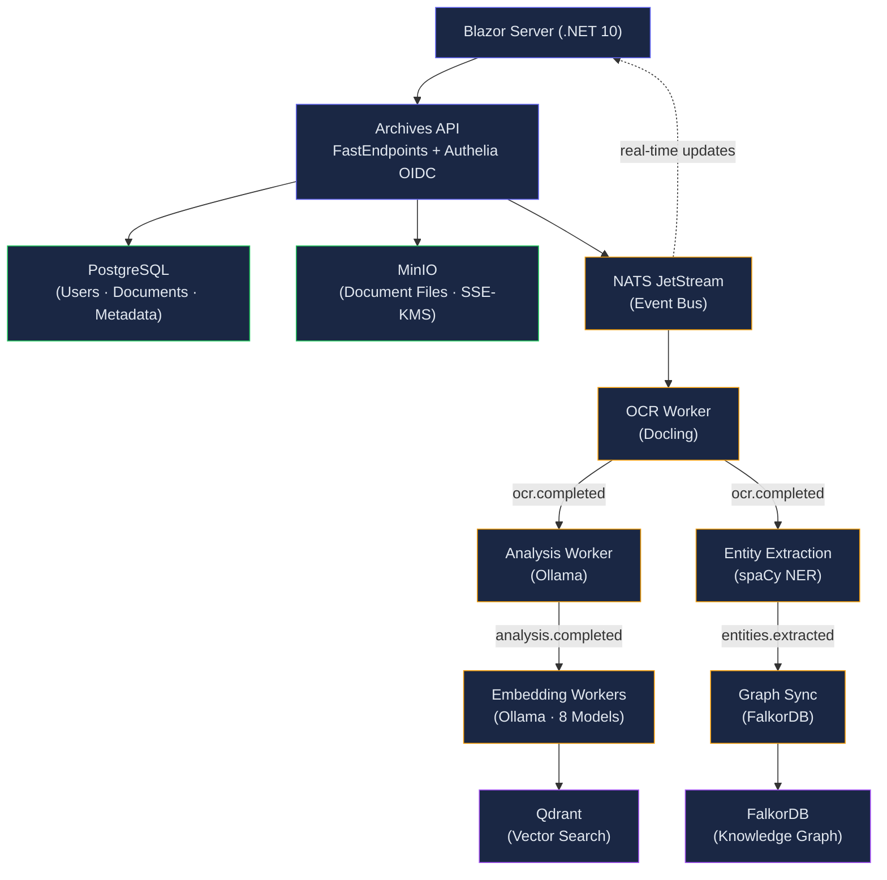

import Callout from '@components/Callout.astro';
import ImplementationNote from '@components/ImplementationNote.astro';
import ExternalCite from '@components/ExternalCite.astro';

BlueRobin is a personal document management system I built to organize, search, and analyze documents using AI. What started as a weekend experiment to index my tax documents has evolved into a full distributed system running on a homelab Kubernetes cluster. This architecture overview explains the system's design, how the components interact, and the key decisions I made along the way—including the ones I got wrong the first time.

## System Overview

BlueRobin follows a **modular monolith** architecture deployed on Kubernetes, with event-driven communication between components. The system processes documents through a multi-stage pipeline: upload → OCR → analysis → embedding → indexing.



## Technology Stack

| Layer | Technology | Purpose |
|-------|------------|---------|
| **Frontend** | Blazor Server (.NET 10) | Interactive server-side UI |
| **Styling** | Tailwind CSS 4 | Utility-first CSS with OKLCH colors |
| **API** | FastEndpoints | High-performance REST endpoints |
| **Auth** | Authelia OIDC | Identity provider with 2FA |
| **Messaging** | NATS JetStream | Event-driven communication |
| **Database** | PostgreSQL (CNPG) | Relational data storage |
| **Vector DB** | Qdrant | Semantic search embeddings |
| **Graph DB** | FalkorDB | Entity relationships |
| **Object Storage** | MinIO | S3-compatible document storage |
| **AI (Local)** | Ollama | Local LLM inference |
| **AI (Cloud)** | Azure OpenAI | Complex reasoning tasks |
| **OCR** | Docling | Document text extraction |
| **NER** | spaCy | Named entity recognition |
| **Orchestration** | K3s + Flux | Kubernetes + GitOps |

## Core Architectural Principles

### 1. Domain-Driven Design (DDD)

The codebase follows DDD tactical patterns. I chose DDD early on because document management has surprisingly deep domain complexity—processing states, ownership rules, content extraction pipelines—and I needed a way to keep that complexity from leaking into every layer of the application.

<ExternalCite
  title="Domain-Driven Design: Tackling Complexity in the Heart of Software"
  url="https://www.domainlanguage.com/ddd/"
  author="Eric Evans"
  date="2003"
/>

- **Entities** with identity (e.g., `Document`, `Archive`)
- **Value Objects** for immutable data (e.g., `FingerPrint`, `BlueRobinId`)
- **Aggregates** with enforced boundaries
- **Domain Events** for cross-aggregate communication

```csharp
// Domain entity with factory method and domain events
public class Document : AggregateRoot
{
    private Document() { }

    public static Document Create(
        BlueRobinId archiveId,
        BlueRobinId createdBy,
        FingerPrint fingerPrint,
        string fileName,
        long fileSize,
        string contentType)
    {
        // Validation and initialization...
        
        document.RaiseDomainEvent(new DocumentAddedEvent(...));
        return document;
    }
}
```

### 2. Clean Architecture

The solution follows Clean Architecture with clear layer boundaries. I was heavily influenced by Robert C. Martin's dependency rule—the idea that source code dependencies should point inward, toward higher-level policies. In practice, this meant that my `Archives.Core` project has zero NuGet dependencies beyond the .NET runtime itself.

<ExternalCite
  title="The Clean Architecture"
  url="https://blog.cleancoder.com/uncle-bob/2012/08/13/the-clean-architecture.html"
  author="Robert C. Martin"
  date="2012"
/>

```
src/
├── Archives.Core/           # Domain entities, value objects, interfaces
├── Archives.Application/    # Use cases, DTOs, application services
├── Archives.Infrastructure/ # EF Core, MinIO, NATS, external services
├── Archives.Api/           # FastEndpoints, controllers
├── Archives.Web/           # Blazor Server UI
└── Archives.Workers/       # Background processing services
```

**Dependency Rule**: Dependencies flow inward. Core has no external dependencies; Infrastructure implements Core interfaces.

<ImplementationNote>
When I first designed the solution structure, I made the mistake of putting DTOs and mapping logic directly in the Core project. This created a subtle coupling—Core started depending on serialization attributes. It took a refactoring pass to move all DTOs to the Application layer, enforcing a strict boundary where Core only contains domain concepts, interfaces, and events.
</ImplementationNote>

### 3. Event-Driven Architecture

I chose NATS JetStream for message brokering after evaluating RabbitMQ and Kafka. For a homelab context, NATS was the clear winner—it's a single binary with built-in persistence, key-value store, and object store. No Zookeeper, no Erlang runtime, no cluster coordination overhead.

<ExternalCite
  title="NATS JetStream"
  url="https://docs.nats.io/nats-concepts/jetstream"
  author="Synadia Communications"
  date="2024"
/>

Services communicate through NATS JetStream events:

```
Document Upload Flow:
1. API receives file → Stores in MinIO → Publishes "document.uploaded"
2. OCR Worker consumes → Extracts text → Publishes "ocr.completed"
3. Analysis Worker consumes → Generates summary → Publishes "analysis.completed"
4. Embedding Worker consumes → Creates vectors → Publishes "embedding.completed"
5. Index Worker consumes → Updates Qdrant → Publishes "indexed"
6. Web receives notification → Updates UI in real-time
```

<ImplementationNote>
Events use environment-prefixed subjects (e.g., `prod.archives.documents.ocr.requested`) to namespace traffic on the shared NATS cluster. BlueRobin now runs prod-only in-cluster with development on a laptop (ADR-034), so production carries the `prod.` prefix; the prefix scheme would still isolate additional environments if they were ever reintroduced.
</ImplementationNote>

## Component Deep Dives

### Identity Model

BlueRobin uses a dual-identity model:

| Identity | Format | Usage |
|----------|--------|-------|
| **BlueRobinId** | 8-char alphanumeric | Internal references, MinIO buckets, database keys |
| **ExternalId** | UUID | OIDC `sub` claim from Authelia |

The `UserSyncService` maps external identities to internal BlueRobinIds on first login. This dual-identity approach took me a while to land on—my first attempt used the OIDC `sub` claim directly as the primary key, which worked until I realized that 36-character UUIDs made terrible MinIO bucket names and NATS subject tokens.

```csharp
// UserSyncService resolves external ID to internal BlueRobinId
public async Task<ApplicationUser> SyncUserAsync(ClaimsPrincipal principal)
{
    var externalId = principal.FindFirstValue(ClaimTypes.NameIdentifier);
    
    var user = await _userRepository.GetByExternalIdAsync(externalId);
    if (user is null)
    {
        user = ApplicationUser.Create(
            BlueRobinId.New(),  // Generate internal ID
            ExternalId.From(externalId),
            principal.FindFirstValue(ClaimTypes.Email));
        await _userRepository.AddAsync(user);
    }
    
    return user;
}
```

### Storage Architecture

Each user has a dedicated MinIO bucket with server-side encryption. I chose MinIO because it's S3-compatible—meaning if I ever move to AWS, the storage layer is a config change, not a rewrite.

<ExternalCite
  title="MinIO Object Storage for Kubernetes"
  url="https://min.io/docs/minio/kubernetes/upstream/"
  author="MinIO, Inc."
  date="2024"
/>

```
Bucket: prod-abc12345  (environment-userId)
├── original/
│   └── {documentId}.pdf     # Original uploaded file
├── processed/
│   └── {documentId}/
│       ├── content.md       # OCR extracted text
│       └── thumbnail.png    # Preview image
└── exports/
    └── {exportId}.zip       # User-requested exports
```

**Encryption**: MinIO uses SSE-KMS with per-user keys managed by KES. Key names follow the pattern `key-{blueRobinId}`.

<ImplementationNote>
Getting MinIO KES encryption working was one of the most frustrating configurations in the entire project. The KES server requires a client certificate for authentication, and the certificate fingerprint must match exactly what's registered in the KES config. I went through at least five rounds of regenerating certificates before realizing the issue was the fingerprint format—KES expects SHA-256 without colons, while OpenSSL outputs with colons by default.
</ImplementationNote>

<Callout type="warning">
Workers must use the bucket name from event payloads (`evt.Bucket`), never construct bucket names manually. This ensures correct environment and user targeting.
</Callout>

### Database Design

PostgreSQL stores structured data. I run PostgreSQL via the CloudNativePG operator, which handles automatic failover, backups, and replication—it's one of the best Kubernetes operators I've worked with.

<ExternalCite
  title="CloudNativePG Documentation"
  url="https://cloudnative-pg.io/documentation/"
  author="CloudNativePG Contributors"
  date="2024"
/>

BlueRobin runs prod-only in the cluster, with development on a laptop (ADR-034). The in-cluster CNPG cluster therefore serves a single production database; the laptop dev environment runs its own local PostgreSQL.

| Environment | Database | Purpose |
|-------------|----------|---------|
| Development (laptop) | `archives_dev` | Local development |
| Production (in-cluster) | `archives_prod` | Production data |

Key tables:

```sql
-- Users and identity mapping
CREATE TABLE application_users (
    id VARCHAR(8) PRIMARY KEY,        -- BlueRobinId
    external_id UUID NOT NULL UNIQUE, -- OIDC sub claim
    email VARCHAR(255) NOT NULL,
    created_at TIMESTAMPTZ NOT NULL
);

-- Documents with metadata
CREATE TABLE documents (
    id VARCHAR(8) PRIMARY KEY,
    archive_id VARCHAR(8) REFERENCES archives(id),
    created_by VARCHAR(8) REFERENCES application_users(id),
    status VARCHAR(50) NOT NULL,
    metadata JSONB NOT NULL,          -- File info, fingerprint
    analysis JSONB,                   -- AI-generated content
    classification JSONB,             -- Document category
    created_at TIMESTAMPTZ NOT NULL
);

-- Entity extractions for knowledge graph
CREATE TABLE canonical_entities (
    id VARCHAR(8) PRIMARY KEY,
    entity_type_id VARCHAR(8) NOT NULL,
    user_id VARCHAR(8) NOT NULL,
    display_name VARCHAR(500) NOT NULL,
    properties JSONB NOT NULL,        -- Flexible schema
    confidence DECIMAL(5,4) NOT NULL
);
```

### Search Architecture

BlueRobin implements hybrid search combining multiple retrieval strategies. Getting search quality right was an iterative process—I started with pure vector search, but quickly hit cases where exact keyword matches (like document IDs or specific legal terms) were missed entirely by semantic search.

<ExternalCite
  title="Qdrant Vector Database Documentation"
  url="https://qdrant.tech/documentation/"
  author="Qdrant"
  date="2024"
/>

1. **Full-text search** — PostgreSQL `tsvector` for keyword matching
2. **Semantic search** — Qdrant vector similarity for meaning-based matching
3. **Graph traversal** — FalkorDB Cypher queries for relationship exploration

```csharp
public async Task<SearchResults> SearchAsync(
    string query, 
    BlueRobinId userId,
    CancellationToken ct)
{
    // 1. Generate query embedding
    var embedding = await _embeddingService.GenerateAsync(query, ct);
    
    // 2. Parallel search execution
    var vectorTask = _qdrantClient.SearchAsync(
        collectionName: $"{_env}-documents",
        vector: embedding,
        filter: new Filter { UserId = userId.Value },
        limit: 20);
    
    var textTask = _documentRepository.FullTextSearchAsync(
        query, userId, limit: 20, ct);
    
    await Task.WhenAll(vectorTask, textTask);
    
    // 3. Merge and rank results
    return MergeResults(vectorTask.Result, textTask.Result);
}
```

### AI Processing Pipeline

Documents flow through a multi-stage AI pipeline. I originally built this as a single monolithic worker that did OCR, analysis, and embedding in sequence. That design crumbled the moment I wanted to add NER or change the embedding model—every change required redeploying the entire pipeline. Breaking it into independent workers connected via NATS events was one of the best architectural decisions I made.

<ExternalCite
  title="Retrieval-Augmented Generation for Knowledge-Intensive NLP Tasks"
  url="https://arxiv.org/abs/2005.11401"
  author="Lewis et al."
  date="2020"
/>

```
┌─────────────┐     ┌─────────────┐     ┌─────────────┐
│   Upload    │────▶│     OCR     │────▶│  Analysis   │
│  (MinIO)    │     │  (Docling)  │     │  (Ollama)   │
└─────────────┘     └─────────────┘     └─────────────┘
                                              │
                    ┌─────────────────────────┼─────────────────────────┐
                    ▼                         ▼                         ▼
             ┌─────────────┐           ┌─────────────┐           ┌─────────────┐
             │  Chunking   │           │     NER     │           │ Embedding   │
             │ (Semantic)  │           │  (spaCy)    │           │  (Ollama)   │
             └─────────────┘           └─────────────┘           └─────────────┘
                    │                         │                         │
                    ▼                         ▼                         ▼
             ┌─────────────┐           ┌─────────────┐           ┌─────────────┐
             │   Qdrant    │           │  FalkorDB   │           │   Qdrant    │
             │  (Chunks)   │           │   (Graph)   │           │   (Docs)    │
             └─────────────┘           └─────────────┘           └─────────────┘
```

**Stage Details**:

| Stage | Service | Input | Output |
|-------|---------|-------|--------|
| OCR | Docling | PDF/Image | Markdown text |
| Analysis | Ollama (llama3) | Markdown | Summary, keywords, category |
| Chunking | Custom | Markdown | Semantic chunks (500 tokens) |
| NER | spaCy | Markdown | Named entities |
| Embedding | Ollama (nomic-embed-text) | Text | 768-dim vectors |

<ImplementationNote>
The embedding stage was a major source of latency early on. Running eight different embedding models (nomic, mxbai, arctic, minilm, bge, granite, bge-m3, paraphrase) sequentially per document took over 60 seconds. I restructured this into a fan-out pattern—NATS publishes one event per model, and each embedding request processes in parallel. The total time dropped from 60 seconds to under 3 seconds. This was one of those "obvious in hindsight" optimizations that took real production pain to discover.
</ImplementationNote>

### Real-Time Updates

Blazor components receive real-time updates through NATS:

```csharp
// NatsDocumentEventListener bridges NATS → Blazor
public class NatsDocumentEventListener : BackgroundService
{
    protected override async Task ExecuteAsync(CancellationToken stoppingToken)
    {
        // Subscribe to all document events
        await foreach (var msg in _consumer.ConsumeAsync<DocumentEvent>(
            cancellationToken: stoppingToken))
        {
            // Notify Blazor components through in-process service
            await _notifier.NotifyDocumentUpdatedAsync(
                msg.Data.DocumentId,
                msg.Data.Status);
        }
    }
}

// Blazor component subscribes to updates
@implements IDisposable

protected override void OnInitialized()
{
    _notifier.OnDocumentUpdated += HandleDocumentUpdated;
}

private async Task HandleDocumentUpdated(string documentId, string status)
{
    if (documentId == Document.Id)
    {
        Document.Status = status;
        await InvokeAsync(StateHasChanged);
    }
}
```

<ImplementationNote>
BlueRobin uses NATS directly instead of SignalR for real-time updates. This eliminates an additional dependency and leverages the existing messaging infrastructure.
</ImplementationNote>

## Infrastructure Architecture

### Kubernetes Namespace Strategy

BlueRobin uses a shared infrastructure model:

```
┌─────────────────────────────────────────────────────────────────┐
│                        K3s Cluster                               │
├─────────────────────────────────────────────────────────────────┤
│                                                                  │
│  ┌──────────────────────────────────────────────────────────┐   │
│  │                    data-layer namespace                   │   │
│  │  ┌──────────┐ ┌──────────┐ ┌──────────┐ ┌──────────┐    │   │
│  │  │PostgreSQL│ │   NATS   │ │  Qdrant  │ │  MinIO   │    │   │
│  │  │ (CNPG)   │ │ JetStream│ │          │ │          │    │   │
│  │  └──────────┘ └──────────┘ └──────────┘ └──────────┘    │   │
│  └──────────────────────────────────────────────────────────┘   │
│                                                                  │
│  ┌─────────────────────┐                                       │
│  │ archives-prod       │   (prod-only in-cluster; dev runs     │
│  │ ┌─────┐ ┌─────┐    │    on a laptop off-cluster — ADR-034)  │
│  │ │ API │ │ Web │    │                                        │
│  │ └─────┘ └─────┘    │                                        │
│  │ ┌─────────────┐    │                                        │
│  │ │   Workers   │    │                                        │
│  │ └─────────────┘    │                                        │
│  └─────────────────────┘                                       │
│                                                                  │
│  ┌──────────────────────────────────────────────────────────┐   │
│  │                       ai namespace                        │   │
│  │  ┌──────────┐ ┌──────────┐ ┌──────────┐                  │   │
│  │  │  Ollama  │ │ Docling  │ │  spaCy   │                  │   │
│  │  └──────────┘ └──────────┘ └──────────┘                  │   │
│  └──────────────────────────────────────────────────────────┘   │
│                                                                  │
└─────────────────────────────────────────────────────────────────┘
```

**Rationale**: 
- Single data infrastructure reduces operational complexity
- BlueRobin runs prod-only in the cluster with development on a laptop (ADR-034); the `prod.`-prefixed subjects, databases, collections, and credentials still namespace traffic and would isolate additional environments if reintroduced
- Shared AI services reduce GPU memory requirements

### GitOps with Flux

All infrastructure is managed through GitOps. This was a deliberate choice—I wanted a single source of truth for every piece of configuration running in the cluster. If a node dies tomorrow, I can rebuild the entire environment from the Git repository.

<ExternalCite
  title="Flux - the GitOps family of projects"
  url="https://fluxcd.io/flux/"
  author="CNCF Flux Project"
  date="2024"
/>

```
bluerobin-infra/
├── apps/                    # Application manifests
│   ├── archives-api/
│   ├── archives-web/
│   └── archives-workers/
├── infrastructure/          # Data layer infrastructure
│   └── data-layer/
│       ├── postgres/
│       ├── nats/
│       ├── qdrant/
│       └── minio/
└── platform/               # Platform services
    ├── monitoring/         # SigNoz
    └── ai/                 # Ollama, Docling
```

**Deployment Flow**:
1. Developer commits changes to `bluerobin-infra`
2. Flux detects changes and reconciles
3. Kubernetes applies updated manifests
4. Image automation updates tags on new builds

## Security Model

### Authentication Flow

```
┌────────┐     ┌──────────┐     ┌──────────┐     ┌──────────┐
│ Browser│────▶│ Traefik  │────▶│ Authelia │────▶│ BlueRobin│
│        │◀────│ (Ingress)│◀────│  (OIDC)  │◀────│   API    │
└────────┘     └──────────┘     └──────────┘     └──────────┘
     │                                │
     │         1. Initial request     │
     │────────────────────────────────▶
     │         2. Redirect to Authelia│
     │◀────────────────────────────────
     │         3. User authenticates  │
     │────────────────────────────────▶
     │         4. OIDC callback       │
     │◀────────────────────────────────
     │         5. Access with JWT     │
     │────────────────────────────────▶
```

### Data Isolation

| Layer | Isolation Method |
|-------|------------------|
| **Storage** | Per-user MinIO buckets with SSE-KMS |
| **Database** | Row-level security via `user_id` columns |
| **Search** | User filter on all Qdrant queries |
| **Events** | User ID embedded in event payloads |

### Secrets Management

Secrets are managed through Infisical with ExternalSecrets Operator:

```yaml
apiVersion: external-secrets.io/v1beta1
kind: ExternalSecret
metadata:
  name: archives-secrets
spec:
  secretStoreRef:
    name: infisical-store
    kind: ClusterSecretStore
  target:
    name: archives-secrets
  data:
    - secretKey: DATABASE_PASSWORD
      remoteRef:
        key: ARCHIVES_DB_PASSWORD
```

## Performance Considerations

### Caching Strategy

| Data | Cache | TTL |
|------|-------|-----|
| User profiles | In-memory | 5 minutes |
| Document metadata | PostgreSQL query cache | N/A |
| Search results | None (real-time) | N/A |
| AI model responses | None | N/A |

### Database Optimization

- **Connection pooling** via PgBouncer
- **Indexes** on frequently queried columns (`user_id`, `archive_id`, `status`)
- **JSONB indexes** using GIN for metadata queries

### Async Processing

All heavy operations are processed asynchronously:
- Document OCR: Background worker
- AI analysis: Background worker
- Embedding generation: Background worker with batching
- Search indexing: Eventually consistent

## Observability

### Metrics and Tracing

BlueRobin uses SigNoz for unified observability. Distributed tracing was essential for debugging the multi-stage document pipeline—without trace correlation, figuring out why a document got stuck at the embedding stage was like searching for a needle in a haystack.

<ExternalCite
  title="OpenTelemetry .NET Documentation"
  url="https://opentelemetry.io/docs/languages/net/"
  author="OpenTelemetry Authors"
  date="2024"
/>

- **Metrics**: Prometheus format, collected by OTEL collector
- **Traces**: Distributed tracing with correlation IDs
- **Logs**: Structured JSON logs with trace context

```csharp
// Automatic tracing with OpenTelemetry
services.AddOpenTelemetry()
    .WithTracing(builder => builder
        .AddAspNetCoreInstrumentation()
        .AddHttpClientInstrumentation()
        .AddNpgsql()
        .AddSource("BlueRobin.Workers")
        .AddOtlpExporter());
```

### Health Checks

```csharp
builder.Services.AddHealthChecks()
    .AddNpgSql(connectionString, name: "postgresql")
    .AddCheck<NatsHealthCheck>("nats")
    .AddCheck<MinioHealthCheck>("minio")
    .AddCheck<QdrantHealthCheck>("qdrant");
```

## Summary

Building BlueRobin has been a journey through nearly every layer of modern software engineering—from DDD aggregates to Kubernetes network policies, from vector databases to Blazor real-time updates. The architecture balances simplicity with scalability:

- **Modular monolith** allows rapid development while maintaining boundaries
- **Event-driven** processing enables loose coupling and horizontal scaling
- **Shared infrastructure** reduces operational overhead
- **DDD patterns** ensure a rich, maintainable domain model
- **GitOps** provides reproducible, auditable deployments

This architecture supports a single-user/family scale while providing a foundation for future growth. Every piece described in this overview has a dedicated deep-dive article in this blog—follow the series links to explore each component in detail.

### Next Steps

- **[Document Archives: From Upload to Intelligence](/blog/bluerobin-features-document-archives-ocr)** -- the archive processing pipeline in detail.
- **[Knowledge Graph & Entity Modelling](/blog/bluerobin-features-knowledge-graph-entity-modelling)** -- how entities are extracted and connected.
- **[Advanced Retrieval: Embeddings, Graphs, and Context](/blog/bluerobin-features-advanced-search-retrieval)** -- the multi-stage retrieval pipeline.

## Further Reading

<ExternalCite
  title="Implementing Domain-Driven Design"
  url="https://www.oreilly.com/library/view/implementing-domain-driven-design/9780133039900/"
  author="Vaughn Vernon"
  date="2013"
/>

<ExternalCite
  title="Kubernetes Documentation"
  url="https://kubernetes.io/docs/home/"
  author="The Kubernetes Authors"
  date="2024"
/>

<ExternalCite
  title="FastEndpoints Documentation"
  url="https://fast-endpoints.com/"
  author="Dhananjay Kumar"
  date="2024"
/>
