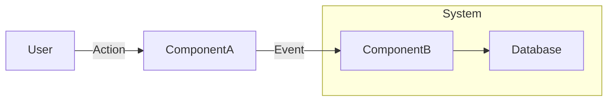

import Callout from '@components/Callout.astro';
import ImplementationNote from '@components/ImplementationNote.astro';
import CodeFile from '@components/CodeFile.astro';
import ExternalCite from '@components/ExternalCite.astro';

## Introduction

[Contextual Hook]: Start with the "Why". Why does this technology or pattern matter in a modern distributed system? Avoid generic definitions. Relate it to challenges like scale, maintainability, or security.

**Why [Topic] Matters:**

- **Benefit 1**: Explanation of benefit.
- **Benefit 2**: Explanation of benefit.
- **Benefit 3**: Explanation of benefit.

### What We'll Build

In this guide, we will implement [Specific Solution]. You will learn how to:

1. **Objective 1**: e.g., Configure the service...
2. **Objective 2**: e.g., Implement the interface...
3. **Objective 3**: e.g., Deploy with resiliency...

## Architecture Overview

[Educational Context]: Before code, explain the design. Use a diagram to show how pieces fit together.



## Section 1: Core Concept/Configuration

Explain the first major concept.

<Callout type="info" title="Best Practice">
    Highlight critical decision points or "gotchas" here.
</Callout>

```csharp
// Code snippets should be annotated or explained immediately after.
public class Example 
{
    // ...
}
```

## Section 2: Implementation

...

## Conclusion

Summarize what was achieved. Reiterate the value.

**Next Steps**:
- Link to related article 1
- Link to related article 2
