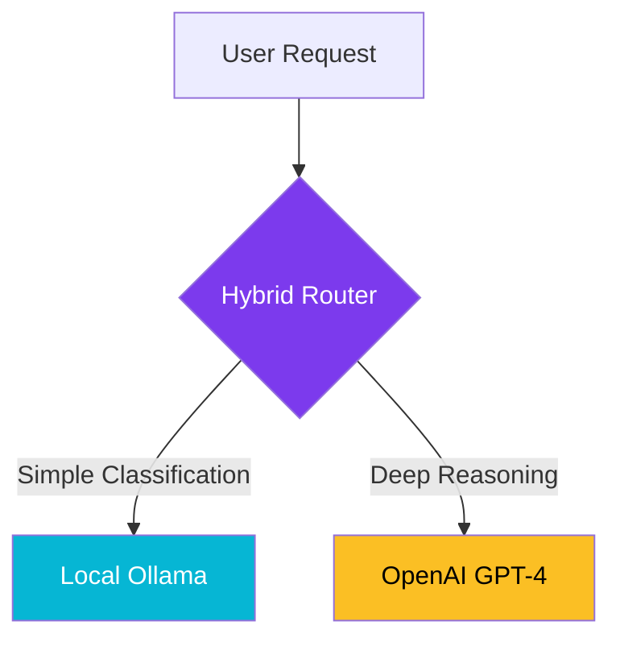

import Callout from '@components/Callout.astro';
import ImplementationNote from '@components/ImplementationNote.astro';
import CodeFile from '@components/CodeFile.astro';
import ExternalCite from '@components/ExternalCite.astro';

## Introduction

In 2024 and 2025, the local LLM ("LocalLlama") movement exploded. The promise was alluring: total privacy, zero subscription fees, and ownership of your intelligence. We excitedly built BlueRobin's MVP using purely local models like Llama 3 and Mistral via Ollama.

However, as we scaled from a prototype to a production-grade archive system, the "Homelab Reality" set in. The hardware requirements for high-fidelity reasoning were massive, and the user experience suffered.

**Why AI Strategy Matters:**

- **Cost Efficiency**: Balancing upfront hardware costs vs. pay-per-token API fees.
- **Performance**: User tolerance for waiting for an answer vs. instant gratification.
- **Maintenance**: The operational burden of managing drivers, CUDA versions, and model quantization.

### What We'll Explore

In this strategy breakdown, we will cover:

1. **The Hardware Wall**: Why running 70B+ models locally is difficult.
2. **Speed vs. Quality**: The trade-off between local speed and GPT-4o intelligence.
3. **The Hybrid Solution**: How we use local execution for simple tasks and Cloud for complex reasoning.

## Architecture Overview

We implemented a **Task-Based Routing** strategy to balance cost and intelligence. We classify AI tasks into "Reflex" (Fast/Simple) and "Reasoning" (Slow/Complex).



### 1. Local Tier (Ollama)
We use a lightweight local model (like **Llama 3 8B** or **Phi-3**) which fits easily on a single standard GPU or even CPU.

**Use Cases**:
- Detecting document language.
- Extracting simple Date/Amount fields from receipts.
- Generating search embeddings (via `all-minilm`).

## The Hardware Reality Check

Running a "smart" model (comparable to GPT-4) locally essentially means running a 70B parameter model like Llama 3 70B or Qwen 72B.

To run a 70B model even at 4-bit quantization, you need approximately **40GB - 48GB of VRAM**.

<Callout type="warning" title="The GPU Tax">
    Consumer GPUs top out at 24GB (RTX 3090/4090). To reach 48GB, you need critical infrastructure: <strong>dual GPUs</strong>, NVLink (optional but helpful), and a massive power supply.
</Callout>

### The Hidden Costs

1.  **Energy**: Dual 3090s idling consume significant power. Under load, your specialized "AI server" draws 700W+.
2.  **Heat**: Keeping a dual-GPU rig cool in a home office is a challenge.
3.  **Noise**: Server-grade fans are loud.
4.  **Upfront Cash**: Buying two 3090s (~$1,400 used) or 4090s (~$3,200 new) pays for *years* of OpenAI API usage.

## Performance Comparison: Token Speed

Even with expensive hardware, inference speed is a bottleneck.

*   **Local 70B (Dual 3090s)**: ~15-20 tokens/second.
*   **OpenAI GPT-4o**: ~80-100+ tokens/second.

For a summary of a long document (1,000 output tokens), the user waits:
*   **Local**: ~50 seconds
*   **Cloud**: ~10 seconds

That 40-second difference is the boundary between "snappy" and "broken" in the user's mind.


### 2. Cloud Tier (OpenAI)
We route complex, context-heavy prompts to OpenAI.

**Use Cases**:
- "Summarize this 50-page legal contract."
- "What are the common themes between these 10 documents?"
- Complex visual analysis of diagrams.

## Implementation: The AI Gateway

We abstracted this routing logic behind an `ILanguageModelProvider` interface.

```csharp
public class HybridAiService : ILanguageModelProvider
{
    private readonly OllamaClient _local;
    private readonly OpenAIClient _cloud;

    public async Task<string> GenerateAsync(string prompt, ComplexityLevel level)
    {
        return level switch
        {
            ComplexityLevel.Reflex => await _local.CompleteAsync(prompt, "llama3"),
            ComplexityLevel.Reasoning => await _cloud.CompleteAsync(prompt, "gpt-4o"),
            _ => throw new NotImplementedException()
        };
    }
}
```

## Conclusion

The "Cloud vs. Local" debate isn't binary. The most pragmatic architecture for 2026 is **Hybrid**.

By offloading the "heavy lifting" to OpenAI, we get the speed and intelligence of state-of-the-art models without the $3,000 hardware investment and energy bill. By keeping small tasks local, we maintain privacy for sensitive, simple data processing and cut API costs for high-volume, low-complexity operations.

**Next Steps**:
- [Optimizing System Latency](./latency-revolution-optimizing-60s-to-3s)
- Setting up Ollama in Kubernetes
