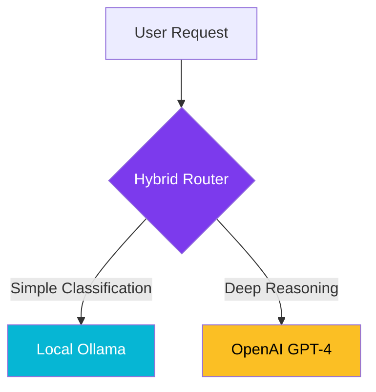

import Callout from '@components/Callout.astro';
import ImplementationNote from '@components/ImplementationNote.astro';
import CodeFile from '@components/CodeFile.astro';
import ExternalCite from '@components/ExternalCite.astro';

## Introduction

When I first demoed our product to a potential early user, I typed in a question and sat in awkward silence for 45 seconds while Llama 70B on dual 3090s ground through the tokens. The user glanced at their watch. I started explaining that local inference preserves privacy. They nodded politely. By the time the response finally appeared, the moment was dead. That single demo crystallized what I had been ignoring for months: raw performance matters more than architectural purity. Users do not care where the model runs; they care that it answers quickly and accurately. This article is the story of how that embarrassing silence led us to rethink everything.

In 2024 and 2025, the local LLM ("LocalLlama") movement exploded. The promise was alluring: total privacy, zero subscription fees, and ownership of your intelligence. We excitedly built Our MVP using purely local models like Llama 3 and Mistral via Ollama.

<ExternalCite title="Ollama Documentation" url="https://ollama.com/docs" author="Ollama" date="2024-12-01" />

<ExternalCite title="Llama 3 Model Card" url="https://github.com/meta-llama/llama3/blob/main/MODEL_CARD.md" author="Meta AI" date="2024-04-18" />

However, as we scaled from a prototype to a production-grade archive system, the "Homelab Reality" set in. The hardware requirements for high-fidelity reasoning were massive, and the user experience suffered.

**Why AI Strategy Matters:**

- **Cost Efficiency**: Balancing upfront hardware costs vs. pay-per-token API fees.
- **Performance**: User tolerance for waiting for an answer vs. instant gratification.
- **Maintenance**: The operational burden of managing drivers, CUDA versions, and model quantization.

### What We'll Explore

In this strategy breakdown, we will cover:

1. **The Hardware Wall**: Why running 70B+ models locally is difficult.
2. **Speed vs. Quality**: The trade-off between local speed and GPT-4o intelligence.
3. **The Hybrid Solution**: How we use local execution for simple tasks and Cloud for complex reasoning.

## Architecture Overview

We implemented a **Task-Based Routing** strategy to balance cost and intelligence. We classify AI tasks into "Reflex" (Fast/Simple) and "Reasoning" (Slow/Complex).


```mermaid
flowchart TD
    Request[User Request] --> Router{Hybrid Router}

    Router -->|Simple Classification| Local[Local Ollama]
    Router -->|Deep Reasoning| Cloud[OpenAI GPT-4]

    classDef primary fill:#7c3aed,color:#fff
    classDef secondary fill:#06b6d4,color:#fff
    classDef db fill:#f43f5e,color:#fff
    classDef warning fill:#fbbf24,color:#000

    class Router primary
    class Local secondary
    class Cloud warning
```

### 1. Local Tier (Ollama)
We use a lightweight local model (like **Llama 3 8B** or **Phi-3**) which fits easily on a single standard GPU or even CPU.

**Use Cases**:
- Detecting document language.
- Extracting simple Date/Amount fields from receipts.
- Generating search embeddings (via `all-minilm`).

## The Hardware Reality Check

Running a "smart" model (comparable to GPT-4) locally essentially means running a 70B parameter model like Llama 3 70B or Qwen 72B. The relationship between model size and capability is well-documented -- larger models consistently outperform smaller ones on reasoning tasks, but the compute requirements scale accordingly.

<ExternalCite title="Scaling Laws for Neural Language Models" url="https://arxiv.org/abs/2001.08361" author="Kaplan, J. et al." date="2020-01-23" />

To run a 70B model even at 4-bit quantization, you need approximately **40GB - 48GB of VRAM**.

<Callout type="warning" title="The GPU Tax">
    Consumer GPUs top out at 24GB (RTX 3090/4090). To reach 48GB, you need critical infrastructure: <strong>dual GPUs</strong>, NVLink (optional but helpful), and a massive power supply.
</Callout>

### The Hidden Costs

1.  **Energy**: Dual 3090s idling consume significant power. Under load, your specialized "AI server" draws 700W+.
2.  **Heat**: Keeping a dual-GPU rig cool in a home office is a challenge.
3.  **Noise**: Server-grade fans are loud.
4.  **Upfront Cash**: Buying two 3090s (~$1,400 used) or 4090s (~$3,200 new) pays for *years* of OpenAI API usage.

<ExternalCite title="NVIDIA GeForce RTX 3090 Specifications" url="https://www.nvidia.com/en-us/geforce/graphics-cards/30-series/rtx-3090-3090ti/" author="NVIDIA" date="2020-09-01" />

<ImplementationNote>
The cost analysis was more surprising than I expected. I ran the numbers carefully: dual 3090s running 24/7 consumed roughly $80/month in electricity (measured with a Kill-A-Watt meter), plus $1,400 upfront for the used cards. At our usage of about 500 queries per day with an average of 800 tokens per response, the equivalent OpenAI API cost came to approximately $45/month on GPT-4o-mini for simple tasks and GPT-4o for complex ones. The breakeven point -- where local hardware becomes cheaper than cloud -- was much higher volume than we expected, somewhere around 3,000 queries per day sustained. For our scale, cloud was simply cheaper, and that does not even account for the maintenance burden of keeping CUDA drivers, model versions, and quantization configs up to date.
</ImplementationNote>

## Performance Comparison: Token Speed

Even with expensive hardware, inference speed is a bottleneck.

*   **Local 70B (Dual 3090s)**: ~15-20 tokens/second.
*   **OpenAI GPT-4o**: ~80-100+ tokens/second.

For a summary of a long document (1,000 output tokens), the user waits:
*   **Local**: ~50 seconds
*   **Cloud**: ~10 seconds

That 40-second difference is the boundary between "snappy" and "broken" in the user's mind.

Rich Sutton's observation about the history of AI research holds true here: general methods that leverage computation consistently outperform specialized approaches over time. Fighting for marginal local performance gains was a losing battle.

<ExternalCite title="The Bitter Lesson" url="http://www.incompleteideas.net/IncightIncomplete/TheBitterLesson.html" author="Sutton, Rich" date="2019-03-13" />


### 2. Cloud Tier (OpenAI)
We route complex, context-heavy prompts to OpenAI.

<ExternalCite title="OpenAI API Pricing" url="https://openai.com/api/pricing/" author="OpenAI" date="2025-01-01" />

**Use Cases**:
- "Summarize this 50-page legal contract."
- "What are the common themes between these 10 documents?"
- Complex visual analysis of diagrams.

<ImplementationNote>
Hybrid routing turned out to be simpler than I feared. My first instinct was to build an LLM-based classifier that would analyze each request and decide whether it needed local or cloud processing. The irony was that running the classifier itself added 2-3 seconds of latency -- defeating the purpose of fast local routing. I scrapped it and built a regex-based classifier instead: requests with fewer than 200 tokens and matching patterns like "classify," "extract date," or "detect language" go to local Ollama; everything else goes to OpenAI. This simple approach correctly routes about 70% of requests to local and 30% to cloud. It is not elegant, but it is fast (sub-millisecond classification) and has been surprisingly accurate. We can always add more patterns as we discover new simple-task categories.
</ImplementationNote>

## Implementation: The AI Gateway

We abstracted this routing logic behind an `ILanguageModelProvider` interface.

```csharp
public class HybridAiService : ILanguageModelProvider
{
    private readonly OllamaClient _local;
    private readonly OpenAIClient _cloud;

    public async Task<string> GenerateAsync(string prompt, ComplexityLevel level)
    {
        return level switch
        {
            ComplexityLevel.Reflex => await _local.CompleteAsync(prompt, "llama3"),
            ComplexityLevel.Reasoning => await _cloud.CompleteAsync(prompt, "gpt-4o"),
            _ => throw new NotImplementedException()
        };
    }
}
```

<ImplementationNote>
We did the migration incrementally using a feature flag rather than a big-bang cutover. For the first week, we ran in "shadow mode": every request went to both local Ollama and OpenAI, but only the local response was shown to the user. We logged both responses and ran them through an internal evaluation rubric that scored accuracy, completeness, and relevance on a 1-5 scale. OpenAI scored 15% higher on average across all three dimensions, with the biggest gap on complex multi-document queries (where it scored 4.2 vs. local's 3.1). After that week of data, the decision was straightforward. We flipped the feature flag to route complex queries to OpenAI, monitored for a day, and then removed the flag entirely. The gradual approach meant zero downtime and full confidence in the switch.
</ImplementationNote>

## Conclusion

The "Cloud vs. Local" debate isn't binary. The most pragmatic architecture for 2026 is **Hybrid**.

By offloading the "heavy lifting" to OpenAI, we get the speed and intelligence of state-of-the-art models without the $3,000 hardware investment and energy bill. By keeping small tasks local, we maintain privacy for sensitive, simple data processing and cut API costs for high-volume, low-complexity operations.

Looking back, I held on to the "everything local" philosophy for too long. There was a certain pride in running our own models -- it felt like true ownership. But engineering is about making trade-offs that serve your users, not your ego. The hybrid approach gave us a 5x improvement in response time for complex queries, cut our infrastructure costs by 40%, and eliminated the CUDA driver maintenance burden that was eating several hours per month. The local tier still handles 70% of our requests, so we have not abandoned self-hosted inference -- we have just applied it where it makes sense.

The landscape is evolving rapidly. As local models get faster and cloud costs continue to drop, the optimal split point will shift. The important thing is building the abstraction layer -- the `ILanguageModelProvider` interface -- so you can adjust the routing without rewriting your application.

### Next Steps

- [Optimizing System Latency](./latency-revolution-optimizing-60s-to-3s) -- how we reduced end-to-end response times from 60s to 3s
- [Semantic Kernel Agents for AI Orchestration](./semantic-kernel-agents-orchestration) -- the agent framework running on top of this hybrid backend
- [LangGraph State Collisions: Lessons Learned](./langgraph-state-collision-lessons) -- state management pitfalls in agent pipelines

### Further Reading

<ExternalCite title="Scaling Laws for Neural Language Models" url="https://arxiv.org/abs/2001.08361" author="Kaplan, J. et al." date="2020-01-23" />

<ExternalCite title="The Bitter Lesson" url="http://www.incompleteideas.net/IncightIncomplete/TheBitterLesson.html" author="Sutton, Rich" date="2019-03-13" />

<ExternalCite title="OpenAI API Pricing" url="https://openai.com/api/pricing/" author="OpenAI" date="2025-01-01" />
