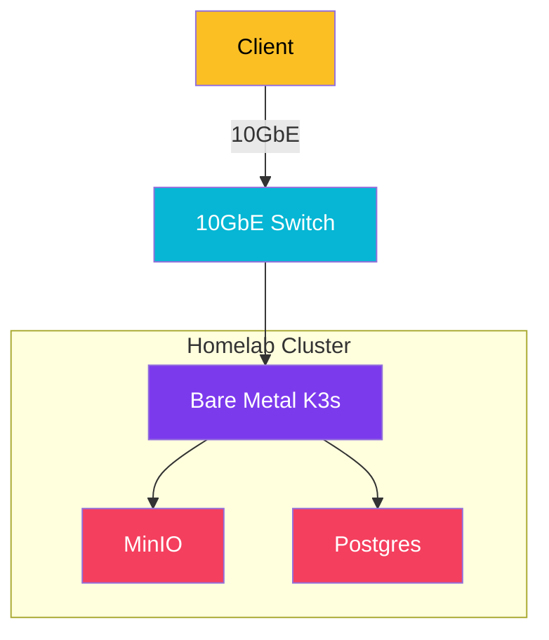

import Callout from '@components/Callout.astro';
import ImplementationNote from '@components/ImplementationNote.astro';
import CodeFile from '@components/CodeFile.astro';
import ExternalCite from '@components/ExternalCite.astro';

## Introduction

For years, the industry mantra has been "Cloud First." The promise of infinite scalability and zero hardware maintenance is intoxicating. However, for a data-intensive platform like BlueRobin—filtering gigabytes of documents, running local AI inference, and managing vector embeddings—the cloud equation started to break down. We realized that we were paying a premium for elasticity we didn't need, while suffering from latency and egress costs that stifled our innovation.

**Why We Moved to Homelab:**

- **Cost Efficiency**: Cloud GPU instances for AI inference are prohibitively expensive for 24/7 distinct usage.
- **Latency**: Local 10GbE networking creates a data plane that feels instantaneous compared to cloud object storage.
- **Data Sovereignty**: Complete physical control over sensitive archives and personal data.

### The Decision Matrix

In this article, I'll explain the specific factors that led us to execute a "Cloud Exit" and migrate BlueRobin to a dedicated on-premise Kubernetes cluster. We will cover:

1. **The Cost Analysis**: Comparing Azure/AWS bills vs. hardware amortization.
2. **Performance Wins**: How local NVMe and 10GbE transformed our ingestion pipeline.
3. **The "Joy of Ownership"**: The intangible benefit of knowing exactly where your bits live.

## Architecture Overview

The shift wasn't just physical; it was architectural. We moved from managed services to self-hosted cloud-native components. The new stack emphasizes data locality and high-speed interconnects.

## Factor 1: The AI Tax

Running LLMs in the cloud is expensive. API costs stack up ($0.03/1k tokens doesn't sound like much until you re-index a million documents), and dedicated GPU instances are overkill for sporadic tasks but necessary for latency.

<Callout type="info" title="The Local Advantage">
    With a consumer-grade GPU (RTX 3090/4090) in a homelab, we can run quantized models (Llama 3, Mistral) via Ollama with zero marginal cost per token. This allows us to re-run classification pipelines aggressively without "budget fear."
</Callout>

## Factor 2: Storage and Networking

BlueRobin is storage-heavy. We store original PDFs, OCR markdown, and vector indices.

In the cloud, high-performance storage (SSD Managed Disks) is a monthly recurring cost. S3/Blob storage is cheap but slow for random access patterns often seen in vector search.

**On-Premise Specs:**
- **Network**: 10GbE SFP+ backbone.
- **Storage**: ZFS pool with NVMe caching.

The result? Putting MinIO on a local 10GbE link made it perform almost as fast as a local disk, completely removing IO wait times from our ingestion workers.

## Factor 3: Privacy and Sovereignty

BlueRobin manages personal archives. While cloud providers have robust security, there is a fundamental peace of mind in air-gapping functionality or simply knowing that `rm -rf` on a drive means the data is truly gone.

Implementation-wise, we use **Infisical** to manage secrets regardless of location, ensuring that our security posture remains identical to a cloud environment (encrypted at rest, encrypted in transit).

## Conclusion

Migrating to a homelab wasn't just about saving money; it was about unlocking performance capablities that would be economically unviable in the public cloud. We traded the convenience of "click-and-provision" specific managed resources for the raw power of bare metal and the satisfaction of building a system that is truly ours.

**Next Steps**:
- Read about our [Hardware Setup](/blog/homelab-setup-truenas-server-guide)
- See how we [Automate Workflows](/blog/workflow-automation-n8n-kubernetes)
