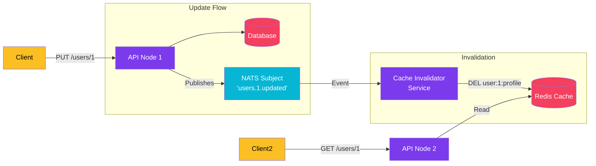

import Callout from '@components/Callout.astro';
import ImplementationNote from '@components/ImplementationNote.astro';

## Introduction

"There are only two hard things in Computer Science: cache invalidation and naming things." - Phil Karlton.

Most developers start caching with a simple **TTL (Time To Live)** strategy: "Cache this user profile for 10 minutes."
This works, but it introduces a trade-off: **Staleness vs. Load**.
- Short TTL (1 min): Database gets hammered more often.
- Long TTL (1 hour): Users see old data for up to an hour after changing it.

**Event-Driven Invalidation** gives us the best of both worlds: indefinite caching (long TTL), but immediate removal when data changes.

### What We'll Build

We will implement a reactive caching system using:
1. **Redis**: As the distributed cache.
2. **NATS JetStream**: To propagate "Data Changed" events.
3. **.NET 10**: To wire up the subscribers.

## Architecture Overview

When an API updates the database, it publishes an event. All instances of the Web/API tier subscribe to this event and evict the relevant keys from the cache.



## Section 1: The Tagged Cache Strategy

To make invalidation effective, we need a consistent Key Generation strategy.

```csharp
public static class CacheKeys
{
    public static string UserProfile(Guid userId) => $"user:{userId}:profile";
    public static string UserOrders(Guid userId) => $"user:{userId}:orders";
}
```

When we cache data, we use these keys.

```csharp
var cacheKey = CacheKeys.UserProfile(userId);
await _cache.SetStringAsync(cacheKey, serializedData, new DistributedCacheEntryOptions 
{ 
    AbsoluteExpirationRelativeToNow = TimeSpan.FromDays(30) // Long TTL!
});
```

We set a 30-day TTL because we are confident we will delete it when necessary.

## Section 2: Publishing the Change

When a user updates their profile, we ensure an event is fired.

```csharp
public async Task Handle(UpdateUserCommand cmd, CancellationToken ct)
{
    // Update DB
    var user = await _repo.GetAsync(cmd.Id);
    user.UpdateName(cmd.NewName);
    await _repo.SaveChangesAsync();

    // Publish Event to NATS
    // Subject: users.{id}.updated
    await _nats.PublishAsync($"users.{cmd.Id}.updated", new UserUpdatedEvent(cmd.Id));
}
```

## Section 3: The Invalidator Worker

We need a background service that listens to these specific NATS subjects and talks to Redis.

```csharp
public class CacheInvalidator : BackgroundService
{
    private readonly INatsConnection _nats;
    private readonly IDistributedCache _cache;

    protected override async Task ExecuteAsync(CancellationToken stoppingToken)
    {
        // Wildcard subscription to any user update
        await foreach (var msg in _nats.SubscribeAsync<UserUpdatedEvent>("users.*.updated"))
        {
            var userId = msg.Data.UserId;
            
            // Construct the keys we know depend on this user
            var keysToRemove = new[] 
            {
                CacheKeys.UserProfile(userId),
                CacheKeys.UserOrders(userId)
            };

            foreach (var key in keysToRemove)
            {
                await _cache.RemoveAsync(key, stoppingToken);
                Console.WriteLine($"Evicted cache key: {key}");
            }
        }
    }
}
```

<ImplementationNote>
**Race Conditions**: There is a tiny window where a read happens immediately after the DB write but before the Cache Invalidation. This is usually acceptable for "Eventual Consistency," but if you need strict consistency (Read-Your-Writes), the API that performs the write should technically update the cache directly or use a versioning scheme (ETags).
</ImplementationNote>

## Section 4: Dealing with Collections

Invalidating a single item is easy. Promoting changes to lists (e.g., "Get All Users") is harder.
If a user is added, the cached list of "All Users" is stale.

Strategies:
1. **Aggressive Invalidation**: If *any* user changes, kill the `users:all` list. Simple but inefficient.
2. **Tagging (Redis Stack)**: Use Redis Sets to group keys. e.g., Add `user:1` to set `group:users`. Delete the whole set on change.
3. **No Caching for Lists**: Often the best strategy. Only cache entities by ID, and query lists from the DB (or Search Engine) with short TTLs (e.g., 5 seconds).

## Conclusion

Event-Driven Cache Invalidation allows your application to be highly responsive while maintaining extremely high cache hit ratios. By relying on NATS acting as the reliable transport for change notifications, you decouple your Domain Logic from your Caching Infrastructure.

**Next Steps**:
- Investigate [Redis Scavenger] patterns for cleanup.
- Learn about [Distributed Locking] (Redlock) if you need to prevent cache stampedes during regeneration.
