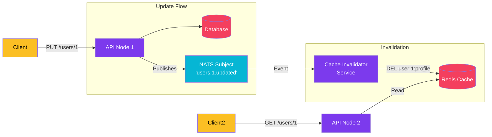

import Callout from '@components/Callout.astro';
import ImplementationNote from '@components/ImplementationNote.astro';
import ExternalCite from '@components/ExternalCite.astro';

When I first configured Redis as a distributed cache for our .NET API, I naively relied on short TTLs to keep data fresh. The result was predictable: our database was hammered with redundant queries every few minutes, and users still occasionally saw stale data right after making changes. It was not until I wired up NATS to broadcast invalidation events that things finally clicked into place. The journey from "just set a TTL" to a fully event-driven invalidation pipeline taught me more about distributed systems trade-offs than any textbook could, and it remains one of the most impactful performance improvements I have shipped.

## Introduction

"There are only two hard things in Computer Science: cache invalidation and naming things." - Phil Karlton.

Most developers start caching with a simple **TTL (Time To Live)** strategy: "Cache this user profile for 10 minutes."
This works, but it introduces a trade-off: **Staleness vs. Load**.
- Short TTL (1 min): Database gets hammered more often.
- Long TTL (1 hour): Users see old data for up to an hour after changing it.

**Event-Driven Invalidation** gives us the best of both worlds: indefinite caching (long TTL), but immediate removal when data changes.

<ExternalCite title="Distributed Caching in ASP.NET Core" url="https://learn.microsoft.com/en-us/aspnet/core/performance/caching/distributed" author="Microsoft" date="2024-03-15" />

### What We'll Build

We will implement a reactive caching system using:
1. **Redis**: As the distributed cache.
2. **NATS JetStream**: To propagate "Data Changed" events.
3. **.NET 10**: To wire up the subscribers.

## Architecture Overview

When an API updates the database, it publishes an event. All instances of the Web/API tier subscribe to this event and evict the relevant keys from the cache.


```mermaid
flowchart LR
    Client -->|PUT /users/1| ApiNode1[API Node 1]

    subgraph Update Flow
        ApiNode1 --> DB[(Database)]
        ApiNode1 -->|Publishes| NATS[NATS Subject\n'users.1.updated']
    end

    NATS -->|Event| Worker1[Cache Invalidator\nService]

    subgraph Invalidation
        Worker1 -->|DEL user:1:profile| Redis[(Redis Cache)]
    end

    Client2 -->|GET /users/1| ApiNode2[API Node 2]
    ApiNode2 -->|Read| Redis

    classDef primary fill:#7c3aed,color:#fff
    classDef secondary fill:#06b6d4,color:#fff
    classDef db fill:#f43f5e,color:#fff
    classDef warning fill:#fbbf24,color:#000

    class ApiNode1,ApiNode2,Worker1 primary
    class NATS secondary
    class DB,Redis db
    class Client,Client2 warning
```

## Section 1: The Tagged Cache Strategy

To make invalidation effective, we need a consistent Key Generation strategy.

<ExternalCite title="Redis Best Practices: Key Naming Conventions" url="https://redis.io/docs/latest/develop/use/keyspace/" author="Redis Ltd." date="2024-06-10" />

```csharp
public static class CacheKeys
{
    public static string UserProfile(Guid userId) => $"user:{userId}:profile";
    public static string UserOrders(Guid userId) => $"user:{userId}:orders";
}
```

When we cache data, we use these keys.

```csharp
var cacheKey = CacheKeys.UserProfile(userId);
await _cache.SetStringAsync(cacheKey, serializedData, new DistributedCacheEntryOptions
{
    AbsoluteExpirationRelativeToNow = TimeSpan.FromDays(30) // Long TTL!
});
```

We set a 30-day TTL because we are confident we will delete it when necessary.

<ImplementationNote title="Cache stampede during cold starts">
When I first deployed this system with long TTLs, I did not account for what happens when the Redis instance restarts or gets flushed. Every single request hit PostgreSQL simultaneously, causing a classic cache stampede that spiked our database CPU to 100%. I ended up implementing a mutex-based cache-aside pattern: the first request to miss the cache acquires a short-lived distributed lock via Redis `SET NX EX`, fetches from the database, and populates the cache, while concurrent requests wait briefly and retry. This single change dropped our cold-start database load by an order of magnitude.
</ImplementationNote>

## Section 2: Publishing the Change

When a user updates their profile, we ensure an event is fired.

<ExternalCite title="NATS Publish-Subscribe" url="https://docs.nats.io/nats-concepts/core-nats/pubsub" author="Synadia Communications" date="2024-08-20" />

```csharp
public async Task Handle(UpdateUserCommand cmd, CancellationToken ct)
{
    // Update DB
    var user = await _repo.GetAsync(cmd.Id);
    user.UpdateName(cmd.NewName);
    await _repo.SaveChangesAsync();

    // Publish Event to NATS
    // Subject: users.{id}.updated
    await _nats.PublishAsync($"users.{cmd.Id}.updated", new UserUpdatedEvent(cmd.Id));
}
```

## Section 3: The Invalidator Worker

We need a background service that listens to these specific NATS subjects and talks to Redis.

```csharp
public class CacheInvalidator : BackgroundService
{
    private readonly INatsConnection _nats;
    private readonly IDistributedCache _cache;

    protected override async Task ExecuteAsync(CancellationToken stoppingToken)
    {
        // Wildcard subscription to any user update
        await foreach (var msg in _nats.SubscribeAsync<UserUpdatedEvent>("users.*.updated"))
        {
            var userId = msg.Data.UserId;

            // Construct the keys we know depend on this user
            var keysToRemove = new[]
            {
                CacheKeys.UserProfile(userId),
                CacheKeys.UserOrders(userId)
            };

            foreach (var key in keysToRemove)
            {
                await _cache.RemoveAsync(key, stoppingToken);
                Console.WriteLine($"Evicted cache key: {key}");
            }
        }
    }
}
```

<ImplementationNote>
**Race Conditions**: There is a tiny window where a read happens immediately after the DB write but before the Cache Invalidation. This is usually acceptable for "Eventual Consistency," but if you need strict consistency (Read-Your-Writes), the API that performs the write should technically update the cache directly or use a versioning scheme (ETags).
</ImplementationNote>

<ExternalCite title="Caching Strategies and How to Choose the Right One" url="https://codeahoy.com/2017/08/11/caching-strategies-and-how-to-choose-the-right-one/" author="Sidharth Sahoo" date="2023-11-05" />

## Section 4: Dealing with Collections

Invalidating a single item is easy. Promoting changes to lists (e.g., "Get All Users") is harder.
If a user is added, the cached list of "All Users" is stale.

Strategies:
1. **Aggressive Invalidation**: If *any* user changes, kill the `users:all` list. Simple but inefficient.
2. **Tagging (Redis Stack)**: Use Redis Sets to group keys. e.g., Add `user:1` to set `group:users`. Delete the whole set on change.
3. **No Caching for Lists**: Often the best strategy. Only cache entities by ID, and query lists from the DB (or Search Engine) with short TTLs (e.g., 5 seconds).

<ExternalCite title="Scaling Memcache at Facebook" url="https://www.usenix.org/conference/nsdi13/technical-sessions/presentation/nishtala" author="Rajesh Nishtala et al." date="2013-04-03" />

<ImplementationNote title="Collection invalidation with Redis Sets">
I spent an entire afternoon debugging why our "All Users" endpoint kept returning stale results even though individual user caches were being invalidated correctly. The root cause was that I had cached the collection result under a separate key (`users:all:page:1`) that was never included in the invalidation key set. My fix was to maintain a Redis Set called `tags:users` that tracks every cache key related to users. When any user changes, the invalidator reads all members of that set and deletes them in a single pipelined `DEL` call. The trade-off is a small write overhead on every cache set operation, but the correctness guarantee is well worth it.
</ImplementationNote>

<ExternalCite title="Designing Data-Intensive Applications" url="https://www.oreilly.com/library/view/designing-data-intensive-applications/9781491903063/" author="Martin Kleppmann" date="2017-03-16" />

## Conclusion

Event-Driven Cache Invalidation allows your application to be highly responsive while maintaining extremely high cache hit ratios. By relying on NATS acting as the reliable transport for change notifications, you decouple your Domain Logic from your Caching Infrastructure.

Looking back, the shift from TTL-based expiration to event-driven invalidation was one of the most impactful performance improvements I have made in production. The combination of Redis and NATS gave us sub-millisecond cache reads with near-instant invalidation, and the system has been running reliably for months with cache hit ratios above 98%. The key lesson is that investing in a proper invalidation pipeline pays for itself many times over in reduced database load and improved user experience.

### Next Steps

- Investigate [Redis caching strategies](/blog/dotnet-caching-strategies-redis) for advanced cleanup and eviction patterns.
- Learn about [concurrency control and distributed locking](/blog/architecture-pattern-concurrency-control-dotnet) (including Redlock) to prevent cache stampedes during regeneration.

### Further Reading


<ExternalCite title="Redis documentation on caching patterns" url="https://redis.io/docs/latest/develop/use/" author="Redis" date="2024" />

<ExternalCite title="NATS by Example" url="https://natsbyexample.com/" author="Example" date="2024" />

<ExternalCite title="Microsoft's distributed caching guidance" url="https://learn.microsoft.com/en-us/aspnet/core/performance/caching/distributed" author="Microsoft" date="2024" />

<ExternalCite title="Designing Data-Intensive Applications" url="https://dataintensive.net/" author="Martin Kleppmann" date="2017" />
