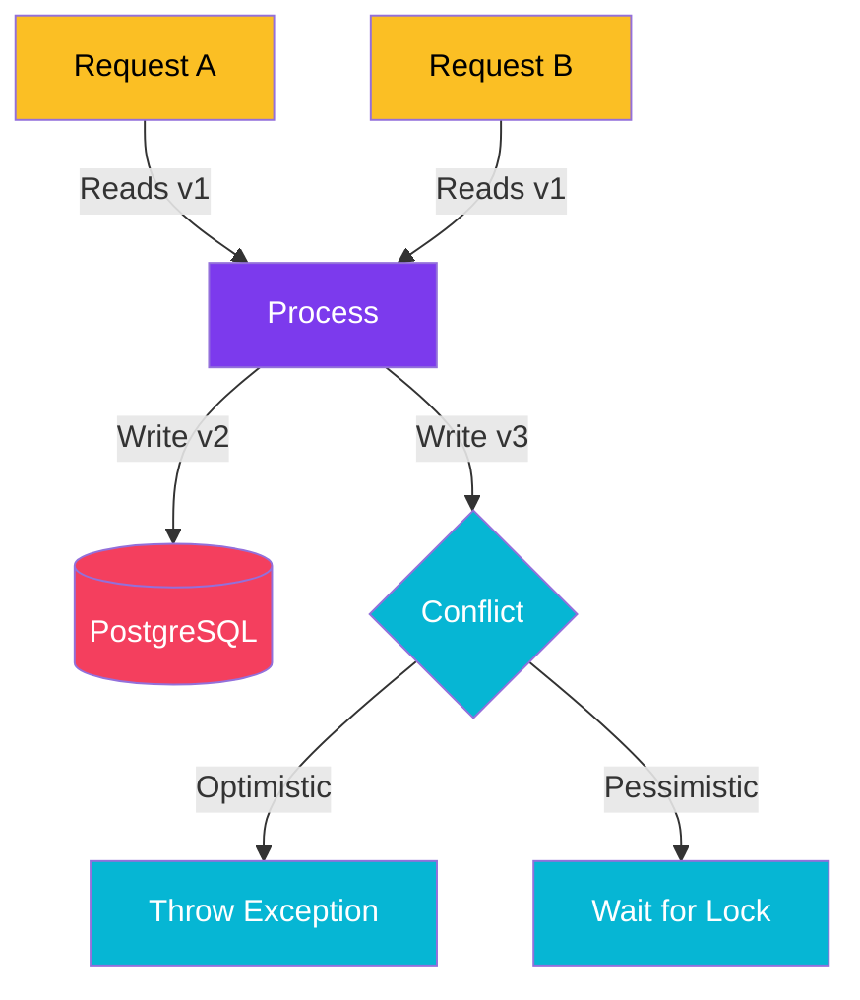

import Callout from '@components/Callout.astro';
import ImplementationNote from '@components/ImplementationNote.astro';

## Introduction

Imagine two admins, Alice and Bob, open the same "Edit User" page for User #42.
1. Alice changes the name to "Alice's Version".
2. Bob changes the generic *email* field.
3. Alice clicks Save.
4. Bob clicks Save a second later.

Without Concurrency Control, the database typically accepts the last write. Bob's save overwrites Alice's changes, potentially reverting the name change she just made because Bob's form submit included the old name. This is the **Lost Update Problem**.

We have two main strategies to fight this: **Optimistic** and **Pessimistic** concurrency control.

### What We'll Build

We will implement both strategies using **Entity Framework Core** and **PostgreSQL**.

## Architecture Overview

We are dealing with the database transaction level here.



## Strategy 1: Optimistic Concurrency (The Default Choice)

Optimistic concurrency assumes conflicts are rare. We don't lock anything when reading. Instead, when saving, we check: *"Is the row version the same as when I read it?"*

### Implementation in EF Core

We use a "Concurrency Token". In PostgreSQL, the system column `xmin` is perfect for this—it changes automatically on every update.

```csharp
public class Product
{
    public int Id { get; set; }
    public string Name { get; set; }
    public decimal Price { get; set; }

    // Maps to Postgres secret system column
    [Timestamp]
    public uint Version { get; set; } 
}
```

When EF updates this, it generates SQL like:
```sql
UPDATE Products SET Price = @p0 
WHERE Id = @id AND Version = @expectedVersion;
```

If the row was modified by someone else, the `Version` won't match, and `RowsAffected` will be 0. EF Core detects this and throws `DbUpdateConcurrencyException`.

### Handling the Exception

```csharp
try
{
    await _db.SaveChangesAsync();
}
catch (DbUpdateConcurrencyException ex)
{
    // The record changed since we loaded it.
    // 1. Reload the database values
    var entry = ex.Entries.Single();
    await entry.ReloadAsync();
    
    // 2. Decide how to merge (Client Wins vs Store Wins)
    // Here we might return a 409 Conflict to the UI
    throw new ConflictException("Data was modified by another user.");
}
```

## Strategy 2: Pessimistic Concurrency (The Tank)

If data integrity is critical and conflicts are likely (e.g., ticket reservation systems), we prevent conflicts by **Locking** the row when we read it. No one else can write (and sometimes read, depending on isolation level) until we finish.

### Implementation using Transactions

EF Core doesn't have a specific `Lock()` method on entities, but we can use raw SQL or Transaction scopes.

```csharp
using var transaction = _db.Database.BeginTransaction();

// SELECT * FROM Products WHERE Id = 1 FOR UPDATE
// This line BLOCKS if someone else holds the lock
var product = await _db.Products
    .FromSqlRaw("SELECT * FROM \"Products\" WHERE \"Id\" = {0} FOR UPDATE", id)
    .SingleAsync();

product.Stock -= 1; // Safe decrement

await _db.SaveChangesAsync();
await transaction.CommitAsync();
```

<ImplementationNote>
**Deadlocks**: Pessimistic locking drastically increases the risk of deadlocks (Process A locks Row 1 wanting Row 2; Process B locks Row 2 wanting Row 1). Always access resources in a consistent order and keep transactions extremely short.
</ImplementationNote>

## Conclusion

- **Use Optimistic Concurrency** for 95% of web api scenarios (Profile edits, admin forms). It's stateless, scalable, and doesn't hold database connections open.
- **Use Pessimistic Concurrency** for financial transactions, inventory decrementing, or "job claiming" logic where preventing the conflict is cheaper than retrying it.

**Next Steps**:
- Read about [Postgres Isolation Levels] (Read Committed vs Serializable).
- Explore [ETags] in HTTP to extend optimistic concurrency to the browser client.
