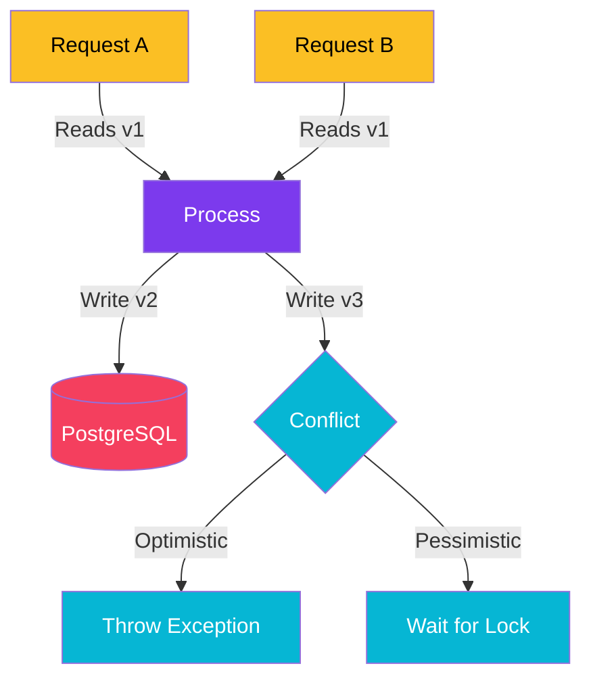

import Callout from '@components/Callout.astro';
import ImplementationNote from '@components/ImplementationNote.astro';
import ExternalCite from '@components/ExternalCite.astro';

When I first encountered optimistic concurrency conflicts in production, I had no idea what was happening. Our admin dashboard allowed multiple team members to edit product details simultaneously, and we kept getting silent data overwrites where one person's changes would vanish without a trace. It took a frustrating Friday afternoon of staring at EF Core logs before I realized we had no concurrency tokens configured at all. Implementing the `xmin` column mapping in PostgreSQL was the fix, but the real lesson was learning when to pick optimistic over pessimistic locking -- and just how expensive getting that choice wrong can be.

## Introduction

Imagine two admins, Alice and Bob, open the same "Edit User" page for User #42.
1. Alice changes the name to "Alice's Version".
2. Bob changes the generic *email* field.
3. Alice clicks Save.
4. Bob clicks Save a second later.

Without Concurrency Control, the database typically accepts the last write. Bob's save overwrites Alice's changes, potentially reverting the name change she just made because Bob's form submit included the old name. This is the **Lost Update Problem**.

<ExternalCite title="EF Core - Handling Concurrency Conflicts" url="https://learn.microsoft.com/en-us/ef/core/saving/concurrency" author="Microsoft" date="2024-05-20" />

We have two main strategies to fight this: **Optimistic** and **Pessimistic** concurrency control.

### What We'll Build

We will implement both strategies using **Entity Framework Core** and **PostgreSQL**.

## Architecture Overview

We are dealing with the database transaction level here.


```mermaid
flowchart TD
    ClientA[Request A]
    ClientB[Request B]
    DB[(PostgreSQL)]
    Valid[Process]
    Fail{Conflict}

    ClientA -->|Reads v1| Valid
    ClientB -->|Reads v1| Valid
    Valid -->|Write v2| DB
    Valid -->|Write v3| Fail

    Fail -->|Optimistic| Ex[Throw Exception]
    Fail -->|Pessimistic| Block[Wait for Lock]

    classDef primary fill:#7c3aed,color:#fff
    classDef secondary fill:#06b6d4,color:#fff
    classDef db fill:#f43f5e,color:#fff
    classDef warning fill:#fbbf24,color:#000

    class ClientA,ClientB warning
    class Valid primary
    class Fail,Ex,Block secondary
    class DB db
```

## Strategy 1: Optimistic Concurrency (The Default Choice)

Optimistic concurrency assumes conflicts are rare. We don't lock anything when reading. Instead, when saving, we check: *"Is the row version the same as when I read it?"*

<ExternalCite title="Optimistic Concurrency Control" url="https://www.postgresql.org/docs/current/mvcc-intro.html" author="PostgreSQL Global Development Group" date="2024-02-15" />

### Implementation in EF Core

We use a "Concurrency Token". In PostgreSQL, the system column `xmin` is perfect for this---it changes automatically on every update.

```csharp
public class Product
{
    public int Id { get; set; }
    public string Name { get; set; }
    public decimal Price { get; set; }

    // Maps to Postgres secret system column
    [Timestamp]
    public uint Version { get; set; }
}
```

When EF updates this, it generates SQL like:
```sql
UPDATE Products SET Price = @p0
WHERE Id = @id AND Version = @expectedVersion;
```

If the row was modified by someone else, the `Version` won't match, and `RowsAffected` will be 0. EF Core detects this and throws `DbUpdateConcurrencyException`.

<ExternalCite title="Npgsql EF Core Provider - Concurrency Tokens" url="https://www.npgsql.org/efcore/modeling/concurrency.html" author="Npgsql Development Team" date="2024-04-10" />

### Handling the Exception

```csharp
try
{
    await _db.SaveChangesAsync();
}
catch (DbUpdateConcurrencyException ex)
{
    // The record changed since we loaded it.
    // 1. Reload the database values
    var entry = ex.Entries.Single();
    await entry.ReloadAsync();

    // 2. Decide how to merge (Client Wins vs Store Wins)
    // Here we might return a 409 Conflict to the UI
    throw new ConflictException("Data was modified by another user.");
}
```

<ImplementationNote title="Retry loops for optimistic concurrency">
In one of our order processing endpoints, I initially just caught `DbUpdateConcurrencyException` and returned a 409 to the client. That worked fine for admin forms, but for automated API consumers it was a terrible experience -- they had to implement their own retry logic. I refactored the handler to use a retry loop with a maximum of three attempts: on each conflict, it reloads the entity, re-applies the command, and tries `SaveChangesAsync` again. The trick was ensuring the domain logic was idempotent so re-application was safe. After this change, our conflict-related error rate dropped from about 2% to near zero under normal load.
</ImplementationNote>

## Strategy 2: Pessimistic Concurrency (The Tank)

If data integrity is critical and conflicts are likely (e.g., ticket reservation systems), we prevent conflicts by **Locking** the row when we read it. No one else can write (and sometimes read, depending on isolation level) until we finish.

<ExternalCite title="PostgreSQL Explicit Locking" url="https://www.postgresql.org/docs/current/explicit-locking.html" author="PostgreSQL Global Development Group" date="2024-02-15" />

### Implementation using Transactions

EF Core doesn't have a specific `Lock()` method on entities, but we can use raw SQL or Transaction scopes.

```csharp
using var transaction = _db.Database.BeginTransaction();

// SELECT * FROM Products WHERE Id = 1 FOR UPDATE
// This line BLOCKS if someone else holds the lock
var product = await _db.Products
    .FromSqlRaw("SELECT * FROM \"Products\" WHERE \"Id\" = {0} FOR UPDATE", id)
    .SingleAsync();

product.Stock -= 1; // Safe decrement

await _db.SaveChangesAsync();
await transaction.CommitAsync();
```

<ImplementationNote>
**Deadlocks**: Pessimistic locking drastically increases the risk of deadlocks (Process A locks Row 1 wanting Row 2; Process B locks Row 2 wanting Row 1). Always access resources in a consistent order and keep transactions extremely short.
</ImplementationNote>

<ImplementationNote title="Deadlock debugging in production">
We ran into a deadlock in our inventory service on a busy Saturday. Two concurrent checkout requests each needed to decrement stock for the same two products, but they acquired locks in different orders based on the items in the cart. PostgreSQL detected the deadlock and killed one transaction after its `deadlock_timeout` (which was set to the default 1 second). The fix was straightforward: I sorted the product IDs before acquiring locks so every transaction always locks rows in the same ascending order. I also added a `SET LOCAL lock_timeout = '5s'` at the start of each transaction so we would fail fast rather than hang indefinitely if something unexpected happened.
</ImplementationNote>

<ExternalCite title="Concurrency Control in Database Systems" url="https://dl.acm.org/doi/10.1145/356842.356846" author="Philip A. Bernstein and Nathan Goodman" date="1981-06-01" />

## Conclusion

- **Use Optimistic Concurrency** for 95% of web api scenarios (Profile edits, admin forms). It's stateless, scalable, and doesn't hold database connections open.
- **Use Pessimistic Concurrency** for financial transactions, inventory decrementing, or "job claiming" logic where preventing the conflict is cheaper than retrying it.

Having implemented both strategies across different services in our platform, my takeaway is that optimistic concurrency should always be your starting point. It is simpler, scales better, and keeps your transaction windows short. I only reach for pessimistic locks when I can prove that conflict rates are high enough to make retry loops wasteful, or when the business cost of even a single conflict-and-retry is unacceptable. The PostgreSQL `xmin` column combined with EF Core's built-in conflict detection covers the vast majority of real-world scenarios with minimal ceremony.

### Next Steps
- Read about [Postgres Isolation Levels] (Read Committed vs Serializable).
- Explore [ETags] in HTTP to extend optimistic concurrency to the browser client.

### Further Reading


<ExternalCite title="EF Core Concurrency Conflicts documentation" url="https://learn.microsoft.com/en-us/ef/core/saving/concurrency" author="Microsoft" date="2024" />

<ExternalCite title="PostgreSQL MVCC documentation" url="https://www.postgresql.org/docs/current/mvcc-intro.html" author="PostgreSQL Global Development Group" date="2024" />

<ExternalCite title="Npgsql EF Core concurrency tokens" url="https://www.npgsql.org/efcore/modeling/concurrency.html" author="Npgsql Project" date="2024" />

<ExternalCite title="Designing Data-Intensive Applications" url="https://dataintensive.net/" author="Martin Kleppmann" date="2017" />
