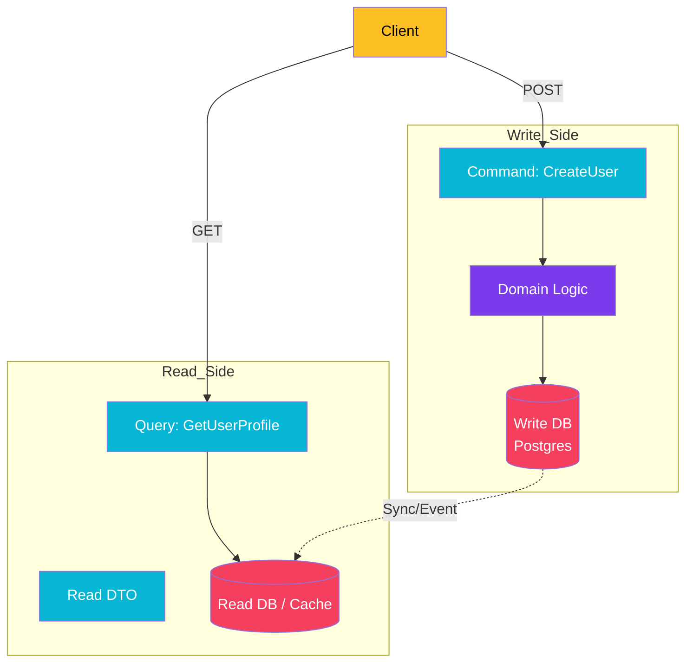

import Callout from '@components/Callout.astro';
import ImplementationNote from '@components/ImplementationNote.astro';

## Introduction

Command Query Responsibility Segregation (CQRS) is a pattern that separates the operations that read data (Queries) from the operations that update data (Commands).

In a traditional "CRUD" architecture, the same model entity is often used for both saving to the database and returning data to the UI. This leads to bloated classes with properties like `IsPasswordConfidential` or complex mappings that slow down simple reads.

**Why CQRS:**

- **Performance**: You can optimize your "Read" store (e.g., flattened SQL views, ElasticSearch) without worrying about normal forms required for writes.
- **Security**: Commands have strict validation and business logic. Queries just fetch data.
- **Scalability**: Reads usually outnumber writes 100:1. You can scale the Read side independently.

### What We'll Build

We will implement a vertical slice architecture using:
1. **FastEndpoints**: A high-performance alternative to Controllers for defining API endpoints.
2. **MediatR** (Optional): For dispatching internal application logic, though FastEndpoints can handle dispatching natively too. We'll show the pattern of distinct Request/Response pairs.
3. **Materialized Views**: A dedicated read model.

## Architecture Overview

We strictly separate the path data takes when entering the system.



## Section 1: The Command (Write Side)

Using **FastEndpoints**, we treat every endpoint as a distinct "Handler".

Here is a command to Create a Document. Notice it only returns an ID, not the full object.

```csharp
// 1. The Request DTO
public class CreateDocumentRequest
{
    public string Title { get; set; }
    public string Content { get; set; }
}

// 2. The Endpoint
public class CreateDocumentEndpoint : Endpoint<CreateDocumentRequest, Guid>
{
    public override void Configure()
    {
        Post("/documents");
        AllowAnonymous();
    }

    public override async Task HandleAsync(CreateDocumentRequest req, CancellationToken ct)
    {
        // 3. Domain Logic (Command)
        var doc = Document.Create(req.Title, req.Content);
        
        await Data.AddAsync(doc);
        await Data.SaveChangesAsync();
        
        // 4. Response
        await SendOkAsync(doc.Id, ct);
    }
}
```

<Callout type="info" title="REPR Pattern">
FastEndpoints promotes the <strong>REPR</strong> (Request-Endpoint-Response) pattern. This is a form of CQRS at the API level. You don't always need MediatR indirection if your Endpoint contains the logic directly or calls a service.
</Callout>

## Section 2: The Query (Read Side)

For the Read side, we bypass the heavy Domain Entities. we don't need a `Document` class with behavior methods like `Approve()` or `Publish()`. We just need a DTO.

We can use SQL implementations like Dapper or EF Core with `AsNoTracking()` and `.Select()`.

```csharp
public class GetDocumentEndpoint : EndpointWithoutRequest<DocumentSummaryDto>
{
    private readonly AppDbContext _db;

    public GetDocumentEndpoint(AppDbContext db)
    {
        _db = db;
    }

    public override void Configure()
    {
        Get("/documents/{id}");
        AllowAnonymous();
    }

    public override async Task HandleAsync(CancellationToken ct)
    {
        var id = Route<Guid>("id");

        // Direct Projection to DTO - efficiently queries only needed columns
        var summary = await _db.Documents
            .AsNoTracking()
            .Where(d => d.Id == id)
            .Select(d => new DocumentSummaryDto 
            {
                Id = d.Id,
                Title = d.Title,
                // We might flatten related data here
                AuthorName = d.Author.FullName 
            })
            .FirstOrDefaultAsync(ct);

        if (summary is null)
        {
            await SendNotFoundAsync(ct);
            return;
        }

        await SendOkAsync(summary, ct);
    }
}
```

## Section 3: Synchronization

In advanced CQRS, the Read Store might be a different technology entirely (e.g., Redis or ElasticSearch).

In that case, you would use an **Event Handler** (triggered after the Write transaction commits) to update the Read Store.

```csharp
public class DocumentIndexedHandler : INotificationHandler<DocumentCreatedEvent>
{
    public async Task Handle(DocumentCreatedEvent evt, CancellationToken ct)
    {
        // Update the search index (Read Model)
        await _qdrant.UpsertAsync(evt.DocumentId, evt.Text);
    }
}
```

## Conclusion

CQRS adds complexity, but it solves the impedance mismatch between high-performance reading and complex transactional writing.

By using FastEndpoints, we make this separation explicit in our project structure. Commands live in `Features/Documents/Create`, and Queries live in `Features/Documents/Get`.

**Next Steps**:
- Explore [Projections] to pre-calculate expensive reads.
- Learn about [Event Sourcing], the natural evolution of CQRS.
