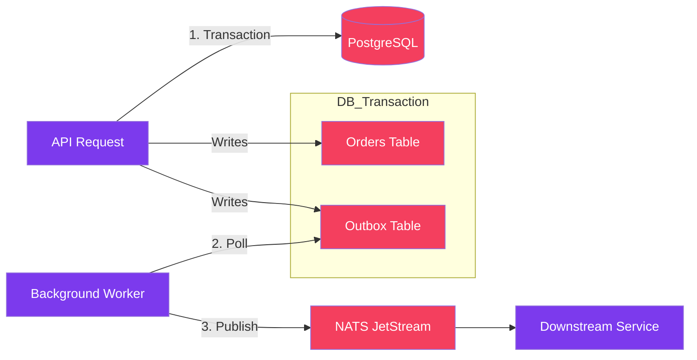

import Callout from '@components/Callout.astro';
import ImplementationNote from '@components/ImplementationNote.astro';

## Introduction

In distributed systems, the "dual-write problem" is a classic villain. It occurs when a service needs to do two things:
1. Update its local database (e.g., "Create Order").
2. Publish an event to a message broker (e.g., "OrderCreated" to NATS).

If you do step 1 and step 2 fails, your system is inconsistent (Order exists, but no one knows). If you do step 2 first and step 1 fails, downstream services process a ghost order.

Atomic transactions across purely distributed resources (Two-Phase Commit) are heavy and brittle. The **Transactional Outbox Pattern** offers an elegant solution by turning the database into a temporary queue.

**Why Use the Outbox Pattern:**

- **Atomicity**: The business data and the event are saved in the *same* database transaction. They either both succeed or both fail.
- **Resilience**: Even if the message broker (NATS) is down, the event is safely stored in your database and will be sent later.
- **Ordering**: Events can be processed in the exact order they were committed.

### What We'll Build

We will implement a robust Outbox mechanism in a .NET application.

1. **Outbox Entity**: A database table to store pending messages.
2. **Atomic Commit**: Storing the domain entity and the outbox message in one EF Core `SaveChanges()`.
3. **The Relay Worker**: A background service that polls the outbox and publishes to NATS.

## Architecture Overview

Instead of publishing directly to NATS during the request, we write to an `OutboxMessages` table. A background process pick these up and sends them.



## Section 1: The Outbox Entity

First, we define the schema for our stored messages. This table acts as our "durability buffer."

```csharp
public class OutboxMessage
{
    public Guid Id { get; set; } = Guid.NewGuid();
    public string Type { get; set; } = string.Empty; // e.g., "OrderCreated"
    public string Payload { get; set; } = string.Empty; // JSON Content
    public string Subject { get; set; } = string.Empty; // NATS Subject
    public DateTime OccurredOnUtc { get; set; } = DateTime.UtcNow;
    public DateTime? ProcessedOnUtc { get; set; }
    public string? Error { get; set; }
}
```

<ImplementationNote>
For high-throughput systems, ensure you have an index on `ProcessedOnUtc` where the value is `NULL` to speed up the polling query.
</ImplementationNote>

## Section 2: Atomic Retrieval & Save

In your Command Handler (using MediatR or FastEndpoints), you simply add the event to the `DbSet` alongside your entity.

```csharp
public async Task Handle(CreateOrderCommand command, CancellationToken ct)
{
    using var transaction = _dbContext.Database.BeginTransaction();

    // 1. Domain Logic
    var order = Order.Create(command.Product, command.Quantity);
    _dbContext.Orders.Add(order);

    // 2. Prepare Event
    var evt = new OrderCreatedEvent(order.Id);
    var outboxMsg = new OutboxMessage 
    {
        Type = nameof(OrderCreatedEvent),
        Subject = $"orders.{order.Id}.created",
        Payload = JsonSerializer.Serialize(evt)
    };
    
    _dbContext.OutboxMessages.Add(outboxMsg);

    // 3. Atomic Commit
    await _dbContext.SaveChangesAsync(ct);
    await transaction.CommitAsync(ct);
}
```

At this point, even if the server crashes immediately after commit, the event is safe on disk.

## Section 3: The Relay Worker

A `BackgroundService` runs continuously to flush the outbox.

```csharp
public class OutboxRelayWorker : BackgroundService
{
    private readonly IServiceProvider _provider;
    private readonly INatsJSContext _nats;

    protected override async Task ExecuteAsync(CancellationToken stoppingToken)
    {
        while (!stoppingToken.IsCancellationRequested)
        {
            await ProcessBatchAsync(stoppingToken);
            await Task.Delay(1000, stoppingToken); // Poll interval
        }
    }

    private async Task ProcessBatchAsync(CancellationToken ct)
    {
        using var scope = _provider.CreateScope();
        var db = scope.ServiceProvider.GetRequiredService<AppDbContext>();

        // Fetch pending messages
        var messages = await db.OutboxMessages
            .Where(m => m.ProcessedOnUtc == null)
            .OrderBy(m => m.OccurredOnUtc)
            .Take(50)
            .ToListAsync(ct);

        foreach (var msg in messages)
        {
            try 
            {
                // Publish to NATS
                await _nats.PublishAsync(msg.Subject, msg.Payload);
                
                // Mark as processed
                msg.ProcessedOnUtc = DateTime.UtcNow;
            }
            catch (Exception ex)
            {
                // Log and optionally retry later
                msg.Error = ex.Message;
            }
        }

        await db.SaveChangesAsync(ct);
    }
}
```

<Callout type="warning" title="At-Least-Once Delivery">
The Outbox pattern guarantees <strong>at-least-once</strong> delivery. It is possible for the worker to publish the message to NATS, but fail to update the DB row to "Processed" before crashing. When the worker restarts, it will send the message again. Therefore, your consumers <strong>must be idempotent</strong>.
</Callout>

## Conclusion

The Transactional Outbox pattern decouples your database transaction from your message broker availability. While it adds moving parts (the relay worker), it is essential for systems where data integrity cannot be compromised.

In the BlueRobin architecture, we rely on this pattern for all critical events, ensuring that even if NATS undergoes maintenance or a network partition occurs, no data is ever lost.

**Next Steps**:
- Explore [Idempotency Consumers] to handle duplicate messages.
- Look into **CDC (Change Data Capture)** tools like Debezium for a zero-code outbox implementation.
