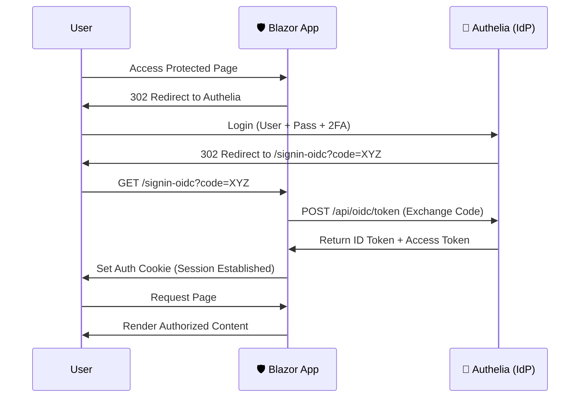

import Callout from '@components/Callout.astro';
import ImplementationNote from '@components/ImplementationNote.astro';
import ExternalCite from '@components/ExternalCite.astro';

## Introduction

Before integrating Authelia, BlueRobin's web app had its own user table with bcrypt-hashed passwords and a hand-rolled JWT system. It worked, but every new feature—password reset, 2FA, session management—was another surface area to secure. Migrating to Authelia OIDC deleted over 2,000 lines of authentication code and replaced it with 40 lines of `Program.cs` configuration. The security posture improved dramatically because I was no longer responsible for implementing cryptographic protocols correctly.

In a manufacturing environment or a homelab, you don't want to manage separate passwords for your Wiki, your Dashboard, and your Document System. You want **Single Sign-On (SSO)**.

**Authelia** is a lightweight authentication server that acts as your Identity Provider (IdP). Your Blazor app acts as the Client. They speak **OpenID Connect (OIDC)** to securely exchange user identity without your app ever touching a password. <ExternalCite title="OpenID Connect Core 1.0" url="https://openid.net/specs/openid-connect-core-1_0.html" author="OpenID Foundation" date="2014" />

**Why Authelia OIDC?**
-   **Centralized User Management**: One place to ban users or reset passwords. <ExternalCite title="Authelia Configuration - Identity Providers" url="https://www.authelia.com/configuration/identity-providers/openid-connect/provider/" author="Authelia" date="2024" />
-   **2FA Enforcement**: Authelia handles TOTP/Duo; your app doesn't need to know.
-   **Standard Protocol**: If you switch to Entra ID (Azure AD) later, the code changes are minimal. <ExternalCite title="Microsoft Identity Platform OIDC" url="https://learn.microsoft.com/en-us/entra/identity-platform/v2-protocols-oidc" author="Microsoft" date="2024" />

### What We'll Build
1.  **Authelia Config**: Register your Blazor app as a client.
2.  **Blazor Program.cs**: Configure the OIDC middleware.
3.  **Token Handling**: Map claims from Authelia (groups, email) to .NET ClaimsPrincipal.

## Architecture Overview


```mermaid
sequenceDiagram
    participant User
    participant Blazor as 🛡️ Blazor App
    participant Authelia as 🔐 Authelia (IdP)

    User->>Blazor: Access Protected Page
    Blazor->>User: 302 Redirect to Authelia
    User->>Authelia: Login (User + Pass + 2FA)
    Authelia->>User: 302 Redirect to /signin-oidc?code=XYZ
    User->>Blazor: GET /signin-oidc?code=XYZ
    Blazor->>Authelia: POST /api/oidc/token (Exchange Code)
    Authelia->>Blazor: Return ID Token + Access Token
    Blazor->>User: Set Auth Cookie (Session Established)
    User->>Blazor: Request Page
    Blazor->>User: Render Authorized Content
```

## Section 1: Authelia Configuration

First, tell Authelia about your application. It needs a `client_id` and a `client_secret`.

```yaml
# configuration.yml (Authelia)
identity_providers:
  oidc:
    clients:
      - client_id: my-web-client
        client_name: My Web App
        client_secret: '$pbkdf2-sha512$...' # Hashed secret
        public: false
        authorization_policy: two_factor # Force 2FA
        redirect_uris:
          - https://web.bluerobin.local/signin-oidc
        scopes:
          - openid
          - profile
          - email
          - groups
        token_endpoint_auth_method: client_secret_post
```

<ImplementationNote>
    Authelia requires the client secret to be hashed with PBKDF2-SHA512 in the configuration file—you cannot use the plaintext secret. I missed this initially and kept getting "invalid_client" errors during the token exchange. The `authelia crypto hash generate pbkdf2` CLI command generates the correct hash format. The plaintext secret goes in your .NET app's configuration; the hashed version goes in Authelia's YAML.
</ImplementationNote>

<ImplementationNote>
    The `redirect_uris` must exactly match what your Blazor app sends. A trailing slash mismatch implies a security risk and will block the login.
</ImplementationNote>

<ExternalCite title="OAuth 2.0 Security Best Current Practice" url="https://datatracker.ietf.org/doc/html/draft-ietf-oauth-security-topics" author="IETF" date="2023" />

## Section 2: .NET 8/9 Configuration

In `Program.cs`, we use the standard `Microsoft.AspNetCore.Authentication.OpenIdConnect` library. <ExternalCite title="ASP.NET Core Authentication" url="https://learn.microsoft.com/en-us/aspnet/core/security/authentication/" author="Microsoft" date="2024" />

```csharp
// Program.cs
using Microsoft.AspNetCore.Authentication.Cookies;
using Microsoft.AspNetCore.Authentication.OpenIdConnect;

builder.Services.AddAuthentication(options =>
{
    options.DefaultScheme = CookieAuthenticationDefaults.AuthenticationScheme;
    options.DefaultChallengeScheme = OpenIdConnectDefaults.AuthenticationScheme;
})
.AddCookie(options => 
{
    options.Cookie.Name = "MyApp.Session";
    options.Cookie.SameSite = SameSiteMode.Lax;
})
.AddOpenIdConnect(options =>
{
    options.Authority = "https://auth.bluerobin.local";
    options.ClientId = "my-web-client";
    options.ClientSecret = builder.Configuration["Auth:ClientSecret"];
    options.ResponseType = "code";

    // Scopes request specific data
    options.Scope.Clear();
    options.Scope.Add("openid");
    options.Scope.Add("profile");
    options.Scope.Add("email");
    options.Scope.Add("groups");

    // Map Authelia's "groups" claim to .NET's Role claim
    options.TokenValidationParameters = new()
    {
        NameClaimType = "preferred_username",
        RoleClaimType = "groups"
    };
    
    // Secure by default
    options.RequireHttpsMetadata = true;
    options.SaveTokens = true;
});
```

<ImplementationNote>
    The `TokenValidationParameters` mapping was the key insight that took me hours to discover. Authelia sends the username as `preferred_username` and roles as `groups`, but ASP.NET Core expects `ClaimTypes.Name` and `ClaimTypes.Role` by default. Without the explicit mapping, `User.Identity.Name` was null and `User.IsInRole("admin")` always returned false—even though the token contained the correct claims. Checking the raw token in jwt.io finally revealed the mismatch.
</ImplementationNote>

## Section 3: Protecting Pages

In Blazor, use `[Authorize]` to protect pages.

```razor
@page "/dashboard"
@using Microsoft.AspNetCore.Authorization
@attribute [Authorize]

<h1>Dashboard</h1>
<p>Welcome, @context.User.Identity?.Name!</p>

@if (context.User.IsInRole("admin"))
{
    <button class="btn-danger">Delete Database</button>
}
```

<ExternalCite title="Blazor Authentication and Authorization" url="https://learn.microsoft.com/en-us/aspnet/core/blazor/security/" author="Microsoft" date="2024" />

<ImplementationNote>
    In Blazor Server, the authentication state lives on the server-side circuit. When a user's session expires at Authelia, the Blazor circuit doesn't know about it until the next HTTP request. This means a user can appear "logged in" on the Blazor UI but get a 401 when the app makes an API call. I solved this by adding a periodic token validation check using a background circuit handler that redirects to the login page when the token is expired or revoked.
</ImplementationNote>

## Conclusion

By offloading authentication to Authelia, you make your application simpler and more secure. You no longer store password hashes. You get multi-factor authentication "for free". And your users get a seamless Single Sign-On experience across your entire suite of apps.

The migration from custom auth to Authelia OIDC was one of the highest-ROI changes I've made to BlueRobin. Not only did it eliminate an entire class of security vulnerabilities (password storage, session fixation, CSRF on login forms), but it also enabled features I hadn't planned for—like group-based access control that lets me share specific sections of the app with family members without giving them admin access.

**Next Steps:**
- Deploy [Authelia as your Identity Provider](/authelia-sso-oidc-dotnet) if you haven't already.
- Learn how [Zero Trust Architecture](/zero-trust-architecture-mtls-tokens-identity) extends this identity layer to service-to-service communication.
- Expose your authenticated app safely with [Cloudflare Tunnel](/cloudflare-tunnel-secure-service-exposure).

### Further Reading

- <ExternalCite title="OpenID Connect Core 1.0" url="https://openid.net/specs/openid-connect-core-1_0.html" author="OpenID Foundation" date="2014" /> — The specification underlying all OIDC authentication flows used in this article.
- <ExternalCite title="ASP.NET Core Authentication" url="https://learn.microsoft.com/en-us/aspnet/core/security/authentication/" author="Microsoft" date="2024" /> — Official Microsoft documentation on authentication middleware, cookie handling, and OIDC integration.
- <ExternalCite title="Authelia Configuration - Identity Providers" url="https://www.authelia.com/configuration/identity-providers/openid-connect/provider/" author="Authelia" date="2024" /> — Detailed configuration reference for Authelia's OIDC provider settings.
