import Callout from '@components/Callout.astro';
import ImplementationNote from '@components/ImplementationNote.astro';
import ExternalCite from '@components/ExternalCite.astro';

## Introduction

In a manufacturing environment or a homelab, you don't want to manage separate passwords for your Wiki, your Dashboard, and your Document System. You want **Single Sign-On (SSO)**.

**Authelia** is a lightweight authentication server that acts as your Identity Provider (IdP). Your Blazor app acts as the Client. They speak **OpenID Connect (OIDC)** to securely exchange user identity without your app ever touching a password.

**Why Authelia OIDC?**
-   **Centralized User Management**: One place to ban users or reset passwords.
-   **2FA Enforcement**: Authelia handles TOTP/Duo; your app doesn't need to know.
-   **Standard Protocol**: If you switch to Entra ID (Azure AD) later, the code changes are minimal.

### What We'll Build
1.  **Authelia Config**: Register your Blazor app as a client.
2.  **Blazor Program.cs**: Configure the OIDC middleware.
3.  **Token Handling**: Map claims from Authelia (groups, email) to .NET ClaimsPrincipal.

## Architecture Overview

```mermaid
sequenceDiagram
    participant User
    participant Blazor as 🛡️ Blazor App
    participant Authelia as 🔐 Authelia (IdP)

    User->>Blazor: Access Protected Page
    Blazor->>User: 302 Redirect to Authelia
    User->>Authelia: Login (User + Pass + 2FA)
    Authelia->>User: 302 Redirect to /signin-oidc?code=XYZ
    User->>Blazor: GET /signin-oidc?code=XYZ
    Blazor->>Authelia: POST /api/oidc/token (Exchange Code)
    Authelia->>Blazor: Return ID Token + Access Token
    Blazor->>User: Set Auth Cookie (Session Established)
    User->>Blazor: Request Page
    Blazor->>User: Render Authorized Content
```



## Section 1: Authelia Configuration

First, tell Authelia about your application. It needs a `client_id` and a `client_secret`.

```yaml
# configuration.yml (Authelia)
identity_providers:
  oidc:
    clients:
      - client_id: bluerobin-web
        client_name: BlueRobin Web
        client_secret: '$pbkdf2-sha512$...' # Hashed secret
        public: false
        authorization_policy: two_factor # Force 2FA
        redirect_uris:
          - https://web.bluerobin.local/signin-oidc
        scopes:
          - openid
          - profile
          - email
          - groups
        token_endpoint_auth_method: client_secret_post
```

<ImplementationNote>
    The `redirect_uris` must exactly match what your Blazor app sends. A trailing slash mismatch implies a security risk and will block the login.
</ImplementationNote>

## Section 2: .NET 8/9 Configuration

In `Program.cs`, we use the standard `Microsoft.AspNetCore.Authentication.OpenIdConnect` library.

```csharp
// Program.cs
using Microsoft.AspNetCore.Authentication.Cookies;
using Microsoft.AspNetCore.Authentication.OpenIdConnect;

builder.Services.AddAuthentication(options =>
{
    options.DefaultScheme = CookieAuthenticationDefaults.AuthenticationScheme;
    options.DefaultChallengeScheme = OpenIdConnectDefaults.AuthenticationScheme;
})
.AddCookie(options => 
{
    options.Cookie.Name = "BlueRobin.Session";
    options.Cookie.SameSite = SameSiteMode.Lax;
})
.AddOpenIdConnect(options =>
{
    options.Authority = "https://auth.bluerobin.local";
    options.ClientId = "bluerobin-web";
    options.ClientSecret = builder.Configuration["Auth:ClientSecret"];
    options.ResponseType = "code";

    // Scopes request specific data
    options.Scope.Clear();
    options.Scope.Add("openid");
    options.Scope.Add("profile");
    options.Scope.Add("email");
    options.Scope.Add("groups");

    // Map Authelia's "groups" claim to .NET's Role claim
    options.TokenValidationParameters = new()
    {
        NameClaimType = "preferred_username",
        RoleClaimType = "groups"
    };
    
    // Secure by default
    options.RequireHttpsMetadata = true;
    options.SaveTokens = true;
});
```

## Section 3: Protecting Pages

In Blazor, use `[Authorize]` to protect pages.

```razor
@page "/dashboard"
@using Microsoft.AspNetCore.Authorization
@attribute [Authorize]

<h1>Dashboard</h1>
<p>Welcome, @context.User.Identity?.Name!</p>

@if (context.User.IsInRole("admin"))
{
    <button class="btn-danger">Delete Database</button>
}
```

## Conclusion

By offloading authentication to Authelia, you make your application simpler and more secure. You no longer store password hashes. You get multi-factor authentication "for free". And your users get a seamless Single Sign-On experience across your entire suite of apps.
