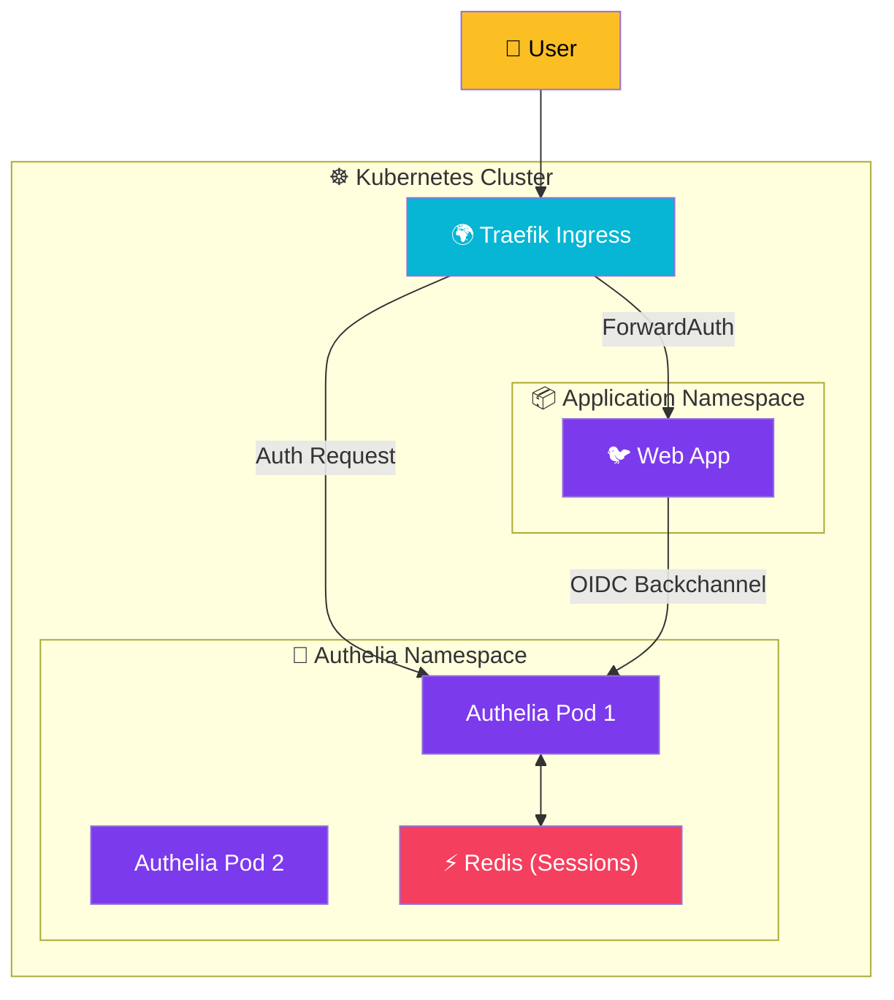

import Callout from '@components/Callout.astro';
import ImplementationNote from '@components/ImplementationNote.astro';
import ExternalCite from '@components/ExternalCite.astro';

## Introduction

Choosing a self-hosted identity provider was one of the most consequential decisions for BlueRobin. I evaluated Keycloak, Authentik, and Authelia over a weekend. Keycloak was too heavy for a homelab—its JVM footprint consumed 1.2GB of RAM just idling. Authentik was promising but still young. Authelia won because it runs in 60MB of RAM, has excellent OIDC support, and integrates natively with Traefik's ForwardAuth middleware. Two years later, it handles authentication for every service in the cluster without a single unplanned outage.

Before we connect our applications, we need an Identity Provider (IdP). While you could use Auth0 or Azure AD B2C, strict data sovereignty requires self-hosting.
<ExternalCite title="GDPR Article 44 - Data Transfers" url="https://gdpr-info.eu/art-44-gdpr/" author="European Union" date="2018" />

**Authelia** is the gold standard for self-hosted auth.
<ExternalCite title="Authelia Documentation" url="https://www.authelia.com/overview/prologue/introduction/" author="Authelia" date="2024" />
It supports:
-   **Hardware 2FA** (YubiKey/WebAuthn).
<ExternalCite title="WebAuthn Specification" url="https://www.w3.org/TR/webauthn-2/" author="W3C" date="2021" />
-   **OIDC/OAuth2** for modern apps (like our Blazor app).
-   **ForwardAuth** for legacy apps (proxied via Traefik).

### What We'll Build
1.  **Authelia Deployment**: A high-availability setup on Kubernetes.
2.  **Redis Session Store**: For distributing sessions across pod replicas.
3.  **OIDC Configuration**: Defining the clients that will trust Authelia.

## Architecture Overview


```mermaid
flowchart TB
    subgraph K8s["☸️ Kubernetes Cluster"]
        Ingress["🌍 Traefik Ingress"]
        
        subgraph Auth["🔐 Authelia Namespace"]
            Pod1["Authelia Pod 1"]
            Pod2["Authelia Pod 2"]
            Redis["⚡ Redis (Sessions)"]
        end
        
        subgraph App["📦 Application Namespace"]
            WebApp["🐦 Web App"]
        end
    end

    User["👤 User"] --> Ingress
    Ingress -->|Auth Request| Pod1
    Pod1 <--> Redis
    Ingress -->|ForwardAuth| WebApp
    WebApp -->|OIDC Backchannel| Pod1

    classDef primary fill:#7c3aed,color:#fff
    classDef secondary fill:#06b6d4,color:#fff
    classDef db fill:#f43f5e,color:#fff
    classDef warning fill:#fbbf24,color:#000

    class WebApp,Pod1,Pod2 primary
    class Ingress secondary
    class Redis db
    class User warning
```

## Section 1: The Configuration

Authelia's configuration is dense.
<ExternalCite title="OpenID Connect Core 1.0" url="https://openid.net/specs/openid-connect-core-1_0.html" author="OpenID Foundation" date="2014" />
We focus here on the **Identity Provider** section, which activates OIDC.

```yaml
# configuration.yml
identity_providers:
  oidc:
    # 1. Security Keys
    hmac_secret: "$env:OIDC_HMAC_SECRET"
    jwks:
      - key: |
          {{ secret "/secrets/oidc/private.pem" | mindent 10 "|" }}

    # 2. Clients (The Apps)
    clients:
      - client_id: my-web-client
        client_name: My Web App
        client_secret: "$env:BLUEROBIN_CLIENT_SECRET"
        public: false
        authorization_policy: two_factor # 2FA Mandatory
        redirect_uris:
          - https://web.bluerobin.local/signin-oidc
        scopes: [openid, profile, email, groups]
        token_endpoint_auth_method: client_secret_post

# 3. Access Control (The Rules)
access_control:
  default_policy: deny
  rules:
    # Public Login Page
    - domain: "auth.bluerobin.local"
      policy: bypass
    # API requires just a password (machine-to-machine)
    - domain: "api.bluerobin.local"
      policy: one_factor
    # Web App requires 2FA
    - domain: "*.bluerobin.local"
      policy: two_factor
```

<ImplementationNote>
    Authelia uses a specialized regex for domains. `*.bluerobin.local` matches subdomains but NOT the root domain. Be precise with your rules.
</ImplementationNote>

<ImplementationNote>
    The OIDC HMAC secret and JWK private key were my biggest deployment headache. I initially generated a weak HMAC secret (just a random string), and Authelia silently accepted it but tokens would intermittently fail validation. The fix was generating a proper 64-byte random secret with `openssl rand -hex 64`. For the JWK, I learned the hard way that the private key must be RSA 4096-bit—Authelia's docs mention this, but the error message when using an EC key was cryptic enough that I spent hours debugging.
</ImplementationNote>

## Section 2: Kubernetes Deployment

<ExternalCite title="Kubernetes Secrets Best Practices" url="https://kubernetes.io/docs/concepts/configuration/secret/#best-practices" author="Kubernetes" date="2024" />

Run Authelia as a Deployment with 2 replicas for redundancy.

```yaml
# deployment.yaml
apiVersion: apps/v1
kind: Deployment
metadata:
  name: authelia
  namespace: authelia
spec:
  replicas: 2
  template:
    spec:
      containers:
        - name: authelia
          image: authelia/authelia:v4.38
          env:
            - name: AUTHELIA_IDENTITY_PROVIDERS_OIDC_HMAC_SECRET
              valueFrom:
                secretKeyRef:
                  name: authelia-secrets
                  key: OIDC_HMAC_SECRET
          volumeMounts:
            - name: config
              mountPath: /config
            - name: secrets
              mountPath: /secrets
      volumes:
        - name: config
          configMap:
            name: authelia-config
```

<ImplementationNote>
    Running Authelia with 2 replicas requires a shared session store—without Redis, each pod maintains its own session state, so a user authenticated on Pod 1 gets a 401 when load-balanced to Pod 2. I discovered this the hard way when users reported being randomly logged out. Adding Redis as the session backend fixed it immediately, and the failover is seamless when a pod restarts.
</ImplementationNote>

## Section 3: Protecting Legacy Apps (Traefik ForwardAuth)

For apps that don't support OIDC (like a simple static dashboard), use **ForwardAuth**.
<ExternalCite title="Traefik ForwardAuth Middleware" url="https://doc.traefik.io/traefik/middlewares/http/forwardauth/" author="Traefik Labs" date="2024" />
Traefik asks Authelia "Is this user logged in?" before every request.

```yaml
# middleware.yaml
apiVersion: traefik.io/v1alpha1
kind: Middleware
metadata:
  name: authelia-auth
  namespace: authelia
spec:
  forwardAuth:
    address: http://authelia.authelia.svc:9091/api/verify?rd=https://auth.bluerobin.local/
    trustForwardHeader: true
    authResponseHeaders:
      - Remote-User
      - Remote-Groups
```

<ImplementationNote>
    The ForwardAuth `authResponseHeaders` configuration is critical but easy to overlook. Without mapping `Remote-User` and `Remote-Groups`, the downstream application has no idea who the authenticated user is—the request arrives authorized but anonymous. I spent a frustrating afternoon wondering why my dashboard showed "Unknown User" before realizing the headers weren't being forwarded.
</ImplementationNote>

## Conclusion

You now have a sovereign Identity Provider. Your secrets stay in your cluster, your user data stays in your database, and you can enforce 2FA on any application—whether it supports OIDC natively or just relies on Traefik Middleware.

Running Authelia for two years has taught me that the initial setup complexity pays dividends every time a new service joins the cluster. Adding a new OIDC client takes five lines of YAML and a Flux reconciliation. Adding ForwardAuth to a legacy app takes three lines of Traefik annotations. The centralized audit log shows every authentication attempt across every service, which has been invaluable for debugging "I can't log in" reports.

**Next Steps:**
- Connect your [Blazor app to Authelia OIDC](/authelia-oidc-blazor-authentication) for native SSO integration.
- Implement the [Zero Trust Architecture](/zero-trust-architecture-mtls-tokens-identity) that Authelia's identity layer enables.
- Harden your [container images](/container-security-best-practices-dotnet) to complete the defense-in-depth strategy.

### Further Reading

- <ExternalCite title="Authelia Documentation" url="https://www.authelia.com/overview/prologue/introduction/" author="Authelia" date="2024" /> — Complete documentation covering configuration, deployment, and integration patterns.
- <ExternalCite title="OpenID Connect Core 1.0" url="https://openid.net/specs/openid-connect-core-1_0.html" author="OpenID Foundation" date="2014" /> — The specification that defines how OIDC authentication flows work.
- <ExternalCite title="Traefik ForwardAuth Middleware" url="https://doc.traefik.io/traefik/middlewares/http/forwardauth/" author="Traefik Labs" date="2024" /> — Official Traefik documentation on ForwardAuth middleware configuration.
