import Callout from '@components/Callout.astro';
import ImplementationNote from '@components/ImplementationNote.astro';
import ExternalCite from '@components/ExternalCite.astro';

Authelia is an open-source authentication and authorization server that provides single sign-on (SSO) and two-factor authentication (2FA) for your applications. In this guide, we'll deploy Authelia on Kubernetes and integrate it with .NET applications using OpenID Connect.

## Architecture

```mermaid
flowchart LR
    Browser["🌐 Browser"] <--> Traefik["🔀 Traefik\n(Ingress)"]
    Traefik <--> Authelia["🔐 Authelia\n(IdP)"]
    Authelia --> Redis["⚡ Redis\n(Sessions)"]
    Traefik --> App["🐦 BlueRobin\n(App)"]

    style Browser fill:#4a90d9,color:#fff
    style Traefik fill:#24a1c1,color:#fff
    style Authelia fill:#1a0dab,color:#fff
    style Redis fill:#dc382d,color:#fff
    style App fill:#512bd4,color:#fff
```



## Prerequisites

- Kubernetes cluster with Traefik ingress
- Redis for session storage
- Domain with TLS certificates

## Deploying Authelia

### Namespace and Secrets

```yaml
# apps/authelia/namespace.yaml
apiVersion: v1
kind: Namespace
metadata:
  name: authelia
---
# apps/authelia/external-secret.yaml
apiVersion: external-secrets.io/v1beta1
kind: ExternalSecret
metadata:
  name: authelia-secrets
  namespace: authelia
spec:
  secretStoreRef:
    kind: ClusterSecretStore
    name: infisical-store
  target:
    name: authelia-secrets
  data:
    - secretKey: JWT_SECRET
      remoteRef:
        key: AUTHELIA_JWT_SECRET
    - secretKey: SESSION_SECRET
      remoteRef:
        key: AUTHELIA_SESSION_SECRET
    - secretKey: STORAGE_ENCRYPTION_KEY
      remoteRef:
        key: AUTHELIA_STORAGE_ENCRYPTION_KEY
    - secretKey: OIDC_HMAC_SECRET
      remoteRef:
        key: AUTHELIA_OIDC_HMAC_SECRET
    - secretKey: REDIS_PASSWORD
      remoteRef:
        key: REDIS_PASSWORD
```

### Configuration

```yaml
# apps/authelia/configmap.yaml
apiVersion: v1
kind: ConfigMap
metadata:
  name: authelia-config
  namespace: authelia
data:
  configuration.yml: |
    theme: dark
    
    server:
      address: 'tcp://:9091'
      asset_path: ''
      headers:
        csp_template: ''
    
    log:
      level: info
      format: json
    
    totp:
      issuer: bluerobin.local
      period: 30
      skew: 1
    
    webauthn:
      display_name: BlueRobin
      attestation_conveyance_preference: indirect
      user_verification: preferred
      timeout: 60s
    
    authentication_backend:
      file:
        path: /config/users.yml
        watch: true
        password:
          algorithm: argon2
          argon2:
            variant: argon2id
            iterations: 3
            memory: 65536
            parallelism: 4
            key_length: 32
            salt_length: 16
    
    access_control:
      default_policy: deny
      rules:
        # Public endpoints
        - domain: "auth.bluerobin.local"
          policy: bypass
        
        # API endpoints - require authentication
        - domain: "api.bluerobin.local"
          policy: one_factor
        
        # Web application - require 2FA
        - domain: "*.bluerobin.local"
          policy: two_factor
    
    session:
      name: authelia_session
      same_site: lax
      expiration: 1h
      inactivity: 5m
      remember_me: 1M
      cookies:
        - domain: bluerobin.local
          authelia_url: https://auth.bluerobin.local
          default_redirection_url: https://web.bluerobin.local
      redis:
        host: redis.authelia.svc.cluster.local
        port: 6379
        password_env: REDIS_PASSWORD
    
    regulation:
      max_retries: 3
      find_time: 2m
      ban_time: 5m
    
    storage:
      local:
        path: /data/db.sqlite3
    
    notifier:
      filesystem:
        filename: /data/notifications.txt
    
    identity_providers:
      oidc:
        hmac_secret_env: OIDC_HMAC_SECRET
        jwks:
          - key_id: main
            algorithm: RS256
            use: sig
            key: |
              {{ secret "/secrets/oidc-private-key.pem" | mindent 14 "|" }}
        cors:
          allowed_origins_from_client_redirect_uris: true
        clients:
          # Development client
          - client_id: bluerobin-web-dev
            client_name: BlueRobin Web (Dev)
            client_secret_env: BLUEROBIN_DEV_CLIENT_SECRET
            public: false
            authorization_policy: two_factor
            redirect_uris:
              - https://localhost:5001/signin-oidc
              - http://localhost:5000/signin-oidc
            scopes:
              - openid
              - profile
              - email
              - groups
            token_endpoint_auth_method: client_secret_post
            userinfo_signed_response_alg: none
          
          # Staging client
          - client_id: bluerobin-web-staging
            client_name: BlueRobin Web (Staging)
            client_secret_env: BLUEROBIN_STAGING_CLIENT_SECRET
            public: false
            authorization_policy: two_factor
            redirect_uris:
              - https://web-staging.bluerobin.local/signin-oidc
            scopes:
              - openid
              - profile
              - email
              - groups
            token_endpoint_auth_method: client_secret_post
          
          # Production client
          - client_id: bluerobin-web
            client_name: BlueRobin Web
            client_secret_env: BLUEROBIN_PROD_CLIENT_SECRET
            public: false
            authorization_policy: two_factor
            redirect_uris:
              - https://web.bluerobin.local/signin-oidc
            scopes:
              - openid
              - profile
              - email
              - groups
            token_endpoint_auth_method: client_secret_post
```

### Users Configuration

```yaml
# apps/authelia/users-secret.yaml
apiVersion: v1
kind: Secret
metadata:
  name: authelia-users
  namespace: authelia
stringData:
  users.yml: |
    users:
      victor:
        displayname: Victor Robin
        email: victor@bluerobin.local
        password: $argon2id$v=19$m=65536,t=3,p=4$[hash]
        groups:
          - admins
          - users
      test_user:
        displayname: Test User
        email: test@bluerobin.local
        password: $argon2id$v=19$m=65536,t=3,p=4$[hash]
        groups:
          - users
```

Generate password hash:

```bash
docker run authelia/authelia:latest authelia crypto hash generate argon2 \
  --password "your-secure-password"
```

### Deployment

```yaml
# apps/authelia/deployment.yaml
apiVersion: apps/v1
kind: Deployment
metadata:
  name: authelia
  namespace: authelia
spec:
  replicas: 1
  selector:
    matchLabels:
      app: authelia
  template:
    metadata:
      labels:
        app: authelia
    spec:
      containers:
        - name: authelia
          image: authelia/authelia:4.38
          ports:
            - containerPort: 9091
          env:
            - name: TZ
              value: UTC
            - name: AUTHELIA_JWT_SECRET_FILE
              value: /secrets/JWT_SECRET
            - name: AUTHELIA_SESSION_SECRET_FILE
              value: /secrets/SESSION_SECRET
            - name: AUTHELIA_STORAGE_ENCRYPTION_KEY_FILE
              value: /secrets/STORAGE_ENCRYPTION_KEY
            - name: AUTHELIA_IDENTITY_PROVIDERS_OIDC_HMAC_SECRET_FILE
              value: /secrets/OIDC_HMAC_SECRET
          volumeMounts:
            - name: config
              mountPath: /config
              readOnly: true
            - name: secrets
              mountPath: /secrets
              readOnly: true
            - name: users
              mountPath: /config/users.yml
              subPath: users.yml
              readOnly: true
            - name: data
              mountPath: /data
          resources:
            requests:
              memory: "128Mi"
              cpu: "100m"
            limits:
              memory: "256Mi"
              cpu: "500m"
          readinessProbe:
            httpGet:
              path: /api/health
              port: 9091
            initialDelaySeconds: 5
            periodSeconds: 10
      volumes:
        - name: config
          configMap:
            name: authelia-config
        - name: secrets
          secret:
            secretName: authelia-secrets
        - name: users
          secret:
            secretName: authelia-users
        - name: data
          persistentVolumeClaim:
            claimName: authelia-data
---
apiVersion: v1
kind: PersistentVolumeClaim
metadata:
  name: authelia-data
  namespace: authelia
spec:
  accessModes:
    - ReadWriteOnce
  resources:
    requests:
      storage: 1Gi
  storageClassName: local-path
```

### Service and Ingress

```yaml
# apps/authelia/service.yaml
apiVersion: v1
kind: Service
metadata:
  name: authelia
  namespace: authelia
spec:
  selector:
    app: authelia
  ports:
    - port: 9091
      targetPort: 9091
---
# apps/authelia/ingress.yaml
apiVersion: networking.k8s.io/v1
kind: Ingress
metadata:
  name: authelia
  namespace: authelia
  annotations:
    traefik.ingress.kubernetes.io/router.entrypoints: websecure
    traefik.ingress.kubernetes.io/router.tls: "true"
spec:
  rules:
    - host: auth.bluerobin.local
      http:
        paths:
          - path: /
            pathType: Prefix
            backend:
              service:
                name: authelia
                port:
                  number: 9091
  tls:
    - hosts:
        - auth.bluerobin.local
      secretName: bluerobin-tls
```

<ImplementationNote>
Authelia uses ForwardAuth with Traefik for path-based authentication. Configure this in your application's ingress.
</ImplementationNote>

## .NET OIDC Integration

### Package Installation

```bash
dotnet add package Microsoft.AspNetCore.Authentication.OpenIdConnect
```

### Configuration

```csharp
// Program.cs
builder.Services.AddAuthentication(options =>
{
    options.DefaultScheme = CookieAuthenticationDefaults.AuthenticationScheme;
    options.DefaultChallengeScheme = OpenIdConnectDefaults.AuthenticationScheme;
})
.AddCookie(options =>
{
    options.Cookie.Name = "BlueRobin.Auth";
    options.Cookie.HttpOnly = true;
    options.Cookie.SecurePolicy = CookieSecurePolicy.Always;
    options.Cookie.SameSite = SameSiteMode.Lax;
    options.ExpireTimeSpan = TimeSpan.FromHours(8);
    options.SlidingExpiration = true;
})
.AddOpenIdConnect(options =>
{
    var oidcConfig = builder.Configuration.GetSection("Oidc");
    
    options.Authority = oidcConfig["Authority"];  // https://auth.bluerobin.local
    options.ClientId = oidcConfig["ClientId"];    // bluerobin-web-staging
    options.ClientSecret = oidcConfig["ClientSecret"];
    
    options.ResponseType = OpenIdConnectResponseType.Code;
    options.ResponseMode = OpenIdConnectResponseMode.Query;
    
    options.Scope.Clear();
    options.Scope.Add("openid");
    options.Scope.Add("profile");
    options.Scope.Add("email");
    options.Scope.Add("groups");
    
    options.SaveTokens = true;
    options.GetClaimsFromUserInfoEndpoint = true;
    
    options.TokenValidationParameters = new TokenValidationParameters
    {
        NameClaimType = "name",
        RoleClaimType = "groups"
    };
    
    // Map claims
    options.ClaimActions.MapJsonKey(ClaimTypes.Name, "name");
    options.ClaimActions.MapJsonKey(ClaimTypes.Email, "email");
    options.ClaimActions.MapJsonKey("groups", "groups");
    
    options.Events = new OpenIdConnectEvents
    {
        OnTokenValidated = async context =>
        {
            // Sync user to local database
            var userSyncService = context.HttpContext.RequestServices
                .GetRequiredService<IUserSyncService>();
            
            await userSyncService.SyncUserAsync(context.Principal!);
        },
        OnRemoteFailure = context =>
        {
            context.Response.Redirect("/error?message=" + 
                Uri.EscapeDataString(context.Failure?.Message ?? "Authentication failed"));
            context.HandleResponse();
            return Task.CompletedTask;
        }
    };
});
```

### appsettings Configuration

```json
{
  "Oidc": {
    "Authority": "https://auth.bluerobin.local",
    "ClientId": "bluerobin-web-staging",
    "ClientSecret": "${OIDC_CLIENT_SECRET}"
  }
}
```

### User Sync Service

Map external OIDC users to internal BlueRobinIds:

```csharp
// Application/Services/UserSyncService.cs
public sealed class UserSyncService : IUserSyncService
{
    private readonly IUserRepository _userRepository;
    private readonly ILogger<UserSyncService> _logger;
    
    public UserSyncService(
        IUserRepository userRepository,
        ILogger<UserSyncService> logger)
    {
        _userRepository = userRepository;
        _logger = logger;
    }
    
    public async Task<ApplicationUser> SyncUserAsync(
        ClaimsPrincipal principal,
        CancellationToken ct = default)
    {
        var externalId = principal.FindFirstValue(ClaimTypes.NameIdentifier)
            ?? throw new InvalidOperationException("Missing sub claim");
        
        var email = principal.FindFirstValue(ClaimTypes.Email)
            ?? throw new InvalidOperationException("Missing email claim");
        
        var name = principal.FindFirstValue(ClaimTypes.Name) ?? email;
        
        // Check if user exists
        var existingUser = await _userRepository.GetByExternalIdAsync(externalId, ct);
        
        if (existingUser is not null)
        {
            // Update if needed
            if (existingUser.Email.Value != email || existingUser.DisplayName != name)
            {
                existingUser.UpdateProfile(Email.From(email), name);
                await _userRepository.UpdateAsync(existingUser, ct);
                
                _logger.LogInformation(
                    "Updated user {UserId} profile",
                    existingUser.Id);
            }
            
            return existingUser;
        }
        
        // Create new user
        var newUser = ApplicationUser.Create(
            BlueRobinId.New(),
            ExternalId.From(externalId),
            Email.From(email),
            name);
        
        await _userRepository.AddAsync(newUser, ct);
        
        _logger.LogInformation(
            "Created new user {UserId} for external ID {ExternalId}",
            newUser.Id,
            externalId);
        
        return newUser;
    }
}
```

## Protecting Routes

### Blazor Server

```csharp
// Program.cs
app.UseAuthentication();
app.UseAuthorization();

// Require authentication for all pages by default
app.MapRazorComponents<App>()
    .AddInteractiveServerRenderMode()
    .RequireAuthorization();
```

### Authorize Attribute

```razor
@page "/documents"
@attribute [Authorize]

<h1>My Documents</h1>
```

### Role-Based Authorization

```razor
@page "/admin"
@attribute [Authorize(Roles = "admins")]

<h1>Admin Panel</h1>
```

### Programmatic Check

```csharp
@inject AuthenticationStateProvider AuthState

@code {
    protected override async Task OnInitializedAsync()
    {
        var authState = await AuthState.GetAuthenticationStateAsync();
        var user = authState.User;
        
        if (user.Identity?.IsAuthenticated == true)
        {
            var userId = user.FindFirstValue(ClaimTypes.NameIdentifier);
            var email = user.FindFirstValue(ClaimTypes.Email);
        }
    }
}
```

## Logout Implementation

```csharp
// Pages/Logout.cshtml.cs
public class LogoutModel : PageModel
{
    public async Task<IActionResult> OnGetAsync()
    {
        await HttpContext.SignOutAsync(CookieAuthenticationDefaults.AuthenticationScheme);
        
        // Build Authelia logout URL
        var logoutUrl = new UriBuilder("https://auth.bluerobin.local/logout")
        {
            Query = $"rd={Uri.EscapeDataString("https://web.bluerobin.local")}"
        };
        
        return Redirect(logoutUrl.ToString());
    }
}
```

## Testing Authentication

### Local Development

For local development, configure Authelia to accept localhost redirect URIs:

```yaml
# In Authelia OIDC clients
redirect_uris:
  - https://localhost:5001/signin-oidc
  - http://localhost:5000/signin-oidc
```

Run with HTTPS:

```bash
dotnet run --urls "https://localhost:5001;http://localhost:5000"
```

### Test Credentials

```yaml
# Staging test user
Username: test_user
Password: qwerty123
```

<Callout type="warning">
Never use test credentials in production. Create strong, unique passwords for all users.
</Callout>

## Two-Factor Authentication

Authelia supports multiple 2FA methods:

### TOTP (Time-based One-Time Password)

Users can register TOTP apps like Google Authenticator:

1. Navigate to `https://auth.bluerobin.local`
2. Click "Register device"
3. Scan QR code with authenticator app
4. Enter verification code

### WebAuthn (Hardware Keys)

For YubiKey and similar devices:

1. Navigate to `https://auth.bluerobin.local`
2. Click "Register security key"
3. Insert and tap hardware key
4. Name the device

## Troubleshooting

### Common Issues

| Issue | Cause | Solution |
|-------|-------|----------|
| Redirect loop | Cookie domain mismatch | Check cookie domain in session config |
| Invalid grant | Client secret mismatch | Verify secret in Infisical |
| CORS error | Missing origin | Add origin to OIDC cors config |
| Token expired | Clock skew | Sync server clocks with NTP |

### Debug Logging

Enable verbose OIDC logging:

```json
{
  "Logging": {
    "LogLevel": {
      "Microsoft.AspNetCore.Authentication": "Debug"
    }
  }
}
```

### Check Authelia Logs

```bash
kubectl logs -n authelia deployment/authelia -f
```

## Summary

We've deployed a complete SSO solution:

- **Authelia** as the identity provider
- **OIDC** integration with .NET applications
- **Two-factor authentication** with TOTP and WebAuthn
- **User synchronization** from external IDs to BlueRobinIds
- **Role-based authorization** using groups

This setup provides enterprise-grade authentication for your home lab or small-scale production environment.

<ExternalCite 
  title="Authelia Documentation" 
  url="https://www.authelia.com/docs/"
  author="Authelia Contributors"
/>
