import Callout from '@components/Callout.astro';
import ImplementationNote from '@components/ImplementationNote.astro';
import ExternalCite from '@components/ExternalCite.astro';

## Introduction

Before we connect our applications, we need an Identity Provider (IdP). While you could use Auth0 or Azure AD B2C, strict data sovereignty requires self-hosting.

**Authelia** is the gold standard for self-hosted auth. It supports:
-   **Hardware 2FA** (YubiKey/WebAuthn).
-   **OIDC/OAuth2** for modern apps (like our Blazor app).
-   **ForwardAuth** for legacy apps (proxied via Traefik).

### What We'll Build
1.  **Authelia Deployment**: A high-availability setup on Kubernetes.
2.  **Redis Session Store**: For distributing sessions across pod replicas.
3.  **OIDC Configuration**: Defining the clients that will trust Authelia.

## Architecture Overview

```mermaid
flowchart TB
    subgraph K8s["☸️ Kubernetes Cluster"]
        Ingress["🌍 Traefik Ingress"]
        
        subgraph Auth["🔐 Authelia Namespace"]
            Pod1["Authelia Pod 1"]
            Pod2["Authelia Pod 2"]
            Redis["⚡ Redis (Sessions)"]
        end
        
        subgraph App["📦 Application Namespace"]
            WebApp["🐦 BlueRobin Web"]
        end
    end

    User["👤 User"] --> Ingress
    Ingress -->|Auth Request| Pod1
    Pod1 <--> Redis
    Ingress -->|ForwardAuth| WebApp
    WebApp -->|OIDC Backchannel| Pod1

    classDef primary fill:#7c3aed,color:#fff
    classDef secondary fill:#06b6d4,color:#fff
    classDef db fill:#f43f5e,color:#fff
    classDef warning fill:#fbbf24,color:#000

    class WebApp,Pod1,Pod2 primary
    class Ingress secondary
    class Redis db
    class User warning
```



## Section 1: The Configuration

Authelia's configuration is dense. We focus here on the **Identity Provider** section, which activates OIDC.

```yaml
# configuration.yml
identity_providers:
  oidc:
    # 1. Security Keys
    hmac_secret: "$env:OIDC_HMAC_SECRET"
    jwks:
      - key: |
          {{ secret "/secrets/oidc/private.pem" | mindent 10 "|" }}

    # 2. Clients (The Apps)
    clients:
      - client_id: bluerobin-web
        client_name: BlueRobin Web
        client_secret: "$env:BLUEROBIN_CLIENT_SECRET"
        public: false
        authorization_policy: two_factor # 2FA Mandatory
        redirect_uris:
          - https://web.bluerobin.local/signin-oidc
        scopes: [openid, profile, email, groups]
        token_endpoint_auth_method: client_secret_post

# 3. Access Control (The Rules)
access_control:
  default_policy: deny
  rules:
    # Public Login Page
    - domain: "auth.bluerobin.local"
      policy: bypass
    # API requires just a password (machine-to-machine)
    - domain: "api.bluerobin.local"
      policy: one_factor
    # Web App requires 2FA
    - domain: "*.bluerobin.local"
      policy: two_factor
```

<ImplementationNote>
    Authelia uses a specialized regex for domains. `*.bluerobin.local` matches subdomains but NOT the root domain. Be precise with your rules.
</ImplementationNote>

## Section 2: Kubernetes Deployment

Run Authelia as a Deployment with 2 replicas for redundancy.

```yaml
# deployment.yaml
apiVersion: apps/v1
kind: Deployment
metadata:
  name: authelia
  namespace: authelia
spec:
  replicas: 2
  template:
    spec:
      containers:
        - name: authelia
          image: authelia/authelia:v4.38
          env:
            - name: AUTHELIA_IDENTITY_PROVIDERS_OIDC_HMAC_SECRET
              valueFrom:
                secretKeyRef:
                  name: authelia-secrets
                  key: OIDC_HMAC_SECRET
          volumeMounts:
            - name: config
              mountPath: /config
            - name: secrets
              mountPath: /secrets
      volumes:
        - name: config
          configMap:
            name: authelia-config
```

## Section 3: Protecting Legacy Apps (Traefik ForwardAuth)

For apps that don't support OIDC (like a simple static dashboard), use **ForwardAuth**. Traefik asks Authelia "Is this user logged in?" before every request.

```yaml
# middleware.yaml
apiVersion: traefik.io/v1alpha1
kind: Middleware
metadata:
  name: authelia-auth
  namespace: authelia
spec:
  forwardAuth:
    address: http://authelia.authelia.svc:9091/api/verify?rd=https://auth.bluerobin.local/
    trustForwardHeader: true
    authResponseHeaders:
      - Remote-User
      - Remote-Groups
```

## Conclusion

You now have a sovereign Identity Provider. Your secrets stay in your cluster, your user data stays in your database, and you can enforce 2FA on any application—whether it supports OIDC natively or just relies on Traefik Middleware.
