import Callout from '@components/Callout.astro';
import ImplementationNote from '@components/ImplementationNote.astro';
import CodeFile from '@components/CodeFile.astro';
import ExternalCite from '@components/ExternalCite.astro';

## Introduction

Unique Identifiers are the spine of any database schema. For years, the `UUID` (Universally Unique Identifier) has been the de facto standard. It's robust, collision-resistant, and natively supported by PostgreSQL.

However, as we built BlueRobin's public-facing document sharing features, we realized that UUIDs (`550e8400-e29b-41d4-a716-446655440000`) are unwieldy, hard to select by double-clicking, and ugly in URLs. We switched to **NanoID**.

**Why NanoID?**

- **URL Friendly**: Shorter, safer characters.
- **Density**: Carries more information in fewer bytes.
- **Customizable**: We can restrict the alphabet to avoid ambiguity (e.g., confusing `l` and `1`).

### What We'll Build

In this guide, we will implement a custom ID generator for BlueRobin. You will learn how to:

1. **Compare ID formats**: Visual and technical differences.
2. **Implement Custom Alphabet**: Creating `BlueRobinId` (lowercase alphanumeric).
3. **Handle Database Integration**: Storing NanoIDS efficiently in PostgreSQL.

## Architecture Overview

The ID generation flow is straightforward but critical to understand:

```mermaid
flowchart LR
    subgraph Application["🔌 Application Layer"]
        Request["📥 Create Entity"]
        Factory["🏭 BlueRobinId.Generate()"]
    end

    subgraph Generator["🔧 NanoID Generator"]
        Alphabet["🔤 Custom Alphabet\n(0-9, a-z)"]
        Length["📏 8 Characters"]
        Crypto["🔒 Crypto RNG"]
    end

    subgraph Storage["💾 PostgreSQL"]
        Column["📊 CHAR(8)\nPrimary Key"]
        Index["🔍 B-Tree Index"]
    end

    Request --> Factory
    Factory --> Alphabet
    Alphabet --> Length
    Length --> Crypto
    Crypto --> Column
    Column --> Index

    classDef primary fill:#7c3aed,color:#fff
    classDef secondary fill:#06b6d4,color:#fff
    classDef db fill:#f43f5e,color:#fff
    classDef warning fill:#fbbf24,color:#000

    class Application primary
    class Generator secondary
    class Storage db
```



**Key Components**:
- **Factory Method**: `BlueRobinId.Generate()` encapsulates ID creation
- **Custom Alphabet**: 36 characters (lowercase + digits) for URL-friendliness
- **Cryptographic RNG**: Ensures unpredictable, secure IDs
- **Fixed-Width Storage**: `CHAR(8)` optimizes PostgreSQL indexing

## Visual Comparison

Let's look at the difference in a real-world URL context.


The NanoID is significantly more compact while retaining sufficient entropy for our scale.

## Section 1: The NanoID Standard vs. Request

Standard NanoID uses `A-Za-z0-9_-`. This is great, but it includes case sensitivity (`a` vs `A`) and special characters (`-`, `_`).

For BlueRobin, we wanted **lowercase alphanumeric only** for maximum readability and ease of typing on mobile devices.

### Custom Alphabet Implementation

We use the `NanoId` library in .NET but configure a custom alphabet.

```csharp
using NanoidDotNet;

public static class BlueRobinId
{
    // Removing look-alikes if desired, but here we use simple lowercase alpha-num
    private const string Alphabet = "0123456789abcdefghijklmnopqrstuvwxyz";
    private const int Length = 8; // Short, yet collision resistant enough for per-user scope

    public static string Generate()
    {
        return Nanoid.Generate(Alphabet, Length);
    }
}
```

<Callout type="info" title="Entropy & Collisions">
    A length of 8 with 36 chars gives ~$36^8 \approx 2.8 \times 10^{12}$ combinations. Since our IDs are often scoped to a specific user or tenant, this probability is acceptable. For global IDs, we increase the length to 21.
</Callout>

## Section 2: Database Storage

In PostgreSQL, a UUID is stored as a 128-bit integer (`uuid` type). Ideally, we might want to store our ID as text, or `char(8)`.

```sql
CREATE TABLE documents (
    -- Fixed length is more efficient than TEXT
    id CHAR(8) PRIMARY KEY,
    
    -- Owner establishes the scope for collision checking
    owner_id CHAR(8) REFERENCES users(id),
    
    title TEXT NOT NULL
);
```

### Performance Consideration

Since NanoIDs are random strings, inserting them into a B-Tree index (like a Primary Key) can cause fragmentation compared to sequential IDs (like `UUIDv7` or Integers).

However, `BlueRobinId` is primarily used for *lookup*, not sorting. The cost of random insertion is a trade-off we accept for UX. For strictly internal, high-volume logging tables, we stick to `UUIDv7` or `BIGINT`.

## Conclusion

Switching to NanoID gave our application a more polished feel. URLs are cleaner, shareable, and less intimidating to non-technical users.

**Next Steps**:
- [PostgreSQL Security Design](/blog/postgresql-security-design-high-assurance)
- [Building a Private PKI](/blog/building-private-pki-root-ca-certificates)
