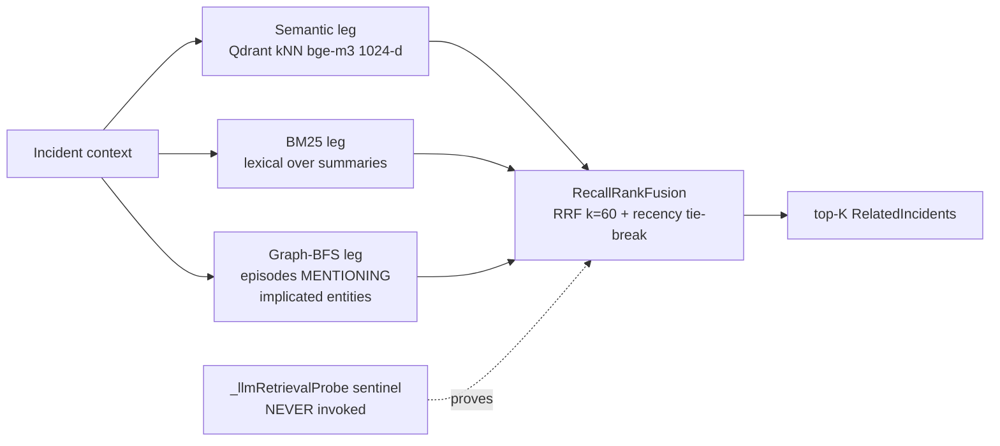

## Abstract

Large-language-model agents that perform root-cause analysis (RCA) on production incidents are, by default, amnesiac: each invocation starts from a blank context window, re-derives the same conclusions about recurring faults, and cannot say "this was the cause last March, but a config change has since superseded it." This paper describes the learning subsystem of the BlueRobin Debug Agent (`FEAT-027`, increment 6), a hand-rolled bi-temporal incident-memory subgraph built on the *existing* FalkorDB property graph rather than a dedicated memory framework. We deliberately re-implement the Graphiti / Zep pattern (Rasmussen et al., 2025; [arXiv:2501.13956](https://arxiv.org/abs/2501.13956)) in .NET — not the Python `graphiti-core` library, and not `mem0` — to fit a single 2 GiB graph store and a hard ~50 EUR/month budget. Each concluded incident becomes a `MemoryEpisode` joined to deduplicated `MemoryEntity` facts by `MENTIONS` / `RESOLVED_BY` / `SUPERSEDES` edges that carry *both* valid-time (`t_valid` / `t_invalid`) and ingestion-time (`ingested_at`); supersession invalidates an interval but never deletes, enabling as-of queries. Retrieval is a hybrid, **no-LLM-at-retrieval** engine: three legs — semantic Qdrant kNN over bge-m3 1024-d embeddings, BM25 lexical, and graph-BFS over the bi-temporal subgraph — fused by Reciprocal Rank Fusion ([Cormack et al., 2009](https://dl.acm.org/doi/10.1145/1571941.1572114)) with a Generative-Agents recency×importance×relevance tie-break, with a structural sentinel proving no model is consulted on the retrieval path. We add Reflexion-style post-incident lessons and a Voyager-style skill store, and a code↔graph embedding join via `CodeUnit.embedding_ref`. We are explicit that this is a systems/experience report: the memory subsystem ships shadow-first, the internal eval is a self-seeded 9-incident set, and the agent remains advisory and human-in-the-loop by design.

## Introduction

The first four papers in this series described how the BlueRobin Debug Agent localizes a fault: a personalized-PageRank "blame propagation" pre-rank, a five-term re-normalizing score blend with a parameter-free BARO change-point term, an externalized verification-gate finite-state machine that forbids the model from grading its own homework, and an eval harness that gates every merge. All of that machinery operates *within a single incident*. It throws away everything the moment the RCA loop concludes.

That is a real and well-documented failure mode. The MAST taxonomy of agentic failures ([IBM + Berkeley, 2025](https://huggingface.co/blog/ibm-research/itbenchandmast)), built from 310 ITBench traces, lists **memory loss** among the dominant categories alongside incorrect self-verification and premature termination. An agent that cannot remember that `authelia` has gone down twice before for the same OIDC reason will re-investigate from scratch each time, burning tokens against a hard 20 EUR/month LLM ceiling and offering the on-call human nothing they did not already know.

The naive fix — stuff prior incident text into the prompt — fails for three reasons. First, **cost and latency**: full-context memory is the most expensive possible design; the literature reports ~90% token and ~90% latency reductions from structured retrieval over full-context replay (Mem0, Chhikara et al., 2025; [arXiv:2504.19413](https://arxiv.org/abs/2504.19413)). Second, **staleness**: a flat log cannot represent that a fact was true until a change invalidated it — exactly the bi-temporal correction RCA needs. Third, and most subtly, **retrieval-time hallucination**: if you ask an LLM to *choose* which past incidents are relevant, you have reintroduced the model into the one place it should not be — the grounding path. Graphiti's central claim is that hybrid retrieval (semantic + BM25 + graph traversal) requires **no LLM at retrieval** and still achieves a P95 near 300 ms, near-constant in graph size ([arXiv:2501.13956](https://arxiv.org/abs/2501.13956)).

This paper's contributions are deliberately modest and engineering-shaped:

- **A hand-rolled bi-temporal incident-memory subgraph** that reuses the platform's already-deployed FalkorDB instead of standing up a dedicated memory service, re-implementing the Graphiti bi-temporal pattern in .NET because the reference library is Python/TS and a sidecar breaks the budget.
- **A no-LLM-at-retrieval hybrid recall** with three fail-open legs fused by Reciprocal Rank Fusion (RRF, k=60), a Generative-Agents recency tie-break, and a structural sentinel (`_llmRetrievalProbe`) that fails a unit test if any LLM is consulted at retrieval.
- **Supersession without deletion** — invalidate-an-interval semantics and an explicit as-of query — so the agent can answer "what was the cause *as of* time T."
- **Reflexion lessons and a Voyager-style skill store**, plus a **code↔graph embedding join** via `CodeUnit.embedding_ref` so a recalled incident links back to the source it implicated.
- **A cost-and-honesty framing**: the whole stack runs in a ~50 EUR/month homelab, ships shadow-first, and is evaluated against a self-seeded benchmark we openly call oversimplified.

## Related Work

**Temporal knowledge-graph agent memory.** The direct ancestor is Zep / Graphiti (Rasmussen et al., 2025; [arXiv:2501.13956](https://arxiv.org/abs/2501.13956)), which introduces bi-temporal edges — distinguishing the *valid time* of a fact (`t_valid` / `t_invalid`) from its *ingestion time* — and a hybrid retrieval combining semantic cosine, BM25, and breadth-first graph traversal with **no LLM at retrieval**, reporting a P95 around 300 ms and +18.5% on LongMemEval at roughly 90% lower latency than full-context replay. The open-source `graphiti-core` defaults to Neo4j and also supports FalkorDB, but is implemented in Python/TypeScript. We adopt the *pattern*, not the library (discussed in Implementation).

**Other memory architectures.** Mem0 (Chhikara et al., 2025; [arXiv:2504.19413](https://arxiv.org/abs/2504.19413)) frames memory as an extract→update pipeline (ADD / UPDATE / DELETE / NOOP) and reports ~90% token and ~91% p95-latency savings versus full context. MemGPT / Letta (Packer et al., 2023; [arXiv:2310.08560](https://arxiv.org/abs/2310.08560)) treats the LLM as an OS managing tiered virtual context through tool calls. A-MEM (Xu et al., 2025; [arXiv:2502.12110](https://arxiv.org/abs/2502.12110)) builds Zettelkasten-style atomic notes with dynamic linking and memory evolution. We reject `mem0` and the `graphiti-core` sidecar primarily on cost and operational grounds, not capability (ADR-042).

**Agent learning patterns.** Reflexion (Shinn et al., 2023; [arXiv:2303.11366](https://arxiv.org/abs/2303.11366)) converts an episode into a verbal self-reflection stored in a buffer, improving downstream success (HumanEval 80→91%); we render an analogous post-incident "lesson." Voyager (Wang et al., 2023; [arXiv:2305.16291](https://arxiv.org/abs/2305.16291)) maintains an ever-growing skill library of executable code, which maps cleanly to a durable runbook/skill store that mitigates catastrophic forgetting. Generative Agents ([Park et al., UIST 2023](https://arxiv.org/abs/2304.03442)) defines the canonical memory-stream score — **recency × importance × relevance** — which we reuse as the fusion tie-break.

**Retrieval fusion.** Reciprocal Rank Fusion ([Cormack et al., 2009](https://dl.acm.org/doi/10.1145/1571941.1572114)) combines ranked lists from heterogeneous retrievers by summing `1/(k + rank)`; it is parameter-light (one constant, conventionally k=60) and rewards items appearing across multiple lists. This is exactly the property we want from three orthogonal recall legs.

**RCA-specific memory reuse.** RCACopilot (Chen et al., Microsoft, 2024; [arXiv:2305.15778](https://arxiv.org/abs/2305.15778)) is the strongest "this pattern deploys" evidence: retrieval-augmented root-cause *category* prediction, reported in production for over four years across more than thirty teams, with accuracy up to 0.766. It validates the core thesis that retrieving similar past incidents materially helps an LLM diagnose new ones. The broader survey consensus ([arXiv:2408.00803](https://arxiv.org/abs/2408.00803)) is that LLM-only RCA "lacks structural grounding and risks hallucinated suggestions," and that a graph supplies that grounding.

## Method / Architecture

### Why a subgraph, not a database

The incident memory is not a separate store. It is a labelled subgraph inside the same `bluerobin_stack` FalkorDB property graph (`ADR-021`) that already holds the platform's topology, telemetry-derived dependency edges, change history, and prior RCA outcomes. Memory writes therefore reuse the single-writer discipline of `GraphIngestor`, the parameterised Cypher templates of `StackGraphCypher` (`SEC-SG-4`), and the ADR-021 provenance bundle (`source`, `status`, `confidence_score`) carried on every node and edge. This is the central engineering choice (`FEAT-027`, `FR-SG-46`, `ADR-042` D1): the memory model is "the .NET Graphiti pattern on FalkorDB, hand-rolled."

### The bi-temporal schema

Two node labels and three edge types form the memory subgraph:

| Element | Kind | Natural key | Notable properties |
|---|---|---|---|
| `MemoryEpisode` | node | `incident_fingerprint` | `summary_nl`, `resolution_nl`, `concluded_at`, `ingested_at`, `t_valid` |
| `MemoryEntity` | node | `entity_type \| entity_ref` | deduplicated fact entity (a service, datastore, change, etc.) |
| `MENTIONS` | edge | episode→entity | `t_valid`, `t_invalid`, `ingested_at`, provenance |
| `RESOLVED_BY` | edge | episode→entity | the resolving fact; same bi-temporal triple |
| `SUPERSEDES` | edge | episode→episode | lineage when a later episode corrects an earlier fact |

The defining property is **two independent time axes** on each `MENTIONS` / `RESOLVED_BY` edge:

- **Valid-time** — `t_valid` / `t_invalid` — *when the fact was true in the world*. A `MENTIONS` edge with `t_invalid IS NULL` is currently valid; setting `t_invalid` closes the interval.
- **Ingestion-time** — `ingested_at` — *when the agent learned it*. This lets the system reason about what it knew at a given moment, independent of when the fact was actually true.

Supersession never deletes. When a later episode establishes that a previously recorded cause no longer holds (for example, a config change replaced the offending one), `SupersedeMemoryFactAsync` performs two parameterised writes: it **invalidates** the prior interval (`InvalidateMemoryFact` sets `t_invalid`, never `DELETE`) and writes a `SUPERSEDES` lineage edge from the new episode to the prior one. The audit trail is preserved in full.

This in turn enables an **as-of query**. `RecallMemoryFactAsOf` returns the entity that a given episode mentioned *as of* time T using the canonical bi-temporal predicate:

```cypher
MATCH (e:MemoryEpisode {incident_fingerprint: $fp})
      -[m:MENTIONS]->(n:MemoryEntity)
WHERE n.entity_type = $type AND n.entity_ref = $ref
  AND m.t_valid <= $asOf
  AND (m.t_invalid IS NULL OR m.t_invalid > $asOf)
RETURN n.entity_ref
```

Every memory template is a constant string with bound parameters (`SEC-SG-4`); relationship types and labels — which Cypher forbids parameterising — are selected only from fixed, code-supplied sets. Writes are idempotent `MERGE`-on-natural-key. The whole surface is **fail-open** (`NFR-SG-2`): an unreachable graph or a malformed reply yields `null` or an empty list, never an exception, so the RCA loop continues on its tool floor even if memory is down.

### Hybrid recall with no LLM at retrieval

Recall is the heart of the subsystem (`FR-SG-47`, `NFR-SG-16`, `ADR-042` D4). `RelatedIncidentRecall.Recall` runs three orthogonal legs, each independently fail-open, and fuses them:



- **Semantic leg** — a Qdrant k-nearest-neighbour search over the `incident-memory-bge-m3-v1` collection, embeddings from bge-m3 at 1024 dimensions (Cosine). Finds incidents that *read* similar even when wording differs.
- **BM25 leg** — classical lexical ranking over episode summaries. Catches exact symptom phrases and identifiers that dense vectors blur.
- **Graph-BFS leg** — `RecallEpisodesMentioningEntities` walks the bi-temporal subgraph for `MemoryEpisode`s that `MENTIONS` any of the entities the current investigation has implicated, restricted to currently-valid facts. This is the structural leg: it finds incidents that touched *the same components*, not merely similar prose.

Each leg degrades to empty on failure — a down store contributes nothing rather than throwing (`NFR-SG-2`, `AC-64`). The legs are then fused by `RecallRankFusion.Fuse`, a pure, total, **no-LLM** function:

```csharp
// RRF damping constant (Cormack et al.); larger k flattens rank contribution.
private const double RrfK = 60.0;

// each episode's score = sum over legs it appears in of 1/(k + rank)  (rank 0-based)
acc.Score += 1.0 / (RrfK + rank);
acc.LegCount += 1; // breadth — how many legs this episode recurs in
```

The ordering is deliberately layered to encode the Generative-Agents intuition while staying deterministic (`NFR-SG-5`):

1. **Leg breadth** (`LegCount`) — an episode appearing in more legs outranks one ranking high in a single leg. RRF rewards breadth; we make it the primary key.
2. **Recency** (`ConcludedAtEpoch`) — the more-recently-concluded episode wins ties (the recency factor of the recency×importance×relevance triple).
3. **RRF position score** — the finer tie-break under recency.
4. **Stable fingerprint** — a final lexicographic tie-break so the order is total and reproducible.

Critically, **no LLM is consulted on this path**. The recall constructor accepts an `Action? llmRetrievalProbe` sentinel that the production path *never invokes*; a dedicated red-team unit test fails if it ever is. This is not a comment-level promise — it is a structural guarantee enforced by the test suite (`NFR-SG-16`), matching the Graphiti no-LLM-at-retrieval property. The recall span records only counts and latency, never bodies (`OBS-SG-9`).

### Reflexion lessons and the Voyager skill store

On every conclusion the agent writes a `MemoryEpisode` and, alongside it, a Reflexion-style lesson (`FR-SG-49`, `ADR-042`). `ReflexionLessonRenderer` produces a recon-stripped, ID-citing "Lesson: cause … resolution …" record — a verbal self-reflection in the sense of [Shinn et al. (2023)](https://arxiv.org/abs/2303.11366) that turns a closed incident into a durable, reusable artifact. The accompanying skill store follows the Voyager discipline ([Wang et al., 2023](https://arxiv.org/abs/2305.16291)): resolutions accrete into a growing library of runbook-shaped entries the agent can recall and reuse, mitigating catastrophic forgetting by construction — external memory rather than weight updates.

Both lesson text and recalled summaries pass through the same recon-strip on the way *in* (at write) and again on the way *out* (at render) — defence-in-depth, so no PHI-like token reaches the model frame even if one slipped past ingestion (consistent with the `SEC-SG-7` PHI-egress guard introduced in increment 7).

### The code↔graph join

A recalled incident is far more useful if it links back to the code it implicated. The static-code ingest lane embeds each structure-defining `:CodeUnit` and persists the returned Qdrant point id onto `CodeUnit.embedding_ref` (`FR-SG-48`, `ADR-042` D3) — a deterministic UUID derived from `repo|path`. This makes the join bidirectional: graph→code returns a service's code-unit `embedding_ref`s, and code→graph maps a semantic code hit's point id back to its owning `:Service`. When memory recall surfaces a related incident, the agent can therefore pivot from "this looks like GT-03" to the exact source file the prior episode changed.

## Implementation

The subsystem is .NET 10, living in `src/DebugAgent/Rca/Memory/` (recall, fusion, Reflexion rendering, recon-strip, the Qdrant upserter) and `src/DebugAgent/StackGraph/Ingest/GraphIngestor.Memory.cs` (the bi-temporal writer), governed by `FEAT-027` increment 6 (`FR-SG-46`–`FR-SG-49`, `NFR-SG-15`, `NFR-SG-16`, `SEC-SG-7`, `ADR-042`, `ADR-047`).

**Why hand-rolled.** The reference `graphiti-core` is Python/TypeScript. Running it would mean a long-lived Python sidecar with its own image, memory footprint, and failure surface — on a node already at roughly 96% memory-request saturation, inside a 2 GiB FalkorDB cap, under a 50 EUR/month ceiling (`ADR-042` D1). `mem0` was likewise rejected. The pattern, by contrast, is small: a handful of parameterised Cypher templates and a pure RRF function. Re-implementing it in the language the rest of the agent already speaks costs less, operationally and financially, than either dependency.

**Stores and models.**

| Concern | Choice | Detail |
|---|---|---|
| Graph store | FalkorDB | `bluerobin_stack` graph, Redis wire `:6379`, 2 GiB cap, Cypher via `GRAPH.QUERY` |
| Memory vectors | Qdrant | `incident-memory-bge-m3-v1`, bge-m3 **1024-d**, Cosine, gRPC `:6334` |
| Code vectors | Qdrant | `code-embeddings`, separate collection for the code↔graph join |
| Embeddings | in-cluster Ollama | OpenAI-compatible `/v1/embeddings`, never transits the Cloudflare edge (`ADR-020`) |
| LLM egress | Cloudflare AI Gateway | irrelevant to recall — *no model is called at retrieval* |

The embedding traffic is the budget-defining decision: by running bge-m3 locally on Ollama, embeddings are effectively free and never cross the metered Cloudflare edge. The only LLM spend touching memory is at *write* time (narration for the episode summary), not retrieval, keeping the whole recall path off the 20 EUR/month LLM line entirely. The recall latency target is the Graphiti figure: ~300 ms P95 (`NFR-SG-16`).

**Rollout discipline.** Memory ships shadow-first via an `RcaMemory.Mode` flag (`ADR-039` lineage). In shadow mode the legs run, the metrics emit (`OBS-SG-9`, per-leg hit counts and a hit-ratio warm-signal tagged by mode), and the fused result is logged but **not** injected into the LLM frame. Only once the warm-signal shows the collection is returning real hits does an operator flip the flag to active. The eval gate (below) proves that flipping it does not regress localization accuracy.

## Evaluation

We evaluate the memory subsystem the same way the rest of the agent is evaluated — and with the same explicit caveats. The harness `RcaEvalHarness` replays a labelled ground-truth set through the real RCA path against a seeded, isolated FalkorDB key (`bluerobin_stack_eval`), emitting a deterministic AC@1 and a replay-clock MTTR proxy.

**What the numbers are — and are not.** The ground-truth set is **9 self-seeded incidents** spanning three fault classes (auth/login, data/datastore, deploy/config), seeded from existing synthetic tests and past runs — explicitly *not* from ChaosMesh, and explicitly disclaiming OpenRCA / ITBench-AA comparability. The repository's own header calls the scorer-only arm "the oversimplified-benchmark caveat." The MTTR figures are **sub-second replay-clock proxies** measured by a stopwatch around the in-process investigation call; they are not production MTTR. Real MTTD/MTTA/MTTR p50/p95 are computed from live lifecycle data by a separate endpoint, but no measured production values are committed.

The memory-specific result is a **no-regression ablation**, not an accuracy gain:

| Arm | AC@1 | MTTR (replay s) | Incidents | Notes |
|---|---|---|---|---|
| Scorer-only baseline | 1.00 | 0.0017 | 9 | AC@1 = 1.0 *by construction* (labelled cause planted top-1) |
| Live-path baseline (distractors injected) | 1.00 | 0.0032 | 9 | the honest production-path arm; AC@1 < 1.0 is *achievable* |
| Memory shadow (recall off frame) | 1.00 | — | 9 | collapses to baseline byte-for-byte (the control) |
| Memory active (recall in frame) | 1.00 | — | 9 | no regression; gate tolerance AC@1 drop ≤ 0.02, MTTR rise ≤ 30 s |

The honest reading: on this small, self-seeded benchmark, turning incident-memory recall on does not *break* localization, and the recall-fusion logic is unit-proven (breadth-across-legs beats single-leg, recency tie-break, top-K bounding, fail-open-to-empty). It does **not** demonstrate a measured accuracy lift — the benchmark is too small and too clean to show one, and we do not claim it. The contribution is the architecture and the discipline (shadow-first, fail-open, no-LLM-at-retrieval, eval-gated), not a leaderboard number.

For external calibration: the honest autonomous ceiling for LLM RCA is low — the best agent on OpenRCA reaches ~11% exact-match, the best frontier model on ITBench-AA ~47% precision@full-recall. An advisory, human-in-the-loop posture is the state of the art, not a concession; memory is one ingredient (RCACopilot-style retrieval reuse) that the field expects to help, evaluated here only for safety, not for lift.

## Limitations & Threats to Validity

- **Benchmark is oversimplified and self-seeded.** Nine labelled incidents, authored by us, with the labelled cause planted as a strong top-1. AC@1 = 1.0 in the scorer arm is by construction; even the distractor-injected live-path arm localizes all nine. These numbers say "no regression," not "accurate at scale," and there is real risk of the set being unrepresentative of production faults.
- **MTTR is a replay-clock proxy.** Sub-second stopwatch timings around an in-process call are not production mean-time-to-resolution and must not be read as such.
- **No measured accuracy lift from memory.** We show the subsystem is safe to enable (no regression) and internally correct (unit-proven fusion); we do not show it improves RCA on this benchmark, because the benchmark is too small to.
- **Shadow-first, not yet load-bearing in production.** At the time of writing, memory recall runs in shadow on the live path; the flip to active is operator-gated on a warm-signal, so production behaviour is observed but not yet acted on.
- **Construct validity of the no-LLM guarantee.** The sentinel proves no LLM is invoked on the *retrieval* code path; episode *summaries* are still LLM-narrated at write time. The guarantee is about retrieval, not the entire memory lifecycle.
- **Dependency-mismatch hazard.** The incident-memory and code-embedding Qdrant collections share configuration plumbing; a create-on-demand race could mint the memory collection at the wrong dimensionality unless the declarative init job wins — a latent operational risk we flag rather than hide.
- **Advisory by design.** A human always merges. This is positioned as matching the state of the art, but it does mean the memory subsystem's value is mediated entirely by whether it improves a human's decision — which this evaluation does not measure.

## Conclusion

Giving an LLM RCA agent durable memory does not require a memory framework. By re-implementing the Graphiti bi-temporal pattern as a labelled subgraph on an already-deployed FalkorDB, the BlueRobin Debug Agent gains time-aware incident memory — `MemoryEpisode` and deduplicated `MemoryEntity` facts joined by bi-temporal `MENTIONS` / `RESOLVED_BY` / `SUPERSEDES` edges that invalidate intervals instead of deleting them, supporting as-of queries — without a new service, a Python sidecar, or a budget overrun. Retrieval is a three-leg hybrid (semantic + BM25 + graph-BFS) fused by Reciprocal Rank Fusion with a Generative-Agents recency tie-break and a structural sentinel proving no model is consulted, complemented by Reflexion lessons, a Voyager-style skill store, and a code↔graph embedding join. The honest framing is that this is an architecture-and-discipline contribution: it ships shadow-first, it is fail-open, it consults no LLM at retrieval, and it is gated by a deliberately oversimplified self-seeded benchmark that proves safety rather than a leaderboard win — all at a ~50 EUR/month homelab cost. That combination — production-grade, graph-grounded, temporally-correct agent memory at hobbyist cost — is the point.

## References

1. P. Rasmussen, P. Paliychuk, et al. [*Zep: A Temporal Knowledge Graph Architecture for Agent Memory.*](https://arxiv.org/abs/2501.13956) 2025. arXiv:2501.13956.
2. P. Chhikara, et al. [*Mem0: Building Production-Ready AI Agents with Scalable Long-Term Memory.*](https://arxiv.org/abs/2504.19413) 2025. arXiv:2504.19413.
3. C. Packer, S. Wooders, K. Lin, et al. [*MemGPT: Towards LLMs as Operating Systems.*](https://arxiv.org/abs/2310.08560) 2023. arXiv:2310.08560.
4. W. Xu, et al. [*A-MEM: Agentic Memory for LLM Agents.*](https://arxiv.org/abs/2502.12110) 2025. arXiv:2502.12110.
5. N. Shinn, F. Cassano, E. Berman, et al. [*Reflexion: Language Agents with Verbal Reinforcement Learning.*](https://arxiv.org/abs/2303.11366) NeurIPS 2023. arXiv:2303.11366.
6. G. Wang, Y. Xie, Y. Jiang, et al. [*Voyager: An Open-Ended Embodied Agent with Large Language Models.*](https://arxiv.org/abs/2305.16291) 2023. arXiv:2305.16291.
7. J. S. Park, J. C. O'Brien, C. J. Cai, et al. [*Generative Agents: Interactive Simulacra of Human Behavior.*](https://arxiv.org/abs/2304.03442) UIST 2023. arXiv:2304.03442.
8. G. V. Cormack, C. L. A. Clarke, S. Buettcher. [*Reciprocal Rank Fusion Outperforms Condorcet and Individual Rank Learning Methods.*](https://dl.acm.org/doi/10.1145/1571941.1572114) SIGIR 2009.
9. Y. Chen, et al. [*Automatic Root Cause Analysis via Large Language Models for Cloud Incidents (RCACopilot).*](https://arxiv.org/abs/2305.15778) 2024. arXiv:2305.15778.
10. L. Pham, H. Ha, H. Zhang. [*BARO: Robust Root Cause Analysis for Microservices via Multivariate Bayesian Online Change Point Detection.*](https://arxiv.org/abs/2405.09330) FSE 2024. arXiv:2405.09330.
11. M. Cemri, et al. [*Why Do Multi-Agent LLM Systems Fail? (MAST).*](https://huggingface.co/blog/ibm-research/itbenchandmast) 2025.
12. S. Yao, J. Zhao, D. Yu, et al. [*ReAct: Synergizing Reasoning and Acting in Language Models.*](https://arxiv.org/abs/2210.03629) 2022. arXiv:2210.03629.
13. [*A Comprehensive Survey on Root Cause Analysis in (Micro)Services Systems.*](https://arxiv.org/abs/2408.00803) 2024. arXiv:2408.00803.
14. Y. Wu, et al. [*Simple Is Effective: The Roles of Graphs and Large Language Models in Knowledge-Graph-Based Retrieval-Augmented Generation.*](https://arxiv.org/abs/2410.20724) 2024. arXiv:2410.20724.
15. [*OpenRCA: Can Large Language Models Locate the Root Cause of Software Failures?*](https://openreview.net/pdf?id=M4qNIzQYpd) ICLR 2025.
