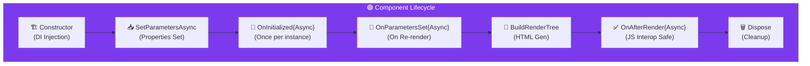

import Callout from '@components/Callout.astro';
import ImplementationNote from '@components/ImplementationNote.astro';
import ExternalCite from '@components/ExternalCite.astro';

When I first configured the Blazor component lifecycle for our document management system, I ran straight into a wall of `ObjectDisposedException` errors flooding the logs every time a user navigated away from a page mid-load. The issue was subtle: background tasks initiated in `OnInitializedAsync` kept running after the component was disposed, attempting to call `StateHasChanged` on a dead circuit. It took nearly two days of tracing through the SignalR pipeline before I realized the solution was not try-catch blocks everywhere, but a disciplined base component pattern with automatic cancellation tokens. That experience reshaped how I think about every component I write in Blazor Server.

## Introduction

In Blazor Server, a component is a C# class instance living on the server. If you don't dispose of it correctly, it leaks memory. If you update the UI from a background thread incorrectly, it crashes.

<ExternalCite title="ASP.NET Core Blazor component lifecycle" url="https://learn.microsoft.com/en-us/aspnet/core/blazor/components/lifecycle" author="Microsoft" date="2024-11-12" />

**Why lifecycle management matters:**
-   **Memory Leaks**: Subscribing to events without unsubscribing keeps the component alive forever.
-   **Race Conditions**: `OnInitializedAsync` runs twice in Prerendering mode.
-   **Responsiveness**: Blocking the render thread freezes the UI.

### What We'll Build
1.  **Lifecycle Map**: Understanding exactly when methods run.
2.  **Base Component**: A reusable `AppComponentBase` that handles `IDisposable` and CancellationTokens automatically.
3.  **Safe Updates**: A helper for thread-safe UI updates.

## Architecture Overview


```mermaid
flowchart TB
    subgraph Lifecycle["🟣 Component Lifecycle"]
        Constructor["🏗️ Constructor\n(DI Injection)"] --> SetParams["📥 SetParametersAsync\n(Properties Set)"]
        SetParams --> Init["🚀 OnInitialized{Async}\n(Once per instance)"]
        Init --> ParamSet["🔄 OnParametersSet{Async}\n(On Re-render)"]
        ParamSet --> Build["🎨 BuildRenderTree\n(HTML Gen)"]
        Build --> After["✅ OnAfterRender{Async}\n(JS Interop Safe)"]
        After --> Dispose["🗑️ Dispose\n(Cleanup)"]
    end

    classDef primary fill:#7c3aed,color:#fff
    classDef secondary fill:#06b6d4,color:#fff
    classDef db fill:#f43f5e,color:#fff
    classDef warning fill:#fbbf24,color:#000

    class Lifecycle primary
```

The Blazor rendering model is synchronous by default, meaning each lifecycle method must complete before the next render can occur. Understanding this sequence is essential for avoiding race conditions, especially during prerendering where `OnInitializedAsync` is invoked twice.

<ExternalCite title="ASP.NET Core Blazor rendering" url="https://learn.microsoft.com/en-us/aspnet/core/blazor/components/rendering" author="Microsoft" date="2024-08-15" />

## Section 1: The Base Component Pattern

Don't implement `IDisposable` in every component. Create a base class.

<ExternalCite title="Component disposal with IDisposable and IAsyncDisposable" url="https://learn.microsoft.com/en-us/aspnet/core/blazor/components/lifecycle#component-disposal-with-idisposable-and-iasyncdisposable" author="Microsoft" date="2024-11-12" />

```csharp
// Infrastructure/AppComponentBase.cs
public abstract class AppComponentBase : ComponentBase, IAsyncDisposable
{
    private readonly CancellationTokenSource _cts = new();

    // Auto-inject common services
    [Inject] protected ILogger Logger { get; set; } = default!;
    [Inject] protected NavigationManager Nav { get; set; } = default!;

    // Pass this to all async calls (HTTP, DB).
    // It cancels automatically when the user leaves the page.
    protected CancellationToken ComponentToken => _cts.Token;

    // Safe way to update UI from background threads (e.g., NATS Consumers)
    protected Task SafeStateHasChangedAsync()
    {
        return _cts.IsCancellationRequested
            ? Task.CompletedTask
            : InvokeAsync(StateHasChanged);
    }

    public async ValueTask DisposeAsync()
    {
        await _cts.CancelAsync();
        _cts.Dispose();
        GC.SuppressFinalize(this);
    }
}
```

<ImplementationNote>
    Using `ComponentToken` prevents "Task Canceled Exceptions" from crashing your logs when users navigate away quickly. The task just stops quietly.
</ImplementationNote>

## Section 2: Safe Async Loading

Typical pattern for loading data without freezing the UI.

<ExternalCite title="Task cancellation in .NET" url="https://learn.microsoft.com/en-us/dotnet/standard/threading/cancellation-in-managed-threads" author="Microsoft" date="2024-06-20" />

```razor
@inherits AppComponentBase

@if (_isLoading)
{
    <LoadingSpinner />
}
else
{
    <h1>@_data.Title</h1>
}

@code {
    private bool _isLoading = true;
    private Document _data;

    protected override async Task OnInitializedAsync()
    {
        try
        {
            // If the user leaves, LoadAsync cancels instantly
            _data = await DocumentService.LoadAsync(Id, ComponentToken);
        }
        catch (OperationCanceledException) { /* Ignore */ }
        finally
        {
            _isLoading = false;
        }
    }
}
```

<ImplementationNote>
    I learned the hard way that `OnInitializedAsync` runs twice when prerendering is enabled: once on the server for the static HTML, and again when the SignalR circuit connects. Without the `ComponentToken` guard, every data fetch doubled, and I saw duplicate rows appearing momentarily before the second render corrected itself. The fix was to either disable prerendering for data-heavy pages or store the result in a scoped cache keyed by component ID.
</ImplementationNote>

## Section 3: The `OnAfterRender` Trap

**Never** call JS Interop in `OnInitialized`. The DOM doesn't exist yet. Use `OnAfterRender`.

<ExternalCite title="Call JavaScript functions from .NET methods in ASP.NET Core Blazor" url="https://learn.microsoft.com/en-us/aspnet/core/blazor/javascript-interoperability/call-javascript-from-dotnet" author="Microsoft" date="2024-11-12" />

```csharp
protected override async Task OnAfterRenderAsync(bool firstRender)
{
    if (firstRender)
    {
        // Only safe to call JS here
        await JS.InvokeVoidAsync("myapp.initializeChart", "myChart");
    }
}
```

<ImplementationNote>
    One particularly frustrating bug I chased involved a chart component that worked in development but failed intermittently in production. The root cause was calling `IJSRuntime.InvokeAsync` inside `OnParametersSetAsync` instead of `OnAfterRenderAsync`. In dev, the timing happened to work because the page was fast enough. Under production load with prerendering enabled, the DOM element did not exist yet, and the JS call would silently fail. Moving it to `OnAfterRenderAsync(firstRender)` resolved it permanently.
</ImplementationNote>

<ExternalCite title="ASP.NET Core Blazor performance best practices" url="https://learn.microsoft.com/en-us/aspnet/core/blazor/performance" author="Microsoft" date="2024-09-10" />

## Conclusion

By inheriting from `AppComponentBase`, you eliminate 90% of the boilerplate associated with cancellation tokens and disposal. You ensure that every component is a good citizen effectively managing its own memory and lifecycle.

Looking back, the base component pattern was the single highest-impact architectural decision I made for our Blazor Server application. Every new component we write automatically inherits safe disposal, cancellation-aware async operations, and thread-safe UI updates. The investment of a few hours building and testing `AppComponentBase` has saved countless hours of debugging `ObjectDisposedException` and circuit disconnect issues across the team.

### Next Steps

- Integrate the base component with real-time NATS updates for event-driven UI refresh.
- Build custom `ShouldRender` logic to minimize unnecessary re-renders in data-heavy components.
- Add centralized error boundary handling that works with the base component pattern.

### Further Reading

- [ASP.NET Core Blazor component lifecycle](https://learn.microsoft.com/en-us/aspnet/core/blazor/components/lifecycle) -- The official lifecycle documentation from Microsoft.
- [Blazor Server Performance Best Practices](https://learn.microsoft.com/en-us/aspnet/core/blazor/performance) -- Guidance on render optimization and memory management.
- [IAsyncDisposable Interface](https://learn.microsoft.com/en-us/dotnet/api/system.iasyncdisposable) -- The .NET interface that underpins async disposal patterns.
