import Callout from '@components/Callout.astro';
import ImplementationNote from '@components/ImplementationNote.astro';
import ExternalCite from '@components/ExternalCite.astro';

## Introduction

In Blazor Server, a component is a C# class instance living on the server. If you don't dispose of it correctly, it leaks memory. If you update the UI from a background thread incorrectly, it crashes.

**Why lifecycle management matters:**
-   **Memory Leaks**: Subscribing to events without unsubscribing keeps the component alive forever.
-   **Race Conditions**: `OnInitializedAsync` runs twice in Prerendering mode.
-   **Responsiveness**: Blocking the render thread freezes the UI.

### What We'll Build
1.  **Lifecycle Map**: Understanding exactly when methods run.
2.  **Base Component**: A reusable `BlueRobinComponentBase` that handles `IDisposable` and CancellationTokens automatically.
3.  **Safe Updates**: A helper for thread-safe UI updates.

## Architecture Overview

```mermaid
flowchart TB
    subgraph Lifecycle["🟣 Component Lifecycle"]
        Constructor["🏗️ Constructor\n(DI Injection)"] --> SetParams["📥 SetParametersAsync\n(Properties Set)"]
        SetParams --> Init["🚀 OnInitialized{Async}\n(Once per instance)"]
        Init --> ParamSet["🔄 OnParametersSet{Async}\n(On Re-render)"]
        ParamSet --> Build["🎨 BuildRenderTree\n(HTML Gen)"]
        Build --> After["✅ OnAfterRender{Async}\n(JS Interop Safe)"]
        After --> Dispose["🗑️ Dispose\n(Cleanup)"]
    end

    classDef primary fill:#7c3aed,color:#fff
    classDef secondary fill:#06b6d4,color:#fff
    classDef db fill:#f43f5e,color:#fff
    classDef warning fill:#fbbf24,color:#000

    class Lifecycle primary
```



## Section 1: The Base Component Pattern

Don't implement `IDisposable` in every component. Create a base class.

```csharp
// Infrastructure/BlueRobinComponentBase.cs
public abstract class BlueRobinComponentBase : ComponentBase, IAsyncDisposable
{
    private readonly CancellationTokenSource _cts = new();
    
    // Auto-inject common services
    [Inject] protected ILogger Logger { get; set; } = default!;
    [Inject] protected NavigationManager Nav { get; set; } = default!;

    // Pass this to all async calls (HTTP, DB). 
    // It cancels automatically when the user leaves the page.
    protected CancellationToken ComponentToken => _cts.Token;

    // Safe way to update UI from background threads (e.g., NATS Consumers)
    protected Task SafeStateHasChangedAsync()
    {
        return _cts.IsCancellationRequested 
            ? Task.CompletedTask 
            : InvokeAsync(StateHasChanged);
    }

    public async ValueTask DisposeAsync()
    {
        await _cts.CancelAsync();
        _cts.Dispose();
        GC.SuppressFinalize(this);
    }
}
```

<ImplementationNote>
    Using `ComponentToken` prevents "Task Canceled Exceptions" from crashing your logs when users navigate away quickly. The task just stops quietly.
</ImplementationNote>

## Section 2: Safe Async Loading

Typical pattern for loading data without freezing the UI.

```razor
@inherits BlueRobinComponentBase

@if (_isLoading)
{
    <LoadingSpinner />
}
else
{
    <h1>@_data.Title</h1>
}

@code {
    private bool _isLoading = true;
    private Document _data;

    protected override async Task OnInitializedAsync()
    {
        try 
        {
            // If the user leaves, LoadAsync cancels instantly
            _data = await DocumentService.LoadAsync(Id, ComponentToken);
        }
        catch (OperationCanceledException) { /* Ignore */ }
        finally 
        {
            _isLoading = false;
        }
    }
}
```

## Section 3: The `OnAfterRender` Trap

**Never** call JS Interop in `OnInitialized`. The DOM doesn't exist yet. Use `OnAfterRender`.

```csharp
protected override async Task OnAfterRenderAsync(bool firstRender)
{
    if (firstRender)
    {
        // Only safe to call JS here
        await JS.InvokeVoidAsync("bluerobin.initializeChart", "myChart");
    }
}
```

## Conclusion

By inheriting from `BlueRobinComponentBase`, you eliminate 90% of the boilerplate associated with cancellation tokens and disposal. You ensure that every component is a good citizen effectively managing its own memory and lifecycle.
