import Callout from '@components/Callout.astro';
import ImplementationNote from '@components/ImplementationNote.astro';
import ExternalCite from '@components/ExternalCite.astro';

Understanding Blazor's component lifecycle and advanced patterns is essential for building responsive, efficient applications. This guide covers lifecycle methods, cascading parameters, virtualization, and performance optimization.

## Component Lifecycle

```mermaid
flowchart TB
    subgraph Lifecycle["🟣 Component Lifecycle"]
        Constructor["🏗️ Constructor\n← DI injection"] --> SetParams["📥 SetParametersAsync\n← Parameters passed"]
        SetParams --> Init["🚀 OnInitialized[Async]\n← First render only"]
        Init --> ParamSet["🔄 OnParametersSet[Async]\n← Every parameter change"]
        ParamSet --> Build["🎨 BuildRenderTree\n← Generate render tree"]
        Build --> After["✅ OnAfterRender[Async]\n← DOM available"]
        After --> Dispose["🗑️ Dispose\n← IDisposable cleanup"]
    end

    style Lifecycle fill:#9b4dca,color:#fff
```



## Base Component

### BlueRobinComponentBase

```csharp
// Components/Shared/BlueRobinComponentBase.cs
public abstract class BlueRobinComponentBase : ComponentBase, IAsyncDisposable
{
    private readonly CancellationTokenSource _cts = new();
    private bool _disposed;
    
    [Inject]
    protected ILogger Logger { get; set; } = default!;
    
    [Inject]
    protected NavigationManager Navigation { get; set; } = default!;
    
    [Inject]
    protected IJSRuntime JS { get; set; } = default!;
    
    /// <summary>
    /// CancellationToken that cancels when component disposes.
    /// Use this for all async operations to prevent memory leaks.
    /// </summary>
    protected CancellationToken ComponentToken => _cts.Token;
    
    /// <summary>
    /// Safely invoke StateHasChanged from any thread.
    /// </summary>
    protected async Task InvokeStateHasChangedAsync()
    {
        if (_disposed) return;
        
        await InvokeAsync(StateHasChanged);
    }
    
    /// <summary>
    /// Execute an async operation with automatic error handling.
    /// </summary>
    protected async Task ExecuteAsync(
        Func<CancellationToken, Task> operation,
        Action<Exception>? onError = null)
    {
        try
        {
            await operation(ComponentToken);
        }
        catch (OperationCanceledException) when (ComponentToken.IsCancellationRequested)
        {
            // Component disposed, ignore
        }
        catch (Exception ex)
        {
            Logger.LogError(ex, "Error in {Component}", GetType().Name);
            onError?.Invoke(ex);
        }
    }
    
    /// <summary>
    /// Execute an async operation that returns a value.
    /// </summary>
    protected async Task<T?> ExecuteAsync<T>(
        Func<CancellationToken, Task<T>> operation,
        T? defaultValue = default,
        Action<Exception>? onError = null)
    {
        try
        {
            return await operation(ComponentToken);
        }
        catch (OperationCanceledException) when (ComponentToken.IsCancellationRequested)
        {
            return defaultValue;
        }
        catch (Exception ex)
        {
            Logger.LogError(ex, "Error in {Component}", GetType().Name);
            onError?.Invoke(ex);
            return defaultValue;
        }
    }
    
    public virtual ValueTask DisposeAsync()
    {
        if (_disposed) return ValueTask.CompletedTask;
        
        _disposed = true;
        _cts.Cancel();
        _cts.Dispose();
        
        return ValueTask.CompletedTask;
    }
}
```

<ImplementationNote>
Always use `ComponentToken` for async operations. This prevents `ObjectDisposedException` when users navigate away before operations complete.
</ImplementationNote>

## Cascading Parameters

### User Context Provider

```razor
@* Components/Layout/UserContextProvider.razor *@
@inherits BlueRobinComponentBase
@inject IUserContextService UserContextService

<CascadingValue Value="_userContext" IsFixed="false">
    @ChildContent
</CascadingValue>

@code {
    [Parameter]
    public RenderFragment? ChildContent { get; set; }
    
    private UserContext? _userContext;
    
    protected override async Task OnInitializedAsync()
    {
        _userContext = await ExecuteAsync(
            async ct => await UserContextService.GetCurrentAsync(ct));
    }
}

public sealed record UserContext
{
    public required BlueRobinId BlueRobinId { get; init; }
    public required string DisplayName { get; init; }
    public required string Email { get; init; }
    public required IReadOnlyList<string> Roles { get; init; }
    
    public bool IsInRole(string role) => Roles.Contains(role);
}
```

### Consuming Cascading Values

```razor
@* Components/Documents/DocumentHeader.razor *@
@inherits BlueRobinComponentBase

<header class="document-header">
    <h1>@Document?.Title</h1>
    
    @if (_canEdit)
    {
        <button @onclick="EditAsync" class="glass-button">
            Edit
        </button>
    }
</header>

@code {
    [CascadingParameter]
    public UserContext? UserContext { get; set; }
    
    [Parameter]
    public Document? Document { get; set; }
    
    private bool _canEdit => 
        UserContext?.BlueRobinId == Document?.OwnerId ||
        UserContext?.IsInRole("admin") == true;
    
    private async Task EditAsync()
    {
        if (!_canEdit) return;
        // Edit logic
    }
}
```

## Virtualization

### Virtualized Document List

```razor
@* Components/Documents/VirtualizedDocumentList.razor *@
@inherits BlueRobinComponentBase
@inject IDocumentService DocumentService

<div class="h-[600px] overflow-y-auto" @ref="_scrollContainer">
    <Virtualize 
        @ref="_virtualizer"
        ItemsProvider="LoadDocumentsAsync"
        ItemSize="80"
        OverscanCount="5">
        
        <ItemContent Context="document">
            <DocumentCard 
                Document="@document" 
                class="h-[72px] mb-2" />
        </ItemContent>
        
        <Placeholder>
            <div class="h-[72px] mb-2 glass-card animate-pulse">
                <div class="h-4 w-3/4 bg-white/10 rounded mb-2"></div>
                <div class="h-3 w-1/2 bg-white/10 rounded"></div>
            </div>
        </Placeholder>
        
        <EmptyContent>
            <div class="text-center py-12">
                <p class="text-muted">No documents found</p>
            </div>
        </EmptyContent>
        
    </Virtualize>
</div>

@code {
    [Parameter]
    public string? SearchQuery { get; set; }
    
    [Parameter]
    public IReadOnlyList<string>? Tags { get; set; }
    
    private Virtualize<Document>? _virtualizer;
    private ElementReference _scrollContainer;
    
    private async ValueTask<ItemsProviderResult<Document>> LoadDocumentsAsync(
        ItemsProviderRequest request)
    {
        var result = await ExecuteAsync(async ct =>
        {
            var response = await DocumentService.SearchAsync(
                new DocumentSearchRequest
                {
                    Query = SearchQuery,
                    Tags = Tags,
                    Skip = request.StartIndex,
                    Take = request.Count
                },
                ct);
            
            return new ItemsProviderResult<Document>(
                response.Items,
                response.TotalCount);
        });
        
        return result ?? new ItemsProviderResult<Document>([], 0);
    }
    
    protected override async Task OnParametersSetAsync()
    {
        // Refresh when search criteria change
        if (_virtualizer != null)
        {
            await _virtualizer.RefreshDataAsync();
        }
    }
}
```

<Callout type="tip">
Set `ItemSize` to the exact height of each item in pixels. This enables accurate scrollbar sizing and smooth scrolling.
</Callout>

### Content Visibility Optimization

```css
/* Styles/input.css */
@layer components {
    .document-card {
        content-visibility: auto;
        contain-intrinsic-size: 0 72px;
    }
    
    .document-list-item {
        contain: layout style paint;
    }
}
```

## Error Boundaries

### Error Boundary Component

```razor
@* Components/Shared/ErrorBoundary.razor *@
@inherits ErrorBoundary

@if (CurrentException is not null)
{
    <div class="glass-card border-red-500/50 p-4">
        <h3 class="text-red-400 font-semibold mb-2">
            Something went wrong
        </h3>
        
        @if (ShowDetails)
        {
            <pre class="text-xs text-red-300 overflow-auto max-h-48">
                @CurrentException.Message
            </pre>
        }
        
        <button @onclick="Recover" class="glass-button mt-4">
            Try Again
        </button>
    </div>
}
else
{
    @ChildContent
}

@code {
    [Parameter]
    public bool ShowDetails { get; set; }
    
    protected override Task OnErrorAsync(Exception exception)
    {
        // Log error
        Logger.LogError(exception, "Unhandled error in component");
        
        // Optionally notify error tracking service
        return base.OnErrorAsync(exception);
    }
}
```

### Usage

```razor
@* Pages/Documents.razor *@
<BlueRobinErrorBoundary>
    <VirtualizedDocumentList 
        SearchQuery="@_searchQuery"
        Tags="@_selectedTags" />
</BlueRobinErrorBoundary>
```

## Render Optimization

### ShouldRender Override

```csharp
// Components/Documents/DocumentCard.razor.cs
public partial class DocumentCard : BlueRobinComponentBase
{
    private Document? _previousDocument;
    
    [Parameter]
    public Document? Document { get; set; }
    
    protected override bool ShouldRender()
    {
        // Only re-render if document changed
        if (ReferenceEquals(_previousDocument, Document))
        {
            return false;
        }
        
        _previousDocument = Document;
        return true;
    }
}
```

### Component Keys

```razor
@* Force re-creation when ID changes *@
<DocumentEditor @key="Document.Id" Document="@Document" />

@* Efficient list rendering *@
@foreach (var doc in _documents)
{
    <DocumentCard @key="doc.Id" Document="@doc" />
}
```

## State Management

### State Container Pattern

```csharp
// Services/DocumentStateContainer.cs
public sealed class DocumentStateContainer : IDisposable
{
    private readonly List<Document> _documents = [];
    private string? _searchQuery;
    private bool _isLoading;
    
    public IReadOnlyList<Document> Documents => _documents;
    public string? SearchQuery => _searchQuery;
    public bool IsLoading => _isLoading;
    
    public event Action? OnChange;
    
    public void SetDocuments(IEnumerable<Document> documents)
    {
        _documents.Clear();
        _documents.AddRange(documents);
        NotifyStateChanged();
    }
    
    public void AddDocument(Document document)
    {
        _documents.Insert(0, document);
        NotifyStateChanged();
    }
    
    public void UpdateDocument(Document document)
    {
        var index = _documents.FindIndex(d => d.Id == document.Id);
        if (index >= 0)
        {
            _documents[index] = document;
            NotifyStateChanged();
        }
    }
    
    public void RemoveDocument(BlueRobinId documentId)
    {
        var document = _documents.FirstOrDefault(d => d.Id == documentId);
        if (document != null)
        {
            _documents.Remove(document);
            NotifyStateChanged();
        }
    }
    
    public void SetSearchQuery(string? query)
    {
        _searchQuery = query;
        NotifyStateChanged();
    }
    
    public void SetLoading(bool isLoading)
    {
        _isLoading = isLoading;
        NotifyStateChanged();
    }
    
    private void NotifyStateChanged() => OnChange?.Invoke();
    
    public void Dispose()
    {
        OnChange = null;
    }
}
```

### Consuming State Container

```razor
@* Components/Documents/DocumentDashboard.razor *@
@inherits BlueRobinComponentBase
@inject DocumentStateContainer State

<div class="space-y-4">
    @if (State.IsLoading)
    {
        <LoadingSpinner />
    }
    else
    {
        <VirtualizedDocumentList Documents="@State.Documents" />
    }
</div>

@code {
    protected override void OnInitialized()
    {
        State.OnChange += HandleStateChanged;
    }
    
    private async void HandleStateChanged()
    {
        await InvokeStateHasChangedAsync();
    }
    
    public override async ValueTask DisposeAsync()
    {
        State.OnChange -= HandleStateChanged;
        await base.DisposeAsync();
    }
}
```

## Summary

Blazor advanced patterns include:

| Pattern | Purpose |
|---------|---------|
| Base Component | Consistent error handling, cancellation |
| Cascading Parameters | Context propagation without prop drilling |
| Virtualization | Efficient rendering of large lists |
| Error Boundaries | Graceful error recovery |
| ShouldRender | Prevent unnecessary re-renders |
| State Containers | Centralized state management |

Combined with proper lifecycle management, these patterns enable responsive, maintainable Blazor applications.

<ExternalCite 
  title="ASP.NET Core Blazor lifecycle" 
  url="https://learn.microsoft.com/en-us/aspnet/core/blazor/components/lifecycle"
  author="Microsoft"
/>
