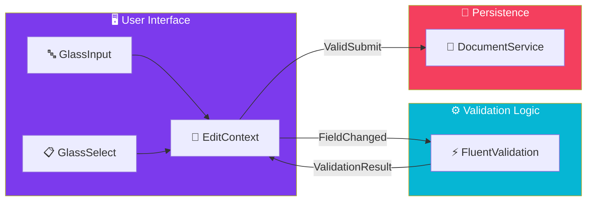

import Callout from '@components/Callout.astro';
import ImplementationNote from '@components/ImplementationNote.astro';
import ExternalCite from '@components/ExternalCite.astro';

When I first configured form validation for our Blazor document management system, I made what seemed like a reasonable choice: binding the `EditForm` directly to the EF Core entity. Within a week, we had silent data corruption because the two-way binding was mutating tracked entities before the user even pressed Save. Rebuilding around a dedicated form model with FluentValidation took effort, but it completely eliminated that class of bug. The experience taught me that forms in Blazor deserve the same architectural rigor as any backend service.

## Introduction

Forms are the primary way users interact with your application. But building forms that are user-friendly, accessible, and securely validated is hard.

<ExternalCite title="ASP.NET Core Blazor forms overview" url="https://learn.microsoft.com/en-us/aspnet/core/blazor/forms" author="Microsoft" date="2024-11-12" />

**Why advanced form handling matters:**
-   **User Experience**: Immediate feedback on bad input prevents frustration.
-   **Maintainability**: Separating validation rules from UI markup keeps code clean.
-   **Consistency**: Using a standard set of "Glass" inputs ensures the entire app looks and behaves the same.

### What We'll Build
1.  **Form Model**: A dedicated DTO for the form, separate from the database entity.
2.  **FluentValidation**: Integrating server-side validation rules into the UI.
3.  **GlassInput**: A reusable text input that handles labels and error messages automatically.

## Architecture Overview


```mermaid
flowchart LR
    subgraph UI["🖥️ User Interface"]
        Input["🔤 GlassInput"] --> EC["🎯 EditContext"]
        Select["📋 GlassSelect"] --> EC
    end

    subgraph Logic["⚙️ Validation Logic"]
        EC -->|FieldChanged| Validator["⚡ FluentValidation"]
        Validator -->|ValidationResult| EC
    end

    subgraph Server["💾 Persistence"]
        EC -->|ValidSubmit| Service["🏢 DocumentService"]
    end

    classDef primary fill:#7c3aed,color:#fff
    classDef secondary fill:#06b6d4,color:#fff
    classDef db fill:#f43f5e,color:#fff
    classDef warning fill:#fbbf24,color:#000

    class UI primary
    class Logic secondary
    class Server db
```

## Section 1: The Form Model

Never bind `EditForm` directly to your database entity. Use a specific model.

<ExternalCite title="FluentValidation Documentation" url="https://docs.fluentvalidation.net/en/latest/aspnet.html" author="Jeremy Skinner" date="2024-03-15" />

```csharp
public class DocumentFormModel
{
    public string Title { get; set; } = string.Empty;
    public string? Description { get; set; }
    public string Category { get; set; } = "General";
    public DateTime? DateSpecific { get; set; }
}

public class DocumentValidator : AbstractValidator<DocumentFormModel>
{
    public DocumentValidator()
    {
        RuleFor(x => x.Title)
            .NotEmpty().WithMessage("Title is required.")
            .MaximumLength(100);

        RuleFor(x => x.Category)
            .Must(c => AllowedCategories.Contains(c))
            .WithMessage("Invalid category.");
    }
}
```

<ImplementationNote>
    Separating the form model from the database entity was a lesson I learned through pain. Early on, I bound `EditForm` directly to our EF Core `Document` entity. Everything seemed fine until I noticed that navigating away from a half-filled form would persist partial changes because the change tracker still held references to the mutated entity. The dedicated DTO pattern creates a clean boundary: the form model is a throwaway object that only maps to the entity on successful submission.
</ImplementationNote>

<ExternalCite title="Blazored.FluentValidation" url="https://github.com/Blazored/FluentValidation" author="Chris Sainty" date="2024-01-20" />

## Section 2: Reusable Input Components

Instead of repeating `<div class="form-group">...</div>` everywhere, build a component.

<ExternalCite title="ASP.NET Core Blazor input components" url="https://learn.microsoft.com/en-us/aspnet/core/blazor/forms/input-components" author="Microsoft" date="2024-11-12" />

```razor
@inherits InputBase<string>

<div class="glass-field group">
    <label for="@Id" class="glass-label">@Label</label>

    <div class="relative">
        <input @attributes="AdditionalAttributes"
               id="@Id"
               class="@CssClass glass-input"
               value="@CurrentValue"
               @onchange="EventCallback.Factory.CreateBinder<string>(this, __value => CurrentValueAsString = __value, CurrentValueAsString)" />

        @if (!string.IsNullOrEmpty(CssClass) && CssClass.Contains("invalid"))
        {
            <ExclamationCircleIcon class="input-icon-error" />
        }
    </div>

    <div class="glass-message">
        <ValidationMessage For="@ValueExpression" />
    </div>
</div>

@code {
    [Parameter] public string Label { get; set; }
}
```

<ImplementationNote>
    Building `GlassInput` by inheriting from `InputBase<string>` felt unintuitive at first because the `CurrentValueAsString` property and `ValueExpression` delegate are not well-documented. I spent an afternoon reading the Blazor source code on GitHub to understand how `InputBase` integrates with `EditContext`. The key insight was that `InputBase` automatically registers the field with the `EditContext` and manages the CSS class toggling between `valid` and `invalid` states, so the component just needs to render accordingly.
</ImplementationNote>

## Section 3: The EditForm

Putting it all together using the `Blazored.FluentValidation` library.

<ExternalCite title="ASP.NET Core Blazor forms validation" url="https://learn.microsoft.com/en-us/aspnet/core/blazor/forms/validation" author="Microsoft" date="2024-11-12" />

```razor
<EditForm Model="@_model" OnValidSubmit="@HandleSubmitAsync">
    <FluentValidationValidator />

    <GlassPanel Title="Document Details">
        <GlassInput Label="Title" @bind-Value="@_model.Title" />
        <GlassTextArea Label="Description" @bind-Value="@_model.Description" />

        <div class="flex justify-end mt-4">
            <GlassButton Type="submit" IsLoading="@_isSaving">
                Save Document
            </GlassButton>
        </div>
    </GlassPanel>
</EditForm>
```

<ImplementationNote>
    One async validation issue caused me significant headaches: async validators in FluentValidation (for example, checking uniqueness against a database) do not fire automatically on `FieldChanged` events. Blazor's `EditContext` only triggers synchronous validation by default. The workaround was to wire up a manual call to `editContext.Validate()` on form submission and display a loading indicator while the async rules execute. This prevented the form from appearing valid when async rules had not yet been evaluated.
</ImplementationNote>

<ExternalCite title="Data Annotations vs FluentValidation in .NET" url="https://code-maze.com/fluentvalidation-in-aspnet/" author="Code Maze" date="2024-05-10" />

## Conclusion

By componentizing your form inputs and externalizing your validation logic, you create forms that are a joy to build and a joy to use. The state management handles the complexity, leaving your markup clean and declarative.

Reflecting on this journey, the combination of FluentValidation with dedicated form models has become my default approach for every Blazor form, regardless of complexity. The upfront cost of creating a validator class and a form DTO pays for itself the moment you need to add a new validation rule or debug a submission issue. The separation of concerns makes each layer independently testable and the overall form behavior predictable.

### Next Steps

- Implement multi-step wizard forms using cascading `EditContext` and shared form state.
- Add real-time server-side validation using the NATS notification service for uniqueness checks.
- Build accessible error summary components that integrate with screen readers.

### Further Reading


<ExternalCite title="FluentValidation Documentation" url="https://docs.fluentvalidation.net/en/latest/" author="Jeremy Skinner" date="2024" />

<ExternalCite title="ASP.NET Core Blazor forms and validation" url="https://learn.microsoft.com/en-us/aspnet/core/blazor/forms/validation" author="Microsoft" date="2024" />

<ExternalCite title="Blazored.FluentValidation" url="https://github.com/Blazored/FluentValidation" author="GitHub Community" date="2024" />
