import Callout from '@components/Callout.astro';
import ImplementationNote from '@components/ImplementationNote.astro';
import ExternalCite from '@components/ExternalCite.astro';

## Introduction

Forms are the primary way users interact with your application. But building forms that are user-friendly, accessible, and securely validated is hard.

**Why advanced form handling matters:**
-   **User Experience**: Immediate feedback on bad input prevents frustration.
-   **Maintainability**: Separating validation rules from UI markup keeps code clean.
-   **Consistency**: Using a standard set of "Glass" inputs ensures the entire app looks and behaves the same.

### What We'll Build
1.  **Form Model**: A dedicated DTO for the form, separate from the database entity.
2.  **FluentValidation**: Integrating server-side validation rules into the UI.
3.  **GlassInput**: A reusable text input that handles labels and error messages automatically.

## Architecture Overview

```mermaid
flowchart LR
    subgraph UI["🖥️ User Interface"]
        Input["🔤 GlassInput"] --> EC["🎯 EditContext"]
        Select["📋 GlassSelect"] --> EC
    end

    subgraph Logic["⚙️ Validation Logic"]
        EC -->|FieldChanged| Validator["⚡ FluentValidation"]
        Validator -->|ValidationResult| EC
    end

    subgraph Server["💾 Persistence"]
        EC -->|ValidSubmit| Service["🏢 DocumentService"]
    end

    classDef primary fill:#7c3aed,color:#fff
    classDef secondary fill:#06b6d4,color:#fff
    classDef db fill:#f43f5e,color:#fff
    classDef warning fill:#fbbf24,color:#000

    class UI primary
    class Logic secondary
    class Server db
```



## Section 1: The Form Model

Never bind `EditForm` directly to your database entity. Use a specific model.

```csharp
public class DocumentFormModel
{
    public string Title { get; set; } = string.Empty;
    public string? Description { get; set; }
    public string Category { get; set; } = "General";
    public DateTime? DateSpecific { get; set; }
}

public class DocumentValidator : AbstractValidator<DocumentFormModel>
{
    public DocumentValidator()
    {
        RuleFor(x => x.Title)
            .NotEmpty().WithMessage("Title is required.")
            .MaximumLength(100);

        RuleFor(x => x.Category)
            .Must(c => AllowedCategories.Contains(c))
            .WithMessage("Invalid category.");
    }
}
```

## Section 2: Reusable Input Components

Instead of repeating `<div class="form-group">...</div>` everywhere, build a component.

```razor
@inherits InputBase<string>

<div class="glass-field group">
    <label for="@Id" class="glass-label">@Label</label>
    
    <div class="relative">
        <input @attributes="AdditionalAttributes"
               id="@Id"
               class="@CssClass glass-input"
               value="@CurrentValue"
               @onchange="EventCallback.Factory.CreateBinder<string>(this, __value => CurrentValueAsString = __value, CurrentValueAsString)" />
        
        @if (!string.IsNullOrEmpty(CssClass) && CssClass.Contains("invalid"))
        {
            <ExclamationCircleIcon class="input-icon-error" />
        }
    </div>
    
    <div class="glass-message">
        <ValidationMessage For="@ValueExpression" />
    </div>
</div>

@code {
    [Parameter] public string Label { get; set; }
}
```

## Section 3: The EditForm

Putting it all together using the `Blazored.FluentValidation` library.

```razor
<EditForm Model="@_model" OnValidSubmit="@HandleSubmitAsync">
    <FluentValidationValidator />
    
    <GlassPanel Title="Document Details">
        <GlassInput Label="Title" @bind-Value="@_model.Title" />
        <GlassTextArea Label="Description" @bind-Value="@_model.Description" />
        
        <div class="flex justify-end mt-4">
            <GlassButton Type="submit" IsLoading="@_isSaving">
                Save Document
            </GlassButton>
        </div>
    </GlassPanel>
</EditForm>
```

## Conclusion

By componentizing your form inputs and externalizing your validation logic, you create forms that are a joy to build and a joy to use. The state management handles the complexity, leaving your markup clean and declarative.
