import Callout from '@components/Callout.astro';
import ImplementationNote from '@components/ImplementationNote.astro';
import ExternalCite from '@components/ExternalCite.astro';

Forms are the backbone of data entry applications. In this guide, we'll build production-ready forms with FluentValidation, custom input components, and proper state management in Blazor.

## Form Architecture

```mermaid
flowchart TB
    subgraph EditForm["📝 EditForm"]
        EC["🎯 EditContext<br/>• Model binding<br/>• Validation state<br/>• Field change tracking"]
    end

    subgraph Components["🧩 Input Components"]
        GI["🔤 GlassInput"]
        GS["📋 GlassSelect"]
        GT["📄 GlassTextArea"]
    end

    subgraph Validation["✅ Validators"]
        FV["⚡ FluentValidation"]
        CR["🔧 Custom Rules"]
    end

    EC --> Components
    EC --> Validation

    style EditForm fill:#512bd4,color:#fff
    style Components fill:#f39c12,color:#fff
    style Validation fill:#27ae60,color:#fff
```



## Setting Up FluentValidation

### Package Installation

```bash
dotnet add package FluentValidation
dotnet add package Blazored.FluentValidation
```

### Document Upload Form Model

```csharp
// Application/Models/DocumentUploadModel.cs
public sealed class DocumentUploadModel
{
    public string Title { get; set; } = string.Empty;
    public string? Description { get; set; }
    public IReadOnlyList<string> Tags { get; set; } = [];
    public IBrowserFile? File { get; set; }
    public bool AutoProcess { get; set; } = true;
    public ProcessingPriority Priority { get; set; } = ProcessingPriority.Normal;
}

public enum ProcessingPriority
{
    Low,
    Normal,
    High
}
```

### Validator

```csharp
// Application/Validators/DocumentUploadModelValidator.cs
public sealed class DocumentUploadModelValidator : AbstractValidator<DocumentUploadModel>
{
    private static readonly string[] AllowedExtensions = [".pdf", ".docx", ".txt", ".md"];
    private const long MaxFileSizeBytes = 50 * 1024 * 1024; // 50MB
    
    public DocumentUploadModelValidator()
    {
        RuleFor(x => x.Title)
            .NotEmpty().WithMessage("Title is required")
            .MaximumLength(200).WithMessage("Title cannot exceed 200 characters")
            .Must(BeValidTitle).WithMessage("Title contains invalid characters");
        
        RuleFor(x => x.Description)
            .MaximumLength(2000).WithMessage("Description cannot exceed 2000 characters");
        
        RuleFor(x => x.Tags)
            .Must(tags => tags.Count <= 10)
            .WithMessage("Maximum 10 tags allowed");
        
        RuleForEach(x => x.Tags)
            .NotEmpty().WithMessage("Tag cannot be empty")
            .MaximumLength(50).WithMessage("Tag cannot exceed 50 characters")
            .Matches("^[a-z0-9-]+$").WithMessage("Tags can only contain lowercase letters, numbers, and hyphens");
        
        RuleFor(x => x.File)
            .NotNull().WithMessage("Please select a file to upload")
            .Must(BeValidFileType!).WithMessage($"Only {string.Join(", ", AllowedExtensions)} files are allowed")
            .Must(BeUnderMaxSize!).WithMessage($"File size cannot exceed {MaxFileSizeBytes / 1024 / 1024}MB");
    }
    
    private static bool BeValidTitle(string title)
    {
        if (string.IsNullOrWhiteSpace(title)) return false;
        
        // No control characters or path separators
        return !title.Any(c => char.IsControl(c) || c == '/' || c == '\\');
    }
    
    private static bool BeValidFileType(IBrowserFile file)
    {
        var extension = Path.GetExtension(file.Name).ToLowerInvariant();
        return AllowedExtensions.Contains(extension);
    }
    
    private static bool BeUnderMaxSize(IBrowserFile file)
    {
        return file.Size <= MaxFileSizeBytes;
    }
}
```

## Custom Input Components

### GlassInput Component

```razor
@* Components/Forms/GlassInput.razor *@
@inherits InputBase<string>

<div class="relative">
    <input
        @attributes="AdditionalAttributes"
        id="@Id"
        type="@Type"
        class="@CssClass"
        placeholder="@Placeholder"
        disabled="@Disabled"
        @bind="CurrentValue"
        @bind:event="oninput"
        @onfocus="HandleFocus"
        @onblur="HandleBlur" />
    
    @if (!string.IsNullOrEmpty(Label))
    {
        <label 
            for="@Id"
            class="@LabelCssClass">
            @Label
        </label>
    }
    
    @if (ShowValidation && EditContext is not null)
    {
        <ValidationMessage For="@ValidationFor" />
    }
</div>

@code {
    [Parameter] public string? Id { get; set; }
    [Parameter] public string? Label { get; set; }
    [Parameter] public string? Placeholder { get; set; }
    [Parameter] public string Type { get; set; } = "text";
    [Parameter] public bool Disabled { get; set; }
    [Parameter] public bool ShowValidation { get; set; } = true;
    [Parameter] public Expression<Func<string>>? ValidationFor { get; set; }
    
    private bool _isFocused;
    
    private string CssClass => new CssBuilder("glass-input")
        .AddClass("peer w-full px-4 py-3 rounded-xl")
        .AddClass("bg-white/5 dark:bg-black/10")
        .AddClass("border border-white/20 dark:border-white/10")
        .AddClass("text-gray-900 dark:text-white")
        .AddClass("placeholder-transparent")
        .AddClass("focus:outline-none focus:ring-2 focus:ring-blue-500/50")
        .AddClass("focus:border-transparent")
        .AddClass("transition-all duration-200")
        .AddClass("disabled:opacity-50 disabled:cursor-not-allowed", Disabled)
        .AddClass(CssClass, !string.IsNullOrEmpty(CssClass))
        .Build();
    
    private string LabelCssClass => new CssBuilder()
        .AddClass("absolute left-4 transition-all duration-200 pointer-events-none")
        .AddClass("text-gray-500 dark:text-gray-400")
        .AddClass("-top-2.5 text-xs bg-white dark:bg-gray-900 px-1", _isFocused || !string.IsNullOrEmpty(CurrentValue))
        .AddClass("top-3 text-base", !_isFocused && string.IsNullOrEmpty(CurrentValue))
        .Build();
    
    protected override bool TryParseValueFromString(
        string? value, 
        out string result, 
        out string validationErrorMessage)
    {
        result = value ?? string.Empty;
        validationErrorMessage = string.Empty;
        return true;
    }
    
    private void HandleFocus() => _isFocused = true;
    private void HandleBlur() => _isFocused = false;
}
```

### GlassSelect Component

```razor
@* Components/Forms/GlassSelect.razor *@
@typeparam TValue
@inherits InputBase<TValue>

<div class="relative">
    <select
        @attributes="AdditionalAttributes"
        id="@Id"
        class="@CssClass"
        disabled="@Disabled"
        @bind="CurrentValueAsString">
        
        @if (!string.IsNullOrEmpty(Placeholder))
        {
            <option value="" disabled selected>@Placeholder</option>
        }
        
        @ChildContent
    </select>
    
    @if (!string.IsNullOrEmpty(Label))
    {
        <label for="@Id" class="@LabelCssClass">
            @Label
        </label>
    }
    
    <div class="absolute inset-y-0 right-0 flex items-center pr-3 pointer-events-none">
        <svg class="w-5 h-5 text-gray-400" fill="none" stroke="currentColor" viewBox="0 0 24 24">
            <path stroke-linecap="round" stroke-linejoin="round" stroke-width="2" d="M19 9l-7 7-7-7" />
        </svg>
    </div>
    
    @if (ShowValidation && EditContext is not null)
    {
        <ValidationMessage For="@ValidationFor" />
    }
</div>

@code {
    [Parameter] public string? Id { get; set; }
    [Parameter] public string? Label { get; set; }
    [Parameter] public string? Placeholder { get; set; }
    [Parameter] public bool Disabled { get; set; }
    [Parameter] public bool ShowValidation { get; set; } = true;
    [Parameter] public Expression<Func<TValue>>? ValidationFor { get; set; }
    [Parameter] public RenderFragment? ChildContent { get; set; }
    
    private string CssClass => new CssBuilder("glass-select")
        .AddClass("appearance-none w-full px-4 py-3 pr-10 rounded-xl")
        .AddClass("bg-white/5 dark:bg-black/10")
        .AddClass("border border-white/20 dark:border-white/10")
        .AddClass("text-gray-900 dark:text-white")
        .AddClass("focus:outline-none focus:ring-2 focus:ring-blue-500/50")
        .AddClass("focus:border-transparent")
        .AddClass("transition-all duration-200")
        .AddClass("cursor-pointer")
        .AddClass("disabled:opacity-50 disabled:cursor-not-allowed", Disabled)
        .Build();
    
    private string LabelCssClass => new CssBuilder()
        .AddClass("absolute -top-2.5 left-4 text-xs")
        .AddClass("text-gray-500 dark:text-gray-400")
        .AddClass("bg-white dark:bg-gray-900 px-1")
        .Build();
    
    protected override bool TryParseValueFromString(
        string? value, 
        out TValue result, 
        out string validationErrorMessage)
    {
        try
        {
            if (typeof(TValue).IsEnum)
            {
                result = (TValue)Enum.Parse(typeof(TValue), value ?? string.Empty);
                validationErrorMessage = string.Empty;
                return true;
            }
            
            var converter = TypeDescriptor.GetConverter(typeof(TValue));
            result = (TValue)converter.ConvertFromString(value ?? string.Empty)!;
            validationErrorMessage = string.Empty;
            return true;
        }
        catch
        {
            result = default!;
            validationErrorMessage = $"Could not parse '{value}' as {typeof(TValue).Name}";
            return false;
        }
    }
}
```

### GlassTagInput Component

```razor
@* Components/Forms/GlassTagInput.razor *@
<div class="space-y-2">
    @if (!string.IsNullOrEmpty(Label))
    {
        <label class="text-sm text-gray-500 dark:text-gray-400">@Label</label>
    }
    
    <div class="@ContainerCssClass">
        @* Existing tags *@
        @foreach (var tag in Tags)
        {
            <span class="@TagCssClass">
                @tag
                <button 
                    type="button" 
                    @onclick="() => RemoveTag(tag)"
                    class="ml-1 hover:text-red-400 transition-colors">
                    <svg class="w-3 h-3" fill="none" stroke="currentColor" viewBox="0 0 24 24">
                        <path stroke-linecap="round" stroke-linejoin="round" stroke-width="2" d="M6 18L18 6M6 6l12 12" />
                    </svg>
                </button>
            </span>
        }
        
        @* Input for new tags *@
        <input
            type="text"
            @bind="_newTag"
            @bind:event="oninput"
            @onkeydown="HandleKeyDown"
            placeholder="@(Tags.Count == 0 ? Placeholder : "Add tag...")"
            class="@InputCssClass"
            disabled="@(Tags.Count >= MaxTags)" />
    </div>
    
    @if (Tags.Count >= MaxTags)
    {
        <p class="text-xs text-amber-500">Maximum @MaxTags tags reached</p>
    }
</div>

@code {
    [Parameter] public IReadOnlyList<string> Tags { get; set; } = [];
    [Parameter] public EventCallback<IReadOnlyList<string>> TagsChanged { get; set; }
    [Parameter] public string? Label { get; set; }
    [Parameter] public string Placeholder { get; set; } = "Add tags...";
    [Parameter] public int MaxTags { get; set; } = 10;
    
    private string _newTag = string.Empty;
    
    private string ContainerCssClass => new CssBuilder()
        .AddClass("flex flex-wrap gap-2 p-3 rounded-xl")
        .AddClass("bg-white/5 dark:bg-black/10")
        .AddClass("border border-white/20 dark:border-white/10")
        .AddClass("focus-within:ring-2 focus-within:ring-blue-500/50")
        .AddClass("transition-all duration-200")
        .Build();
    
    private string TagCssClass => new CssBuilder()
        .AddClass("inline-flex items-center px-2 py-1 rounded-lg")
        .AddClass("bg-blue-500/20 text-blue-400")
        .AddClass("text-sm font-medium")
        .Build();
    
    private string InputCssClass => new CssBuilder()
        .AddClass("flex-1 min-w-[120px] bg-transparent")
        .AddClass("text-gray-900 dark:text-white")
        .AddClass("placeholder-gray-400 dark:placeholder-gray-500")
        .AddClass("focus:outline-none")
        .AddClass("disabled:opacity-50")
        .Build();
    
    private async Task HandleKeyDown(KeyboardEventArgs e)
    {
        if (e.Key == "Enter" || e.Key == ",")
        {
            await AddTag();
        }
        else if (e.Key == "Backspace" && string.IsNullOrEmpty(_newTag) && Tags.Count > 0)
        {
            await RemoveTag(Tags[^1]);
        }
    }
    
    private async Task AddTag()
    {
        var tag = _newTag.Trim().ToLowerInvariant();
        
        if (string.IsNullOrEmpty(tag) || Tags.Contains(tag) || Tags.Count >= MaxTags)
        {
            _newTag = string.Empty;
            return;
        }
        
        var newTags = Tags.Append(tag).ToList();
        _newTag = string.Empty;
        
        await TagsChanged.InvokeAsync(newTags);
    }
    
    private async Task RemoveTag(string tag)
    {
        var newTags = Tags.Where(t => t != tag).ToList();
        await TagsChanged.InvokeAsync(newTags);
    }
}
```

## Complete Upload Form

```razor
@* Pages/Upload.razor *@
@page "/upload"
@attribute [Authorize]
@inject IDocumentService DocumentService
@inject NavigationManager Navigation
@inject IToastService Toast

<PageTitle>Upload Document | BlueRobin</PageTitle>

<div class="max-w-2xl mx-auto py-8">
    <GlassCard>
        <h1 class="text-2xl font-bold text-gray-900 dark:text-white mb-6">
            Upload Document
        </h1>
        
        <EditForm 
            Model="_model" 
            OnValidSubmit="HandleSubmit"
            FormName="document-upload">
            
            <FluentValidationValidator />
            
            <div class="space-y-6">
                @* File Upload *@
                <div>
                    <GlassFileUpload
                        @bind-File="_model.File"
                        Accept=".pdf,.docx,.txt,.md"
                        MaxSizeMb="50"
                        Label="Select file" />
                    <ValidationMessage For="@(() => _model.File)" />
                </div>
                
                @* Title *@
                <GlassInput
                    @bind-Value="_model.Title"
                    Label="Title"
                    Placeholder="Enter document title"
                    ValidationFor="@(() => _model.Title)" />
                
                @* Description *@
                <GlassTextArea
                    @bind-Value="_model.Description"
                    Label="Description"
                    Placeholder="Optional description"
                    Rows="3"
                    ValidationFor="@(() => _model.Description)" />
                
                @* Tags *@
                <GlassTagInput
                    @bind-Tags="_model.Tags"
                    Label="Tags"
                    Placeholder="Add tags (press Enter)"
                    MaxTags="10" />
                
                @* Priority *@
                <GlassSelect
                    @bind-Value="_model.Priority"
                    Label="Processing Priority"
                    ValidationFor="@(() => _model.Priority)">
                    <option value="@ProcessingPriority.Low">Low</option>
                    <option value="@ProcessingPriority.Normal">Normal</option>
                    <option value="@ProcessingPriority.High">High</option>
                </GlassSelect>
                
                @* Auto Process Toggle *@
                <GlassToggle
                    @bind-Value="_model.AutoProcess"
                    Label="Start processing immediately" />
                
                @* Submit *@
                <div class="flex gap-4 pt-4">
                    <GlassButton 
                        Type="submit" 
                        Variant="primary"
                        Loading="_isSubmitting"
                        Disabled="_isSubmitting">
                        @if (_isSubmitting)
                        {
                            <span>Uploading...</span>
                        }
                        else
                        {
                            <span>Upload Document</span>
                        }
                    </GlassButton>
                    
                    <GlassButton
                        Type="button"
                        Variant="secondary"
                        OnClick="Cancel"
                        Disabled="_isSubmitting">
                        Cancel
                    </GlassButton>
                </div>
            </div>
        </EditForm>
    </GlassCard>
</div>

@code {
    private DocumentUploadModel _model = new();
    private bool _isSubmitting;
    
    [CascadingParameter]
    private Task<AuthenticationState>? AuthState { get; set; }
    
    private async Task HandleSubmit()
    {
        if (_model.File is null) return;
        
        _isSubmitting = true;
        
        try
        {
            var authState = await AuthState!;
            var userId = authState.User.GetBlueRobinId();
            
            await using var stream = _model.File.OpenReadStream(maxAllowedSize: 50 * 1024 * 1024);
            
            var documentId = await DocumentService.CreateDocumentAsync(
                userId,
                stream,
                new CreateDocumentRequest
                {
                    Title = _model.Title,
                    FileName = _model.File.Name,
                    ContentType = _model.File.ContentType,
                    Description = _model.Description,
                    Tags = _model.Tags,
                    AutoProcess = _model.AutoProcess,
                    Priority = _model.Priority
                });
            
            Toast.ShowSuccess("Document uploaded successfully!");
            Navigation.NavigateTo($"/documents/{documentId}");
        }
        catch (DuplicateDocumentException)
        {
            Toast.ShowWarning("This document already exists in your archive.");
        }
        catch (Exception ex)
        {
            Toast.ShowError($"Upload failed: {ex.Message}");
        }
        finally
        {
            _isSubmitting = false;
        }
    }
    
    private void Cancel()
    {
        Navigation.NavigateTo("/documents");
    }
}
```

<ImplementationNote>
The `FluentValidationValidator` component from `Blazored.FluentValidation` automatically discovers and applies validators for your model.
</ImplementationNote>

## Multi-Step Forms

For complex workflows, use multi-step forms:

```razor
@* Components/Forms/MultiStepForm.razor *@
@typeparam TModel where TModel : class, new()

<div class="space-y-8">
    @* Progress indicator *@
    <div class="flex justify-between">
        @for (int i = 0; i < Steps.Count; i++)
        {
            var step = Steps[i];
            var index = i;
            var isActive = index == CurrentStep;
            var isComplete = index < CurrentStep;
            
            <div class="flex items-center">
                <div class="@GetStepCircleClass(isActive, isComplete)">
                    @if (isComplete)
                    {
                        <svg class="w-4 h-4" fill="currentColor" viewBox="0 0 20 20">
                            <path fill-rule="evenodd" d="M16.707 5.293a1 1 0 010 1.414l-8 8a1 1 0 01-1.414 0l-4-4a1 1 0 011.414-1.414L8 12.586l7.293-7.293a1 1 0 011.414 0z" clip-rule="evenodd"/>
                        </svg>
                    }
                    else
                    {
                        <span>@(index + 1)</span>
                    }
                </div>
                <span class="ml-2 text-sm @(isActive ? "text-blue-400 font-medium" : "text-gray-400")">
                    @step.Title
                </span>
            </div>
            
            @if (i < Steps.Count - 1)
            {
                <div class="flex-1 mx-4 h-0.5 @(isComplete ? "bg-blue-500" : "bg-gray-700")"></div>
            }
        }
    </div>
    
    @* Current step content *@
    <EditForm Model="Model" OnValidSubmit="HandleNext">
        <FluentValidationValidator />
        
        @Steps[CurrentStep].Content(Model)
        
        @* Navigation buttons *@
        <div class="flex justify-between pt-6">
            <GlassButton
                Type="button"
                Variant="secondary"
                OnClick="HandlePrevious"
                Disabled="CurrentStep == 0">
                Previous
            </GlassButton>
            
            @if (CurrentStep < Steps.Count - 1)
            {
                <GlassButton Type="submit" Variant="primary">
                    Next
                </GlassButton>
            }
            else
            {
                <GlassButton Type="submit" Variant="primary" Loading="IsSubmitting">
                    @SubmitText
                </GlassButton>
            }
        </div>
    </EditForm>
</div>

@code {
    [Parameter] public TModel Model { get; set; } = new();
    [Parameter] public List<FormStep<TModel>> Steps { get; set; } = [];
    [Parameter] public EventCallback<TModel> OnSubmit { get; set; }
    [Parameter] public string SubmitText { get; set; } = "Submit";
    [Parameter] public bool IsSubmitting { get; set; }
    
    private int CurrentStep { get; set; } = 0;
    
    private async Task HandleNext()
    {
        if (CurrentStep < Steps.Count - 1)
        {
            CurrentStep++;
        }
        else
        {
            await OnSubmit.InvokeAsync(Model);
        }
    }
    
    private void HandlePrevious()
    {
        if (CurrentStep > 0)
        {
            CurrentStep--;
        }
    }
    
    private string GetStepCircleClass(bool isActive, bool isComplete)
    {
        return new CssBuilder()
            .AddClass("w-8 h-8 rounded-full flex items-center justify-center text-sm")
            .AddClass("bg-blue-500 text-white", isActive || isComplete)
            .AddClass("bg-gray-700 text-gray-400", !isActive && !isComplete)
            .Build();
    }
}

public record FormStep<TModel>(string Title, RenderFragment<TModel> Content);
```

## Form State Persistence

Preserve form state across navigation:

```csharp
// Services/FormStateService.cs
public sealed class FormStateService
{
    private readonly ISessionStorageService _sessionStorage;
    
    public FormStateService(ISessionStorageService sessionStorage)
    {
        _sessionStorage = sessionStorage;
    }
    
    public async Task SaveStateAsync<T>(string key, T state)
    {
        await _sessionStorage.SetItemAsync(key, state);
    }
    
    public async Task<T?> LoadStateAsync<T>(string key)
    {
        return await _sessionStorage.GetItemAsync<T>(key);
    }
    
    public async Task ClearStateAsync(string key)
    {
        await _sessionStorage.RemoveItemAsync(key);
    }
}

// Usage in component
protected override async Task OnInitializedAsync()
{
    var savedState = await FormState.LoadStateAsync<DocumentUploadModel>("upload-form");
    if (savedState is not null)
    {
        _model = savedState;
    }
}

private async Task HandleFieldChange()
{
    await FormState.SaveStateAsync("upload-form", _model);
}
```

## Summary

Building robust forms requires:

| Component | Purpose |
|-----------|---------|
| FluentValidation | Declarative validation rules |
| Custom inputs | Consistent styling and UX |
| Tag inputs | Multi-value selection |
| Multi-step forms | Complex workflows |
| State persistence | Form recovery |

These patterns ensure your forms are both user-friendly and maintainable.

<ExternalCite 
  title="Blazor Forms and Validation" 
  url="https://learn.microsoft.com/en-us/aspnet/core/blazor/forms-and-input-components"
  author="Microsoft"
/>
