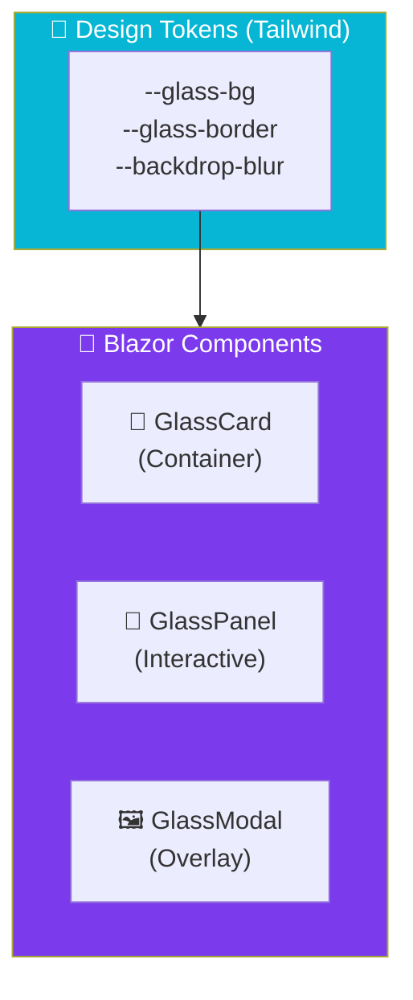

import Callout from '@components/Callout.astro';
import ImplementationNote from '@components/ImplementationNote.astro';
import ExternalCite from '@components/ExternalCite.astro';

## Introduction

When I started building BlueRobin's UI, it looked like every other Bootstrap dashboard—functional but forgettable. I wanted something that felt modern and distinctive without sacrificing accessibility or performance. Glassmorphism caught my eye, but most implementations I found were CSS demos that fell apart with real content. Building production-quality glass components in Blazor required understanding Tailwind CSS 4's new color system and the quirks of backdrop-filter across browsers.

"Glass Morphism" is a design trend emphasizing depth and translucency. It looks great, but implemented poorly, it kills performance and accessibility. <ExternalCite title="Glassmorphism CSS Generator" url="https://hype4.academy/tools/glassmorphism-generator" author="Hype4 Academy" date="2024" /> The technique relies on `backdrop-filter` to blur content behind a semi-transparent element, creating the illusion of frosted glass. <ExternalCite title="MDN: backdrop-filter" url="https://developer.mozilla.org/en-US/docs/Web/CSS/backdrop-filter" author="Mozilla" date="2024" />

**Why build a component library?**
-   **Consistency**: Define the "blur" and "opacity" values once in CSS tokens, use everywhere.
-   **Encapsulation**: Hide the complex Tailwind classes behind simple Razor parameters.
-   **Dark Mode**: Handle color shifts automatically inside the component.

### What We'll Build
1.  **CSS Theme**: Configuring Tailwind 4 with OKLCH variables for glass effects.
2.  **GlassCard**: A container with a frosted glass background.
3.  **GlassModal**: A dialog with a blur backdrop that doesn't suffer from Z-index hell.

## Architecture Overview


```mermaid
flowchart TB
    subgraph CSS["🎨 Design Tokens (Tailwind)"]
        Vars["--glass-bg\n--glass-border\n--backdrop-blur"]
    end

    subgraph Blazor["🧩 Blazor Components"]
        Card["📄 GlassCard\n(Container)"]
        Panel["📱 GlassPanel\n(Interactive)"]
        Modal["🖼️ GlassModal\n(Overlay)"]
    end

    Vars --> Blazor
    
    classDef primary fill:#7c3aed,color:#fff
    classDef secondary fill:#06b6d4,color:#fff
    classDef db fill:#f43f5e,color:#fff
    classDef warning fill:#fbbf24,color:#000

    class Blazor primary
    class CSS secondary
```

## Section 1: The Design Tokens (Tailwind 4)

We use `oklch()` colors because they provide consistent perceived brightness, making it easier to create "glass" that looks good in both Light and Dark modes. <ExternalCite title="OKLCH Color Space" url="https://oklch.com/" author="Evil Martians" date="2024" /> The Tailwind CSS v4 release embraced this color space as a first-class citizen, replacing the older hex-based palette with perceptually uniform alternatives. <ExternalCite title="Tailwind CSS v4 Documentation" url="https://tailwindcss.com/docs" author="Tailwind Labs" date="2024" />

```css
/* input.css */
@theme {
  --color-glass-surface: oklch(100% 0 0 / 0.6);
  --color-glass-border: oklch(100% 0 0 / 0.2);
  --blur-glass: 16px;
}

@media (prefers-color-scheme: dark) {
  :root {
    --color-glass-surface: oklch(20% 0.02 260 / 0.7);
    --color-glass-border: oklch(80% 0.05 260 / 0.1);
  }
}

.glass-panel {
  background-color: var(--color-glass-surface);
  backdrop-filter: blur(var(--blur-glass));
  border: 1px solid var(--color-glass-border);
  box-shadow: 0 4px 30px rgba(0, 0, 0, 0.1);
}
```

<ImplementationNote>
Migrating from Tailwind CSS 3 to v4 was a bigger change than I expected. The new CSS-first configuration means no more tailwind.config.js—you define everything in CSS using @theme. OKLCH colors replaced the old hex palette, which was actually a welcome change because OKLCH gives perceptually uniform color manipulation. But it took me a full day to port our existing color tokens.
</ImplementationNote>

## Section 2: The GlassCard Component

A simple wrapper that applies our glass classes and supports arbitrary content. Blazor's component model makes this straightforward—parameters map to HTML attributes, and `RenderFragment` handles child content projection. <ExternalCite title="Blazor Component Model" url="https://learn.microsoft.com/en-us/aspnet/core/blazor/components/" author="Microsoft" date="2024" />

```razor
<!-- Components/GlassCard.razor -->
<div class="glass-panel rounded-2xl p-6 transition-all hover:scale-[1.01] @CssClass">
    @if (Title is not null)
    {
        <h3 class="text-xl font-display font-bold mb-4 text-slate-800 dark:text-slate-100">
            @Title
        </h3>
    }
    
    @ChildContent
</div>

@code {
    [Parameter] public string? Title { get; set; }
    [Parameter] public RenderFragment? ChildContent { get; set; }
    [Parameter] public string CssClass { get; set; } = "";
}
```

<ImplementationNote>
The backdrop-filter property that creates the glass effect performs poorly when applied to many elements simultaneously. On my initial implementation, scrolling a page with 20+ glass cards would drop to 15fps. The fix was restricting backdrop-filter to a maximum of 3-4 visible elements and using simple semi-transparent backgrounds for list items.
</ImplementationNote>

## Section 3: The GlassModal

Modals are tricky because of the backdrop. We use a fixed overlay with a high blur. When building accessible modals, ensure that focus is trapped within the dialog and that the backdrop click-to-close behavior does not interfere with screen readers. <ExternalCite title="Web Content Accessibility Guidelines (WCAG) 2.1" url="https://www.w3.org/TR/WCAG21/" author="W3C" date="2018" />

```razor
@if (IsVisible)
{
    <!-- Backdrop -->
    <div class="fixed inset-0 z-50 flex items-center justify-center bg-black/40 backdrop-blur-md"
         @onclick="OnBackdropClick">
         
        <!-- Modal Content -->
        <div class="glass-panel w-full max-w-lg rounded-xl p-6 shadow-2xl animate-in fade-in zoom-in-95"
             @onclick:stopPropagation>
             
            <header class="flex justify-between items-center mb-4">
                <h2 class="text-2xl font-bold">@Title</h2>
                <button @onclick="CloseAsync" class="p-2 hover:bg-white/20 rounded-full">✕</button>
            </header>
            
            @ChildContent
            
        </div>
    </div>
}

@code {
    [Parameter] public bool IsVisible { get; set; }
    [Parameter] public string Title { get; set; }
    [Parameter] public EventCallback<bool> IsVisibleChanged { get; set; }

    private async Task CloseAsync()
    {
        IsVisible = false;
        await IsVisibleChanged.InvokeAsync(false);
    }

    private async Task OnBackdropClick() => await CloseAsync();
}
```

<ImplementationNote>
One subtle gotcha with glass modals: if any ancestor element has a `transform`, `filter`, or `perspective` CSS property set, `position: fixed` on the modal will be relative to that ancestor instead of the viewport. I spent hours debugging why the modal was clipping inside a parent container before discovering that a `hover:scale-[1.01]` transition on a parent GlassCard was the culprit. The solution was rendering modals through a Blazor portal at the document root.
</ImplementationNote>

## Conclusion

With these components, you can rapidly assemble UI that looks "designed" without writing custom CSS for every view. The `glass-panel` utility class ensures that every surface in your app shares the same depth and texture characteristics.

Looking back, glassmorphism was worth the effort but not without its lessons. The biggest takeaway was that a visual effect that takes five minutes to demo can take five days to make production-ready. Browser inconsistencies with `backdrop-filter`, performance cliffs with too many blurred layers, and accessibility concerns around contrast ratios all required careful attention. If you are considering glass morphism for your own project, start with a single surface--a card or a modal--and validate performance and readability before scaling it across your entire UI. The visual payoff is real, but only if you build on a solid foundation of design tokens and reusable components.

### Next Steps

- **[Integrating Tailwind CSS v4 with Blazor](/articles/blazor-ui-tailwind-v4-integration)** -- Deep dive into the CSS-first configuration and build pipeline for Tailwind v4 in a Blazor project.
- **[Blazor Advanced Patterns and Lifecycle](/articles/blazor-advanced-patterns-lifecycle)** -- Understand component lifecycle hooks, cascading parameters, and render optimization techniques.
- **[Blazor Forms, Validation, and State](/articles/blazor-forms-validation-state)** -- Build accessible, validated forms that work inside glass containers without contrast issues.
- **[Implementing a Glassmorphism Design System](/articles/implementing-glassmorphism-design-system)** -- Take these components further with a full design system including spacing, typography, and animation tokens.

### Further Reading

- <ExternalCite title="Glassmorphism CSS Generator" url="https://hype4.academy/tools/glassmorphism-generator" author="Hype4 Academy" date="2024" /> -- Interactive tool for experimenting with glass effect parameters before committing to code.
- <ExternalCite title="MDN: backdrop-filter" url="https://developer.mozilla.org/en-US/docs/Web/CSS/backdrop-filter" author="Mozilla" date="2024" /> -- Comprehensive reference for the `backdrop-filter` property, including browser compatibility tables.
- <ExternalCite title="Tailwind CSS v4 Documentation" url="https://tailwindcss.com/docs" author="Tailwind Labs" date="2024" /> -- Official documentation for Tailwind CSS v4, covering the new CSS-first configuration and `@theme` directive.
- <ExternalCite title="OKLCH Color Space" url="https://oklch.com/" author="Evil Martians" date="2024" /> -- Interactive color picker and explanation of the OKLCH perceptual color model.
- <ExternalCite title="Web Content Accessibility Guidelines (WCAG) 2.1" url="https://www.w3.org/TR/WCAG21/" author="W3C" date="2018" /> -- The accessibility standard you should validate your glass components against, especially contrast ratios (SC 1.4.3).
- <ExternalCite title="Blazor Component Model" url="https://learn.microsoft.com/en-us/aspnet/core/blazor/components/" author="Microsoft" date="2024" /> -- Microsoft's official documentation on Blazor component architecture, parameters, and render fragments.
