import Callout from '@components/Callout.astro';
import ImplementationNote from '@components/ImplementationNote.astro';
import ExternalCite from '@components/ExternalCite.astro';

## Introduction

"Glass Morphism" is a design trend emphasizing depth and translucency. It looks great, but implemented poorly, it kills performance and accessibility.

**Why build a component library?**
-   **Consistency**: Define the "blur" and "opacity" values once in CSS tokens, use everywhere.
-   **Encapsulation**: Hide the complex Tailwind classes behind simple Razor parameters.
-   **Dark Mode**: Handle color shifts automatically inside the component.

### What We'll Build
1.  **CSS Theme**: Configuring Tailwind 4 with OKLCH variables for glass effects.
2.  **GlassCard**: A container with a frosted glass background.
3.  **GlassModal**: A dialog with a blur backdrop that doesn't suffer from Z-index hell.

## Architecture Overview

```mermaid
flowchart TB
    subgraph CSS["🎨 Design Tokens (Tailwind)"]
        Vars["--glass-bg\n--glass-border\n--backdrop-blur"]
    end

    subgraph Blazor["🧩 Blazor Components"]
        Card["📄 GlassCard\n(Container)"]
        Panel["📱 GlassPanel\n(Interactive)"]
        Modal["🖼️ GlassModal\n(Overlay)"]
    end

    Vars --> Blazor
    
    classDef primary fill:#7c3aed,color:#fff
    classDef secondary fill:#06b6d4,color:#fff
    classDef db fill:#f43f5e,color:#fff
    classDef warning fill:#fbbf24,color:#000

    class Blazor primary
    class CSS secondary
```



## Section 1: The Design Tokens (Tailwind 4)

We use `oklch()` colors because they provide consistent perceived brightness, making it easier to create "glass" that looks good in both Light and Dark modes.

```css
/* input.css */
@theme {
  --color-glass-surface: oklch(100% 0 0 / 0.6);
  --color-glass-border: oklch(100% 0 0 / 0.2);
  --blur-glass: 16px;
}

@media (prefers-color-scheme: dark) {
  :root {
    --color-glass-surface: oklch(20% 0.02 260 / 0.7);
    --color-glass-border: oklch(80% 0.05 260 / 0.1);
  }
}

.glass-panel {
  background-color: var(--color-glass-surface);
  backdrop-filter: blur(var(--blur-glass));
  border: 1px solid var(--color-glass-border);
  box-shadow: 0 4px 30px rgba(0, 0, 0, 0.1);
}
```

## Section 2: The GlassCard Component

A simple wrapper that applies our glass classes and supports arbitrary content.

```razor
<!-- Components/GlassCard.razor -->
<div class="glass-panel rounded-2xl p-6 transition-all hover:scale-[1.01] @CssClass">
    @if (Title is not null)
    {
        <h3 class="text-xl font-display font-bold mb-4 text-slate-800 dark:text-slate-100">
            @Title
        </h3>
    }
    
    @ChildContent
</div>

@code {
    [Parameter] public string? Title { get; set; }
    [Parameter] public RenderFragment? ChildContent { get; set; }
    [Parameter] public string CssClass { get; set; } = "";
}
```

## Section 3: The GlassModal

Modals are tricky because of the backdrop. We use a fixed overlay with a high blur.

```razor
@if (IsVisible)
{
    <!-- Backdrop -->
    <div class="fixed inset-0 z-50 flex items-center justify-center bg-black/40 backdrop-blur-md"
         @onclick="OnBackdropClick">
         
        <!-- Modal Content -->
        <div class="glass-panel w-full max-w-lg rounded-xl p-6 shadow-2xl animate-in fade-in zoom-in-95"
             @onclick:stopPropagation>
             
            <header class="flex justify-between items-center mb-4">
                <h2 class="text-2xl font-bold">@Title</h2>
                <button @onclick="CloseAsync" class="p-2 hover:bg-white/20 rounded-full">✕</button>
            </header>
            
            @ChildContent
            
        </div>
    </div>
}

@code {
    [Parameter] public bool IsVisible { get; set; }
    [Parameter] public string Title { get; set; }
    [Parameter] public EventCallback<bool> IsVisibleChanged { get; set; }

    private async Task CloseAsync()
    {
        IsVisible = false;
        await IsVisibleChanged.InvokeAsync(false);
    }

    private async Task OnBackdropClick() => await CloseAsync();
}
```

## Conclusion

With these components, you can rapidly assemble UI that looks "designed" without writing custom CSS for every view. The `glass-panel` utility class ensures that every surface in your app shares the same depth and texture characteristics.
