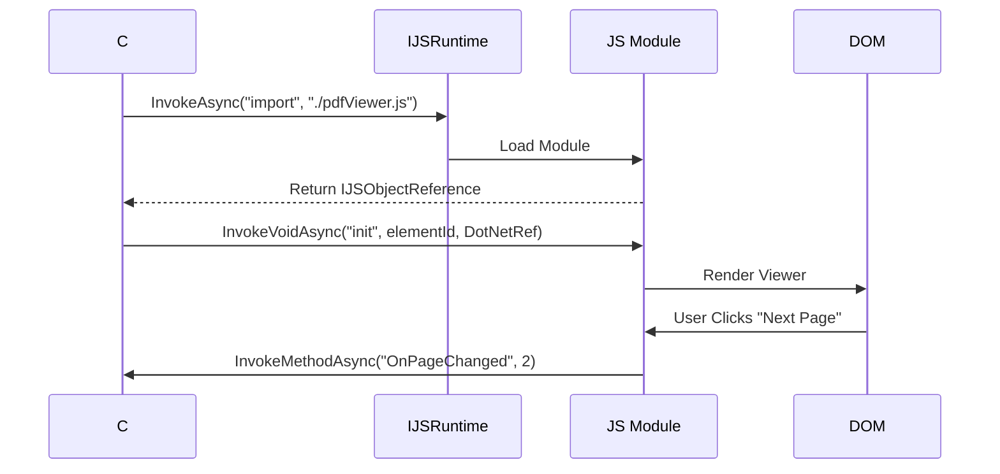

import Callout from '@components/Callout.astro';
import ImplementationNote from '@components/ImplementationNote.astro';
import CodeFile from '@components/CodeFile.astro';
import ExternalCite from '@components/ExternalCite.astro';

## Introduction

While Blazor allows us to write C# for the frontend, the reality of the web is that the ecosystem is rich with JavaScript libraries. Whether it's a complex chart, a map, or a specific browser API, robust interop is essential. It's not just about "making it work"; it's about managing memory, ensuring type safety, and handling asynchrony correctly.

**Why Proper Interop Matters:**

- **Memory Leaks**: Improper disposal of `DotNetObjectReference` or `IJSObjectReference` can crash long-running apps.
- **Performance**: Excessive marshalling between WASM/Server and JS can slow down the UI.
- **Maintainability**: encapsulating JS logic prevents "magic string" calls scattered throughout Razor components.

### What We'll Build

We will implement a wrapper for a hypothetical PDF viewer library. You will learn how to:

1.  **Load Modules**: Use dynamic importing of JS modules.
2.  **Two-way Comms**: Call JS functions and receive callbacks in C#.
3.  **Clean Up**: Implement `IAsyncDisposable` correctly.

## Architecture Overview

We use the "Module Pattern" to isolate our JS code, avoiding global scope pollution.



## Implementation

### 1. The JavaScript Module

Create an ES6 module that exports functions.

<CodeFile filename="wwwroot/js/pdfViewer.js" language="javascript">
```javascript
export function initViewer(element, dotNetRef) {
    const viewer = new ThirdPartyViewer(element);
    
    viewer.on('pagechange', (page) => {
        dotNetRef.invokeMethodAsync('OnPageChanged', page);
    });

    return {
        next: () => viewer.nextPage(),
        prev: () => viewer.prevPage(),
        dispose: () => viewer.destroy()
    };
}
```
</CodeFile>

### 2. The C# Wrapper Component

We wrap the functionality in a reusable C# class or component.

<CodeFile filename="PdfViewer.razor.cs" language="csharp">
```csharp
using Microsoft.JSInterop;

public partial class PdfViewer : IAsyncDisposable
{
    [Inject] IJSRuntime JSRuntime { get; set; }
    
    private IJSObjectReference? _module;
    private IJSObjectReference? _instance;
    private DotNetObjectReference<PdfViewer>? _selfRef;
    private ElementReference _container;

    protected override async Task OnAfterRenderAsync(bool firstRender)
    {
        if (firstRender)
        {
            _module = await JSRuntime.InvokeAsync<IJSObjectReference>(
                "import", "./js/pdfViewer.js");
                
            _selfRef = DotNetObjectReference.Create(this);
            
            _instance = await _module.InvokeAsync<IJSObjectReference>(
                "initViewer", _container, _selfRef);
        }
    }

    [JSInvokable]
    public void OnPageChanged(int page)
    {
        Console.WriteLine($"User is now on page {page}");
    }

    public async ValueTask DisposeAsync()
    {
        if (_instance != null)
        {
            await _instance.InvokeVoidAsync("dispose");
            await _instance.DisposeAsync();
        }
        
        if (_module != null)
            await _module.DisposeAsync();
            
        _selfRef?.Dispose();
    }
}
```
</CodeFile>

<Callout type="tip">
  Always implement `IAsyncDisposable`. This ensures that when the user navigates away from the page, the JavaScript side cleans up DOM event listeners and resources.
</Callout>

## Conclusion

By treating JavaScript interoperability as a first-class citizen with strict types and lifecycle management, we extend Blazor's capabilities infinitely. This pattern defines how BlueRobin integrates complex visualization tools without compromising stability.
