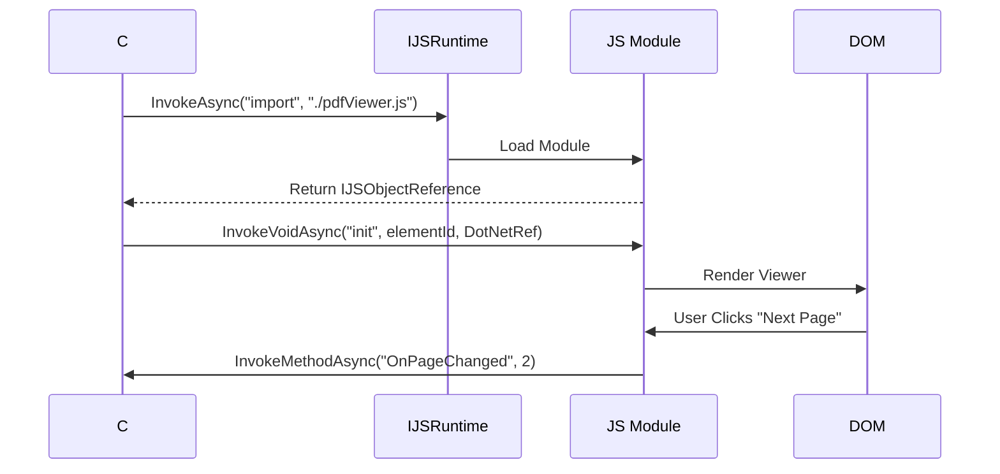

import Callout from '@components/Callout.astro';
import ImplementationNote from '@components/ImplementationNote.astro';
import CodeFile from '@components/CodeFile.astro';
import ExternalCite from '@components/ExternalCite.astro';

When I first configured JavaScript interop for our PDF viewer component, I thought it would be a quick wrapper around a third-party library. Instead, I spent days chasing a memory leak that only manifested after users opened and closed the viewer several times in a single session. The `DotNetObjectReference` instances were accumulating because I was creating new references on every parameter change instead of reusing them. That debugging session gave me a deep respect for the GC boundary between .NET and JavaScript, and it is the reason every JS interop pattern in this article emphasizes proper disposal.

## Introduction

While Blazor allows us to write C# for the frontend, the reality of the web is that the ecosystem is rich with JavaScript libraries. Whether it's a complex chart, a map, or a specific browser API, robust interop is essential. It's not just about "making it work"; it's about managing memory, ensuring type safety, and handling asynchrony correctly.

<ExternalCite title="Call JavaScript functions from .NET methods in ASP.NET Core Blazor" url="https://learn.microsoft.com/en-us/aspnet/core/blazor/javascript-interoperability/call-javascript-from-dotnet" author="Microsoft" date="2024-11-12" />

**Why Proper Interop Matters:**

- **Memory Leaks**: Improper disposal of `DotNetObjectReference` or `IJSObjectReference` can crash long-running apps.
- **Performance**: Excessive marshalling between WASM/Server and JS can slow down the UI.
- **Maintainability**: encapsulating JS logic prevents "magic string" calls scattered throughout Razor components.

### What We'll Build

We will implement a wrapper for a hypothetical PDF viewer library. You will learn how to:

1.  **Load Modules**: Use dynamic importing of JS modules.
2.  **Two-way Comms**: Call JS functions and receive callbacks in C#.
3.  **Clean Up**: Implement `IAsyncDisposable` correctly.

## Architecture Overview

We use the "Module Pattern" to isolate our JS code, avoiding global scope pollution.

<ExternalCite title="JavaScript module interop in Blazor" url="https://learn.microsoft.com/en-us/aspnet/core/blazor/javascript-interoperability/import-export-interop" author="Microsoft" date="2024-08-20" />


```mermaid
sequenceDiagram
    participant C as C# Component
    participant R as IJSRuntime
    participant J as JS Module
    participant D as DOM

    C->>R: InvokeAsync("import", "./pdfViewer.js")
    R->>J: Load Module
    J-->>C: Return IJSObjectReference

    C->>J: InvokeVoidAsync("init", elementId, DotNetRef)
    J->>D: Render Viewer

    D->>J: User Clicks "Next Page"
    J->>C: InvokeMethodAsync("OnPageChanged", 2)
```

## Implementation

### 1. The JavaScript Module

Create an ES6 module that exports functions.

<CodeFile filename="wwwroot/js/pdfViewer.js" language="javascript">
```javascript
export function initViewer(element, dotNetRef) {
    const viewer = new ThirdPartyViewer(element);

    viewer.on('pagechange', (page) => {
        dotNetRef.invokeMethodAsync('OnPageChanged', page);
    });

    return {
        next: () => viewer.nextPage(),
        prev: () => viewer.prevPage(),
        dispose: () => viewer.destroy()
    };
}
```
</CodeFile>

<ImplementationNote>
    I originally wrote the JS module using global function declarations instead of ES6 exports. This caused naming collisions when two viewer instances existed on the same page. Switching to the module pattern with `export function` resolved the scoping issue entirely, and as a bonus, Blazor's `IJSObjectReference` maps cleanly to the module import handle, making the C# side more intuitive.
</ImplementationNote>

### 2. The C# Wrapper Component

We wrap the functionality in a reusable C# class or component.

<ExternalCite title="Call .NET methods from JavaScript functions in ASP.NET Core Blazor" url="https://learn.microsoft.com/en-us/aspnet/core/blazor/javascript-interoperability/call-dotnet-from-javascript" author="Microsoft" date="2024-11-12" />

<CodeFile filename="PdfViewer.razor.cs" language="csharp">
```csharp
using Microsoft.JSInterop;

public partial class PdfViewer : IAsyncDisposable
{
    [Inject] IJSRuntime JSRuntime { get; set; }

    private IJSObjectReference? _module;
    private IJSObjectReference? _instance;
    private DotNetObjectReference<PdfViewer>? _selfRef;
    private ElementReference _container;

    protected override async Task OnAfterRenderAsync(bool firstRender)
    {
        if (firstRender)
        {
            _module = await JSRuntime.InvokeAsync<IJSObjectReference>(
                "import", "./js/pdfViewer.js");

            _selfRef = DotNetObjectReference.Create(this);

            _instance = await _module.InvokeAsync<IJSObjectReference>(
                "initViewer", _container, _selfRef);
        }
    }

    [JSInvokable]
    public void OnPageChanged(int page)
    {
        Console.WriteLine($"User is now on page {page}");
    }

    public async ValueTask DisposeAsync()
    {
        if (_instance != null)
        {
            await _instance.InvokeVoidAsync("dispose");
            await _instance.DisposeAsync();
        }

        if (_module != null)
            await _module.DisposeAsync();

        _selfRef?.Dispose();
    }
}
```
</CodeFile>

<ImplementationNote>
    The disposal order in `DisposeAsync` is critical and I got it wrong the first time. I was disposing `_module` before calling `_instance.InvokeVoidAsync("dispose")`, which threw a `JSDisconnectedException` because the module reference was already gone. The correct order is: first invoke any cleanup functions on the JS side, then dispose the instance reference, then the module reference, and finally the `DotNetObjectReference`. Getting this sequence wrong will produce errors that only appear when users navigate away from the page.
</ImplementationNote>

<ExternalCite title="IAsyncDisposable Interface" url="https://learn.microsoft.com/en-us/dotnet/api/system.iasyncdisposable" author="Microsoft" date="2024-06-15" />

<Callout type="tip">
  Always implement `IAsyncDisposable`. This ensures that when the user navigates away from the page, the JavaScript side cleans up DOM event listeners and resources.
</Callout>

<ImplementationNote>
    In production, I also had to guard the `DisposeAsync` method against `JSDisconnectedException`, which occurs when the SignalR circuit drops before disposal completes. Wrapping the JS interop calls in a try-catch that specifically catches this exception type prevents noisy error logs during deployment restarts or when users close the browser tab abruptly.
</ImplementationNote>

<ExternalCite title="Handle errors in ASP.NET Core Blazor apps" url="https://learn.microsoft.com/en-us/aspnet/core/blazor/fundamentals/handle-errors" author="Microsoft" date="2024-11-12" />

<ExternalCite title="ASP.NET Core Blazor performance best practices" url="https://learn.microsoft.com/en-us/aspnet/core/blazor/performance" author="Microsoft" date="2024-09-10" />

## Conclusion

By treating JavaScript interoperability as a first-class citizen with strict types and lifecycle management, we extend Blazor's capabilities infinitely. This pattern defines how we integrate complex visualization tools without compromising stability.

The investment in building a proper interop wrapper pays dividends across the entire application. Every subsequent JS library integration follows the same pattern: module import, `DotNetObjectReference` for callbacks, and disciplined `IAsyncDisposable` cleanup. What once felt like a fragile bridge between two worlds now feels like a reliable, well-tested integration layer. The key takeaway is that JS interop failures are almost always lifecycle issues, not logic issues, and the fix is always to respect the disposal chain.

### Next Steps

- Build a generic `JsModuleBase<T>` base class that automates module loading and disposal for any JS library.
- Implement streaming interop for large data transfers between C# and JavaScript.
- Add TypeScript declaration files to get compile-time safety on the JS method signatures.

### Further Reading


<ExternalCite title="Call JavaScript from .NET in Blazor" url="https://learn.microsoft.com/en-us/aspnet/core/blazor/javascript-interoperability/call-javascript-from-dotnet" author="Microsoft" date="2024" />

<ExternalCite title="Call .NET from JavaScript in Blazor" url="https://learn.microsoft.com/en-us/aspnet/core/blazor/javascript-interoperability/call-dotnet-from-javascript" author="Microsoft" date="2024" />

<ExternalCite title="JavaScript isolation in Blazor" url="https://learn.microsoft.com/en-us/aspnet/core/blazor/javascript-interoperability/import-export-interop" author="Microsoft" date="2024" />
