import Callout from '@components/Callout.astro';
import ImplementationNote from '@components/ImplementationNote.astro';
import CodeFile from '@components/CodeFile.astro';

## Introduction

When a user uploads a document, they shouldn't stare at a spinner wondering if anything is happening. They should see real-time progress: "OCR processing... 45%... Entity extraction... Complete!"

**The typical solution is SignalR**, but Blazor Server already uses SignalR internally for its circuit connection. Adding another SignalR layer for real-time events creates redundancy. Instead, we'll leverage our existing NATS messaging infrastructure to push updates directly to Blazor components.

### What We'll Build

In this guide, we'll implement:

1. **In-process notification service** — Decouples NATS from Blazor components
2. **NATS event listener** — Bridges external events to the notification service
3. **Base component class** — Handles subscriptions, filtering, and cleanup
4. **Document uploader** — Shows real-time upload and processing progress
5. **Live document list** — Updates automatically when documents change

### Why NATS Instead of SignalR?

- **Consistency**: Workers already publish to NATS; no need for a separate notification channel
- **Simplicity**: One messaging system instead of two
- **Scalability**: NATS handles cross-pod communication naturally; SignalR needs Redis backplane
- **Already there**: No additional infrastructure to manage

## Architecture Overview

The data flow from worker to UI:

```mermaid
flowchart LR
    Worker["⚙️ Worker\n(Publishes)"] --> NATS["⚡ NATS\n(JetStream)"]
    NATS --> Listener["👂 Listener\n(Hosted)"]
    Listener --> Notifier["📢 Notifier\n(Service)"]
    Notifier --> CompA["🟣 Component A"]
    Notifier --> CompB["🟣 Component B"]
    Notifier --> CompC["🟣 Component C"]

    style Worker fill:#512bd4,color:#fff
    style NATS fill:#27aae1,color:#fff
    style Listener fill:#512bd4,color:#fff
    style Notifier fill:#512bd4,color:#fff
    style CompA fill:#9b4dca,color:#fff
    style CompB fill:#9b4dca,color:#fff
    style CompC fill:#9b4dca,color:#fff
```



**Key insight**: The `DocumentProcessingNotifier` acts as an in-process event bus. The NATS listener translates external messages to C# events; components subscribe to only the documents they care about.

## The Notification Service

The notification service provides an in-process event aggregation layer. Components subscribe to it; they never know about NATS directly.

**Why this indirection?**
- **Testability**: Unit tests can call `NotifyDocumentUpdatedAsync` without NATS
- **Flexibility**: Could swap NATS for another source without changing components
- **Filtering**: Components subscribe to specific document IDs; the service broadcasts to all

```csharp
// Application/Services/IDocumentProcessingNotifier.cs
namespace Archives.Application.Services;

public interface IDocumentProcessingNotifier
{
    /// <summary>
    /// Event raised when a document's processing status changes.
    /// </summary>
    event Func<DocumentStatusUpdate, Task>? OnDocumentUpdated;
    
    /// <summary>
    /// Event raised for processing progress updates.
    /// </summary>
    event Func<DocumentProgressUpdate, Task>? OnProgressUpdated;
    
    /// <summary>
    /// Notifies subscribers of a document status change.
    /// </summary>
    Task NotifyDocumentUpdatedAsync(
        string documentId, 
        DocumentStatus status,
        string? message = null);
    
    /// <summary>
    /// Notifies subscribers of processing progress.
    /// </summary>
    Task NotifyProgressUpdatedAsync(
        string documentId,
        string stage,
        int percentage,
        string? detail = null);
}

public record DocumentStatusUpdate(
    string DocumentId,
    DocumentStatus Status,
    string? Message,
    DateTimeOffset Timestamp);

public record DocumentProgressUpdate(
    string DocumentId,
    string Stage,
    int Percentage,
    string? Detail,
    DateTimeOffset Timestamp);
```

### Implementation

The implementation iterates through handlers, catching exceptions to prevent one bad handler from breaking the notification chain:

```csharp
// Web/Services/DocumentProcessingNotifier.cs
namespace Archives.Web.Services;

public sealed class DocumentProcessingNotifier : IDocumentProcessingNotifier
{
    private readonly ILogger<DocumentProcessingNotifier> _logger;
    
    public event Func<DocumentStatusUpdate, Task>? OnDocumentUpdated;
    public event Func<DocumentProgressUpdate, Task>? OnProgressUpdated;
    
    public DocumentProcessingNotifier(ILogger<DocumentProcessingNotifier> logger)
    {
        _logger = logger;
    }
    
    public async Task NotifyDocumentUpdatedAsync(
        string documentId,
        DocumentStatus status,
        string? message = null)
    {
        var update = new DocumentStatusUpdate(
            documentId,
            status,
            message,
            DateTimeOffset.UtcNow);
        
        _logger.LogDebug(
            "Notifying status update: {DocumentId} -> {Status}",
            documentId,
            status);
        
        var handlers = OnDocumentUpdated;
        if (handlers is not null)
        {
            // Invoke all handlers, catching exceptions to avoid breaking the chain
            foreach (var handler in handlers.GetInvocationList()
                .Cast<Func<DocumentStatusUpdate, Task>>())
            {
                try
                {
                    await handler(update);
                }
                catch (Exception ex)
                {
                    _logger.LogError(ex, 
                        "Error in document update handler for {DocumentId}",
                        documentId);
                }
            }
        }
    }
    
    public async Task NotifyProgressUpdatedAsync(
        string documentId,
        string stage,
        int percentage,
        string? detail = null)
    {
        var update = new DocumentProgressUpdate(
            documentId,
            stage,
            Math.Clamp(percentage, 0, 100),  // Ensure valid range
            detail,
            DateTimeOffset.UtcNow);
        
        var handlers = OnProgressUpdated;
        if (handlers is not null)
        {
            foreach (var handler in handlers.GetInvocationList()
                .Cast<Func<DocumentProgressUpdate, Task>>())
            {
                try
                {
                    await handler(update);
                }
                catch (Exception ex)
                {
                    _logger.LogError(ex,
                        "Error in progress handler for {DocumentId}",
                        documentId);
                }
            }
        }
    }
}
```

<ImplementationNote>
Register the notifier as a singleton so all components and the NATS listener share the same instance. This is critical—scoped registration would create separate instances that can't communicate.
</ImplementationNote>

## NATS Event Listener

This hosted service bridges NATS events to the notification service. It uses an **ephemeral consumer** since we only care about real-time updates—if the web server restarts, we don't need to replay missed events.

```csharp
// Web/Services/NatsDocumentEventListener.cs
namespace Archives.Web.Services;

public sealed class NatsDocumentEventListener : BackgroundService
{
    private readonly INatsConnection _nats;
    private readonly IDocumentProcessingNotifier _notifier;
    private readonly ILogger<NatsDocumentEventListener> _logger;
    private readonly string _environment;
    
    public NatsDocumentEventListener(
        INatsConnection nats,
        IDocumentProcessingNotifier notifier,
        IConfiguration configuration,
        ILogger<NatsDocumentEventListener> logger)
    {
        _nats = nats;
        _notifier = notifier;
        _logger = logger;
        _environment = configuration["Environment"] ?? "dev";
    }
    
    protected override async Task ExecuteAsync(CancellationToken stoppingToken)
    {
        var js = _nats.CreateJetStreamContext();
        
        // Ephemeral consumer: unique name, short inactivity timeout, no ack required
        var consumer = await js.CreateOrUpdateConsumerAsync(
            stream: "DOCUMENTS",
            config: new ConsumerConfig
            {
                // Unique name per instance for horizontal scaling
                Name = $"web-{Environment.MachineName}-{Guid.NewGuid():N}",
                // Subscribe to all document events for this environment
                FilterSubject = $"{_environment}.archives.documents.>",
                // Only receive new messages (not replays)
                DeliverPolicy = ConsumerConfigDeliverPolicy.New,
                // Fire-and-forget: missing a notification isn't critical
                AckPolicy = ConsumerConfigAckPolicy.None,
                // Auto-cleanup when this pod dies
                InactiveThreshold = TimeSpan.FromMinutes(5)
            },
            stoppingToken);
        
        _logger.LogInformation(
            "NATS document event listener started for {Environment}",
            _environment);
        
        try
        {
            await foreach (var msg in consumer.ConsumeAsync<DocumentEventEnvelope>(
                cancellationToken: stoppingToken))
            {
                await HandleEventAsync(msg.Subject, msg.Data!, stoppingToken);
            }
        }
        catch (OperationCanceledException) when (stoppingToken.IsCancellationRequested)
        {
            _logger.LogInformation("NATS document event listener stopping");
        }
    }
```

**Event mapping**: The listener translates NATS subjects to notification calls. Subject structure is `{env}.archives.documents.{event-type}`:

```csharp
    private async Task HandleEventAsync(
        string subject,
        DocumentEventEnvelope envelope,
        CancellationToken ct)
    {
        try
        {
            // Extract event type from subject: "dev.archives.documents.ocr-completed" -> "ocr-completed"
            var eventType = subject.Split('.').Last();
            
            switch (eventType)
            {
                case "uploaded":
                    await _notifier.NotifyDocumentUpdatedAsync(
                        envelope.DocumentId,
                        DocumentStatus.Uploaded,
                        "Document uploaded successfully");
                    break;
                
                case "ocr-started":
                    await _notifier.NotifyDocumentUpdatedAsync(
                        envelope.DocumentId,
                        DocumentStatus.Processing,
                        "Starting OCR...");
                    await _notifier.NotifyProgressUpdatedAsync(
                        envelope.DocumentId,
                        "OCR",
                        0,
                        "Initializing document processor");
                    break;
                
                case "ocr-progress":
                    if (envelope.Progress is not null)
                    {
                        await _notifier.NotifyProgressUpdatedAsync(
                            envelope.DocumentId,
                            "OCR",
                            envelope.Progress.Percentage,
                            envelope.Progress.Detail);
                    }
                    break;
                
                case "ocr-completed":
                    await _notifier.NotifyProgressUpdatedAsync(
                        envelope.DocumentId,
                        "OCR",
                        100,
                        "Text extraction complete");
                    break;
                
                case "analysis-completed":
                    await _notifier.NotifyProgressUpdatedAsync(
                        envelope.DocumentId,
                        "Analysis",
                        100,
                        "AI analysis complete");
                    break;
                
                case "embedding-completed":
                    await _notifier.NotifyProgressUpdatedAsync(
                        envelope.DocumentId,
                        "Indexing",
                        100,
                        "Search index updated");
                    break;
                
                case "indexed":
                    await _notifier.NotifyDocumentUpdatedAsync(
                        envelope.DocumentId,
                        DocumentStatus.Ready,
                        "Document ready for search");
                    break;
                
                case "error":
                    await _notifier.NotifyDocumentUpdatedAsync(
                        envelope.DocumentId,
                        DocumentStatus.Error,
                        envelope.Error ?? "Processing failed");
                    break;
            }
        }
        catch (Exception ex)
        {
            _logger.LogError(ex,
                "Error handling event {Subject} for {DocumentId}",
                subject,
                envelope.DocumentId);
        }
    }
}

public record DocumentEventEnvelope
{
    public required string DocumentId { get; init; }
    public ProgressInfo? Progress { get; init; }
    public string? Error { get; init; }
}

public record ProgressInfo(int Percentage, string? Detail);
```

## Service Registration

```csharp
// Program.cs
builder.Services.AddSingleton<IDocumentProcessingNotifier, DocumentProcessingNotifier>();
builder.Services.AddHostedService<NatsDocumentEventListener>();
```

## Blazor Component Base

Now the Blazor side. We create a base component that handles the subscription boilerplate and—critically—cleanup when components dispose.

**Why cleanup matters**: Blazor Server components can be disposed at any time (navigation, circuit disconnect). Without unsubscribing, you get memory leaks and exceptions when handlers try to invoke `StateHasChanged` on disposed components.

```csharp
// Components/BlueRobinComponentBase.cs
namespace Archives.Web.Components;

public abstract class BlueRobinComponentBase : ComponentBase, IDisposable
{
    [Inject]
    protected IDocumentProcessingNotifier Notifier { get; set; } = default!;
    
    [Inject]
    protected ILogger<BlueRobinComponentBase> Logger { get; set; } = default!;
    
    private readonly List<IDisposable> _subscriptions = new();
    private bool _disposed;
    
    /// <summary>
    /// Subscribe to updates for a specific document.
    /// Automatically filters events and triggers StateHasChanged.
    /// </summary>
    protected void SubscribeToDocumentUpdates(
        string documentId,
        Func<DocumentStatusUpdate, Task> handler)
    {
        // Wrap handler to filter by document ID and trigger re-render
        async Task FilteredHandler(DocumentStatusUpdate update)
        {
            if (update.DocumentId == documentId)
            {
                await handler(update);
                await InvokeAsync(StateHasChanged);
            }
        }
        
        Notifier.OnDocumentUpdated += FilteredHandler;
        _subscriptions.Add(new EventSubscription(() => 
            Notifier.OnDocumentUpdated -= FilteredHandler));
    }
    
    /// <summary>
    /// Subscribe to progress updates for a specific document.
    /// </summary>
    protected void SubscribeToProgressUpdates(
        string documentId,
        Func<DocumentProgressUpdate, Task> handler)
    {
        async Task FilteredHandler(DocumentProgressUpdate update)
        {
            if (update.DocumentId == documentId)
            {
                await handler(update);
                await InvokeAsync(StateHasChanged);
            }
        }
        
        Notifier.OnProgressUpdated += FilteredHandler;
        _subscriptions.Add(new EventSubscription(() => 
            Notifier.OnProgressUpdated -= FilteredHandler));
    }
    
    /// <summary>
    /// Subscribe to all document updates (useful for lists).
    /// </summary>
    protected void SubscribeToAllDocumentUpdates(
        Func<DocumentStatusUpdate, Task> handler)
    {
        async Task WrappedHandler(DocumentStatusUpdate update)
        {
            await handler(update);
            await InvokeAsync(StateHasChanged);
        }
        
        Notifier.OnDocumentUpdated += WrappedHandler;
        _subscriptions.Add(new EventSubscription(() => 
            Notifier.OnDocumentUpdated -= WrappedHandler));
    }
    
    public void Dispose()
    {
        Dispose(true);
        GC.SuppressFinalize(this);
    }
    
    protected virtual void Dispose(bool disposing)
    {
        if (_disposed) return;
        
        if (disposing)
        {
            // Unsubscribe from all events
            foreach (var subscription in _subscriptions)
            {
                subscription.Dispose();
            }
            _subscriptions.Clear();
        }
        
        _disposed = true;
    }
    
    /// <summary>
    /// Helper class to track subscriptions for cleanup.
    /// </summary>
    private sealed class EventSubscription : IDisposable
    {
        private Action? _unsubscribe;
        
        public EventSubscription(Action unsubscribe) => _unsubscribe = unsubscribe;
        
        public void Dispose()
        {
            _unsubscribe?.Invoke();
            _unsubscribe = null;
        }
    }
}
```

## Document Upload Component

Now let's build a complete upload component that shows real-time progress. This component:
1. Handles file selection via drag-and-drop or file picker
2. Uploads to the API
3. Subscribes to processing events for real-time progress
4. Updates the UI as events arrive

```razor
@* Components/Documents/DocumentUploader.razor *@
@inherits BlueRobinComponentBase

<div class="space-y-4">
    @* Upload Area *@
    <div class="@DropZoneClass"
         @ondragenter="HandleDragEnter"
         @ondragleave="HandleDragLeave"
         @ondragover:preventDefault
         @ondrop="HandleDrop"
         @ondrop:preventDefault>
        
        <InputFile OnChange="HandleFileSelected" 
                   accept=".pdf,.docx,.pptx,.png,.jpg,.jpeg"
                   class="hidden"
                   id="file-input" />
        
        <label for="file-input" class="cursor-pointer flex flex-col items-center">
            <svg class="w-12 h-12 text-gray-400 mb-3" fill="none" 
                 stroke="currentColor" viewBox="0 0 24 24">
                <path stroke-linecap="round" stroke-linejoin="round" stroke-width="2"
                      d="M7 16a4 4 0 01-.88-7.903A5 5 0 1115.9 6L16 6a5 5 0 011 9.9M15 13l-3-3m0 0l-3 3m3-3v12"/>
            </svg>
            <span class="text-gray-600 dark:text-gray-300">
                Drop files here or click to browse
            </span>
            <span class="text-sm text-gray-400 mt-1">
                PDF, Word, PowerPoint, or images up to 50MB
            </span>
        </label>
    </div>
    
    @* Upload Queue *@
    @if (uploads.Count > 0)
    {
        <div class="space-y-2">
            @foreach (var upload in uploads)
            {
                <DocumentUploadCard Upload="upload" OnRemove="RemoveUpload" />
            }
        </div>
    }
</div>

@code {
    [Parameter] public string ArchiveId { get; set; } = default!;
    [Parameter] public EventCallback<string> OnUploadComplete { get; set; }
    
    private List<UploadState> uploads = new();
    private bool isDragOver;
    
    private string DropZoneClass => new CssBuilder()
        .AddClass("border-2 border-dashed rounded-xl p-8 text-center transition-colors")
        .AddClass("border-gray-300 dark:border-gray-600", !isDragOver)
        .AddClass("border-robin-blue bg-robin-blue/5", isDragOver)
        .Build();
    
    private void HandleDragEnter() => isDragOver = true;
    private void HandleDragLeave() => isDragOver = false;
    
    private async Task HandleDrop(DragEventArgs e)
    {
        isDragOver = false;
        // File handling via InputFile is more reliable
    }
    
    private async Task HandleFileSelected(InputFileChangeEventArgs e)
    {
        foreach (var file in e.GetMultipleFiles(10))
        {
            var upload = new UploadState(file.Name, file.Size);
            uploads.Add(upload);
            
            // Start upload asynchronously
            _ = UploadFileAsync(upload, file);
        }
    }
    
    private async Task UploadFileAsync(UploadState upload, IBrowserFile file)
    {
        try
        {
            upload.Status = UploadStatus.Uploading;
            StateHasChanged();
            
            // Subscribe to updates for this document
            // (DocumentId will be set after API response)
            
            using var content = new MultipartFormDataContent();
            using var stream = file.OpenReadStream(maxAllowedSize: 50 * 1024 * 1024);
            using var streamContent = new StreamContent(stream);
            
            content.Add(streamContent, "file", file.Name);
            content.Add(new StringContent(ArchiveId), "archiveId");
            
            var response = await Http.PostAsync("/api/documents/upload", content);
            response.EnsureSuccessStatusCode();
            
            var result = await response.Content.ReadFromJsonAsync<UploadResponse>();
            upload.DocumentId = result!.DocumentId;
            upload.Status = UploadStatus.Processing;
            
            // Now subscribe to NATS updates for this specific document
            SubscribeToDocumentUpdates(upload.DocumentId, update => 
            {
                upload.StatusMessage = update.Message;
                
                if (update.Status == DocumentStatus.Ready)
                {
                    upload.Status = UploadStatus.Complete;
                    OnUploadComplete.InvokeAsync(upload.DocumentId);
                }
                else if (update.Status == DocumentStatus.Error)
                {
                    upload.Status = UploadStatus.Error;
                    upload.Error = update.Message;
                }
                
                return Task.CompletedTask;
            });
            
            SubscribeToProgressUpdates(upload.DocumentId, progress =>
            {
                upload.Stage = progress.Stage;
                upload.Progress = progress.Percentage;
                upload.ProgressDetail = progress.Detail;
                return Task.CompletedTask;
            });
        }
        catch (Exception ex)
        {
            upload.Status = UploadStatus.Error;
            upload.Error = ex.Message;
            Logger.LogError(ex, "Upload failed for {FileName}", file.Name);
        }
        
        StateHasChanged();
    }
    
    private void RemoveUpload(UploadState upload)
    {
        uploads.Remove(upload);
    }
    
    [Inject] private HttpClient Http { get; set; } = default!;
}

public class UploadState
{
    public string FileName { get; }
    public long FileSize { get; }
    public string? DocumentId { get; set; }
    public UploadStatus Status { get; set; } = UploadStatus.Pending;
    public string? Stage { get; set; }
    public int Progress { get; set; }
    public string? ProgressDetail { get; set; }
    public string? StatusMessage { get; set; }
    public string? Error { get; set; }
    
    public UploadState(string fileName, long fileSize)
    {
        FileName = fileName;
        FileSize = fileSize;
    }
}

public enum UploadStatus { Pending, Uploading, Processing, Complete, Error }

public record UploadResponse(string DocumentId);
```

## Upload Card with Progress

The upload card displays file info, status, and a progress bar. The key is the progress bar that updates in real-time as events arrive:

```razor
@* Components/Documents/DocumentUploadCard.razor *@

<div class="glass-card p-4">
    <div class="flex items-center gap-4">
        @* File Icon *@
        <div class="w-10 h-10 rounded-lg bg-robin-blue/10 flex items-center justify-center">
            <FileIcon FileName="@Upload.FileName" />
        </div>
        
        @* File Info *@
        <div class="flex-1 min-w-0">
            <p class="font-medium text-gray-900 dark:text-white truncate">
                @Upload.FileName
            </p>
            <p class="text-sm text-gray-500">
                @FormatBytes(Upload.FileSize)
                @if (!string.IsNullOrEmpty(Upload.StatusMessage))
                {
                    <span class="ml-2">• @Upload.StatusMessage</span>
                }
            </p>
        </div>
        
        @* Status Indicator *@
        <div class="flex items-center gap-2">
            @switch (Upload.Status)
            {
                case UploadStatus.Pending:
                    <span class="text-gray-400">Waiting...</span>
                    break;
                    
                case UploadStatus.Uploading:
                    <div class="animate-spin w-5 h-5 border-2 border-robin-blue 
                                border-t-transparent rounded-full" />
                    <span class="text-robin-blue">Uploading</span>
                    break;
                    
                case UploadStatus.Processing:
                    <div class="animate-pulse w-5 h-5 bg-amber-400 rounded-full" />
                    <span class="text-amber-600 dark:text-amber-400">Processing</span>
                    break;
                    
                case UploadStatus.Complete:
                    <svg class="w-5 h-5 text-green-500" fill="currentColor" viewBox="0 0 20 20">
                        <path fill-rule="evenodd" 
                              d="M10 18a8 8 0 100-16 8 8 0 000 16zm3.707-9.293a1 1 0 00-1.414-1.414L9 10.586 7.707 9.293a1 1 0 00-1.414 1.414l2 2a1 1 0 001.414 0l4-4z" 
                              clip-rule="evenodd" />
                    </svg>
                    <span class="text-green-600 dark:text-green-400">Complete</span>
                    break;
                    
                case UploadStatus.Error:
                    <svg class="w-5 h-5 text-red-500" fill="currentColor" viewBox="0 0 20 20">
                        <path fill-rule="evenodd" 
                              d="M10 18a8 8 0 100-16 8 8 0 000 16zM8.707 7.293a1 1 0 00-1.414 1.414L8.586 10l-1.293 1.293a1 1 0 101.414 1.414L10 11.414l1.293 1.293a1 1 0 001.414-1.414L11.414 10l1.293-1.293a1 1 0 00-1.414-1.414L10 8.586 8.707 7.293z" 
                              clip-rule="evenodd" />
                    </svg>
                    <span class="text-red-600 dark:text-red-400">Failed</span>
                    break;
            }
            
            @* Remove Button *@
            @if (Upload.Status is UploadStatus.Complete or UploadStatus.Error)
            {
                <button @onclick="() => OnRemove.InvokeAsync(Upload)"
                        class="p-1 text-gray-400 hover:text-gray-600 rounded">
                    <svg class="w-4 h-4" fill="none" stroke="currentColor" viewBox="0 0 24 24">
                        <path stroke-linecap="round" stroke-linejoin="round" stroke-width="2" 
                              d="M6 18L18 6M6 6l12 12" />
                    </svg>
                </button>
            }
        </div>
    </div>
    
    @* Progress Bar *@
    @if (Upload.Status == UploadStatus.Processing && Upload.Progress > 0)
    {
        <div class="mt-3">
            <div class="flex justify-between text-xs text-gray-500 mb-1">
                <span>@Upload.Stage</span>
                <span>@Upload.Progress%</span>
            </div>
            <div class="h-1.5 bg-gray-200 dark:bg-gray-700 rounded-full overflow-hidden">
                <div class="h-full bg-robin-blue transition-all duration-300 rounded-full"
                     style="width: @(Upload.Progress)%" />
            </div>
            @if (!string.IsNullOrEmpty(Upload.ProgressDetail))
            {
                <p class="text-xs text-gray-400 mt-1">@Upload.ProgressDetail</p>
            }
        </div>
    }
    
    @* Error Message *@
    @if (Upload.Status == UploadStatus.Error && !string.IsNullOrEmpty(Upload.Error))
    {
        <p class="mt-2 text-sm text-red-500">@Upload.Error</p>
    }
</div>

@code {
    [Parameter, EditorRequired] public UploadState Upload { get; set; } = default!;
    [Parameter] public EventCallback<UploadState> OnRemove { get; set; }
    
    private string FormatBytes(long bytes)
    {
        string[] sizes = ["B", "KB", "MB", "GB"];
        double len = bytes;
        int order = 0;
        while (len >= 1024 && order < sizes.Length - 1)
        {
            order++;
            len /= 1024;
        }
        return $"{len:0.##} {sizes[order]}";
    }
}
```

## Document List with Live Updates

Finally, a document list that updates in real-time when new documents are added or statuses change. This uses `SubscribeToAllDocumentUpdates` since it needs to react to any document, not just a specific one:

```razor
@* Components/Documents/DocumentList.razor *@
@inherits BlueRobinComponentBase
@implements IAsyncDisposable

<div class="space-y-4">
    @foreach (var doc in documents)
    {
        <DocumentCard Document="doc" />
    }
    
    @if (documents.Count == 0)
    {
        <div class="text-center py-12 text-gray-500">
            <p>No documents yet</p>
        </div>
    }
</div>

@code {
    [Parameter] public string ArchiveId { get; set; } = default!;
    
    private List<DocumentViewModel> documents = new();
    
    protected override async Task OnInitializedAsync()
    {
        // Load initial documents
        documents = await LoadDocumentsAsync();
        
        // Subscribe to all document updates for this archive
        SubscribeToAllDocumentUpdates(async update =>
        {
            var doc = documents.FirstOrDefault(d => d.Id == update.DocumentId);
            
            if (doc is not null)
            {
                // Update existing document
                doc.Status = update.Status;
                doc.UpdatedAt = update.Timestamp;
            }
            else if (update.Status == DocumentStatus.Uploaded)
            {
                // New document - refresh list
                documents = await LoadDocumentsAsync();
            }
        });
    }
    
    private async Task<List<DocumentViewModel>> LoadDocumentsAsync()
    {
        var response = await Http.GetFromJsonAsync<DocumentListResponse>(
            $"/api/archives/{ArchiveId}/documents");
        return response?.Documents ?? new();
    }
    
    [Inject] private HttpClient Http { get; set; } = default!;
    
    public async ValueTask DisposeAsync()
    {
        // BlueRobinComponentBase.Dispose handles unsubscription
        Dispose();
        await ValueTask.CompletedTask;
    }
}
```

<Callout type="tip">
By subscribing to updates at the component level, each component receives only the updates it needs. The NATS listener broadcasts to all subscribers, and filtering happens in the component—simple and efficient.
</Callout>

## Conclusion

We've built a complete real-time update system for Blazor Server that leverages existing NATS infrastructure:

| Component | Purpose |
|-----------|---------|
| **IDocumentProcessingNotifier** | In-process event aggregation |
| **NatsDocumentEventListener** | Bridges NATS → notification service |
| **BlueRobinComponentBase** | Subscription management + cleanup |
| **DocumentUploader** | Real-time upload + processing progress |
| **DocumentList** | Live list updates |

**Key patterns:**

- **Event filtering**: Components subscribe to specific document IDs; filtering happens locally
- **Automatic cleanup**: Base component disposes subscriptions to prevent memory leaks
- **Fire-and-forget NATS**: No acks needed for UI notifications; missed events aren't critical
- **InvokeAsync(StateHasChanged)**: Always marshal UI updates to the Blazor synchronization context

This approach keeps the architecture simple: one messaging system (NATS) for both backend workers and frontend notifications, no SignalR hubs to configure, no Redis backplane for scaling.

**Next in the series**: We'll build **advanced form components** with validation, error states, and glass morphism styling.
