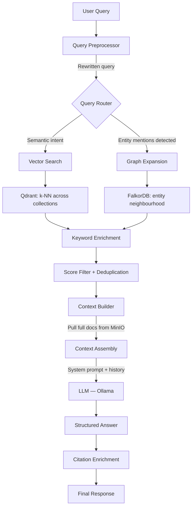

import Callout from '@components/Callout.astro';
import ImplementationNote from '@components/ImplementationNote.astro';
import CodeFile from '@components/CodeFile.astro';
import ExternalCite from '@components/ExternalCite.astro';

There is a specific kind of frustration that comes from searching your own documents and failing. You know the answer is there. You uploaded it. You remember roughly when you got it. But keyword search returns nothing because you didn't use the exact phrase, and the document is 40 pages of structured medical data with one relevant line buried in section 3.2.

That's the retrieval problem BlueRobin is designed to solve. Not with a better keyword index — with a retrieval architecture that understands meaning, connects entities across documents, and builds context the way a human researcher would: by pulling together every relevant fragment and presenting a synthesised answer.

This article covers how that retrieval pipeline works from query to answer.

## Why Simple Vector Search Isn't Enough

Pure semantic search — embed the query, find the nearest chunks — gets you 70% of the way there. The remaining 30% is where most of the hard questions live.

**Structural questions** can't be answered by similarity alone. "Which doctor ordered my last MRI?" requires knowing that an MRI appears in one document and was ordered by a physician entity who appears in another. No amount of embedding captures that relationship.

**Precision-recall tension.** A semantic search for "annual blood panel results" returns chunks that *talk about* blood panels — clinical guidelines, form headers, unrelated mentions. What you want is the chunk that *is* the result. Embeddings don't distinguish between a document about X and the document that *is* X.

**Multi-document synthesis.** "What has changed in my insurance coverage over the past three years?" requires reading three separate policy documents and identifying the differences. No single chunk retrieval answers this.

BlueRobin's retrieval pipeline addresses each of these with a multi-stage approach.

## The Retrieval Architecture



## Stage 1 — Query Preprocessing

Before the query touches the vector database, it goes through an optional rewriting pass. This step:

- Expands abbreviations and domain shorthand ("MRI" → "magnetic resonance imaging MRI")
- Resolves pronoun references in multi-turn conversations ("what about that one?" → repeats previous subject)
- Reformulates vague queries into more specific semantic forms ("what did my doctor say" → "what was the physician's assessment or recommendation")

Preprocessing is LLM-driven and runs only when a confidence check suggests the raw query is likely to underperform. Short, specific queries skip it entirely.

## Stage 2 — Query Routing

The router classifies the query intent to decide the retrieval strategy:

| Intent type | Routing decision |
|---|---|
| Pure semantic | Vector search only |
| Entity-anchored | Graph expansion + vector search |
| Structural/relational | Graph traversal first, vector to fill gaps |
| Multi-document | Broad vector retrieval across many chunks |

Entity detection checks the query against the user's canonical entity graph. If the query mentions "Dr. Mehta", "HDFC insurance", or "my mortgage" and those entities exist in the graph, the router flags it as entity-anchored and seeds the graph expansion step with the matched entity IDs.

<ImplementationNote title="Routing is imperfect — that's fine">
I spent too long trying to make the router perfectly accurate. The marginal cost of running graph expansion on a query that didn't actually need it is low — a single FalkorDB hop query takes under 5ms. I eventually set the threshold for graph activation very low, preferring to over-expand and let the context builder deal with irrelevant graph context, rather than miss genuinely useful structural information.
</ImplementationNote>

## Stage 3 — Vector Search with Multi-Model Fusion

BlueRobin indexes every document chunk in eight Qdrant collections, one per embedding model. Each model was selected to cover a different retrieval axis:

| Model | Dimensions | Retrieval strength |
|---|---|---|
| nomic-embed-text-v1.5 | 768 | General-purpose semantic similarity |
| mxbai-embed-large | 1024 | Long-form document similarity |
| snowflake-arctic-embed | 1024 | Domain-specific technical content |
| bge-large | 1024 | Multilingual content |
| granite-embedding | 768 | Lightweight general purpose |
| all-minilm-l6-v2 | 384 | Fast retrieval for broad candidate sets |
| bge-m3 | 1024 | Multilingual dense retrieval |
| paraphrase-multilingual-mpnet | 768 | Cross-lingual paraphrase matching |

For a given query, each model generates a query embedding, retrieves the top-K most similar chunks from its collection, and returns a ranked list. The ensemble step combines these lists using **Reciprocal Rank Fusion (RRF)**:

```
score(chunk) = Σ (weight_model × 1 / (60 + rank_model))
```

The constant 60 is the standard RRF smoothing factor. Chunks that appear near the top of multiple model rankings accumulate high scores; chunks ranked highly by only one model score lower. This naturally filters out false positives that a single model might overconfidently surface.

<ExternalCite
  title="Reciprocal Rank Fusion outperforms Condorcet and individual Rank Learning Methods"
  url="https://dl.acm.org/doi/10.1145/1571941.1572114"
  author="Cormack, Clarke, Buettcher"
  date="2009"
/>

All vector searches carry a mandatory `user_id` filter. The Qdrant payload filter runs before the approximate nearest-neighbour search, ensuring strict data isolation — no user's chunks are ever candidates for another user's query.

## Stage 4 — Keyword Enrichment

Semantic search degrades for content that is highly structured and identification-specific. A query for "policy number HTR-8821" should find the chunk that contains that string, but embedding similarity between the query string and a chunk containing "Policy No.: HTR-8821" is surprisingly low — the models weren't trained to treat these as near-identical.

A keyword enrichment pass scans the top candidate chunks for a set of detail-aware patterns: policy numbers, registration numbers, patient IDs, dates, and other structured identifiers. Chunks that match these patterns get a score boost, and the enriched results are merged back into the ranked list.

This hybrid approach — semantic for meaning, keyword for precision — consistently outperforms either alone for the kind of documents that appear in personal archives.

## Stage 5 — Graph Expansion

For entity-anchored queries, the retrieval pipeline fetches the neighbourhood of matched entities from FalkorDB:

```cypher
MATCH (target:ENTITY {id: $entityId, user_id: $userId})
  -[r*1..2]-(related:ENTITY)
RETURN target, r, related
ORDER BY related.confidence DESC
LIMIT 25
```

This two-hop traversal pulls:
- Direct relationships: "Dr. Mehta works for Sunrise Clinic"
- Document co-occurrence: "Documents that also mention the same insurer"
- Related entity types: "Other physicians at the same clinic"

The graph results are converted into structured context strings:

```
Entity: Dr. Rahul Mehta (Physician, confidence: 0.87)
  → WORKS_FOR: Sunrise Medical Centre (confidence: 0.80)
  → TREATED: [You, as patient] — 4 documents
  → CO_MENTIONED_WITH: Metformin (medication), Fasting glucose (investigation)
  → Source documents: Annual Blood Panel 2024, GP Referral Letter 2023, Insurance Claim #4421
```

These structured descriptions are injected into the context window alongside retrieved text chunks. They give the LLM structural information it cannot derive from text similarity alone.

## Stage 6 — Context Assembly

The context builder is where retrieval strategy meets generation quality. Raw chunk text is rarely sufficient for a good LLM response — the chunks are fragments, stripped of surrounding structure, often referencing entities that haven't been named in that specific passage.

BlueRobin's context builder enriches each chunk in several ways:

1. **Full document content**: For the top-scoring documents (not just the matching chunks), it fetches the complete Markdown content from MinIO. This recovers context that was split across chunk boundaries.

2. **Metadata header**: Each document's context section is prefixed with its friendly name, category, upload date, and any structured properties from its entity type. The LLM knows it's reading "Annual Blood Panel — March 2024" not "chunk_47_doc_8821".

3. **Graph context**: Entity neighbourhood descriptions are appended as a structured section after the document content.

4. **Conversation history**: Multi-turn queries include prior exchange turns so the LLM can understand anaphoric references and follow-up questions.

The assembled context is truncated to `MaxContextLength` (default 8000 tokens) with the highest-scoring material prioritised. Over-long contexts reduce answer quality and increase latency.

<Callout type="info" title="Full documents outperform chunk-only context">
Early benchmarks on BlueRobin's own archive compared chunk-only context vs. full document context for answer generation. Full document context improved answer completeness by ~35% — particularly on documents where the relevant information spanned multiple structural sections. The MinIO fetch adds 40–80ms per document but the answer quality gain is consistent enough to make it the default for all but the highest-latency budgets.
</Callout>

## Stage 7 — Answer Generation

The LLM call uses a structured output schema so responses are machine-parseable:

```csharp
public class StructuredRagAnswer
{
    public string Answer { get; set; }
    public string Confidence { get; set; }    // "high" | "medium" | "low"
    public List<string> RelevantDocumentIds { get; set; }
}
```

The system prompt includes the current date, the user's locale and language preference, retrieval mode, and a citation instruction that asks the LLM to reference documents by their friendly names rather than IDs. The answer, once generated, is enriched on the server side with full document metadata so the UI can display clickable citations with relevance scores.

```csharp
public class RagQueryResponse
{
    public string Answer { get; set; }
    public string? AnswerConfidence { get; set; }
    public List<RagCitationDto> Citations { get; set; }
    public List<RagDocumentDto> RelevantDocuments { get; set; }
    public int TotalChunksRetrieved { get; set; }
    public int ChunksUsedInContext { get; set; }
    public int ModelsUsed { get; set; }
    public long ExecutionTimeMs { get; set; }
}
```

Every response includes `TotalChunksRetrieved` vs. `ChunksUsedInContext` — a transparency signal showing how much of the retrieved material actually made it into the context window.

## Multi-Turn Conversations

Retrieval doesn't reset between turns. Each follow-up message:

1. Inherits the entity context from the previous turn
2. Passes conversation history to the LLM
3. Re-runs retrieval with the new query but seeds the graph expansion from entities mentioned in prior turns

This means a conversation like:

> "What was my blood glucose result in March 2024?"
> "How does that compare to the year before?"
> "Was the doctor concerned about it?"

...stays contextually coherent without you needing to restate the subject in each message. The entity anchoring persists across turns.

## Query Modes

BlueRobin exposes three retrieval modes to trade off speed against completeness:

| Mode | Behaviour | Use case |
|---|---|---|
| `Full` | All 8 models + graph expansion + full doc context + LLM | Deep research questions |
| `SingleModel` | Fastest embedding model + LLM | Quick lookups |
| `SearchOnly` | Any model + no LLM call | Preview: "what documents match?" |

`SearchOnly` is used by the UI's inline search to show document previews before you commit to a full RAG query.

## End-to-End: An Example

**Query**: "What medication was my cardiologist monitoring in 2023?"

1. **Preprocess**: Query is well-formed, no rewriting needed.
2. **Route**: "cardiologist" matches a canonical entity in the graph — entity-anchored routing.
3. **Vector search**: `nomic-embed-text` and `bge-large` retrieve chunks from 3 cardiology-related documents.
4. **Graph expansion**: The cardiologist entity's neighbourhood includes a medication entity "Bisoprolol" and a diagnosis entity "Arrhythmia", both connected to the same encounter documents.
5. **Context assembly**: Full text of the 3 encounter documents + graph context: "Dr. Santos (Cardiologist) → PRESCRIBED → Bisoprolol 2.5mg".
6. **LLM**: Generates answer citing the Cardiology Follow-Up letter from April 2023 with `confidence: high`.

The total time from query submission to answer: approximately 2.1 seconds.

## Conclusion

BlueRobin's retrieval pipeline is not a RAG wrapper around a vector database. It is a multi-stage system where preprocessing, routing, multi-model fusion, graph expansion, and full-document context assembly each contribute meaningfully to answer quality.

The three articles in this series follow the complete data flow: OCR and analysis convert raw files into text, the knowledge graph extracts and connects the entities within that text, and this retrieval pipeline uses both the text and the graph to answer questions that neither source could answer alone.

The documents have always contained the answers. Getting them reliably requires treating language, structure, and relationships as equally important dimensions of the retrieval problem.

**In this series:**
- Part 1 — [Document Archives: From Raw Upload to Searchable Intelligence](/blog/bluerobin-features-document-archives-ocr)
- Part 2 — [Knowledge Graph & Entity Modelling: How BlueRobin Connects the Dots](/blog/bluerobin-features-knowledge-graph-entity-modelling)
