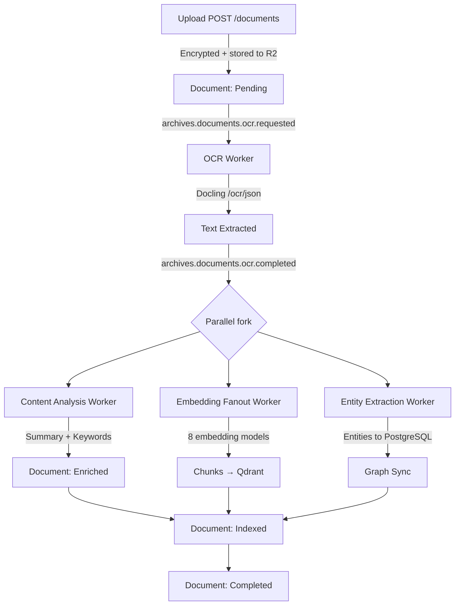

import Callout from '@components/Callout.astro';
import ImplementationNote from '@components/ImplementationNote.astro';
import CodeFile from '@components/CodeFile.astro';
import ExternalCite from '@components/ExternalCite.astro';

Every family accumulates an enormous number of documents over a lifetime. Insurance policies, medical reports, tax returns, bank statements, vaccination records, mortgage paperwork. They exist in drawers, inboxes, phone photos, and USB drives — never where you need them when you need them. When I started building BlueRobin, the core promise was simple: upload once, find anything. But delivering that promise required solving a much harder problem than file storage. A document is not just bytes. It has language, meaning, structure, and relationships. BlueRobin's archive pipeline turns raw uploads into structured knowledge.

This article walks through everything that happens from the moment you click upload to the moment a document becomes fully searchable.

## What the Archive Is

BlueRobin assigns every user exactly one archive. This isn't a folder structure or a bucket of files — it is a first-class domain aggregate that owns a collection of documents, enforces limits (1000 documents per archive currently), and is always resolved automatically from the JWT. You never pass an archive ID; the server derives it from your authenticated identity.

Each document within the archive carries:

- **Metadata**: filename, file size, MIME type, SHA-256 fingerprint, upload timestamp
- **Analysis**: OCR'd text, translated text, AI-generated summary, keywords, and a friendly name
- **Classification**: document category (Medical, Financial, Legal, etc.) and document type
- **Status**: where the document sits in the processing pipeline

Documents are stored as objects in **Cloudflare R2**, keyed by user and archive (`{userId}/{archiveId}/…`). Encryption happens in the application *before* upload: each document is sealed with a per-user data key derived via HKDF-SHA256 and encrypted with AES-256-GCM (per-user envelope encryption). R2 only ever holds ciphertext, so even though all users share a bucket, no cross-contamination is possible at the storage layer (ADR-006).

<Callout type="info" title="Fingerprint deduplication">
BlueRobin computes a SHA-256 fingerprint per document and stores it in both PostgreSQL and R2 object metadata. Uploading the same file twice is silently rejected before any processing begins. Identical content under different filenames is caught the same way.
</Callout>

## The Processing Pipeline

Document processing is fully event-driven over NATS JetStream. Uploading a document only creates the record and schedules work — it doesn't block. The response returns immediately with the document ID and a `Pending` status. From that point, the pipeline runs asynchronously and pushes real-time status updates to the Blazor UI as each stage completes.



The pipeline is idempotent. NATS JetStream deduplicates events by message ID using a KV store, so a worker crash and restart will not reprocess a document twice.

## Stage 1 — OCR with Docling

Text extraction runs against a self-hosted [Docling](https://github.com/DS4SD/docling) service. Docling was chosen because it handles structure-preserving OCR — it doesn't just dump raw text; it outputs Markdown that preserves headings, tables, and lists from the original layout.

**Supported input formats:**
- PDF (including scanned PDFs with embedded images)
- Images: PNG, JPEG, TIFF, WebP
- Office: DOCX, XLSX, PPTX
- HTML, plain text

The OCR result is stored as Markdown at `processed/{documentId}/content.md` under the user's prefix in R2.

```csharp
public record OcrResult(
    string Markdown,
    string Language,
    string LanguageName,
    string? TranslatedMarkdown,
    int Pages
);
```

<ExternalCite
  title="Docling: An efficient and accurate document conversion toolkit"
  url="https://github.com/DS4SD/docling"
  author="IBM Research"
  date="2024"
/>

## Stage 2 — Language Detection and Auto-Translation

This was a feature I hadn't planned but turned out to be one of the most useful. My family accumulates documents in French, Spanish, and English. Without translation, semantic search across languages was essentially broken — an English query wouldn't match a French document regardless of how good the embeddings were.

Docling returns an ISO 639-1 language code with every extraction. If the detected language is not English, BlueRobin automatically sends the Markdown through an LLM translation pass and stores the result at `processed/{documentId}/translated.md`.

All downstream stages — entity extraction, embedding, RAG context building — prefer the translated content where available. The original is always preserved.

<ImplementationNote title="Translation quality matters more than speed">
I initially tried to skip translation for "well-supported" languages, thinking the multilingual embedding models would handle cross-language search adequately. They don't. A French insurance policy queried with "what is my deductible" returns near-zero similarity. Translating first and embedding the English output gave dramatically better retrieval results, even with the same models. The extra latency (2–4 seconds per document) is worth it.
</ImplementationNote>

## Stage 3 — AI Content Analysis

Once OCR completes, a Content Analysis worker runs three LLM calls against the extracted text:

1. **Summary**: A 3–5 sentence plain-language summary of what the document contains. This appears in the document card in the UI and as context in RAG queries.
2. **Keywords**: 5–10 domain-specific terms extracted from the document. These supplement vector search for exact-match retrieval of structured content like policy numbers and registration codes.
3. **Friendly name**: A human-readable label generated from the content. `scan_2024_03_11_143022.pdf` becomes `Dr. Mehta — Annual Blood Panel — March 2024`.

These three values are written back to the document record in PostgreSQL and updated in Qdrant as chunk payload metadata, so every search result can surface the friendly name rather than the raw filename.

```csharp
public record DocumentAnalysis
{
    public string Summary { get; init; }
    public IReadOnlyList<string> Keywords { get; init; }
    public string TextContent { get; init; }
    public string? TranslatedContent { get; init; }
    public string? DetectedLanguage { get; init; }
    public string? FriendlyName { get; init; }
}
```

## Stage 4 — Embedding and Indexing

The embedding pipeline fans out across multiple models in parallel. Each model gets its own NATS subject (`archives.embeddings.{modelId}`) and its own Qdrant collection.

Before embedding, the document text is split into semantic chunks. BlueRobin stores three chunk types per document:

| Chunk type | Content | Purpose |
|---|---|---|
| `Title` | Friendly name + filename | Boosts title-matching |
| `Summary` | AI-generated summary | Coarse retrieval |
| `Content` | Overlapping semantic windows | Fine-grained passage retrieval |

Each Qdrant point carries a payload with `document_id`, `user_id`, `archive_id`, `file_name`, `friendly_name`, `keywords`, and `chunk_index`. The `user_id` filter enforces data isolation — every vector search query carries a mandatory filter so a user can only retrieve their own chunks.

An aggregator worker waits for all embedding models to confirm completion before marking the document as `Completed`. If any model fails, the document moves to an `EmbeddingFailed` status and retries automatically.

## Document Status Lifecycle

```
Pending → ContentExtracted → Enriched → Indexed → Completed
                                                 ↘ Failed (any stage)
```

The status is pushed to the Blazor UI in real time via an in-process notification bus bridged from NATS. You can watch a document progress through the pipeline within seconds of uploading it.

<Callout type="tip" title="What Completed actually means">
A document reaches Completed only when OCR, analysis, entity extraction, and all embedding models have confirmed success. A document can be searched at the Indexed stage (embeddings done, analysis done) but won't appear in the knowledge graph until entity extraction and graph sync complete.
</Callout>

## File Storage Layout

```
bluerobin-prod/  (R2 bucket — objects stored as ciphertext)
└── {userId}/{archiveId}/
    ├── {documentId}/{filename}                  ← original uploaded file
    ├── {documentId}/fingerprint.txt             ← SHA-256 hash
    ├── processed/{documentId}/content.md        ← OCR'd Markdown
    ├── processed/{documentId}/translated.md     ← English translation (if needed)
    ├── processed/{documentId}/summary.txt       ← AI summary
    └── thumbnails/{documentId}/{page}.png       ← page previews
```

Everything under `processed/` is generated and can be regenerated by replaying the OCR event. The original file is the source of truth.

## Conclusion

The archive pipeline transforms a raw file into a rich, searchable record in under 30 seconds for most documents. OCR extracts structure-preserving Markdown, language detection and translation make multilingual documents first-class citizens, AI analysis generates summaries and keywords, and the embedding pipeline indexes every chunk across multiple models for semantic search.

This pipeline is the foundation everything else in BlueRobin builds on. Entities can only be extracted from text. Search can only be semantic if embeddings exist. The quality of what happens downstream is entirely determined by the quality of what the archive pipeline produces.

The hardest lesson from building this pipeline was that idempotency is not optional in an event-driven architecture — it is the architecture. Early on, a NATS redelivery would re-trigger OCR and re-emit downstream events, causing duplicate embeddings in Qdrant and duplicate entities in FalkorDB. Adding fingerprint-based deduplication at the document level and NATS KV-based event deduplication at the worker level finally made the pipeline reliable under retries. The second lesson was that OCR quality varies wildly by document type: scanned handwritten forms produce noisy Markdown that confuses the summarization model. I now run a confidence-score heuristic after OCR and fall back to a simpler extraction path for low-confidence pages, which improved downstream analysis accuracy significantly.

### Next Steps

- **[Docling OCR Integration in .NET](/articles/docling-ocr-dotnet-integration)** -- the implementation details behind the OCR stage of this pipeline.
- **[Multi-Model Embedding Pipeline](/articles/embedding-pipeline-ollama-qdrant)** -- how the 8 embedding models process the chunks produced by OCR.
- **[Cloudflare R2 + Per-User Envelope Encryption](/articles/cloudflare-r2-envelope-encryption)** -- the app-layer encryption architecture that protects every uploaded file.

### Further Reading

<ExternalCite
  title="Docling: An Efficient Document Understanding Library"
  url="https://ds4sd.github.io/docling/"
  author="IBM Research"
  date="2024"
/>

<ExternalCite
  title="Cloudflare R2 Object Storage"
  url="https://developers.cloudflare.com/r2/"
  author="Cloudflare"
  date="2024"
/>

<ExternalCite
  title="OCR State of the Art: A Survey"
  url="https://arxiv.org/abs/2401.05418"
  author="Subramani et al."
  date="2024"
/>

**In this series:**
- Part 2 — [Knowledge Graph & Entity Modelling: How BlueRobin Connects the Dots](/articles/bluerobin-features-knowledge-graph-entity-modelling)
- Part 3 — [Advanced Retrieval: Combining Embeddings and Graph Context](/articles/bluerobin-features-advanced-search-retrieval)
