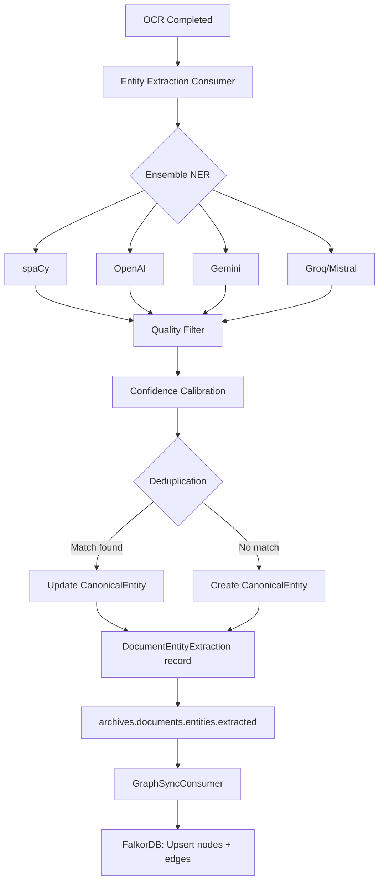

import Callout from '@components/Callout.astro';
import ImplementationNote from '@components/ImplementationNote.astro';
import CodeFile from '@components/CodeFile.astro';
import ExternalCite from '@components/ExternalCite.astro';

Documents don't exist in isolation. A blood panel report mentions a doctor's name. A letter from that doctor references a clinic. The clinic appears on an insurance claim. The claim references a policy number that links to an insurer. None of those connections live in any single document — they span years of paperwork, often described in inconsistent or abbreviated ways. A document archive that treats each file as an island misses everything interesting.

BlueRobin builds a knowledge graph from every document in the archive. As each document is processed, entities — people, organisations, locations, dates, medical concepts, financial terms — are extracted, deduplicated against what's already known, and stored in a property graph. Over time, the graph becomes a structural map of your life as documented on paper.

This article covers how that extraction pipeline works, how entities are modelled, and what the graph enables.

## Why Ensemble NER?

Named entity recognition is a solved problem in isolation. Every major model provider offers it. The problem is that no single provider is uniformly good across all entity types and domains. A general-purpose NLP model is accurate for PERSON and ORG but misses domain-specific labels like DIAGNOSIS or POLICY_NUMBER. A medical NER model excels at clinical concepts but ignores financial entities.

BlueRobin uses an ensemble of four NER providers per document:

| Provider | Strength |
|---|---|
| spaCy | Fast, high-precision standard entities (PERSON, ORG, DATE, GPE) |
| OpenAI | Broad context, good at implicit relationships and long-form documents |
| Gemini | Strong multilingual and medical domain coverage |
| Groq/Mistral | Fast inference for verification pass |

Each provider runs independently and returns a list of candidate entities with confidence scores. The results are merged, quality-filtered (minimum length, confidence floor), and then passed through a deduplication step before any entity is written to the database.

<ExternalCite
  title="A Survey on Named Entity Recognition: Past, Present, and Future"
  url="https://arxiv.org/abs/2401.00069"
  author="Xu et al."
  date="2024"
/>



## The Canonical Entity Model

Raw NER output is noisy. "Dr. Mehta", "Dr. R. Mehta", "Rahul Mehta", and "R. Mehta MD" may all refer to the same person in different documents. The canonical entity model resolves these into a single record with aliases.

```csharp
public class CanonicalEntity : AggregateRoot
{
    public BlueRobinId EntityTypeId { get; }
    public BlueRobinId UserId { get; }
    public string DisplayName { get; }
    public string Properties { get; }     // JSONB: type-specific fields
    public List<string> Aliases { get; }  // All surface forms seen
    public List<string> SourceDocumentIds { get; }
    public decimal AggregateConfidence { get; }
    public EntityReviewStatus ReviewStatus { get; }
    public float[]? Embedding { get; }    // Stored in Qdrant, not PostgreSQL
    public BlueRobinId? MergedIntoEntityId { get; }
}
```

The `AggregateConfidence` accumulates across every document that mentions the entity. An entity seen with 0.7 confidence in three separate documents has a much higher aggregate confidence than one seen once at 0.9. This drives automated acceptance:

| Aggregate confidence | Action |
|---|---|
| < 0.4 | `PendingReview` — needs manual confirmation |
| 0.4 – 0.75 | `AutoAccepted` — queued for review but usable |
| > 0.75 | `Verified` — treated as ground truth |

Entities that are `Verified` with external web search enrichment get a `WebEnriched` status. For a verified doctor entity, for example, a background web search via Tavily can populate a `specialty`, `clinic_affiliation`, and `contact` property — information inferred and confirmed from public sources.

<ImplementationNote title="The alias problem is harder than it looks">
My first attempt at deduplication used exact string matching on the display name, normalised to lowercase. That missed 40% of duplicates. The second attempt used Levenshtein distance with a threshold of 2. Better, but it merged "Dr. Martinez" and "Dr. Morris" in a short document. The current approach combines name similarity scoring, entity type matching, and — for entities with embeddings — cosine similarity in the 768-dimensional space. All three signals must agree before an automatic merge is performed. Borderline cases go to `PendingReview`.
</ImplementationNote>

## Entity Types: A Dynamic Taxonomy

Entity types in BlueRobin are not hardcoded. They form a hierarchical taxonomy that grows as your document collection grows.

```
Medical/
├── Professional/
│   ├── Physician
│   └── Specialist
├── Condition/
│   ├── Diagnosis
│   └── Symptom
└── Investigation/
    ├── BloodReport
    └── Imaging

Financial/
├── Institution/
│   ├── Bank
│   └── Insurer
└── Document/
    ├── Policy
    └── Transaction

Legal/
├── Person/
│   ├── Notary
│   └── Solicitor
└── Document/
    ├── Contract
    └── Deed
```

Each `EntityType` can carry an optional JSON schema that defines structured properties for that type. A `Policy` entity type might specify `policy_number`, `effective_date`, `coverage_limit`, and `insurer` as typed fields. When an entity of that type is created, those fields are populated from extraction and stored in the `Properties` JSONB column.

User-defined types sit alongside system-defined types, allowing the taxonomy to extend into domains BlueRobin doesn't know about at build time.

## The FalkorDB Graph

After PostgreSQL is updated, a `GraphSyncConsumer` subscribes to `archives.documents.entities.extracted` and propagates the entity data into FalkorDB. FalkorDB is a Redis module that implements a Cypher-compatible property graph — it was chosen for homelab deployment because it runs as a single StatefulSet on Kubernetes with no external dependencies.

**Node types in the graph:**

```cypher
-- Entity node
(e:ENTITY {
  id: "abc12345",
  name: "Dr. Rahul Mehta",
  type: "Medical/Professional/Physician",
  confidence: 0.87,
  verification: "VERIFIED",
  user_id: "xyz99999"
})

-- Document node
(d:DOCUMENT {
  id: "doc67890",
  name: "Annual Blood Panel — March 2024",
  type: "Medical/Investigation/BloodReport",
  user_id: "xyz99999"
})
```

**Relationship types:**

```cypher
-- Entity appears in a document
(e)-[:EXTRACTED_FROM {confidence: 0.87, source_text: "Dr. Mehta"}]->(d)

-- Entity relationships discovered across documents
(doctor)-[:WORKS_FOR {confidence: 0.8, evidence: "...affiliated with..."}]->(clinic)
(patient)-[:TREATED_BY {confidence: 0.9}]->(doctor)
(policy)-[:ISSUED_BY {confidence: 0.95}]->(insurer)
```

Relationship extraction is currently driven by the LLM: given two entities and the passage of text that mentions both, the LLM is asked to classify the relationship type and provide supporting evidence text. That evidence is stored as a relationship property, which means every edge in the graph is traceable back to a specific document passage.

## What the Graph Enables

The graph is queryable independent of text search. A few things this unlocks:

**Document clustering by entity.** "Show me all documents that mention Dr. Mehta" becomes a graph traversal (`MATCH (d:DOCUMENT)-[:EXTRACTED_FROM]-(e:ENTITY {name: "Dr. Mehta"})`) rather than a keyword search. This catches documents where the doctor is mentioned by role or abbreviation but not full name.

**Entity connection discovery.** "What connects my financial advisor to my insurance policy?" returns a shortest-path result through the graph:

```cypher
MATCH path = shortestPath(
  (a:ENTITY {name: "James Okafor"})-[*..6]-(b:ENTITY {name: "Policy #HTR-8821"})
)
WHERE ALL(n IN nodes(path) WHERE n.user_id = $userId)
RETURN path
```

**Cross-document timeline construction.** Date entities anchor events. People and organisations link across those events. The graph can surface "every document involving your mortgage lender in 2023" without requiring those documents to share any common phrasing.

**RAG context enrichment.** When a search query mentions a known entity, the retrieval pipeline expands the graph neighbourhood of that entity — pulling in related entities, their document set, and the relationships between them — and injects that structural context alongside the vector-retrieved passages. This is covered in detail in Part 3.

<Callout type="warning" title="Graph quality depends on OCR quality">
The knowledge graph is only as good as the text it's built from. Poor OCR — degraded photocopies, low-resolution photos, handwritten forms — produces garbled text that the NER providers interpret unpredictably. BlueRobin flags low-confidence entities from documents with detected OCR quality issues for mandatory human review. Accepting an incorrectly merged entity is harder to fix than reviewing it upfront.
</Callout>

## Entity Review Interface

All entities in `PendingReview` status are surfaced in the BlueRobin UI. For each entity, you can:

- **Confirm**: promotes to `Verified`, eligible for web enrichment
- **Reject**: marks as noise, removed from graph
- **Merge**: manually merge with another entity if automatic deduplication missed it
- **Split**: separate an incorrectly merged entity back into two

Manual review accumulates training signal. Confirmed merges and splits feed back as calibration examples, improving future deduplication accuracy without requiring a full model retrain.

## Conclusion

The knowledge graph transforms BlueRobin from a searchable file store into a structured representation of the relationships that matter in your life. Entities aren't extracted as a side effect — they're a first-class output of document processing, persisted as a graph that grows, connects, and improves with every new document.

Ensemble NER handles the extraction. Canonical entities handle the deduplication. FalkorDB handles the graph storage. Entity types handle the taxonomy.

The biggest lesson from building the knowledge graph was that extraction accuracy is meaningless without deduplication. The first version of the pipeline extracted entities with high precision, but every name variation — "Dr. Smith", "J. Smith", "Dr. John Smith" — became a separate node. Within 50 documents the graph had thousands of disconnected fragments instead of a clean web of relationships. Embedding-based deduplication with a cosine similarity threshold of 0.88 collapsed most duplicates, but edge cases like common last names still required manual merge capabilities. The second lesson was that the taxonomy cannot be fixed at design time. Medical documents surfaced entity types (medications, diagnoses, lab values) that did not exist in my initial schema. Building the taxonomy as a configurable registry rather than a hard-coded enum made the graph adaptable without code changes.

Together, they create a structure that vector search alone cannot produce.

The next article covers how BlueRobin's retrieval pipeline combines vector search and graph traversal to answer questions that neither approach can answer independently.

### Next Steps

- **[FalkorDB Graph Database for Knowledge Graphs](/blog/falkordb-graph-database-knowledge-graph)** -- the implementation details behind entity storage and Cypher queries.
- **[Ensemble NER with spaCy and LLM Voting](/blog/ensemble-ner-spacy-llm-voting)** -- how the NER providers are orchestrated and their results fused.
- **[spaCy NER for Document Analysis](/blog/spacy-ner-document-analysis)** -- deep dive into spaCy's entity extraction pipeline.

### Further Reading

<ExternalCite
  title="From Local to Global: A Graph RAG Approach to Query-Focused Summarization"
  url="https://arxiv.org/abs/2404.16130"
  author="Edge et al. (Microsoft Research)"
  date="2024"
/>

<ExternalCite
  title="FalkorDB Documentation"
  url="https://docs.falkordb.com/"
  author="FalkorDB"
  date="2024"
/>

<ExternalCite
  title="Knowledge Graphs: Opportunities and Challenges"
  url="https://arxiv.org/abs/2312.06816"
  author="Pan et al."
  date="2023"
/>

**In this series:**
- Part 1 — [Document Archives: From Raw Upload to Searchable Intelligence](/blog/bluerobin-features-document-archives-ocr)
- Part 3 — [Advanced Retrieval: Combining Embeddings and Graph Context](/blog/bluerobin-features-advanced-search-retrieval)
