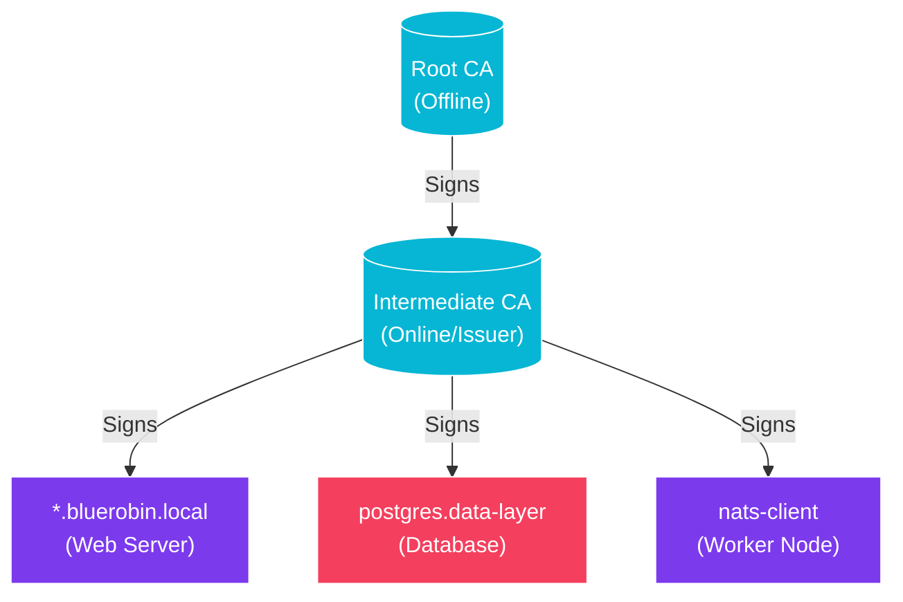

import Callout from '@components/Callout.astro';
import ImplementationNote from '@components/ImplementationNote.astro';
import CodeFile from '@components/CodeFile.astro';
import ExternalCite from '@components/ExternalCite.astro';

## Introduction

In a zero-trust architecture, you cannot blindly trust the network. Every internal service-to-service communication—from the API to the Database, or NATS to the Workers—must be authenticated and encrypted. A Private Public Key Infrastructure (PKI) allows us to issue our own TLS certificates, giving us full control over trust chains without the cost or constraints of public CAs.

**Why Build a Private PKI:**

- **Mutual TLS (mTLS)**: Authenticate both client and server (e.g., Worker ↔ Broker).
- **Cost**: Issue unlimited certificates for internal domains (`*.bluerobin.local`) for free.
- **Control**: Set custom expirations and policies suited for high-velocity DevOps.

### What We'll Build

In this guide, we will implement a 2-tier PKI hierarchy. You will learn how to:

1. **Bootstrap trust**: Generate a secure Root Certificate Authority (CA).
2. **Delegate authority**: Create an Intermediate CA for daily signing operations.
3. **Issue certificates**: Sign leaf certificates for our internal NATS and PostgreSQL endpoints.
4. **Establish trust**: Install the Root CA in OS trust stores.

## Architecture Overview

We use a hierarchical trust model to protect the "keys to the kingdom."



## Section 1: The Root CA

The Root CA is the anchor of trust. Its private key is the most sensitive file in your infrastructure. If compromised, an attacker can impersonate *any* service.

<Callout type="info" title="Offline Root">
    In production, the Root CA private key should never be on a networked machine. Here, we generate it in a secure directory, but ideally, this happens on an air-gapped machine or hardware token.
</Callout>

### Generating the Root Key and Certificate

```bash
# 1. Generate the Root Private Key (AES-256 encrypted)
openssl genrsa -aes256 -out root-ca.key 4096

# 2. Create the Root Certificate (valid for 10 years)
openssl req -config root-ca.conf \
    -key root-ca.key \
    -new -x509 -days 3650 -sha256 -extensions v3_ca \
    -out root-ca.crt \
    -subj "/C=US/O=BlueRobin/CN=BlueRobin Root CA"
```

## Section 2: The Intermediate CA

Using the Root CA for every daily task exposes it to risk. Instead, we sign an Intermediate CA.

```bash
# 1. Generate Intermediate Key
openssl genrsa -out intermediate-ca.key 4096

# 2. Create CSR (Certificate Signing Request)
openssl req -config intermediate-ca.conf -new -sha256 \
    -key intermediate-ca.key \
    -out intermediate-ca.csr

# 3. Sign the Intermediate CSR with the Root CA
openssl ca -config root-ca.conf -extensions v3_intermediate_ca \
    -days 1825 -notext -md sha256 \
    -in intermediate-ca.csr \
    -out intermediate-ca.crt
```

Now, we chain them together to create the full chain file provided to clients:

```bash
cat intermediate-ca.crt root-ca.crt > ca-chain.pem
```

## Section 3: Issuing Leaf Certificates

Now our web services or databases can request certificates signed by the *Intermediate* CA.

```bash
# 1. Generate Leaf Key for PostgreSQL
openssl genrsa -out postgres.key 2048

# 2. Create CSR
openssl req -new -key postgres.key -out postgres.csr \
    -subj "/C=US/O=BlueRobin/CN=postgres.bluerobin.local"

# 3. Sign with Intermediate CA
openssl x509 -req -in postgres.csr \
    -CA intermediate-ca.crt -CAkey intermediate-ca.key -CAcreateserial \
    -out postgres.crt -days 365 -sha256
```

## Section 4: Testing & Trust

For your local machine to trust these certificates, the `root-ca.crt` must be added to the trust store.

### macOS
```bash
sudo security add-trusted-cert -d -r trustRoot -k /Library/Keychains/System.keychain root-ca.crt
```

### Linux (Ubuntu/Debian)
```bash
sudo cp root-ca.crt /usr/local/share/ca-certificates/bluerobin-root.crt
sudo update-ca-certificates
```

Verification:
```bash
openssl verify -CAfile ca-chain.pem postgres.crt
# Output: postgres.crt: OK
```

## Conclusion

We have successfully built a PKI backbone. This infrastructure enables us to enforce `hostssl` in PostgreSQL and secure NATS streams, forming the bedrock of our internal security posture.

**Next Steps**:
- [Hardened Security: Signing with YubiKey](/blog/hardened-security-yubikey-certificate-signing)
- [PostgreSQL Security Design](/blog/postgresql-security-design-high-assurance)
