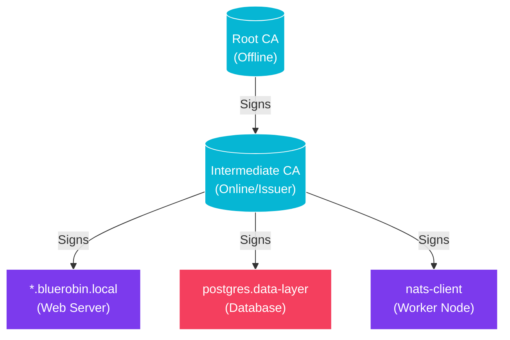

import Callout from '@components/Callout.astro';
import ImplementationNote from '@components/ImplementationNote.astro';
import CodeFile from '@components/CodeFile.astro';
import ExternalCite from '@components/ExternalCite.astro';

When I first configured TLS for the internal services on my k3s homelab, I naively used self-signed certificates generated ad hoc for each service. Within weeks, I was chasing expired certs at 2 AM after NATS connections started failing silently. The PostgreSQL replication stream broke the next morning because I had forgotten to regenerate a leaf cert whose 30-day lifetime had quietly elapsed. That painful weekend convinced me to build a proper two-tier PKI from scratch so that every certificate flows from a single root of trust with predictable, auditable lifetimes. This guide distills those lessons into a reproducible process you can stand up in an afternoon.

## Introduction

In a zero-trust architecture, you cannot blindly trust the network. Every internal service-to-service communication—from the API to the Database, or NATS to the Workers—must be authenticated and encrypted. A Private Public Key Infrastructure (PKI) allows us to issue our own TLS certificates, giving us full control over trust chains without the cost or constraints of public CAs.

**Why Build a Private PKI:**

- **Mutual TLS (mTLS)**: Authenticate both client and server (e.g., Worker ↔ Broker).
- **Cost**: Issue unlimited certificates for internal domains (`*.bluerobin.local`) for free.
- **Control**: Set custom expirations and policies suited for high-velocity DevOps.

<ExternalCite title="RFC 5280 - Internet X.509 PKI Certificate and CRL Profile" url="https://datatracker.ietf.org/doc/html/rfc5280" author="D. Cooper, S. Santesson, S. Farrell, S. Boeyen, R. Housley, W. Polk" date="2008-05-01" />

<ExternalCite title="Bulletproof TLS and PKI" url="https://www.feistyduck.com/books/bulletproof-tls-and-pki/" author="Ivan Ristic" date="2022-10-01" />

### What We'll Build

In this guide, we will implement a 2-tier PKI hierarchy. You will learn how to:

1. **Bootstrap trust**: Generate a secure Root Certificate Authority (CA).
2. **Delegate authority**: Create an Intermediate CA for daily signing operations.
3. **Issue certificates**: Sign leaf certificates for our internal NATS and PostgreSQL endpoints.
4. **Establish trust**: Install the Root CA in OS trust stores.

## Architecture Overview

We use a hierarchical trust model to protect the "keys to the kingdom."


```mermaid
flowchart TD
    RootCA[("Root CA\n(Offline)")]
    InterCA[("Intermediate CA\n(Online/Issuer)")]
    Leaf1["*.bluerobin.local\n(Web Server)"]
    Leaf2["postgres.data-layer\n(Database)"]
    Leaf3["nats-client\n(Worker Node)"]

    RootCA -->|Signs| InterCA
    InterCA -->|Signs| Leaf1
    InterCA -->|Signs| Leaf2
    InterCA -->|Signs| Leaf3

    classDef primary fill:#7c3aed,stroke:#fff,color:#fff
    classDef secondary fill:#06b6d4,stroke:#fff,color:#fff
    classDef db fill:#f43f5e,stroke:#fff,color:#fff
    classDef warning fill:#fbbf24,stroke:#fff,color:#fff

    class Leaf1,Leaf3 primary
    class RootCA,InterCA secondary
    class Leaf2 db
```

## Section 1: The Root CA

The Root CA is the anchor of trust. Its private key is the most sensitive file in your infrastructure. If compromised, an attacker can impersonate *any* service.

<ExternalCite title="OpenSSL Certificate Authority" url="https://www.openssl.org/docs/man3.0/man1/openssl-ca.html" author="OpenSSL Project" date="2024-06-01" />

<Callout type="info" title="Offline Root">
    In production, the Root CA private key should never be on a networked machine. Here, we generate it in a secure directory, but ideally, this happens on an air-gapped machine or hardware token.
</Callout>

### Generating the Root Key and Certificate

```bash
# 1. Generate the Root Private Key (AES-256 encrypted)
openssl genrsa -aes256 -out root-ca.key 4096

# 2. Create the Root Certificate (valid for 10 years)
openssl req -config root-ca.conf \
    -key root-ca.key \
    -new -x509 -days 3650 -sha256 -extensions v3_ca \
    -out root-ca.crt \
    -subj "/C=US/O=MyOrg/CN=MyOrg Root CA"
```

<ImplementationNote title="Choosing the right key size and algorithm">
I initially generated the Root CA key with RSA 2048-bit because it was faster, but after reading NIST SP 800-57, I switched to 4096-bit for the Root and Intermediate CAs. The extra computation cost is negligible since you only sign the Intermediate CA once every few years. For leaf certificates I kept 2048-bit RSA because those rotate frequently and the handshake overhead matters on resource-constrained homelab nodes. I also considered ECDSA P-384 but ultimately stuck with RSA for broader compatibility with older clients in my lab network.
</ImplementationNote>

## Section 2: The Intermediate CA

Using the Root CA for every daily task exposes it to risk. Instead, we sign an Intermediate CA.

```bash
# 1. Generate Intermediate Key
openssl genrsa -out intermediate-ca.key 4096

# 2. Create CSR (Certificate Signing Request)
openssl req -config intermediate-ca.conf -new -sha256 \
    -key intermediate-ca.key \
    -out intermediate-ca.csr

# 3. Sign the Intermediate CSR with the Root CA
openssl ca -config root-ca.conf -extensions v3_intermediate_ca \
    -days 1825 -notext -md sha256 \
    -in intermediate-ca.csr \
    -out intermediate-ca.crt
```

Now, we chain them together to create the full chain file provided to clients:

<ExternalCite title="Smallstep step-ca: An Online Certificate Authority" url="https://smallstep.com/docs/step-ca/" author="Smallstep Labs" date="2024-09-15" />

<ImplementationNote title="Intermediate CA lifetime bit me hard">
I originally set the Intermediate CA to a 5-year validity (1825 days) without thinking about the leaf certificate overlap. When leaf certs had 365-day lifetimes, any certificate issued in the last year of the Intermediate CA's life would outlive its issuer. I discovered this when `openssl verify` started returning "certificate has expired" on perfectly fresh leaf certs. The fix was straightforward: I now ensure the Intermediate CA has at least 2x the maximum leaf lifetime remaining before issuing, and I built a small cron job that alerts me 90 days before the Intermediate expires.
</ImplementationNote>

```bash
cat intermediate-ca.crt root-ca.crt > ca-chain.pem
```

## Section 3: Issuing Leaf Certificates

Now our web services or databases can request certificates signed by the *Intermediate* CA.

<ExternalCite title="CFSSL: Cloudflare's PKI and TLS toolkit" url="https://github.com/cloudflare/cfssl" author="Cloudflare" date="2024-03-12" />

```bash
# 1. Generate Leaf Key for PostgreSQL
openssl genrsa -out postgres.key 2048

# 2. Create CSR
openssl req -new -key postgres.key -out postgres.csr \
    -subj "/C=US/O=MyOrg/CN=postgres.bluerobin.local"

# 3. Sign with Intermediate CA
openssl x509 -req -in postgres.csr \
    -CA intermediate-ca.crt -CAkey intermediate-ca.key -CAcreateserial \
    -out postgres.crt -days 365 -sha256
```

<ImplementationNote title="SAN requirements caught me off guard">
I spent an entire evening debugging why my NATS client rejected a perfectly valid leaf certificate. The issue turned out to be that modern TLS libraries ignore the Common Name (CN) field and require Subject Alternative Names (SANs) instead. I had to add `-extfile` with a config specifying `subjectAltName = DNS:postgres.bluerobin.local,DNS:postgres.data-layer.svc.cluster.local` to the signing command. Once I added the SAN extension, the connection succeeded immediately. Now I always include SANs for both the friendly hostname and the full Kubernetes service DNS name.
</ImplementationNote>

## Section 4: Testing & Trust

For your local machine to trust these certificates, the `root-ca.crt` must be added to the trust store.

### macOS
```bash
sudo security add-trusted-cert -d -r trustRoot -k /Library/Keychains/System.keychain root-ca.crt
```

### Linux (Ubuntu/Debian)
```bash
sudo cp root-ca.crt /usr/local/share/ca-certificates/myorg-root.crt
sudo update-ca-certificates
```

Verification:

<ExternalCite title="NIST SP 800-57: Recommendation for Key Management" url="https://csrc.nist.gov/publications/detail/sp/800-57-part-1/rev-5/final" author="Elaine Barker" date="2020-05-04" />
```bash
openssl verify -CAfile ca-chain.pem postgres.crt
# Output: postgres.crt: OK
```

## Conclusion

We have successfully built a PKI backbone. This infrastructure enables us to enforce `hostssl` in PostgreSQL and secure NATS streams, forming the bedrock of our internal security posture.

Looking back, the single biggest lesson I took from this process is that PKI is not a "set it and forget it" system. Certificate lifetimes, chain validation, and SAN configuration all demand ongoing attention. After standing up this two-tier hierarchy, I invested an additional afternoon writing a monitoring script that checks every leaf certificate's expiration daily and pushes alerts to a dedicated Slack channel. That small investment has saved me from at least three potential outages since I first deployed it. If you are running a homelab or any internal infrastructure, treat your PKI with the same care you would give a production database: automate, monitor, and rotate.

### Next Steps

- [Hardened Security: Signing with YubiKey](/hardened-security-yubikey-certificate-signing)
- [PostgreSQL Security Design](/postgresql-security-design-high-assurance)
- Automate certificate renewal with step-ca ACME or cert-manager in Kubernetes.
- Implement certificate revocation lists (CRLs) or OCSP for rapid revocation.

### Further Reading

- [RFC 5280 - X.509 PKI Certificate Profile](https://datatracker.ietf.org/doc/html/rfc5280) -- The foundational standard for certificate structure and validation.
- [Smallstep Practical Zero Trust](https://smallstep.com/practical-zero-trust/) -- Approachable guide to building zero-trust infrastructure with private PKI.
- [NIST SP 800-57 Key Management Guidelines](https://csrc.nist.gov/publications/detail/sp/800-57-part-1/rev-5/final) -- Authoritative reference for key sizes, lifetimes, and algorithm selection.
