import Callout from '@components/Callout.astro';
import ImplementationNote from '@components/ImplementationNote.astro';
import ExternalCite from '@components/ExternalCite.astro';

Manual certificate management doesn't scale. cert-manager automates certificate issuance and renewal, integrating with Let's Encrypt and Cloudflare DNS for wildcard certificates.

## Architecture

```mermaid
flowchart TB
    subgraph Lifecycle["🔒 Certificate Lifecycle"]
        Cert["📜 Certificate Resource"] --> |creates| CSR["📝 CertificateRequest\n(CSR)"]
        CSR --> Order["📋 Order (ACME)"]
        Order --> Challenge["🏆 Challenge\n(DNS-01)"]
        Challenge --> CF["☁️ Cloudflare DNS API"]
        CF --> LE["🔐 Let's Encrypt ACME"]
        LE --> Secret["🔑 Secret\n(TLS Cert)"]
    end

    style Lifecycle fill:#326ce5,color:#fff
```



## Installation

### HelmRelease

```yaml
# platform/cert-manager/helmrelease.yaml
apiVersion: helm.toolkit.fluxcd.io/v2
kind: HelmRelease
metadata:
  name: cert-manager
  namespace: cert-manager
spec:
  interval: 30m
  chart:
    spec:
      chart: cert-manager
      version: ">=1.14.0 <2.0.0"
      sourceRef:
        kind: HelmRepository
        name: jetstack
        namespace: flux-system
  values:
    installCRDs: true
    prometheus:
      enabled: true
      servicemonitor:
        enabled: true
    resources:
      requests:
        cpu: 10m
        memory: 32Mi
      limits:
        cpu: 100m
        memory: 128Mi
    webhook:
      resources:
        requests:
          cpu: 10m
          memory: 32Mi
    cainjector:
      resources:
        requests:
          cpu: 10m
          memory: 32Mi
```

## ClusterIssuer Configuration

### Let's Encrypt Production

```yaml
# platform/cert-manager/clusterissuer.yaml
apiVersion: cert-manager.io/v1
kind: ClusterIssuer
metadata:
  name: letsencrypt-prod
spec:
  acme:
    email: admin@bluerobin.com
    server: https://acme-v02.api.letsencrypt.org/directory
    privateKeySecretRef:
      name: letsencrypt-prod-account-key
    solvers:
      - dns01:
          cloudflare:
            email: admin@bluerobin.com
            apiTokenSecretRef:
              name: cloudflare-api-token
              key: api-token
        selector:
          dnsZones:
            - "bluerobin.com"
            - "bluerobin.local"
```

### Staging Issuer (Testing)

```yaml
# platform/cert-manager/clusterissuer-staging.yaml
apiVersion: cert-manager.io/v1
kind: ClusterIssuer
metadata:
  name: letsencrypt-staging
spec:
  acme:
    email: admin@bluerobin.com
    server: https://acme-staging-v02.api.letsencrypt.org/directory
    privateKeySecretRef:
      name: letsencrypt-staging-account-key
    solvers:
      - dns01:
          cloudflare:
            email: admin@bluerobin.com
            apiTokenSecretRef:
              name: cloudflare-api-token
              key: api-token
```

<Callout type="tip">
Always test with the staging issuer first! Let's Encrypt production has rate limits (50 certs/week for the same set of domains).
</Callout>

## Cloudflare API Token

### Token Configuration

Create a Cloudflare API token with Zone:DNS:Edit permissions:

```yaml
# platform/cert-manager/cloudflare-secret.yaml
apiVersion: external-secrets.io/v1beta1
kind: ExternalSecret
metadata:
  name: cloudflare-api-token
  namespace: cert-manager
spec:
  refreshInterval: 1h
  secretStoreRef:
    name: infisical-store
    kind: ClusterSecretStore
  target:
    name: cloudflare-api-token
    creationPolicy: Owner
  data:
    - secretKey: api-token
      remoteRef:
        key: CLOUDFLARE_DNS_API_TOKEN
```

<ImplementationNote>
Store the Cloudflare API token in Infisical and use ExternalSecrets to sync it. Never commit API tokens to Git.
</ImplementationNote>

## Certificate Resources

### Wildcard Certificate

```yaml
# platform/cert-manager/certificates/wildcard.yaml
apiVersion: cert-manager.io/v1
kind: Certificate
metadata:
  name: bluerobin-wildcard
  namespace: cert-manager
spec:
  secretName: bluerobin-tls
  issuerRef:
    name: letsencrypt-prod
    kind: ClusterIssuer
  dnsNames:
    - "*.bluerobin.local"
    - "bluerobin.local"
    - "*.staging.bluerobin.com"
    - "staging.bluerobin.com"
  duration: 2160h    # 90 days
  renewBefore: 720h  # Renew 30 days before expiry
  privateKey:
    algorithm: ECDSA
    size: 256
  secretTemplate:
    annotations:
      reflector.v1.k8s.emberstack.com/reflection-allowed: "true"
      reflector.v1.k8s.emberstack.com/reflection-allowed-namespaces: >-
        archives-staging,archives-prod,authelia,kube-system
      reflector.v1.k8s.emberstack.com/reflection-auto-enabled: "true"
```

### Application-Specific Certificate

```yaml
# apps/archives-api/certificate.yaml
apiVersion: cert-manager.io/v1
kind: Certificate
metadata:
  name: api-staging-tls
  namespace: archives-staging
spec:
  secretName: api-staging-tls
  issuerRef:
    name: letsencrypt-prod
    kind: ClusterIssuer
  dnsNames:
    - "api-staging.bluerobin.local"
  duration: 2160h
  renewBefore: 720h
```

## Secret Reflection

### Reflector Installation

To share certificates across namespaces, use Reflector:

```yaml
# platform/reflector/helmrelease.yaml
apiVersion: helm.toolkit.fluxcd.io/v2
kind: HelmRelease
metadata:
  name: reflector
  namespace: kube-system
spec:
  interval: 30m
  chart:
    spec:
      chart: reflector
      version: ">=7.1.0"
      sourceRef:
        kind: HelmRepository
        name: emberstack
        namespace: flux-system
```

### Using Reflected Secrets

```yaml
# apps/bluerobin-web/ingressroute.yaml
apiVersion: traefik.io/v1alpha1
kind: IngressRoute
metadata:
  name: bluerobin-web
  namespace: archives-staging
spec:
  entryPoints:
    - websecure
  routes:
    - match: Host(`web-staging.bluerobin.local`)
      kind: Rule
      services:
        - name: bluerobin-web
          port: 80
  tls:
    secretName: bluerobin-tls  # Reflected from cert-manager namespace
```

## Monitoring

### Certificate Status

```bash
# Check certificate status
kubectl get certificates -A

# Describe specific certificate
kubectl describe certificate bluerobin-wildcard -n cert-manager

# Check certificate requests
kubectl get certificaterequests -A

# Check orders
kubectl get orders -A
```

### Prometheus Alerts

```yaml
# platform/cert-manager/prometheusrule.yaml
apiVersion: monitoring.coreos.com/v1
kind: PrometheusRule
metadata:
  name: cert-manager-alerts
  namespace: cert-manager
spec:
  groups:
    - name: cert-manager
      rules:
        - alert: CertManagerCertExpiringSoon
          expr: |
            certmanager_certificate_expiration_timestamp_seconds 
            - time() < 7 * 24 * 60 * 60
          for: 5m
          labels:
            severity: warning
          annotations:
            summary: "Certificate {{ $labels.name }} expires in less than 7 days"
            
        - alert: CertManagerCertNotReady
          expr: certmanager_certificate_ready_status{status="False"} == 1
          for: 15m
          labels:
            severity: critical
          annotations:
            summary: "Certificate {{ $labels.name }} is not ready"
```

## Troubleshooting

### Common Issues

| Issue | Diagnosis | Solution |
|-------|-----------|----------|
| Challenge failed | `kubectl describe challenge` | Check DNS propagation, API token permissions |
| Order stuck | `kubectl get orders` | Check ACME server status, rate limits |
| Secret not created | Check certificate events | Verify issuer exists and is ready |
| Renewal failed | Check certificate age | Manually delete and recreate certificate |

### Debug Commands

```bash
# View cert-manager logs
kubectl logs -n cert-manager deployment/cert-manager -f

# Check Cloudflare DNS records
dig TXT _acme-challenge.bluerobin.local

# Force certificate renewal
kubectl delete secret bluerobin-tls -n cert-manager
```

<Callout type="warning">
DNS-01 challenges require DNS propagation time. If validation fails, wait 2-5 minutes and retry. Cloudflare usually propagates within 1 minute.
</Callout>

## Summary

cert-manager automates TLS with:

| Feature | Configuration |
|---------|---------------|
| ACME Protocol | Let's Encrypt with DNS-01 |
| DNS Provider | Cloudflare API token |
| Wildcards | `*.bluerobin.local` |
| Reflection | Emberstack Reflector for cross-namespace |
| Renewal | Automatic 30 days before expiry |

Combined with Traefik, this provides zero-touch TLS for all BlueRobin services.

<ExternalCite 
  title="cert-manager Documentation" 
  url="https://cert-manager.io/docs/"
  author="Jetstack"
/>
