import Callout from '@components/Callout.astro';
import ImplementationNote from '@components/ImplementationNote.astro';
import ExternalCite from '@components/ExternalCite.astro';

## Introduction

In a production cluster, TLS is not optional. But manually generating certificates, creating Kubernetes Secrets, and rotating them every 90 days is toil.

**Why Cert-Manager?**
-   **Automation**: It detects when a certificate is about to expire and renews it.
-   **Integration**: It works seamlessly with Ingress controllers (Traefik, Nginx).
-   **DNS-01 support**: Obtain wildcard certificates (`*.bluerobin.local`) without exposing your cluster to the public internet.

### What We'll Build
1.  **ClusterIssuer**: A cluster-wide configuration for Let's Encrypt.
2.  **External Secrets**: A secure way to pass your Cloudflare API token.
3.  **Wildcard Certificate**: A single certificate covering `*.bluerobin.local`.

## Architecture Overview

```mermaid
flowchart TB
    subgraph Lifecycle["🔒 Certificate Lifecycle"]
        Cert["📜 Certificate Resource"] --> |creates| CSR["📝 CertificateRequest"]
        CSR --> Order["📋 ACME Order"]
        Order --> Challenge["🏆 Challenge (DNS-01)"]
        Challenge --> CF["☁️ Cloudflare DNS API"]
        CF --> LE["🔐 Let's Encrypt CA"]
        LE --> Secret["🔑 K8s Secret\n(tls.crt + tls.key)"]
    end

    classDef primary fill:#7c3aed,stroke:#fff,color:#fff
    classDef secondary fill:#06b6d4,stroke:#fff,color:#fff
    classDef db fill:#f43f5e,stroke:#fff,color:#fff
    classDef warning fill:#fbbf24,stroke:#fff,color:#fff

    class Lifecycle secondary
```



## Section 1: The Trust Chain

We use the **DNS-01** challenge type. This proves ownership of the domain by adding a TXT record to your DNS, rather than hosting a file on a public HTTP server (HTTP-01). This allows us to get certificates for internal services that aren't reachable from the internet.

```yaml
# core-infra/security/cluster-issuer.yaml
apiVersion: cert-manager.io/v1
kind: ClusterIssuer
metadata:
  name: letsencrypt-prod
spec:
  acme:
    server: https://acme-v02.api.letsencrypt.org/directory
    email: admin@bluerobin.local
    privateKeySecretRef:
      name: letsencrypt-prod-account-key
    solvers:
      - dns01:
          cloudflare:
            email: admin@bluerobin.local
            apiTokenSecretRef:
              name: cloudflare-api-token-secret
              key: api-token
```

## Section 2: Managing Secrets

We don't hardcode the Cloudflare Token. We use External Secrets to fetch it from Infisical.

```yaml
# core-infra/security/external-secret.yaml
apiVersion: external-secrets.io/v1beta1
kind: ExternalSecret
metadata:
  name: cloudflare-api-token
  namespace: cert-manager
spec:
  secretStoreRef:
    kind: ClusterSecretStore
    name: infisical-store
  target:
    name: cloudflare-api-token-secret
  data:
    - secretKey: api-token
      remoteRef:
        key: CLOUDFLARE_API_TOKEN
```

## Section 3: Requesting the Certificate

With the Issuer ready, we can request our wildcard certificate.

```yaml
# core-infra/security/certificate.yaml
apiVersion: cert-manager.io/v1
kind: Certificate
metadata:
  name: bluerobin-wildcard
  namespace: traefik
spec:
  secretName: bluerobin-wildcard-tls
  issuerRef:
    name: letsencrypt-prod
    kind: ClusterIssuer
  dnsNames:
    - "bluerobin.local"
    - "*.bluerobin.local"
```

## Conclusion

Once applied, `cert-manager` will continually monitor the `bluerobin-wildcard-tls` secret. 30 days before expiration, it will talk to Cloudflare, prove ownership, fetch a new certificate from Let's Encrypt, and update the secret. Your applications (and Traefik) will pick up the new certificate automatically.
