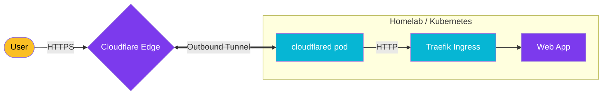

import Callout from '@components/Callout.astro';
import ImplementationNote from '@components/ImplementationNote.astro';
import CodeFile from '@components/CodeFile.astro';
import ExternalCite from '@components/ExternalCite.astro';

## Introduction

Historically, hosting a web server meant punching a hole in your firewall (Port-Forwarding 80/443) and hoping your Nginx config was secure enough to stop attacks. **Cloudflare Tunnel** changes this paradigm. Instead of allowing traffic *in*, your server creates an outbound connection *to* Cloudflare's edge network.

**Why Cloudflare Tunnel Matters:**

- **No Open Ports**: Your firewall blocks all inbound connections. The tunnel is outbound-only.
- **DDoS Protection**: Traffic hits Cloudflare's massive edge before it ever reaches your ISP.
- **Zero Trust Auth**: Add an authentication layer (Google, GitHub, Email OTP) *before* the request even touches your application.

### What We'll Build

In this guide, we will securely expose the `BlueRobin` dashboard. You will learn how to:

1. **Deploy cloudflared**: Run the tunnel daemon in Kubernetes.
2. **Route Traffic**: Map public domains (e.g., `app.bluerobin.io`) to internal services.
3. **Enforce Access Policies**: Require GitHub authentication to access the dashboard.

## Architecture Overview

The `cloudflared` daemon creates a persistent connection to the nearest Cloudflare data center.



## Section 1: Setting up the Tunnel

While you can run `cloudflared` on bare metal, running it as a Kubernetes sidecar or deployment is cleaner. We recommend the "Cloudflare Zero Trust" dashboard method for easier management, which gives you a token.

### Kubernetes Deployment

We use a simple Deployment to keep the tunnel alive.

```yaml
apiVersion: apps/v1
kind: Deployment
metadata:
  name: cloudflared
  namespace: networking
spec:
  replicas: 2
  selector:
    matchLabels:
      app: cloudflared
  template:
    metadata:
      labels:
        app: cloudflared
    spec:
      containers:
      - name: cloudflared
        image: cloudflare/cloudflared:latest
        args:
        - tunnel
        - --no-autoupdate
        - run
        - --token
        - <YOUR_TUNNEL_TOKEN>
```

<ImplementationNote title="Secret Management">
    Do not hardcode the token in YAML. Use a Kubernetes Secret or Infisical to inject it as an environment variable (`TUNNEL_TOKEN`).
</ImplementationNote>

## Section 2: Routing Intranet Services

Once the tunnel is up (status "Healthy" in Cloudflare Dashboard), we configure **Public Hostnames**.

1. Go to **Access** > **Tunnels** > **Configure**.
2. **Public Hostname**: `app.bluerobin.io`
3. **Service**: `http://traefik.networking.svc.cluster.local:80`

Notice we point to the internal K8s DNS name of our Ingress controller. This allows Cloudflare to pipe traffic directly to our Ingress, which then handles the routing based on the `Host` header.

## Section 3: Zero Trust Policies

Now the app is exposed, but it's public. Let's lock it down.

1. Go to **Access** > **Applications** > **Add an Application**.
2. Select **Self-hosted**.
3. **Application Domain**: `app.bluerobin.io`
4. **Identity Providers**: connect GitHub or One-Time Pin (OTP).
5. **Policies**: Create a policy named "Allow Team".
   - **Action**: Allow
   - **Include**: Emails ending in `@bluerobin.io` OR GitHub Organization `BlueRobin-Devs`.

Now, when a user visits `app.bluerobin.io`, they are intercepted by a Cloudflare login screen. If they fail to authenticate, their request is dropped at the edge—your server never even sees the packet.

## Conclusion

Cloudflare Tunnel abstracts away the complexity of dynamic DNS, port forwarding, and certificate management (Cloudflare manages the public SSL). Combined with Access policies, you can provide VPN-less secure access to your internal tools.

**Next Steps**:
- [Zero Trust Architecture: mTLS, Tokens, and Identity](/blog/zero-trust-architecture-mtls-tokens-identity)
- [Securing the Homelab: VLANS, Firewalls, and Hardening](/blog/securing-homelab-subnetting-firewall-hardening)
