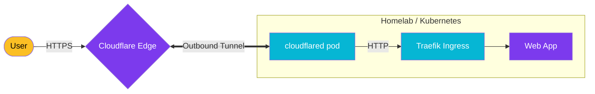

import Callout from '@components/Callout.astro';
import ImplementationNote from '@components/ImplementationNote.astro';
import CodeFile from '@components/CodeFile.astro';
import ExternalCite from '@components/ExternalCite.astro';

## Introduction

I used to port-forward 443 on my router directly to an Nginx reverse proxy. It worked, but one morning I woke up to find my server had processed 2.3 million requests overnight—someone had discovered the open port and was running a credential-stuffing attack against every service behind the proxy. Switching to Cloudflare Tunnel eliminated that entire attack vector. Now my firewall has zero inbound rules, and every request passes through Cloudflare's WAF and bot detection before it reaches my cluster.

Historically, hosting a web server meant punching a hole in your firewall (Port-Forwarding 80/443) and hoping your Nginx config was secure enough to stop attacks. **Cloudflare Tunnel** changes this paradigm. <ExternalCite title="Cloudflare Tunnel Documentation" url="https://developers.cloudflare.com/cloudflare-one/connections/connect-networks/" author="Cloudflare" date="2024" /> Instead of allowing traffic *in*, your server creates an outbound connection *to* Cloudflare's edge network.

**Why Cloudflare Tunnel Matters:**

- **No Open Ports**: Your firewall blocks all inbound connections. The tunnel is outbound-only.
- **DDoS Protection**: Traffic hits Cloudflare's massive edge before it ever reaches your ISP. <ExternalCite title="Cloudflare DDoS Protection" url="https://www.cloudflare.com/ddos/" author="Cloudflare" date="2024" />
- **Zero Trust Auth**: Add an authentication layer (Google, GitHub, Email OTP) *before* the request even touches your application. <ExternalCite title="Cloudflare Zero Trust" url="https://developers.cloudflare.com/cloudflare-one/" author="Cloudflare" date="2024" />

### What We'll Build

In this guide, we will securely expose our dashboard. You will learn how to:

1. **Deploy cloudflared**: Run the tunnel daemon in Kubernetes.
2. **Route Traffic**: Map public domains (e.g., `app.bluerobin.io`) to internal services.
3. **Enforce Access Policies**: Require GitHub authentication to access the dashboard.

## Architecture Overview

The `cloudflared` daemon creates a persistent connection to the nearest Cloudflare data center.


```mermaid
flowchart LR
    %% Styles
    classDef primary fill:#7c3aed,color:#fff
    classDef secondary fill:#06b6d4,color:#fff
    classDef db fill:#f43f5e,color:#fff
    classDef warning fill:#fbbf24,color:#000

    User([User]) -->|HTTPS| Cloudflare{Cloudflare Edge}
    
    subgraph Home [Homelab / Kubernetes]
        Daemon[cloudflared pod]
        Ingress[Traefik Ingress]
        App[Web App]
    end

    Cloudflare <==>|Outbound Tunnel| Daemon
    Daemon -->|HTTP| Ingress
    Ingress --> App

    class Cloudflare,App primary
    class Daemon,Ingress secondary
    class User warning
```

## Section 1: Setting up the Tunnel

While you can run `cloudflared` on bare metal, running it as a Kubernetes sidecar or deployment is cleaner. We recommend the "Cloudflare Zero Trust" dashboard method for easier management, which gives you a token.

### Kubernetes Deployment

We use a simple Deployment to keep the tunnel alive. <ExternalCite title="Kubernetes Deployment" url="https://kubernetes.io/docs/concepts/workloads/controllers/deployment/" author="Kubernetes" date="2024" />

```yaml
apiVersion: apps/v1
kind: Deployment
metadata:
  name: cloudflared
  namespace: networking
spec:
  replicas: 2
  selector:
    matchLabels:
      app: cloudflared
  template:
    metadata:
      labels:
        app: cloudflared
    spec:
      containers:
      - name: cloudflared
        image: cloudflare/cloudflared:latest
        args:
        - tunnel
        - --no-autoupdate
        - run
        - --token
        - <YOUR_TUNNEL_TOKEN>
```

<ImplementationNote title="Secret Management">
    Do not hardcode the token in YAML. Use a Kubernetes Secret or Infisical to inject it as an environment variable (`TUNNEL_TOKEN`).
</ImplementationNote>

<ImplementationNote>
    Running 2 replicas of cloudflared was an important reliability lesson. With a single replica, every pod restart (during node maintenance or rolling updates) caused 10-15 seconds of downtime for all externally-exposed services. With 2 replicas spread across different nodes using pod anti-affinity rules, the tunnel maintains connectivity even during planned maintenance. Cloudflare automatically load-balances between the two connections.
</ImplementationNote>

## Section 2: Routing Intranet Services

Once the tunnel is up (status "Healthy" in Cloudflare Dashboard), we configure **Public Hostnames**.

1. Go to **Access** > **Tunnels** > **Configure**.
2. **Public Hostname**: `app.bluerobin.io`
3. **Service**: `http://traefik.networking.svc.cluster.local:80`

Notice we point to the internal K8s DNS name of our Ingress controller. This allows Cloudflare to pipe traffic directly to our Ingress, which then handles the routing based on the `Host` header.

<ImplementationNote>
    I initially pointed the tunnel directly to individual services (`http://myapp.default.svc:8080`), bypassing the ingress controller entirely. This worked but meant I lost all of Traefik's middleware—rate limiting, header manipulation, and the Authelia ForwardAuth integration. Routing through Traefik's internal service means the tunnel benefits from the same middleware chain as internal traffic, which is the correct architecture.
</ImplementationNote>

## Section 3: Zero Trust Policies

Now the app is exposed, but it's public. Let's lock it down.

1. Go to **Access** > **Applications** > **Add an Application**.
2. Select **Self-hosted**.
3. **Application Domain**: `app.bluerobin.io`
4. **Identity Providers**: connect GitHub or One-Time Pin (OTP).
5. **Policies**: Create a policy named "Allow Team".
   - **Action**: Allow
   - **Include**: Emails ending in `@example.io` OR GitHub Organization `Engineering-Team`.

Now, when a user visits `app.bluerobin.io`, they are intercepted by a Cloudflare login screen. <ExternalCite title="Cloudflare Access Policies" url="https://developers.cloudflare.com/cloudflare-one/policies/access/" author="Cloudflare" date="2024" /> If they fail to authenticate, their request is dropped at the edge—your server never even sees the packet.

<ImplementationNote>
    The Cloudflare Access JWT that gets injected into the request headers after authentication is useful beyond just access control. I parse the `Cf-Access-Jwt-Assertion` header in my .NET middleware to extract the authenticated user's email, which I use for audit logging. This means even services behind ForwardAuth (that don't speak OIDC) can identify who made the request, creating a complete audit trail from edge to application.
</ImplementationNote>

## Conclusion

Cloudflare Tunnel abstracts away the complexity of dynamic DNS, port forwarding, and certificate management (Cloudflare manages the public SSL). <ExternalCite title="NIST SP 800-44: Guidelines on Securing Public Web Servers" url="https://csrc.nist.gov/publications/detail/sp/800-44/version-2/final" author="NIST" date="2007" /> Combined with Access policies, you can provide VPN-less secure access to your internal tools.

After six months with Cloudflare Tunnel, I haven't touched a port-forwarding rule once. The blog you're reading right now is served through a tunnel from my homelab's Kubernetes cluster. The combination of outbound-only connectivity, edge-level WAF, and Zero Trust access policies has made the security posture of my homelab stronger than the cloud-hosted setup it replaced—and at zero additional cost for the tunnel itself.

**Next Steps:**
- Implement [Zero Trust Architecture](/zero-trust-architecture-mtls-tokens-identity) to secure service-to-service communication inside the cluster.
- Set up [Authelia SSO](/authelia-sso-oidc-dotnet) as the identity provider that Cloudflare Access can delegate to.
- Harden your [container images](/container-security-best-practices-dotnet) for defense in depth behind the tunnel.

### Further Reading

- <ExternalCite title="Cloudflare Tunnel Documentation" url="https://developers.cloudflare.com/cloudflare-one/connections/connect-networks/" author="Cloudflare" date="2024" /> — Complete guide to setting up and configuring Cloudflare Tunnels for various deployment scenarios.
- <ExternalCite title="Cloudflare Zero Trust" url="https://developers.cloudflare.com/cloudflare-one/" author="Cloudflare" date="2024" /> — Documentation for Cloudflare's Zero Trust platform including Access policies, Gateway, and Browser Isolation.
- <ExternalCite title="Cloudflare Access Policies" url="https://developers.cloudflare.com/cloudflare-one/policies/access/" author="Cloudflare" date="2024" /> — Detailed reference for configuring access policies, identity provider integration, and application protection.
