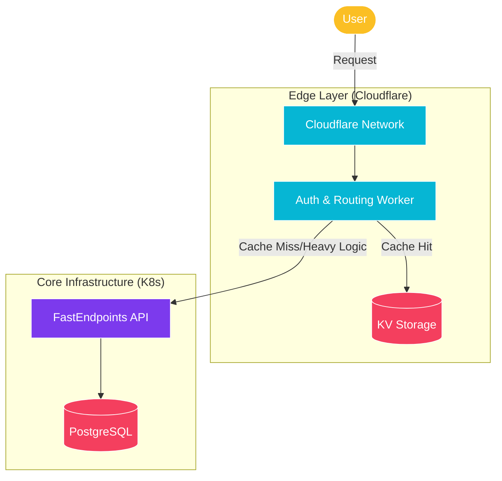

import Callout from '@components/Callout.astro';
import ImplementationNote from '@components/ImplementationNote.astro';
import CodeFile from '@components/CodeFile.astro';
import ExternalCite from '@components/ExternalCite.astro';

## Introduction

"I love you, me neither." It's a phrase that perfectly captures our relationship with Cloudflare Workers. In the quest for lower latency and higher availability, moving compute to the edge seems like the holy grail. And often, it is. But like any powerful tool, it comes with tradeoffs that can range from mild annoyances to architectural roadblocks.

We use Cloudflare Workers extensively at BlueRobin for handling lightweight requests, authentication checks, and fast routing decisions. However, we've also learned—sometimes the hard way—where they fall short compared to traditional containerized services.

**Why This Matters:**

- **Performance**: Understanding when edge compute actually speeds up your app vs. when it adds complexity.
- **Cost**: The billing model is attractive, but developer time spent debugging helps balance the equation.
- **Architecture**: Knowing the boundary between "Edge logic" and "Core logic".

### What We'll Cover

In this article, we will traverse the landscape of Edge Computing with Cloudflare. You will learn:

1. **The Good**: Why global distribution and 0ms cold starts are game changers.
2. **The Bad**: Execution limits, KV consistency issues, and the pain of local debugging.
3. **The Verdict**: Our decision matrix for when to use Workers vs. Containers.

## Architecture Overview

Here is how we split responsibilities between the Edge (Cloudflare) and our Core Infrastructure (Kubernetes).



## The Good: Why We Love It

The "Love" part of the relationship is easy to justify. The developer experience for *deploying* is magical, and the performance characteristics are hard to beat with traditional servers.

### Globally Distributed by Default

When you deploy a Worker, you aren't choosing a region like `us-east-1` or `eu-central-1`. You are deploying to hundreds of data centers simultaneously. For our users in Australia or Japan, this means the TLS handshake and initial response happen in milliseconds, not seconds.

### Near-Instant Cold Starts

Unlike Lambda functions which can sometimes take seconds to warm up (especially inside a VPC), Cloudflare Workers utilize V8 isolates. The startup overhead is practically non-existent (often under 5ms). This makes them perfect for simple, bursty tasks.

<Callout type="info" title="Best Use Case">
    We use Workers for our "Permissions Gateway". It checks a JWT signature and verifies scopes against KV storage before the request ever touches our heavy .NET API. This offloads millions of CPU cycles from our K8s cluster.
</Callout>

## The Bad: The Friction Points

But then comes the "Hate". Or at least, the "Strong Dislike".

### Execution Limits & CPU Time

Cloudflare Workers (on the standard plan) have strict CPU time limits (e.g., 10ms or 50ms depending on the plan type for CPU time, though wall time can be higher). This fundamentally changes how you write code. You can't just limitlessly loop or process large files.

We ran into this when trying to perform on-the-fly image resizing for large user uploads. The isolate would frequently time out on high-res images, forcing us to move that logic back to a containerized service.

### KV Storage Consistency

Cloudflare KV is *eventually consistent*. Extremely eventually.

> "KV achieves high read performance by caching data in Cloudflare data centers... Changes may take up to 60 seconds to propagate."

For configuration flags, this is fine. For a user who just updated their profile and expects to see the change immediately on a refresh? It's a disaster. We had to build specific cache-busting mechanisms or fallback to durable storage (like Durable Objects or D1) which adds cost and complexity.

### Debugging Locally

While `wrangler dev` is fantastic, it's never *quite* the same as the production environment.
- **Environment Variables**: syncing secrets between local dev and CI/CD requires discipline.
- **Network quirks**: `fetch` behavior inside the runtime can slightly differ from Node.js, leading to "works on my machine" bugs.

## When We Use It vs. Containers

After several iterations, we settled on a strict decision matrix.

| Feature | Cloudflare Worker | Container (K8s/Docker) |
| :--- | :--- | :--- |
| **Request Handling** | Routing, Auth, Redirects | Business Logic, Transactions |
| **Duration** | < 10ms CPU time | Long running jobs |
| **State** | Stateless or Eventual (KV) | Strong Consistency (Postgres/Redis) |
| **Dependencies** | Minimal (JS/Wasm) | Complex (System libraries, heavy SDKs) |

### The "Hybrid" Approach

We found the sweet spot is using Workers as a **Shield and Router**.

1. **Worker** receives request.
2. **Worker** checks caches (KV) and security headers.
3. If fast path possible -> Return response.
4. If complex logic needed -> Forward to Origin (K8s).

```javascript
export default {
  async fetch(request, env) {
    // 1. Fast Validations
    if (request.method === "OPTIONS") return handleCors(request);
    
    // 2. Auth Check (Edge)
    const session = await getSession(request);
    if (!session) return new Response("Unauthorized", { status: 401 });

    // 3. Fallback to Origin (K8s) for heavy lifting
    return fetch(request);
  }
}
```

## Conclusion

Cloudflare Workers are an incredible tool in the modern infrastructure belt, but they are not a hammer for every nail. 

We love the speed. We love the distribution. We hate the execution limits and consistency gotchas. By treating them as a sophisticated **Edge Gateway** rather than a replacement for our backend, we get the best of both worlds: lightning-fast user interactions and the robustness of containerized .NET services for the heavy lifting.

**Next Steps:**
- Explore [Cloudflare D1](https://developers.cloudflare.com/d1/) for relational data at the edge.
- Learn about [.NET 10 Native AOT](https://learn.microsoft.com/en-us/dotnet/core/deploying/native-aot/) for container cold starts.
