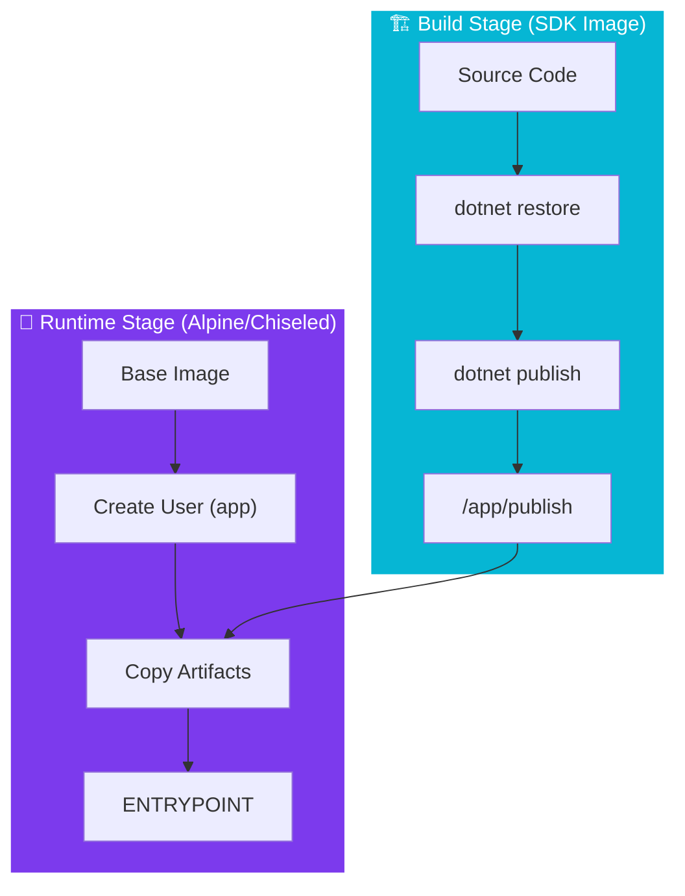

import Callout from '@components/Callout.astro';
import ImplementationNote from '@components/ImplementationNote.astro';
import ExternalCite from '@components/ExternalCite.astro';

## Introduction

The first time I ran `docker scan` on BlueRobin's API image, it found 247 vulnerabilities—including 12 critical CVEs in the base image's OS packages. The image was 890MB, running as root, with a full shell and package manager available. An attacker who exploited any RCE vulnerability would have had a fully-equipped Linux environment to work from. Rebuilding the images with multi-stage builds, Alpine bases, and non-root users reduced the image to 89MB and the vulnerability count to 3 (all low severity).

"It runs on my machine" is not a security strategy. When deploying to Kubernetes, your container image acts as the first line of defense. <ExternalCite title="CIS Docker Benchmark" url="https://www.cisecurity.org/benchmark/docker" author="Center for Internet Security" date="2023" /> A bloated image running as `root` is a gift to attackers.

**Why Container Hardening?**
-   **Least Privilege**: If an attacker compromises the app, they shouldn't have root access to the filesystem. <ExternalCite title="OWASP Docker Security Cheat Sheet" url="https://cheatsheetseries.owasp.org/cheatsheets/Docker_Security_Cheat_Sheet.html" author="OWASP" date="2024" />
-   **Attack Surface**: Removing shells (`/bin/sh`) and package managers (`apk`) prevents attackers from installing tools. <ExternalCite title="Distroless Container Images" url="https://github.com/GoogleContainerTools/distroless" author="Google" date="2024" />
-   **Size**: Smaller images pull faster and scale quicker. <ExternalCite title="Chainguard Images" url="https://www.chainguard.dev/chainguard-images" author="Chainguard" date="2024" />

### What We'll Build
1.  **Multi-Stage Build**: Separating the SDK (heavy) from the Runtime (light).
2.  **Non-Root User**: Configuring the container to run as `app` (UID 1000).
3.  **Read-Only Filesystem**: Preparing the app to run without write access to disk.

## Architecture Overview


```mermaid
flowchart TB
    subgraph BuildStage["🏗️ Build Stage (SDK Image)"]
        Src["Source Code"] --> Restore["dotnet restore"]
        Restore --> Publish["dotnet publish"]
        Publish --> Artifacts["/app/publish"]
    end

    subgraph RuntimeStage["🚀 Runtime Stage (Alpine/Chiseled)"]
        Base["Base Image"] --> User["Create User (app)"]
        User --> Copy["Copy Artifacts"]
        Copy --> Entry["ENTRYPOINT"]
    end

    Artifacts --> Copy

    classDef primary fill:#7c3aed,stroke:#fff,color:#fff
    classDef secondary fill:#06b6d4,stroke:#fff,color:#fff
    classDef db fill:#f43f5e,stroke:#fff,color:#fff
    classDef warning fill:#fbbf24,stroke:#fff,color:#fff

    class RuntimeStage primary
    class BuildStage secondary
```

## Section 1: The Secure Dockerfile

Does your Dockerfile look like this?

```dockerfile
# Dockerfile
# 1. Build Stage
FROM mcr.microsoft.com/dotnet/sdk:9.0-alpine AS build
WORKDIR /src
COPY . .
RUN dotnet publish -c Release -o /app/publish /p:UseAppHost=false

# 2. Runtime Stage
FROM mcr.microsoft.com/dotnet/aspnet:9.0-alpine AS runtime
WORKDIR /app

# 3. Create a non-root group and user
RUN addgroup -g 1000 appgroup && \
    adduser -u 1000 -G appgroup -h /app -D appuser

# 4. Copy artifacts
COPY --from=build /app/publish .

# 5. Switch to non-root user
USER 1000

# 6. Expose port (must be > 1024 for non-root)
EXPOSE 8080
ENV ASPNETCORE_URLS=http://+:8080

ENTRYPOINT ["dotnet", "MyApp.Api.dll"]
```

<ExternalCite title=".NET Container Images" url="https://learn.microsoft.com/en-us/dotnet/core/docker/container-images" author="Microsoft" date="2024" />

<ImplementationNote>
    Switching from the standard `aspnet:9.0` base to `aspnet:9.0-alpine` broke my application on first try. The issue was that Alpine uses musl libc instead of glibc, and one of my NuGet packages (SkiaSharp for image processing) had a native dependency compiled against glibc. The fix was adding the `SkiaSharp.NativeAssets.Linux.NoDependencies` package and publishing with `RuntimeIdentifier=linux-musl-x64`. This is a common gotcha when switching to Alpine-based .NET images.
</ImplementationNote>

<ImplementationNote>
    I considered using Microsoft's new "chiseled" Ubuntu images (`mcr.microsoft.com/dotnet/aspnet:9.0-noble-chiseled`) instead of Alpine. Chiseled images are even smaller and have no shell at all—not even `/bin/sh`. They're ideal for production, but they made debugging impossible when I needed to exec into a container to check file permissions or network connectivity. My compromise: chiseled images in production, Alpine images in staging where I occasionally need to troubleshoot.
</ImplementationNote>

## Section 2: Kubernetes Security Context

The Dockerfile is only half the battle. You must enforce security in your Kubernetes manifest. <ExternalCite title="Kubernetes Pod Security Standards" url="https://kubernetes.io/docs/concepts/security/pod-security-standards/" author="Kubernetes" date="2024" />

```yaml
# deployment.yaml
apiVersion: apps/v1
kind: Deployment
spec:
  template:
    spec:
      securityContext:
        runAsNonRoot: true
        runAsUser: 1000
        runAsGroup: 1000
        fsGroup: 1000
      containers:
        - name: api
          image: myapp-api:latest
          securityContext:
            allowPrivilegeEscalation: false
            readOnlyRootFilesystem: true
            capabilities:
              drop: ["ALL"]
          volumeMounts:
            - name: tmp
              mountPath: /tmp
      volumes:
        - name: tmp
          emptyDir: {}
```

<ImplementationNote>
    When `readOnlyRootFilesystem` is true, .NET requires a writable `/tmp` directory for diagnostics and temporary files. That's why we mount an `emptyDir` volume at `/tmp`.
</ImplementationNote>

<ImplementationNote>
    The `capabilities: drop: ["ALL"]` setting caused a subtle issue with .NET's Kestrel server. Kestrel needs the `NET_BIND_SERVICE` capability to bind to ports below 1024. Since we're already running on port 8080 (above 1024) as a non-root user, dropping all capabilities works fine. But when I briefly tried switching to port 443 for HTTPS termination at the container level, the pod would crash with a cryptic "permission denied" error. The lesson: always use high ports with non-root containers and let the ingress controller handle TLS termination.
</ImplementationNote>

## Conclusion

By combining a hardened Dockerfile with a restrictive Kubernetes SecurityContext, you create a "defense in depth" posture. Even if an attacker finds a Remote Code Execution (RCE) vulnerability in your API, they are trapped in a container with no root privileges, no shell, a read-only filesystem, and no capabilities.

Every BlueRobin service now follows this template. The CI pipeline runs `trivy image scan` on every build, and any image with a critical or high CVE is blocked from deployment. The combination of Alpine base images, non-root users, read-only filesystems, and dropped capabilities means that even a zero-day in the .NET runtime would give an attacker almost nothing to work with. Container security isn't glamorous, but it's the foundation that every other security layer depends on.

**Next Steps:**
- Implement [network segmentation](/securing-homelab-subnetting-firewall-hardening) to isolate containers at the network level.
- Add [Authelia SSO](/authelia-sso-oidc-dotnet) for identity-based access control to your containerized services.
- Expose hardened containers safely with [Cloudflare Tunnel](/cloudflare-tunnel-secure-service-exposure).

### Further Reading

- <ExternalCite title="CIS Docker Benchmark" url="https://www.cisecurity.org/benchmark/docker" author="Center for Internet Security" date="2023" /> — Industry-standard benchmark for securing Docker containers, covering image building, runtime configuration, and orchestration.
- <ExternalCite title="Kubernetes Pod Security Standards" url="https://kubernetes.io/docs/concepts/security/pod-security-standards/" author="Kubernetes" date="2024" /> — Official Kubernetes documentation defining Privileged, Baseline, and Restricted security profiles for pods.
- <ExternalCite title="OWASP Docker Security Cheat Sheet" url="https://cheatsheetseries.owasp.org/cheatsheets/Docker_Security_Cheat_Sheet.html" author="OWASP" date="2024" /> — Practical checklist covering Dockerfile best practices, secret management, and network security for containers.
