import Callout from '@components/Callout.astro';
import ImplementationNote from '@components/ImplementationNote.astro';
import ExternalCite from '@components/ExternalCite.astro';

## Introduction

"It runs on my machine" is not a security strategy. When deploying to Kubernetes, your container image acts as the first line of defense. A bloated image running as `root` is a gift to attackers.

**Why Container Hardening?**
-   **Least Privilege**: If an attacker compromises the app, they shouldn't have root access to the filesystem.
-   **Attack Surface**: Removing shells (`/bin/sh`) and package managers (`apk`) prevents attackers from installing tools.
-   **Size**: Smaller images pull faster and scale quicker.

### What We'll Build
1.  **Multi-Stage Build**: Separating the SDK (heavy) from the Runtime (light).
2.  **Non-Root User**: Configuring the container to run as `app` (UID 1000).
3.  **Read-Only Filesystem**: Preparing the app to run without write access to disk.

## Architecture Overview

```mermaid
flowchart TB
    subgraph BuildStage["🏗️ Build Stage (SDK Image)"]
        Src["Source Code"] --> Restore["dotnet restore"]
        Restore --> Publish["dotnet publish"]
        Publish --> Artifacts["/app/publish"]
    end

    subgraph RuntimeStage["🚀 Runtime Stage (Alpine/Chiseled)"]
        Base["Base Image"] --> User["Create User (app)"]
        User --> Copy["Copy Artifacts"]
        Copy --> Entry["ENTRYPOINT"]
    end

    Artifacts --> Copy

    classDef primary fill:#7c3aed,stroke:#fff,color:#fff
    classDef secondary fill:#06b6d4,stroke:#fff,color:#fff
    classDef db fill:#f43f5e,stroke:#fff,color:#fff
    classDef warning fill:#fbbf24,stroke:#fff,color:#fff

    class RuntimeStage primary
    class BuildStage secondary
```



## Section 1: The Secure Dockerfile

Does your Dockerfile look like this?

```dockerfile
# Dockerfile
# 1. Build Stage
FROM mcr.microsoft.com/dotnet/sdk:9.0-alpine AS build
WORKDIR /src
COPY . .
RUN dotnet publish -c Release -o /app/publish /p:UseAppHost=false

# 2. Runtime Stage
FROM mcr.microsoft.com/dotnet/aspnet:9.0-alpine AS runtime
WORKDIR /app

# 3. Create a non-root group and user
RUN addgroup -g 1000 appgroup && \
    adduser -u 1000 -G appgroup -h /app -D appuser

# 4. Copy artifacts
COPY --from=build /app/publish .

# 5. Switch to non-root user
USER 1000

# 6. Expose port (must be > 1024 for non-root)
EXPOSE 8080
ENV ASPNETCORE_URLS=http://+:8080

ENTRYPOINT ["dotnet", "Archives.Api.dll"]
```

## Section 2: Kubernetes Security Context

The Dockerfile is only half the battle. You must enforce security in your Kubernetes manifest.

```yaml
# deployment.yaml
apiVersion: apps/v1
kind: Deployment
spec:
  template:
    spec:
      securityContext:
        runAsNonRoot: true
        runAsUser: 1000
        runAsGroup: 1000
        fsGroup: 1000
      containers:
        - name: api
          image: archives-api:latest
          securityContext:
            allowPrivilegeEscalation: false
            readOnlyRootFilesystem: true
            capabilities:
              drop: ["ALL"]
          volumeMounts:
            - name: tmp
              mountPath: /tmp
      volumes:
        - name: tmp
          emptyDir: {}
```

<ImplementationNote>
    When `readOnlyRootFilesystem` is true, .NET requires a writable `/tmp` directory for diagnostics and temporary files. That's why we mount an `emptyDir` volume at `/tmp`.
</ImplementationNote>

## Conclusion

By combining a hardened Dockerfile with a restrictive Kubernetes SecurityContext, you create a "defense in depth" posture. Even if an attacker finds a Remote Code Execution (RCE) vulnerability in your API, they are trapped in a container with no root privileges, no shell, a read-only filesystem, and no capabilities.
