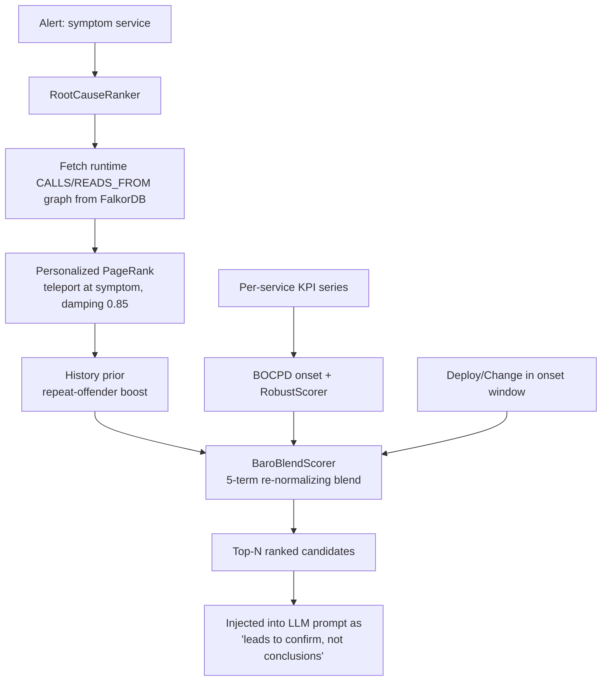

## Abstract

This paper describes the deterministic, training-free pre-LLM scoring layer of the BlueRobin Debug Agent, an advisory root-cause-analysis (RCA) system for a self-hosted homelab operated under a hard ~50 EUR/month budget. Before any large-language-model (LLM) tokens are spent, the system seeds the agent's hypothesis space with a ranked candidate list produced entirely by classical, parameter-free graph and time-series statistics. The core is a four-stage pipeline: (1) an error-rate-weighted *personalized PageRank* over the runtime dependency graph that propagates "blame" from the alerting (symptom) service to the dependencies it transitively calls; (2) a Bayesian repeat-offender history prior; (3) a parameter-free Bayesian Online Change-Point Detection (BOCPD) onset detector paired with a nonparametric, median-based robust scorer in the style of BARO (Pham et al., 2024; arXiv:2405.09330); and (4) a five-term re-normalizing additive blend (`w_topo=0.35, w_tele=0.25, w_hist=0.15, w_chg=0.15, w_baro=0.10`) that provably collapses byte-for-byte to a topology/telemetry/history baseline when any lane is absent. The design makes an explicit, repeatedly enforced architectural choice: it uses *correlation and change-point* signals only and rejects causal discovery (PC/FCI/Granger/learned causal graphs), a decision validated against two independent re-evaluations of the RCA literature and policed by a CI reflection scan over the scoring assembly. We report results on a self-seeded nine-incident benchmark with the explicit caveat — shared by the authors — that it is an oversimplified benchmark and that the reported MTTR figures are sub-second replay-clock proxies, not production mean-time-to-resolution.

## 1. Introduction

Modern microservice RCA increasingly reaches for an LLM agent: a ReAct-style loop that calls observability tools, reads traces and logs, and narrates a hypothesis. The honest published ceiling for *autonomous* LLM RCA is low — the best agent on OpenRCA (Xu et al., 2025) reaches roughly 11.3% exact-match, and the best frontier model on ITBench-AA (IBM/Artificial Analysis, 2026) roughly 47% precision-at-full-recall. LLM-only RCA is also structurally fragile: it lacks grounding in system topology, it hallucinates plausible-but-wrong causes, and — per the MAST failure taxonomy (Cemri et al., 2025) — its dominant failure modes are *incorrect self-verification* and *premature termination*. An agent dropped cold into a tool loop wastes its turn budget rediscovering the obvious shape of the system on every incident.

The pre-LLM scoring layer described here addresses the *cold-start* problem directly. Rather than asking the model to find the needle from scratch, the system computes a ranked candidate list deterministically and injects it into the prompt as "prioritised leads to confirm, not conclusions." The leads come from cheap, well-understood statistics that independent benchmarks show *beat* the expensive causal-discovery machinery on real data. The LLM's job is then verification and narration, not blind search.

The contributions of this paper are:

- **An error-weighted personalized PageRank "blame propagation" pre-ranker** (`PageRank.cs`, `RootCauseRanker.cs`) that seeds the teleport vector at the symptom service and amplifies blame flow along high-error dependency edges — a power-iteration computation with no external dependency, fully deterministic, computed in microseconds on a homelab-sized graph.
- **A parameter-free BOCPD onset detector plus a nonparametric robust scorer** (`BaroAnomalyScorer.cs`) that reproduces the BARO recipe in dependency-free C#: no hazard knob, no training, no GPU, total on degenerate input.
- **A five-term re-normalizing additive blend** (`BaroBlendScorer.cs`) with a *provable fail-open collapse*: when the change lane and/or BARO lane are absent, the blend reduces byte-for-byte to a two- or three-term baseline, so the ranker degrades gracefully rather than failing closed.
- **An explicit, CI-enforced rejection of causal discovery.** The scoring assembly carries no PC/FCI/Granger/causal-graph code, and a reflection scan (TS-57) fails the build if a causal symbol appears. We justify this against the literature rather than asserting it.
- **A budget-first systems posture.** The entire layer runs inside an already-deployed 2 GiB FalkorDB instance with zero new always-on workload, consistent with the platform's ~50 EUR/month ceiling.

This is a systems / experience report, not an empirical breakthrough. The layer is advisory by design — a human always merges — and the evaluation is deliberately modest.

## 2. Related Work

**Classical and statistical RCA.** Spectrum-and-random-walk methods rank suspect services by propagating anomaly mass over a dependency graph. MicroRank (Yu et al., WWW'21; doi:10.1145/3442381.3449905) combines spectrum analysis with PageRank-style blame propagation; TraceRCA (Li et al., IWQoS'21) mines suspicious sets from anomalous traces and ranks by conditional probability. BARO (Pham et al., 2024; arXiv:2405.09330) detects the failure *onset* with multivariate BOCPD and then ranks with a nonparametric RobustScorer; it is parameter-free, training-free, and runs in roughly 0.01 s. Our pre-LLM layer sits squarely in this family: error-weighted personalized PageRank for propagation, plus a hand-rolled BARO core for onset and robust ranking.

**Causal RCA, and why we decline it.** A parallel line of work learns a causal graph and infers the root from it: CIRCA (Li et al., KDD'22; arXiv:2206.05871) frames a fault as an intervention and applies a regression-based hypothesis test; RCD (Ikram et al., NeurIPS'22) does localized causal discovery with a ψ-PC variant; RUN (Lin et al., AAAI'24; arXiv:2402.01140) combines neural Granger causality with personalized PageRank. The decisive evidence against adopting causal *discovery* in our setting comes from two independent re-evaluations. RCAEval (Pham et al., 2024; arXiv:2412.17015) re-runs 15 baselines across 735 cases and finds correlation methods (BARO Avg@5 0.80, TraceRCA 0.77) decisively beating causal ones (CIRCA 0.46, MicroCause 0.20, RCD 0.13). "Root Cause Analysis with LLMs... How Far Are We from Causal Inference?" (Zhang et al., ASE'24; arXiv:2408.13729) finds PC/FCI/Granger full-graph methods are "no better or only slightly better than random," require the *exact* failure time (a 60 s error degrades them significantly), and blow up computationally (PC+KCI exceeding an hour per case at ten nodes versus BARO's ~0.01 s). The defensible causal *idea* — "fault as intervention" — survives in our change-correlation term; the *graph-learning step* is the weak, expensive link we drop.

**Anomaly detection.** TSB-AD (Liu & Paparrizos, VLDB'24) benchmarks 40 algorithms over 1,070 series and concludes that "simpler architectures and statistical methods often yield better performance"; foundation models neither win nor pay for their 10–50× slowdown. This is the empirical warrant for a median-based, distribution-free robust scorer over a learned detector.

**Benchmarks.** OpenRCA (arXiv, ICLR'25), AIOpsLab (Chen et al., 2025; arXiv:2501.06706), ITBench (arXiv:2502.05352) and RCAEval (arXiv:2412.17015) supply the metric vocabulary (AC@k, Avg@k, MRR, MTTD/MTTR/TTM) we adopt internally. RCAEval's AC@k/Avg@k/MRR is the closest analogue to our own scorecard. A standing caveat (arXiv:2510.04711) warns that current RCA benchmarks are oversimplified and overstate real capability — a caveat we apply to our own nine-incident set in §7.

## 3. Method / Architecture

The pre-LLM layer transforms an incoming alert into a ranked list of candidate root causes using only deterministic statistics. Figure 1 shows where it sits.



*Figure 1. The deterministic pre-LLM scoring pipeline. Every box is pure, training-free, and runs before a single LLM token is spent.*

### 3.1 Personalized PageRank blame propagation

The substrate is the runtime dependency graph: `Service-[:CALLS|READS_FROM]->Service` edges in the persistent `bluerobin_stack` FalkorDB graph, each carrying a measured `error_rate` from Tempo service-graph metrics. `RootCauseRanker.RankAsync` (per **FEAT-027 / FR-SG-6**, the RCA query API requirement) fetches the *whole* runtime graph — it is small, tens of edges on a homelab — with a single parameterless Cypher template, never caller-interpolated (**SEC-SG-4**, parameterized Cypher only):

```cypher
MATCH (a:Service)-[e:CALLS|READS_FROM]->(b:Service)
RETURN a.name, b.name, coalesce(e.error_rate, 0.0)
```

Each directed edge is weighted

```
w(from → to) = BaseEdgeWeight(0.1) + error_rate
```

The base weight keeps the graph connected so blame can flow at all; the additive `error_rate` term amplifies flow toward failing dependencies. The ranker then runs weighted *personalized* PageRank (`PageRank.Run`), where the personalization (teleport) vector is a point mass at the symptom service:

```
teleport = { [symptomService] = 1.0 }   // all other nodes 0
damping  = 0.85
iterations = 50   // fixed → deterministic, no convergence-tolerance nondeterminism
```

Power iteration is initialized at the teleport distribution. At every step, mass is mixed `(1 − d)` toward the teleport vector and `d` along row-normalized out-edges; dangling nodes (no usable out-edge) redistribute their mass through the teleport vector. Because all blame re-injects at the symptom, score concentrates on the dependencies the symptom transitively calls, weighted by how error-prone those paths are. This is "blame propagation": the symptom is innocent of *being* the cause but is the seed from which suspicion flows downstream. The implementation is pure and dependency-free, returns a distribution summing to ~1, and is fully unit-tested. Per-node anomaly teleport (seeding mass at *every* anomalous service, not just the symptom) is noted in the code as a deliberate future refinement; today the teleport is symptom-only.

### 3.2 Bayesian repeat-offender history prior

PageRank scores a candidate `c` are folded with a multiplicative history prior:

```
score'(c) = score(c) · (1 + HistoryInfluence(0.5) · prior(c))
```

where `prior(c) ∈ [0,1]` is a Bayesian repeat-offender estimate drawn from the graph's RCA write-back history (`ROOT_CAUSED_BY` edges from past validated incidents). A service that has been the validated root cause before is, all else equal, a more credible candidate — a cheap Bayesian shrinkage toward known offenders, capped at a 1.5× boost so history can never dominate live error signal.

### 3.3 Parameter-free BOCPD onset detection and the robust scorer

The change-point lane (`BaroAnomalyScorer.cs`, per **FR-SG-30** and **ADR-037 D5**) reproduces BARO in dependency-free C#. It has three pieces:

- **`BocpdChangePoint.DetectOnset`** — a parameter-free retrospective change-point detector over a single KPI series. It sweeps every candidate boundary `k` and chooses the one that maximizes the two-segment Gaussian log-likelihood gain over the no-change (single-segment) model, each segment scored under its own MLE mean and variance (the offline reduction of a Normal–Gamma conjugate posterior). Crucially, *no hazard or threshold knob is passed in*: the significance test is a BIC-style penalty derived from series length,

  ```
  onset = argmax_k [ LL(0,k) + LL(k,n) − LL(0,n) ]   if gain > log(n)  else  null
  ```

  so a flat or stationary series yields *no* onset — the fail-open sentinel that prevents fabricating a change-point where none exists. A variance floor keeps a perfect step finite. A minimum segment length of 3 guarantees each side has a defined mean and variance.

- **`RobustScorer`** — the nonparametric BARO scorer: the *robust relative magnitude* of the post-onset level shift, computed median-based and scale-free across heterogeneous KPIs, with **no Gaussian/z-score assumption**. Bounded to [0,1]; exactly 0 when there is no onset or no shift.

- **`BaroAnomalyScorer`** — the façade the ranker consumes. Given a service's three Tempo service-graph KPI series (`ServiceKpiSeries`: call-rate, error-ratio, p95-latency), it returns the maximum robust shift across those KPIs as a bounded `baro` sub-score (multivariate by max-pooling; 0 ⇒ no boost).

The whole core is pure, dependency-free, and total on empty/short input, mirroring the existing `AnomalyStatistics` discipline.

### 3.4 The five-term re-normalizing additive blend

`BaroBlendScorer` (per **FR-SG-30**, **NFR-SG-2**, **ADR-037 §T5**) fuses five deterministic sub-scores into one ranking score. The blend evolved across increments; the canonical five-term form and its weights are:

| Term | Weight | Source signal |
|---|---|---|
| `topo` | **0.35** | topology criticality of the candidate service |
| `tele` | **0.25** | telemetry: measured error rate on the dependency edge (halved if the edge is `stale`) |
| `hist` | **0.15** | repeat-offender history prior (§3.2) |
| `chg` | **0.15** | onset-window change recency (Deploy/Change near the onset) |
| `baro` | **0.10** | BARO robust change-point sub-score (§3.3) |

The weights sum to 1.0. The change term `chg(c)` is the maximum over in-window Deploy/Change events of a recency ramp `1 − ((T − ts)/W)` over a half-open onset window `[T − W, T]` with `W = 1800 s` — privileging the deploy or commit nearest the failure onset, the single strongest signal in the SRE literature (Google's "≈70% of outages are change-induced").

The **fail-open collapse** is the load-bearing guarantee (**NFR-SG-2**). When a lane's signal is absent — no Deploy/Change in window, or a KPI series too short for BOCPD — the blend *re-normalizes over the present terms only* rather than penalizing the candidate with a zero. Concretely:

- All five present → `0.35/0.25/0.15/0.15/0.10`.
- BARO absent, change present → the four-term blend `0.40/0.30/0.15/0.15`.
- Change and BARO both absent → the three-term baseline `0.50/0.35/0.15` (topo/tele/hist).

Each collapse is *byte-for-byte identical* to the earlier-increment scorer it reduces to — the four-term `OnsetWindowChangeScorer` delegates to the three-term `RootCauseScorer` when the change lane is empty, and the five-term `BaroBlendScorer` delegates to the four-term form when BARO is empty. This is what lets the layer ship a richer ranker without risking a regression: with the new lanes off, the output is provably the old output. Ties break deterministically (score descending, then `NodeId` ascending) — a fix for an early flaky AC@1 caused by FalkorDB returning rows in nondeterministic order.

### 3.5 The deliberate rejection of causal discovery

The scoring assembly is annotated and tested as **"correlation + change-point only — explicitly NO causal discovery (PC/FCI/Granger/causal-graph)."** This is not an omission; it is an enforced invariant. A reflection scan (TS-57) runs over the analysis assembly in CI and fails the build if any causal-discovery symbol is present. The justification is the §2 evidence: on independent benchmarks, correlation and change-point beat learned causal graphs, while causal discovery demands exact fault timing and prohibitive compute. The "fault-as-intervention" framing we *do* keep — but it lives entirely in the change-correlation term (a deploy in the onset window *is* the intervention), not in any structure-learning step.

## 4. Implementation

The layer is C# (.NET 10), part of the Debug Agent service (FEAT-008 / FEAT-027). Key types:

| Component | File | Role |
|---|---|---|
| `PageRank` | `Analysis/PageRank.cs` | pure weighted personalized PageRank (power iteration) |
| `RootCauseRanker` | `Analysis/RootCauseRanker.cs` | fetches the runtime graph, builds edge weights, runs PageRank + history prior |
| `BocpdChangePoint` | `Analysis/BaroAnomalyScorer.cs` | parameter-free BOCPD onset detection |
| `RobustScorer` / `BaroAnomalyScorer` | `Analysis/BaroAnomalyScorer.cs` | nonparametric robust shift magnitude → `[0,1]` |
| `OnsetWindowChangeScorer` | `StackGraph/OnsetWindowChangeScorer.cs` | four-term blend (`0.40/0.30/0.15/0.15`) |
| `BaroBlendScorer` | `StackGraph/BaroBlendScorer.cs` | five-term blend (`0.35/0.25/0.15/0.15/0.10`) |

**Graph store.** The runtime dependency graph lives in the existing FalkorDB instance (`falkordb/falkordb:v4.4.1`, Redis wire protocol on port 6379, 2 GiB memory limit) as a second graph key `bluerobin_stack`, queried with parameterized OpenCypher via `GRAPH.QUERY`. No second time-series database and no new always-on workload is introduced; the `bluerobin` node is memory-saturated, which is the binding constraint behind reusing the deployed FalkorDB rather than standing up a dedicated graph engine.

**Telemetry source.** Edge `error_rate` and the per-service KPI series come from Tempo's metrics-generator service graphs (`traces_service_graph_request_*`) — the dependency graph and the RED signals are read from the same observability plane the cluster already runs. Change/Deploy nodes are ingested from Flux reconciliations and Git commits.

**Cost.** The entire pre-LLM layer consumes *zero* LLM tokens: PageRank, BOCPD, the robust scorer, and the blend are all CPU-only arithmetic over a tens-of-edges graph and short KPI windows, completing in well under a millisecond. This is what makes a graph-grounded RCA stack viable under the platform's hard ceiling — Hetzner worker ≈ €17.5/mo, Cloudflare R2/Tunnel free tier, and an LLM budget capped at €20/mo (COST-7), for ~50 EUR/month total. The expensive alternative — GraphRAG-style community indexing at roughly $20–40 per 1M tokens, or causal discovery at >1 hr/case — is explicitly out of budget. Spending the LLM budget only on *verifying* a deterministically-computed shortlist is the core FinOps move.

```csharp
// RootCauseRanker.RankAsync — error-weighted personalized PageRank seed (abridged)
var weight = BaseEdgeWeight + (err > 0 ? err : 0);        // 0.1 + error_rate
var scores = PageRank.Run(
    nodes, outEdges,
    teleport: new Dictionary<string, double> { [symptomService] = 1.0 },
    damping: 0.85, iterations: 50);
// fold the repeat-offender prior: score * (1 + 0.5 * prior[node])
```

The ranker is advisory and best-effort by contract (**NFR-SG-2**): an empty, stale, or unreachable graph yields no candidates and never throws — the agent then proceeds on its cold tool-floor. This fail-open posture is the same one the blend's re-normalization enforces at the scoring level: every degradation path returns a valid (possibly empty) ranking rather than an error.

## 5. Evaluation

The pre-LLM ranker is exercised by a deterministic offline replay harness (`RcaEvalHarness`, per **FR-SG-23** / **ADR-036**) that replays a labelled ground-truth incident set through the *real* ranking path over a seeded FalkorDB and emits an AC@1 + MTTR scorecard. The set is **nine self-seeded labelled incidents** spanning three fault classes (auth/login, data/datastore, deploy/config), drawn from existing synthetic faults — no ChaosMesh — so the set is not trivially gameable.

The harness has two arms. The **scorer-only** arm plants the labelled cause as an unambiguous top-1, so its AC@1 = 1.0 *by construction* — a regression sentinel, not an accuracy measure. The honest arm is **`ReplayLivePathAsync`**, the live-path arm, which derives onset from the alert and **injects distractor candidates** (a deliberate topology trap: distractor criticality 0.95 *above* the true cause's 0.9, distractor error-rate 0.55) so that AC@1 < 1.0 is achievable. Results:

| Arm | AC@1 | Avg@k | MRR | MTTR (s, replay-clock) | Incidents |
|---|---|---|---|---|---|
| Scorer-only baseline (1.0 by construction) | 1.0 | 1.0 | 1.0 | 0.0017 | 9 |
| **Live-path baseline (distractors injected)** | **1.0** | 1.0 | 1.0 | 0.0032 | 9 |

On the nine-incident set, the ranker localizes the labelled root cause at top-1 in all nine incidents *even with distractors injected*. Avg@k and MRR reduce to AC@1 here because each incident carries a single labelled cause scored at top-1 (per ADR-036 D1; extended when multi-candidate labels land). The per-commit merge gate fails any candidate that drops AC@1 below 0.98 or inflates MTTR by more than 30 s (`GateTolerance(AcAt1Drop: 0.02, MttrSecondsIncrease: 30.0)`).

**Ablations.** Because the five-term blend collapses byte-for-byte when lanes are disabled, the harness runs *shadow-vs-active* ablations: with the BARO/change lanes in shadow mode the scorecard is identical to the baseline (the "feature off" control), and the two change-induced incidents (GT-03 bad-deploy, GT-07 bad-commit) must keep AC@1 = 1.0 in every active-mode run — a guard that the new lanes never *suppress* a true positive they should have surfaced. There is no graph-vs-no-graph ablation as a graded metric: the graph is the substrate of the entire RCA path, and "no graph" surfaces only as the three-term fail-open floor.

## 6. Limitations & Threats to Validity

We state these plainly; the authors themselves call the benchmark oversimplified.

- **The benchmark is small and self-seeded.** Nine incidents, three fault classes, labelled by the same authors who built the system. AC@1 = 1.0 on this set is *not* evidence of production accuracy. It is a regression sentinel and a sanity check, nothing more. External yardsticks (OpenRCA ≈ 11%, ITBench-AA ≈ 47%) are referenced as context, never as something this set is comparable to.
- **MTTR is a replay-clock proxy.** The reported sub-second MTTR figures are the wall-clock around an in-process replay, not time-to-resolution of a real incident. Production MTTD/MTTA/MTTR are computed separately from live lifecycle data (SLO-15/SLO-16), but no measured production value is claimed here.
- **The distractor trap is hand-designed.** The live-path arm's distractors are deliberately adversarial on topology but were authored by us; a different distractor distribution could lower AC@1. We make no claim that the trap is representative of real misleading topology.
- **Symptom-only teleport.** PageRank seeds blame solely at the alerting service. Multi-symptom incidents, where several services are independently anomalous, are not yet modeled by per-node anomaly teleport (a noted future refinement). Single-root-cause is an assumption baked into the current scorer.
- **Correlation is not causation — by design.** We deliberately do *not* attempt causal discovery, so the ranker can be fooled by a confounded correlation (e.g. a shared upstream that fails two services at once). The change-correlation term mitigates but does not eliminate this; the human-in-the-loop merge is the backstop.
- **Advisory only.** Nothing auto-remediates. Every output is a lead for a human reviewer. This matches the state of the art for autonomous RCA rather than conceding a limitation — but it does mean the layer's value is measured by how well it *focuses* a human, which this benchmark does not capture.

## 7. Conclusion

The pre-LLM scoring layer demonstrates that a large fraction of the RCA problem can be handled *before* the LLM ever runs, using deterministic, training-free statistics that the independent literature shows outperform expensive causal discovery. Error-weighted personalized PageRank propagates blame from symptom to suspect; a parameter-free BOCPD onset detector and a nonparametric robust scorer reproduce BARO with no training and no GPU; and a five-term re-normalizing blend fuses these with a provable fail-open collapse to a baseline. The whole layer runs in microseconds inside an already-deployed FalkorDB, consuming no LLM tokens, which is precisely what makes a graph-grounded agentic RCA stack feasible at ~50 EUR/month. The headline is not an accuracy number — our benchmark is too small and too friendly for that — but an architecture: spend deterministic compute to build a shortlist, spend scarce LLM tokens only to verify it, and refuse, on the evidence, to learn a causal graph.

## 8. References

1. Pham, L., et al. *BARO: Robust Root Cause Analysis with Bayesian Online Change-Point Detection.* FSE 2024. arXiv:2405.09330. https://arxiv.org/abs/2405.09330
2. Pham, L., et al. *RCAEval: A Benchmark for Root Cause Analysis of Microservice Systems.* WWW 2025. arXiv:2412.17015. https://arxiv.org/abs/2412.17015
3. Zhang, et al. *Root Cause Analysis with LLMs... How Far Are We from Causal Inference?* ASE 2024. arXiv:2408.13729. https://arxiv.org/abs/2408.13729
4. Li, M., et al. *CIRCA: Causal Inference-based Root Cause Analysis (Regression-based Hypothesis Testing).* KDD 2022. arXiv:2206.05871. https://arxiv.org/abs/2206.05871
5. Ikram, A., et al. *RCD: Root Cause Discovery via Localized Causal Discovery.* NeurIPS 2022. https://openreview.net/forum?id=weoLjoYFvXY
6. Lin, et al. *RUN: Neural Granger Causality + Personalized PageRank for RCA.* AAAI 2024. arXiv:2402.01140. https://arxiv.org/abs/2402.01140
7. Yu, G., et al. *MicroRank: End-to-End Latency Issue Localization with Spectrum + PageRank.* WWW 2021. https://dl.acm.org/doi/10.1145/3442381.3449905
8. Li, Z., et al. *TraceRCA: Practical Root Cause Localization for Microservice Systems via Trace Analysis.* IWQoS 2021. https://ieeexplore.ieee.org/document/9521340/
9. Liu, Q., & Paparrizos, J. *TSB-AD: The Elephant in the Room — Towards a Reliable Time-Series Anomaly Detection Benchmark.* VLDB 2024. https://github.com/thedatumorg/TSB-AD
10. Cemri, M., et al. *Why Do Multi-Agent LLM Systems Fail? (MAST Failure Taxonomy).* IBM + UC Berkeley, 2025. https://huggingface.co/blog/ibm-research/itbenchandmast
11. Xu, J., et al. *OpenRCA: Can Large Language Models Locate the Root Cause of Software Failures?* ICLR 2025. https://github.com/microsoft/OpenRCA
12. Chen, et al. *AIOpsLab: A Holistic Framework for Evaluating AI Agents for Operations.* 2025. arXiv:2501.06706. https://arxiv.org/abs/2501.06706
13. IBM Research / Artificial Analysis. *ITBench-AA: Agentic SRE Root-Cause Analysis Benchmark.* 2026. https://huggingface.co/blog/ibm-research/itbench-aa
14. *Rethinking the Evaluation of Root Cause Analysis: A Fault-Propagation-Aware Benchmark.* 2025. arXiv:2510.04711. https://arxiv.org/abs/2510.04711
15. Beyer, B., et al. *Site Reliability Engineering (Google SRE Book).* O'Reilly, 2016. https://sre.google/sre-book/introduction/
