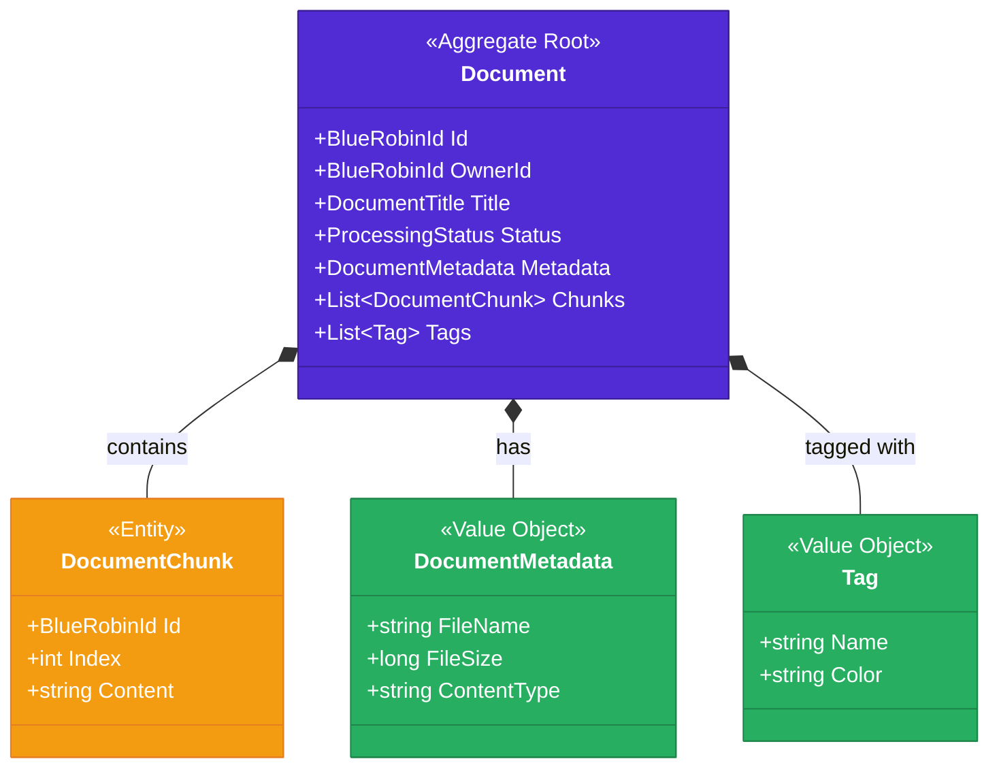

import Callout from '@components/Callout.astro';
import ImplementationNote from '@components/ImplementationNote.astro';
import ExternalCite from '@components/ExternalCite.astro';

Aggregates are the cornerstone of tactical Domain-Driven Design. They define consistency boundaries, encapsulate business rules, and serve as the unit of persistence. In this article, we'll explore how to design and implement aggregates that protect your domain invariants.

## What is an Aggregate?

An aggregate is a cluster of domain objects (entities and value objects) that form a consistency boundary. The aggregate root is the single entry point for all modifications to the cluster.



## Design Principles

### 1. Small Aggregates

Keep aggregates small. Each aggregate should represent a single transactional consistency boundary.

```csharp
// ❌ Bad: Too large, mixing concerns
public class User
{
    public List<Document> Documents { get; } // Wrong boundary
    public List<Subscription> Subscriptions { get; }
    public List<AuditLog> AuditLogs { get; }
}

// ✅ Good: Focused aggregate
public sealed class Document : AggregateRoot<BlueRobinId>
{
    public BlueRobinId OwnerId { get; private set; }
    public DocumentTitle Title { get; private set; }
    public ProcessingStatus Status { get; private set; }
    
    private readonly List<DocumentChunk> _chunks = [];
    public IReadOnlyCollection<DocumentChunk> Chunks => _chunks.AsReadOnly();
}
```

### 2. Reference by Identity

Aggregates reference other aggregates by ID, not by direct object reference.

```csharp
public sealed class Document : AggregateRoot<BlueRobinId>
{
    // ✅ Reference by ID
    public BlueRobinId OwnerId { get; private set; }
    public BlueRobinId? ArchiveId { get; private set; }
    
    // ❌ Never direct references to other aggregates
    // public User Owner { get; private set; }
}
```

### 3. Enforce Invariants

All business rules are enforced within the aggregate boundary.

```csharp
public sealed class Document : AggregateRoot<BlueRobinId>
{
    private readonly List<DocumentChunk> _chunks = [];
    
    public void AddChunk(string content, int sequenceNumber)
    {
        // Invariant: Chunks must be in sequence
        if (_chunks.Any(c => c.SequenceNumber == sequenceNumber))
        {
            throw new DomainException($"Chunk with sequence {sequenceNumber} already exists");
        }
        
        // Invariant: Cannot add chunks to failed documents
        if (Status == ProcessingStatus.Failed)
        {
            throw new DomainException("Cannot add chunks to a failed document");
        }
        
        var chunk = DocumentChunk.Create(Id, content, sequenceNumber);
        _chunks.Add(chunk);
        
        AddDomainEvent(new ChunkAddedEvent(Id, chunk.Id, sequenceNumber));
    }
}
```

## Implementing the Document Aggregate

Let's build a complete document aggregate for BlueRobin's archive system.

### The Aggregate Root

```csharp
// Core/Entities/Document.cs
public sealed class Document : AggregateRoot<BlueRobinId>
{
    public BlueRobinId OwnerId { get; private set; }
    public DocumentTitle Title { get; private set; }
    public FileName OriginalFileName { get; private set; }
    public FileSize Size { get; private set; }
    public ContentType ContentType { get; private set; }
    public ProcessingStatus Status { get; private set; }
    public FingerPrint? FingerPrint { get; private set; }
    public DocumentMetadata? Metadata { get; private set; }
    public DateTimeOffset CreatedAt { get; private set; }
    public DateTimeOffset? ProcessedAt { get; private set; }
    
    private readonly List<DocumentChunk> _chunks = [];
    public IReadOnlyCollection<DocumentChunk> Chunks => _chunks.AsReadOnly();
    
    private readonly List<Tag> _tags = [];
    public IReadOnlyCollection<Tag> Tags => _tags.AsReadOnly();
    
    // Required for EF Core
    private Document() { }
    
    private Document(
        BlueRobinId id,
        BlueRobinId ownerId,
        DocumentTitle title,
        FileName originalFileName,
        FileSize size,
        ContentType contentType)
    {
        Id = id;
        OwnerId = ownerId;
        Title = title;
        OriginalFileName = originalFileName;
        Size = size;
        ContentType = contentType;
        Status = ProcessingStatus.Pending;
        CreatedAt = DateTimeOffset.UtcNow;
    }
    
    public static Document Create(
        BlueRobinId ownerId,
        DocumentTitle title,
        FileName originalFileName,
        FileSize size,
        ContentType contentType)
    {
        var document = new Document(
            BlueRobinId.New(),
            ownerId,
            title,
            originalFileName,
            size,
            contentType);
        
        document.AddDomainEvent(new DocumentCreatedEvent(
            document.Id,
            ownerId,
            title.Value,
            originalFileName.Value));
        
        return document;
    }
    
    // State transitions
    public void StartProcessing()
    {
        if (Status != ProcessingStatus.Pending)
        {
            throw new InvalidStateTransitionException(Status, ProcessingStatus.Processing);
        }
        
        Status = ProcessingStatus.Processing;
        AddDomainEvent(new DocumentProcessingStartedEvent(Id));
    }
    
    public void CompleteOcr(string extractedText, FingerPrint fingerPrint)
    {
        if (Status != ProcessingStatus.Processing)
        {
            throw new InvalidStateTransitionException(Status, ProcessingStatus.OcrComplete);
        }
        
        FingerPrint = fingerPrint;
        Status = ProcessingStatus.OcrComplete;
        
        AddDomainEvent(new DocumentOcrCompletedEvent(Id, extractedText, fingerPrint.Value));
    }
    
    public void CompleteProcessing(DocumentMetadata metadata)
    {
        if (Status != ProcessingStatus.Embedding)
        {
            throw new InvalidStateTransitionException(Status, ProcessingStatus.Completed);
        }
        
        Metadata = metadata;
        Status = ProcessingStatus.Completed;
        ProcessedAt = DateTimeOffset.UtcNow;
        
        AddDomainEvent(new DocumentProcessingCompletedEvent(Id, metadata));
    }
    
    public void MarkFailed(string reason)
    {
        Status = ProcessingStatus.Failed;
        AddDomainEvent(new DocumentProcessingFailedEvent(Id, reason));
    }
    
    // Chunk management
    public DocumentChunk AddChunk(string content, int sequenceNumber, float[] embedding)
    {
        ValidateChunkAddition(sequenceNumber);
        
        var chunk = DocumentChunk.Create(Id, content, sequenceNumber, embedding);
        _chunks.Add(chunk);
        
        AddDomainEvent(new ChunkCreatedEvent(Id, chunk.Id, sequenceNumber));
        
        return chunk;
    }
    
    private void ValidateChunkAddition(int sequenceNumber)
    {
        if (Status == ProcessingStatus.Failed)
        {
            throw new DomainException("Cannot add chunks to a failed document");
        }
        
        if (Status == ProcessingStatus.Completed)
        {
            throw new DomainException("Cannot add chunks to a completed document");
        }
        
        if (_chunks.Any(c => c.SequenceNumber == sequenceNumber))
        {
            throw new DomainException($"Chunk {sequenceNumber} already exists");
        }
        
        if (sequenceNumber > 0 && !_chunks.Any(c => c.SequenceNumber == sequenceNumber - 1))
        {
            throw new DomainException($"Chunks must be added in sequence. Missing chunk {sequenceNumber - 1}");
        }
    }
    
    // Tag management
    public void AddTag(Tag tag)
    {
        if (_tags.Any(t => t.Name == tag.Name))
        {
            return; // Idempotent
        }
        
        _tags.Add(tag);
        AddDomainEvent(new TagAddedEvent(Id, tag.Name));
    }
    
    public void RemoveTag(string tagName)
    {
        var tag = _tags.FirstOrDefault(t => t.Name == tagName);
        if (tag is null) return;
        
        _tags.Remove(tag);
        AddDomainEvent(new TagRemovedEvent(Id, tagName));
    }
    
    // Title update
    public void UpdateTitle(DocumentTitle newTitle)
    {
        if (Title == newTitle) return;
        
        var oldTitle = Title;
        Title = newTitle;
        
        AddDomainEvent(new DocumentTitleChangedEvent(Id, oldTitle.Value, newTitle.Value));
    }
}
```

### Processing Status Enum

```csharp
// Core/Enums/ProcessingStatus.cs
public enum ProcessingStatus
{
    Pending = 0,
    Processing = 1,
    OcrComplete = 2,
    Chunking = 3,
    Embedding = 4,
    Completed = 5,
    Failed = 99
}

// Core/Exceptions/InvalidStateTransitionException.cs
public sealed class InvalidStateTransitionException : DomainException
{
    public ProcessingStatus CurrentStatus { get; }
    public ProcessingStatus TargetStatus { get; }
    
    public InvalidStateTransitionException(
        ProcessingStatus current,
        ProcessingStatus target)
        : base($"Cannot transition from {current} to {target}")
    {
        CurrentStatus = current;
        TargetStatus = target;
    }
}
```

### Child Entity: DocumentChunk

```csharp
// Core/Entities/DocumentChunk.cs
public sealed class DocumentChunk : Entity<BlueRobinId>
{
    public BlueRobinId DocumentId { get; private set; }
    public string Content { get; private set; }
    public int SequenceNumber { get; private set; }
    public int TokenCount { get; private set; }
    public float[] Embedding { get; private set; }
    public DateTimeOffset CreatedAt { get; private set; }
    
    private DocumentChunk() { }
    
    internal static DocumentChunk Create(
        BlueRobinId documentId,
        string content,
        int sequenceNumber,
        float[] embedding)
    {
        if (string.IsNullOrWhiteSpace(content))
        {
            throw new ArgumentException("Chunk content cannot be empty", nameof(content));
        }
        
        if (embedding.Length == 0)
        {
            throw new ArgumentException("Embedding cannot be empty", nameof(embedding));
        }
        
        return new DocumentChunk
        {
            Id = BlueRobinId.New(),
            DocumentId = documentId,
            Content = content,
            SequenceNumber = sequenceNumber,
            TokenCount = EstimateTokenCount(content),
            Embedding = embedding,
            CreatedAt = DateTimeOffset.UtcNow
        };
    }
    
    private static int EstimateTokenCount(string content)
    {
        // Rough estimate: ~4 characters per token
        return content.Length / 4;
    }
}
```

<ImplementationNote>
Child entities like `DocumentChunk` have `internal static` factory methods. Only the aggregate root can create them, enforcing the consistency boundary.
</ImplementationNote>

## Aggregate Root Base Class

```csharp
// Core/Primitives/AggregateRoot.cs
public abstract class AggregateRoot<TId> : Entity<TId>, IAggregateRoot
    where TId : notnull
{
    private readonly List<IDomainEvent> _domainEvents = [];
    
    public IReadOnlyCollection<IDomainEvent> DomainEvents => _domainEvents.AsReadOnly();
    
    public int Version { get; protected set; }
    
    protected void AddDomainEvent(IDomainEvent domainEvent)
    {
        _domainEvents.Add(domainEvent);
    }
    
    public void ClearDomainEvents()
    {
        _domainEvents.Clear();
    }
    
    public void IncrementVersion()
    {
        Version++;
    }
}

public interface IAggregateRoot
{
    IReadOnlyCollection<IDomainEvent> DomainEvents { get; }
    void ClearDomainEvents();
}
```

## State Machine Pattern

For complex status workflows, implement explicit state transitions:

```csharp
// Core/StateMachine/DocumentStateMachine.cs
public static class DocumentStateMachine
{
    private static readonly Dictionary<ProcessingStatus, ProcessingStatus[]> ValidTransitions = new()
    {
        [ProcessingStatus.Pending] = [ProcessingStatus.Processing, ProcessingStatus.Failed],
        [ProcessingStatus.Processing] = [ProcessingStatus.OcrComplete, ProcessingStatus.Failed],
        [ProcessingStatus.OcrComplete] = [ProcessingStatus.Chunking, ProcessingStatus.Failed],
        [ProcessingStatus.Chunking] = [ProcessingStatus.Embedding, ProcessingStatus.Failed],
        [ProcessingStatus.Embedding] = [ProcessingStatus.Completed, ProcessingStatus.Failed],
        [ProcessingStatus.Completed] = [],
        [ProcessingStatus.Failed] = [ProcessingStatus.Pending] // Retry
    };
    
    public static bool CanTransition(ProcessingStatus from, ProcessingStatus to)
    {
        return ValidTransitions.TryGetValue(from, out var allowed) && allowed.Contains(to);
    }
    
    public static void ValidateTransition(ProcessingStatus from, ProcessingStatus to)
    {
        if (!CanTransition(from, to))
        {
            throw new InvalidStateTransitionException(from, to);
        }
    }
}

// Usage in Document aggregate
public void TransitionTo(ProcessingStatus newStatus)
{
    DocumentStateMachine.ValidateTransition(Status, newStatus);
    
    var oldStatus = Status;
    Status = newStatus;
    
    AddDomainEvent(new DocumentStatusChangedEvent(Id, oldStatus, newStatus));
}
```

## Repository Pattern

Aggregates are loaded and saved through repositories:

```csharp
// Application/Interfaces/IDocumentRepository.cs
public interface IDocumentRepository
{
    Task<Document?> GetByIdAsync(BlueRobinId id, CancellationToken ct = default);
    
    Task<Document?> GetByIdWithChunksAsync(BlueRobinId id, CancellationToken ct = default);
    
    Task<IReadOnlyList<Document>> GetByOwnerAsync(
        BlueRobinId ownerId,
        int skip = 0,
        int take = 20,
        CancellationToken ct = default);
    
    Task AddAsync(Document document, CancellationToken ct = default);
    
    Task UpdateAsync(Document document, CancellationToken ct = default);
    
    Task DeleteAsync(Document document, CancellationToken ct = default);
}

// Infrastructure/Persistence/Repositories/DocumentRepository.cs
public sealed class DocumentRepository : IDocumentRepository
{
    private readonly BlueRobinDbContext _context;
    
    public DocumentRepository(BlueRobinDbContext context)
    {
        _context = context;
    }
    
    public async Task<Document?> GetByIdAsync(BlueRobinId id, CancellationToken ct = default)
    {
        return await _context.Documents
            .Include(d => d.Tags)
            .FirstOrDefaultAsync(d => d.Id == id, ct);
    }
    
    public async Task<Document?> GetByIdWithChunksAsync(BlueRobinId id, CancellationToken ct = default)
    {
        return await _context.Documents
            .Include(d => d.Chunks.OrderBy(c => c.SequenceNumber))
            .Include(d => d.Tags)
            .FirstOrDefaultAsync(d => d.Id == id, ct);
    }
    
    public async Task AddAsync(Document document, CancellationToken ct = default)
    {
        await _context.Documents.AddAsync(document, ct);
    }
    
    public async Task UpdateAsync(Document document, CancellationToken ct = default)
    {
        document.IncrementVersion();
        _context.Documents.Update(document);
    }
    
    public async Task DeleteAsync(Document document, CancellationToken ct = default)
    {
        _context.Documents.Remove(document);
    }
}
```

<Callout type="tip">
Always load the minimum data needed. Use `GetByIdAsync` for simple operations and `GetByIdWithChunksAsync` only when chunks are needed.
</Callout>

## EF Core Configuration

```csharp
// Infrastructure/Persistence/Configurations/DocumentConfiguration.cs
public sealed class DocumentConfiguration : IEntityTypeConfiguration<Document>
{
    public void Configure(EntityTypeBuilder<Document> builder)
    {
        builder.ToTable("documents");
        
        builder.HasKey(d => d.Id);
        
        builder.Property(d => d.Id)
            .HasConversion(
                id => id.Value,
                value => BlueRobinId.From(value))
            .HasColumnName("id")
            .HasMaxLength(8);
        
        builder.Property(d => d.OwnerId)
            .HasConversion(
                id => id.Value,
                value => BlueRobinId.From(value))
            .HasColumnName("owner_id")
            .HasMaxLength(8)
            .IsRequired();
        
        builder.ComplexProperty(d => d.Title, titleBuilder =>
        {
            titleBuilder.Property(t => t.Value)
                .HasColumnName("title")
                .HasMaxLength(500)
                .IsRequired();
        });
        
        builder.ComplexProperty(d => d.OriginalFileName, fnBuilder =>
        {
            fnBuilder.Property(f => f.Value)
                .HasColumnName("original_file_name")
                .HasMaxLength(255)
                .IsRequired();
        });
        
        builder.ComplexProperty(d => d.Size, sizeBuilder =>
        {
            sizeBuilder.Property(s => s.Bytes)
                .HasColumnName("size_bytes")
                .IsRequired();
        });
        
        builder.Property(d => d.Status)
            .HasColumnName("status")
            .HasConversion<string>()
            .IsRequired();
        
        builder.Property(d => d.Version)
            .HasColumnName("version")
            .IsConcurrencyToken();
        
        // Chunks as owned entities
        builder.OwnsMany(d => d.Chunks, chunkBuilder =>
        {
            chunkBuilder.ToTable("document_chunks");
            
            chunkBuilder.HasKey(c => c.Id);
            
            chunkBuilder.Property(c => c.Id)
                .HasConversion(
                    id => id.Value,
                    value => BlueRobinId.From(value))
                .HasColumnName("id");
            
            chunkBuilder.Property(c => c.Content)
                .HasColumnName("content")
                .IsRequired();
            
            chunkBuilder.Property(c => c.SequenceNumber)
                .HasColumnName("sequence_number")
                .IsRequired();
            
            chunkBuilder.Property(c => c.Embedding)
                .HasColumnName("embedding")
                .HasColumnType("vector(384)");
            
            chunkBuilder.HasIndex(c => new { c.DocumentId, c.SequenceNumber })
                .IsUnique();
        });
        
        // Tags as value objects
        builder.OwnsMany(d => d.Tags, tagBuilder =>
        {
            tagBuilder.ToTable("document_tags");
            tagBuilder.Property(t => t.Name).HasColumnName("name");
            tagBuilder.HasIndex(t => t.Name);
        });
        
        builder.HasIndex(d => d.OwnerId);
        builder.HasIndex(d => d.Status);
        builder.HasIndex(d => d.CreatedAt);
    }
}
```

## Optimistic Concurrency

The `Version` property prevents lost updates:

```csharp
// In UpdateAsync
public async Task UpdateAsync(Document document, CancellationToken ct)
{
    try
    {
        document.IncrementVersion();
        _context.Documents.Update(document);
        await _context.SaveChangesAsync(ct);
    }
    catch (DbUpdateConcurrencyException)
    {
        throw new ConcurrencyException(
            $"Document {document.Id} was modified by another process");
    }
}
```

## Testing Aggregates

```csharp
// Tests/Core/DocumentTests.cs
public class DocumentTests
{
    [Fact]
    public void Create_ShouldSetInitialStatus()
    {
        // Act
        var document = Document.Create(
            BlueRobinId.New(),
            DocumentTitle.From("Test Doc"),
            FileName.From("test.pdf"),
            FileSize.From(1024),
            ContentType.From("application/pdf"));
        
        // Assert
        document.Status.Should().Be(ProcessingStatus.Pending);
        document.DomainEvents.Should().ContainSingle()
            .Which.Should().BeOfType<DocumentCreatedEvent>();
    }
    
    [Fact]
    public void AddChunk_WhenFailed_ShouldThrow()
    {
        // Arrange
        var document = CreateDocument();
        document.StartProcessing();
        document.MarkFailed("Test failure");
        
        // Act
        var act = () => document.AddChunk("content", 0, new float[384]);
        
        // Assert
        act.Should().Throw<DomainException>()
            .WithMessage("Cannot add chunks to a failed document");
    }
    
    [Fact]
    public void AddChunk_OutOfSequence_ShouldThrow()
    {
        // Arrange
        var document = CreateDocument();
        document.StartProcessing();
        
        // Act - try to add chunk 2 without chunk 0 and 1
        var act = () => document.AddChunk("content", 2, new float[384]);
        
        // Assert
        act.Should().Throw<DomainException>()
            .WithMessage("Chunks must be added in sequence*");
    }
    
    private static Document CreateDocument()
    {
        return Document.Create(
            BlueRobinId.New(),
            DocumentTitle.From("Test"),
            FileName.From("test.pdf"),
            FileSize.From(1024),
            ContentType.From("application/pdf"));
    }
}
```

## Summary

Aggregates are powerful tools for modeling complex domains:

| Principle | Benefit |
|-----------|---------|
| Small aggregates | Better performance, simpler transactions |
| Reference by ID | Loose coupling between aggregates |
| Enforce invariants | Consistent domain state |
| Domain events | Decoupled side effects |
| Optimistic concurrency | Safe concurrent updates |

In the next article, we'll explore domain events and how they enable reactive, event-driven architectures.

<ExternalCite 
  title="Implementing Domain-Driven Design" 
  url="https://www.oreilly.com/library/view/implementing-domain-driven-design/9780133039900/"
  author="Vaughn Vernon"
/>
