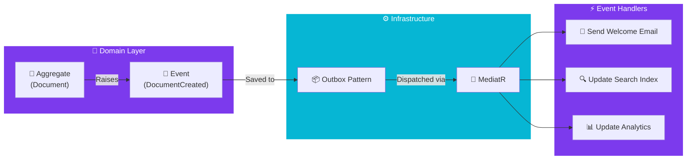

import Callout from '@components/Callout.astro';
import ImplementationNote from '@components/ImplementationNote.astro';
import ExternalCite from '@components/ExternalCite.astro';

## Introduction

In a monolithic procedural system, when you complete a document, you might call `EmailService.Send()`, `AuditLog.Log()`, and `SearchIndex.Update()` right inside your `DocumentService`. This creates a knot of tight coupling. **Domain Events** are the solution: they allow you to say "Something happened" and let other parts of the system react without the sender knowing who they are.

**Why Domain Events Matter:**

-   **Decoupling**: The `Document` aggregate doesn't need to know about email or search. It just raises an event.
-   **Side Effects**: They allow you to trigger non-transactional side effects (like sending emails) *after* the database commits.
-   **Audit Trail**: The sequence of events forms a natural history of what happened in the system.

### What We'll Build

In this guide, we will implement a robust Event Dispatching system. You will learn how to:

1.  **Define Events**: Create immutable C# records representing past occurrences.
2.  **Raise Events**: Capture events inside your Aggregates.
3.  **Dispatch Events**: Use MediatR to route events to handlers.
4.  **Handle Consistency**: Execute side effects only after the transaction succeeds.

## Architecture Overview



## Section 1: Defining Domain Events

A Domain Event is a fact. It happened. It cannot be changed. Therefore, we use immutable `record` types.

```csharp
// The Abstraction
public interface IDomainEvent : INotification // MediatR
{
    Guid EventId { get; }
    DateTimeOffset OccurredAt { get; }
}

// The Concrete Event
public sealed record DocumentCreatedEvent(
    BlueRobinId DocumentId,
    BlueRobinId OwnerId,
    string Title) : IDomainEvent
{
    public Guid EventId { get; } = Guid.NewGuid();
    public DateTimeOffset OccurredAt { get; } = DateTimeOffset.UtcNow;
}
```

<ImplementationNote>
    Naming is critical. Events should be verbs in the **past tense** (`Created`, `Updated`, `Deleted`). They are strictly about history, not intent.
</ImplementationNote>

## Section 2: Raising Events in Aggregates

The Aggregate tracks the events that occur during its lifecycle. It does *not* dispatch them immediately; it holds them until the transaction is ready.

```csharp
public abstract class AggregateRoot<TId>
{
    private readonly List<IDomainEvent> _domainEvents = [];
    public IReadOnlyCollection<IDomainEvent> DomainEvents => _domainEvents.AsReadOnly();

    protected void AddDomainEvent(IDomainEvent domainEvent)
    {
        _domainEvents.Add(domainEvent);
    }

    public void ClearDomainEvents() => _domainEvents.Clear();
}

// Usage in Document
public void CompleteProcessing()
{
    Status = ProcessingStatus.Completed;
    AddDomainEvent(new DocumentProcessingCompletedEvent(Id));
}
```

## Section 3: Dispatching (The EF Core Interceptor)

We don't want to manually call `Publish()` on every service method. Instead, we hook into EF Core's `SaveChangesAsync` to automatically dispatch events when the data is saved.

```csharp
public sealed class DomainEventDispatcherInterceptor : SaveChangesInterceptor
{
    private readonly IPublisher _mediator;

    public override async ValueTask<InterceptionResult<int>> SavingChangesAsync(
        DbContextEventData eventData,
        InterceptionResult<int> result,
        CancellationToken ct = default)
    {
        var context = eventData.Context;
        if (context is null) return await base.SavingChangesAsync(eventData, result, ct);

        // 1. Find all entities with events
        var aggregates = context.ChangeTracker
            .Entries<AggregateRoot<BlueRobinId>>()
            .Where(e => e.Entity.DomainEvents.Any())
            .Select(e => e.Entity)
            .ToList();

        var events = aggregates
            .SelectMany(a => a.DomainEvents)
            .ToList();

        aggregates.ForEach(a => a.ClearDomainEvents());

        // 2. Dispatch events BEFORE commit (for in-process consistency)
        // OR AFTER commit (for eventual consistency/side effects)
        foreach (var domainEvent in events)
        {
            await _mediator.Publish(domainEvent, ct);
        }

        return await base.SavingChangesAsync(eventData, result, ct);
    }
}
```

## Section 4: Handling Events

Handlers are simple classes that react to specific events.

```csharp
public sealed class DocumentCreatedHandler : INotificationHandler<DocumentCreatedEvent>
{
    private readonly ILogger<DocumentCreatedHandler> _logger;

    public DocumentCreatedHandler(ILogger<DocumentCreatedHandler> logger)
    {
        _logger = logger;
    }

    public Task Handle(DocumentCreatedEvent notification, CancellationToken ct)
    {
        _logger.LogInformation("New document created: {Id}", notification.DocumentId);
        
        // Logic to send email, etc.
        return Task.CompletedTask;
    }
}
```

## Conclusion

Domain Events give you superpowers. They allow you to write small, focused aggregates that don't know about the rest of the world, while still driving complex workflows.

**Next Steps:**
- Learn how to use [NATS JetStream](/blog/nats-introduction-jetstream-dotnet) to broadcast these events to other microservices.
- Explore [Aggregates](/blog/ddd-aggregates-consistency-boundaries) to see where these events originate.
