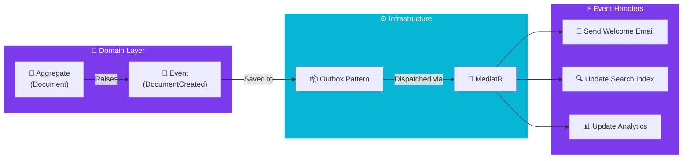

import Callout from '@components/Callout.astro';
import ImplementationNote from '@components/ImplementationNote.astro';
import ExternalCite from '@components/ExternalCite.astro';

## Introduction

Domain events were the architectural breakthrough that transformed BlueRobin from a tightly-coupled monolith into a reactive system. Before I introduced them, adding a new side effect—like sending a Telegram notification when a document finished processing—meant modifying the core document service. Every new feature created a new dependency. Domain events broke that cycle by letting me add behavior without touching existing code.

In a monolithic procedural system, when you complete a document, you might call `EmailService.Send()`, `AuditLog.Log()`, and `SearchIndex.Update()` right inside your `DocumentService`. This creates a knot of tight coupling. **Domain Events** are the solution: they allow you to say "Something happened" and let other parts of the system react without the sender knowing who they are. <ExternalCite title="Domain-Driven Design: Tackling Complexity in the Heart of Software" url="https://www.domainlanguage.com/ddd/" author="Eric Evans" date="2003" />

**Why Domain Events Matter:**

-   **Decoupling**: The `Document` aggregate doesn't need to know about email or search. It just raises an event.
-   **Side Effects**: They allow you to trigger non-transactional side effects (like sending emails) *after* the database commits.
-   **Audit Trail**: The sequence of events forms a natural history of what happened in the system.

### What We'll Build

In this guide, we will implement a robust Event Dispatching system. You will learn how to:

1.  **Define Events**: Create immutable C# records representing past occurrences.
2.  **Raise Events**: Capture events inside your Aggregates.
3.  **Dispatch Events**: Use MediatR to route events to handlers. <ExternalCite title="MediatR - Simple Mediator in .NET" url="https://github.com/jbogard/MediatR" author="Jimmy Bogard" date="2024" />
4.  **Handle Consistency**: Execute side effects only after the transaction succeeds.

## Architecture Overview

The following diagram shows the event flow from aggregate to handlers, using the Outbox Pattern for reliable delivery. <ExternalCite title="Pattern: Transactional Outbox" url="https://microservices.io/patterns/data/transactional-outbox.html" author="Chris Richardson" date="2024" />


```mermaid
flowchart LR
    subgraph Domain["🧱 Domain Layer"]
        Agg["📄 Aggregate\n(Document)"] -->|Raises| Evt["📣 Event\n(DocumentCreated)"]
    end

    subgraph Infrastucture["⚙️ Infrastructure"]
        Evt -->|Saved to| Outbox["📦 Outbox Pattern"]
        Outbox -->|Dispatched via| MediatR["🚀 MediatR"]
    end

    subgraph Handlers["⚡ Event Handlers"]
        MediatR --> H1["📧 Send Welcome Email"]
        MediatR --> H2["🔍 Update Search Index"]
        MediatR --> H3["📊 Update Analytics"]
    end

    classDef primary fill:#7c3aed,stroke:#fff,color:#fff
    classDef secondary fill:#06b6d4,stroke:#fff,color:#fff
    classDef db fill:#f43f5e,stroke:#fff,color:#fff
    classDef warning fill:#fbbf24,stroke:#fff,color:#fff

    class Domain,Handlers primary
    class Infrastucture secondary
```

## Section 1: Defining Domain Events

A Domain Event is a fact. It happened. It cannot be changed. Therefore, we use immutable `record` types. <ExternalCite title="Domain Events: Design and Implementation" url="https://learn.microsoft.com/en-us/dotnet/architecture/microservices/microservice-ddd-cqrs-patterns/domain-events-design-implementation" author="Microsoft" date="2024" />

```csharp
// The Abstraction
public interface IDomainEvent : INotification // MediatR
{
    Guid EventId { get; }
    DateTimeOffset OccurredAt { get; }
}

// The Concrete Event
public sealed record DocumentCreatedEvent(
    CustomId DocumentId,
    CustomId OwnerId,
    string Title) : IDomainEvent
{
    public Guid EventId { get; } = Guid.NewGuid();
    public DateTimeOffset OccurredAt { get; } = DateTimeOffset.UtcNow;
}
```

<ImplementationNote>
    Naming is critical. Events should be verbs in the **past tense** (`Created`, `Updated`, `Deleted`). They are strictly about history, not intent.
</ImplementationNote>

<ImplementationNote>
    In BlueRobin, we initially had over-specific event names like `DocumentUploadedToBucketEvent` and `DocumentOcrExtractedAndSavedEvent`. These leaked implementation details into the domain. We refactored to pure domain concepts: `DocumentAddedEvent`, `DocumentProcessedEvent`, `DocumentAnalyzedEvent`. The handlers that care about buckets and OCR subscribe to the domain event and handle the infrastructure concerns internally.
</ImplementationNote>

## Section 2: Raising Events in Aggregates

The Aggregate tracks the events that occur during its lifecycle. It does *not* dispatch them immediately; it holds them until the transaction is ready.

```csharp
public abstract class AggregateRoot<TId>
{
    private readonly List<IDomainEvent> _domainEvents = [];
    public IReadOnlyCollection<IDomainEvent> DomainEvents => _domainEvents.AsReadOnly();

    protected void AddDomainEvent(IDomainEvent domainEvent)
    {
        _domainEvents.Add(domainEvent);
    }

    public void ClearDomainEvents() => _domainEvents.Clear();
}

// Usage in Document
public void CompleteProcessing()
{
    Status = ProcessingStatus.Completed;
    AddDomainEvent(new DocumentProcessingCompletedEvent(Id));
}
```

## Section 3: Dispatching (The EF Core Interceptor)

We don't want to manually call `Publish()` on every service method. Instead, we hook into EF Core's `SaveChangesAsync` to automatically dispatch events when the data is saved. <ExternalCite title="EF Core Interceptors" url="https://learn.microsoft.com/en-us/ef/core/logging-events-diagnostics/interceptors" author="Microsoft" date="2024" />

```csharp
public sealed class DomainEventDispatcherInterceptor : SaveChangesInterceptor
{
    private readonly IPublisher _mediator;

    public override async ValueTask<InterceptionResult<int>> SavingChangesAsync(
        DbContextEventData eventData,
        InterceptionResult<int> result,
        CancellationToken ct = default)
    {
        var context = eventData.Context;
        if (context is null) return await base.SavingChangesAsync(eventData, result, ct);

        // 1. Find all entities with events
        var aggregates = context.ChangeTracker
            .Entries<AggregateRoot<CustomId>>()
            .Where(e => e.Entity.DomainEvents.Any())
            .Select(e => e.Entity)
            .ToList();

        var events = aggregates
            .SelectMany(a => a.DomainEvents)
            .ToList();

        aggregates.ForEach(a => a.ClearDomainEvents());

        // 2. Dispatch events BEFORE commit (for in-process consistency)
        // OR AFTER commit (for eventual consistency/side effects)
        foreach (var domainEvent in events)
        {
            await _mediator.Publish(domainEvent, ct);
        }

        return await base.SavingChangesAsync(eventData, result, ct);
    }
}
```

<ImplementationNote>
    The timing of event dispatch was a critical design decision. My first implementation dispatched events BEFORE `SaveChangesAsync`, which meant handlers could see data that hadn't been committed yet. When a handler failed, the transaction rolled back—but a Telegram notification had already been sent. I switched to dispatching AFTER the commit for side effects, while keeping pre-commit dispatch for domain consistency events that need to participate in the same transaction. This dual-phase approach took three iterations to get right.
</ImplementationNote>

## Section 4: Handling Events

Handlers are simple classes that react to specific events.

```csharp
public sealed class DocumentCreatedHandler : INotificationHandler<DocumentCreatedEvent>
{
    private readonly ILogger<DocumentCreatedHandler> _logger;

    public DocumentCreatedHandler(ILogger<DocumentCreatedHandler> logger)
    {
        _logger = logger;
    }

    public Task Handle(DocumentCreatedEvent notification, CancellationToken ct)
    {
        _logger.LogInformation("New document created: {Id}", notification.DocumentId);
        
        // Logic to send email, etc.
        return Task.CompletedTask;
    }
}
```

<ImplementationNote>
    One subtle issue I encountered: when a domain event handler raises additional domain events (cascading events), the original interceptor had already cleared the event list. Events raised by handlers were silently lost. The fix was collecting events in a loop—after dispatching, re-check for new events and dispatch again—with a maximum depth guard to prevent infinite recursion. This pattern is sometimes called "event draining."
</ImplementationNote>

## Conclusion

Domain Events give you superpowers. They allow you to write small, focused aggregates that don't know about the rest of the world, while still driving complex workflows.

In BlueRobin, domain events power everything from real-time UI updates to Telegram notifications to search index rebuilds. The single best design decision was making events immutable records—they serve as both a communication mechanism and an audit trail. If I were starting over, I would introduce domain events from day one rather than retrofitting them after the domain logic was already coupled to specific side effects.

**Next Steps:**
- Learn how to use [NATS JetStream](/nats-introduction-jetstream-dotnet) to broadcast these events to other microservices.
- Explore [Aggregates](/ddd-aggregates-consistency-boundaries) to see where these events originate.
- See how the [Repository Pattern](/ddd-repository-pattern-efcore) integrates with the Unit of Work to commit events transactionally.

### Further Reading

- <ExternalCite title="Domain Events: Design and Implementation" url="https://learn.microsoft.com/en-us/dotnet/architecture/microservices/microservice-ddd-cqrs-patterns/domain-events-design-implementation" author="Microsoft" date="2024" /> — Microsoft's comprehensive guide to implementing domain events in .NET microservices.
- <ExternalCite title="Pattern: Transactional Outbox" url="https://microservices.io/patterns/data/transactional-outbox.html" author="Chris Richardson" date="2024" /> — The outbox pattern for reliable event publishing alongside database transactions.
- <ExternalCite title="Enterprise Integration Patterns" url="https://www.enterpriseintegrationpatterns.com/" author="Gregor Hohpe & Bobby Woolf" date="2003" /> — The foundational text on messaging patterns that underpin event-driven architecture.
