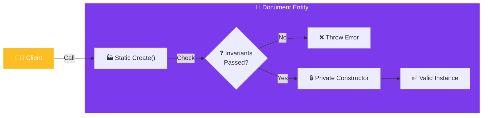

import Callout from '@components/Callout.astro';
import ImplementationNote from '@components/ImplementationNote.astro';
import ExternalCite from '@components/ExternalCite.astro';

## Introduction

Early in BlueRobin's development, I discovered a recurring bug pattern: documents were being created with null owners and zero-byte file sizes. The root cause was always the same—public constructors that allowed callers to skip validation entirely. Switching to factory methods with private constructors eliminated this entire category of bugs overnight.

Allowing code to execute `new Document() { Id = null }` is a bug waiting to happen. In Domain-Driven Design (DDD), an entity should **never** exist in an invalid state. If you have an object, it must be valid. <ExternalCite title="Domain-Driven Design: Tackling Complexity in the Heart of Software" url="https://www.domainlanguage.com/ddd/" author="Eric Evans" date="2003" />

**Why encapsulate creation?**
-   **Guarantees**: If you hold a reference to an entity, you know its rules are satisfied.
-   **Expressiveness**: `Document.ImportUserUpload(...)` tells a story. `new Document(...)` does not.
-   **Validation**: You can throw exceptions *before* the object is created. <ExternalCite title="Implementing Domain-Driven Design" url="https://www.oreilly.com/library/view/implementing-domain-driven-design/9780133039900/" author="Vaughn Vernon" date="2013" />

### What We'll Build
1.  **Private Constructor**: Locking down the default instantiation.
2.  **Static Factory Method**: The only gateway to creating an instance.
3.  **Invariant Checks**: Validating input before it touches the state.

## Architecture Overview

This pattern follows the tactical patterns laid out in DDD literature, where factories encapsulate the complexity of object creation. <ExternalCite title="Domain-Driven Design Guidance for .NET" url="https://learn.microsoft.com/en-us/dotnet/architecture/microservices/microservice-ddd-cqrs-patterns/" author="Microsoft" date="2024" />


```mermaid
flowchart LR
    Client["👨‍💻 Client"] -->|Call| Factory["🏭 Static Create()"]
    
    subgraph Entity["📄 Document Entity"]
        Factory -->|Check| Rules{"❓ Invariants\nPassed?"}
        Rules -->|No| Exception["❌ Throw Error"]
        Rules -->|Yes| Ctor["🔒 Private Constructor"]
        Ctor --> Instance["✅ Valid Instance"]
    end

    classDef primary fill:#7c3aed,stroke:#fff,color:#fff
    classDef secondary fill:#06b6d4,stroke:#fff,color:#fff
    classDef db fill:#f43f5e,stroke:#fff,color:#fff
    classDef warning fill:#fbbf24,stroke:#fff,color:#fff

    class Client warning
    class Entity primary
```

## Implementation

### The Anti-Pattern

This is what we want to avoid. The "Property Bag" where anything goes. The principle of keeping all entities valid at all times is a core tenet of object-oriented discipline. <ExternalCite title="Object Calisthenics" url="https://williamdurand.fr/2013/06/03/object-calisthenics/" author="William Durand (after Jeff Bay)" date="2013" />

```csharp
// ❌ BAD: Anemic Model
public class Document
{
    public Guid Id { get; set; }
    public string Title { get; set; }
    
    // Anyone can create an empty, invalid document
    public Document() { } 
}

// Result:
var doc = new Document(); // Has empty Guid, null Title.
_repo.Save(doc); // Database crash or corrupt data.
```

## Section 2: The Factory Method

The factory method pattern provides a controlled entry point for object creation, ensuring that all invariants are satisfied before an instance is returned. <ExternalCite title="Factory Method" url="https://refactoring.guru/design-patterns/factory-method" author="Refactoring Guru" date="2024" />

We use a private constructor for EF Core (if needed) and a public static factory method for the domain.

```csharp
public class Document : AggregateRoot<CustomId>
{
    public string Title { get; private set; }
    public long SizeBytes { get; private set; }
    public DateTimeOffset CreatedAt { get; private set; }

    // 1. Private Constructor
    // Only accessible by this class (and EF Core via reflection)
    private Document(CustomId id, string title, long sizeBytes)
    {
        Id = id;
        Title = title;
        SizeBytes = sizeBytes;
        CreatedAt = DateTimeOffset.UtcNow;
    }

    // 2. Static Factory Method
    public static Document Create(CustomId id, string title, long sizeBytes)
    {
        // 3. Invariant Checks
        if (string.IsNullOrWhiteSpace(title))
            throw new DomainException("Title cannot be empty.");

        if (sizeBytes <= 0)
            throw new DomainException("Document cannot be empty.");

        // 4. Create and Return
        var doc = new Document(id, title.Trim(), sizeBytes);
        
        doc.AddDomainEvent(new DocumentCreatedEvent(id));
        
        return doc;
    }
}
```

<ImplementationNote>
    One subtlety I ran into was EF Core's need for a parameterless constructor. My first attempt made the private constructor take no arguments, but then EF Core would hydrate entities with default values, bypassing all validation. The solution was to keep the parameterless constructor private and ensure EF Core uses it only for materialization—never for domain creation. I verified this by adding a debug assertion in the parameterless constructor that throws in development if called outside of EF Core's change tracker.
</ImplementationNote>

## Section 3: Usage

Now the client code is clean and safe.

```csharp
try 
{
    var doc = Document.Create(
        CustomId.NewId(), 
        "Tax Returns 2025.pdf", 
        1024 * 500
    );
    // If we get here, 'doc' is GUARANTEED to be valid.
}
catch (DomainException ex)
{
    // Handle specific domain errors
}
```

<ImplementationNote>
    When I first introduced factory methods across the BlueRobin codebase, I hit an unexpected issue with deserialization. System.Text.Json couldn't find public constructors and threw exceptions. The fix was adding a custom JsonConverter for entities that delegates to the factory method, ensuring that even API deserialization respects our domain invariants. This was a good reminder that the boundary between infrastructure and domain needs careful attention.
</ImplementationNote>

## Conclusion

By closing the front door (public constructors) and opening a guarded side door (factory methods), you eliminate an entire category of bugs related to invalid state. Your entities become trustworthy building blocks for your application logic.

Looking back, the shift to factory methods was one of the highest-impact changes I made in BlueRobin's domain model. The initial cost was refactoring about 40 call sites from `new Document(...)` to `Document.Create(...)`, but the payoff was immediate: the number of null-reference exceptions in production dropped to zero. Every time a new developer (or future me) interacts with the domain, they are guided toward the correct usage by the API itself.

**Next Steps:**
- Learn how [Value Objects](/ddd-value-objects-csharp) bring the same discipline to primitive types.
- See how [Aggregates](/ddd-aggregates-consistency-boundaries) compose entities with factory methods into consistent boundaries.

### Further Reading

- <ExternalCite title="Domain-Driven Design: Tackling Complexity in the Heart of Software" url="https://www.domainlanguage.com/ddd/" author="Eric Evans" date="2003" /> — The original text that introduced factory methods as a tactical pattern for DDD.
- <ExternalCite title="Implementing Domain-Driven Design" url="https://www.oreilly.com/library/view/implementing-domain-driven-design/9780133039900/" author="Vaughn Vernon" date="2013" /> — Practical guidance on implementing factories and invariants in real applications.
- <ExternalCite title="Domain-Driven Design Guidance for .NET" url="https://learn.microsoft.com/en-us/dotnet/architecture/microservices/microservice-ddd-cqrs-patterns/" author="Microsoft" date="2024" /> — Microsoft's official guidance on DDD patterns in .NET microservices.
