import Callout from '@components/Callout.astro';
import ImplementationNote from '@components/ImplementationNote.astro';
import ExternalCite from '@components/ExternalCite.astro';

## Introduction

Allowing code to execute `new Document() { Id = null }` is a bug waiting to happen. In Domain-Driven Design (DDD), an entity should **never** exist in an invalid state. If you have an object, it must be valid.

**Why encapsulate creation?**
-   **Guarantees**: If you hold a reference to an entity, you know its rules are satisfied.
-   **Expressiveness**: `Document.ImportUserUpload(...)` tells a story. `new Document(...)` does not.
-   **Validation**: You can throw exceptions *before* the object is created.

### What We'll Build
1.  **Private Constructor**: Locking down the default instantiation.
2.  **Static Factory Method**: The only gateway to creating an instance.
3.  **Invariant Checks**: Validating input before it touches the state.

## Architecture Overview

```mermaid
flowchart LR
    Client["👨‍💻 Client"] -->|Call| Factory["🏭 Static Create()"]
    
    subgraph Entity["📄 Document Entity"]
        Factory -->|Check| Rules{"❓ Invariants\nPassed?"}
        Rules -->|No| Exception["❌ Throw Error"]
        Rules -->|Yes| Ctor["🔒 Private Constructor"]
        Ctor --> Instance["✅ Valid Instance"]
    end

    classDef primary fill:#7c3aed,stroke:#fff,color:#fff
    classDef secondary fill:#06b6d4,stroke:#fff,color:#fff
    classDef db fill:#f43f5e,stroke:#fff,color:#fff
    classDef warning fill:#fbbf24,stroke:#fff,color:#fff

    class Client warning
    class Entity primary
```



## Implementation

### The Anti-Pattern

This is what we want to avoid. The "Property Bag" where anything goes.

```csharp
// ❌ BAD: Anemic Model
public class Document
{
    public Guid Id { get; set; }
    public string Title { get; set; }
    
    // Anyone can create an empty, invalid document
    public Document() { } 
}

// Result:
var doc = new Document(); // Has empty Guid, null Title.
_repo.Save(doc); // Database crash or corrupt data.
```

## Section 2: The Factory Method

We use a private constructor for EF Core (if needed) and a public static factory method for the domain.

```csharp
public class Document : AggregateRoot<BlueRobinId>
{
    public string Title { get; private set; }
    public long SizeBytes { get; private set; }
    public DateTimeOffset CreatedAt { get; private set; }

    // 1. Private Constructor
    // Only accessible by this class (and EF Core via reflection)
    private Document(BlueRobinId id, string title, long sizeBytes)
    {
        Id = id;
        Title = title;
        SizeBytes = sizeBytes;
        CreatedAt = DateTimeOffset.UtcNow;
    }

    // 2. Static Factory Method
    public static Document Create(BlueRobinId id, string title, long sizeBytes)
    {
        // 3. Invariant Checks
        if (string.IsNullOrWhiteSpace(title))
            throw new DomainException("Title cannot be empty.");

        if (sizeBytes <= 0)
            throw new DomainException("Document cannot be empty.");

        // 4. Create and Return
        var doc = new Document(id, title.Trim(), sizeBytes);
        
        doc.AddDomainEvent(new DocumentCreatedEvent(id));
        
        return doc;
    }
}
```

## Section 3: Usage

Now the client code is clean and safe.

```csharp
try 
{
    var doc = Document.Create(
        BlueRobinId.NewId(), 
        "Tax Returns 2025.pdf", 
        1024 * 500
    );
    // If we get here, 'doc' is GUARANTEED to be valid.
}
catch (DomainException ex)
{
    // Handle specific domain errors
}
```

## Conclusion

By closing the front door (public constructors) and opening a guarded side door (factory methods), you eliminate an entire category of bugs related to invalid state. Your entities become trustworthy building blocks for your application logic.
