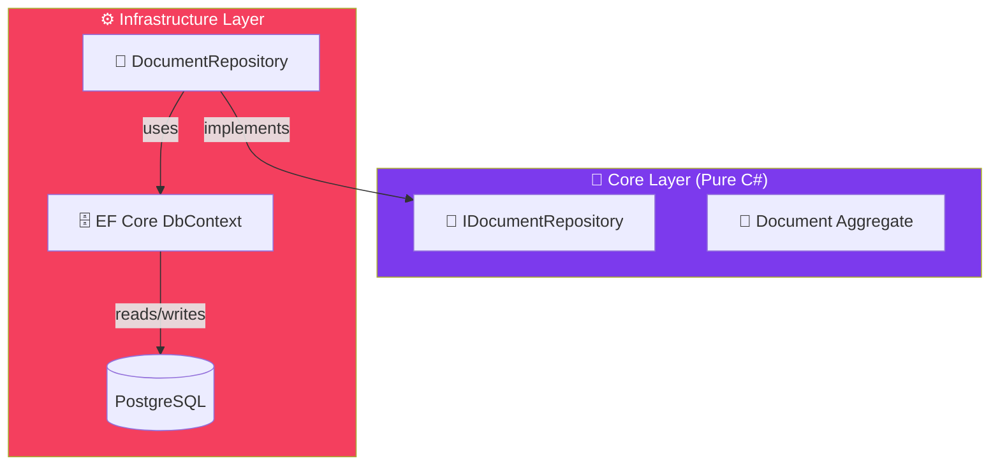

import Callout from '@components/Callout.astro';
import ImplementationNote from '@components/ImplementationNote.astro';
import ExternalCite from '@components/ExternalCite.astro';

## Introduction

The Repository pattern is one of the most debated patterns in the .NET ecosystem—some argue it's unnecessary with EF Core since the DbContext already acts as a Unit of Work. I was in that camp initially. But after watching BlueRobin's application services grow fat with LINQ queries and EF Core–specific syntax, I changed my mind. Extracting repositories gave me testable domain logic and the flexibility to swap persistence strategies for specific aggregates without rewriting business rules. <ExternalCite title="Repository" url="https://martinfowler.com/eaaCatalog/repository.html" author="Martin Fowler" date="2002" />

Your Domain Layer should not know what a `DbContext` is. It shouldn't know about SQL connections or transaction scopes.

**Why the Repository Pattern?**
-   **Abstraction**: Swapping EF Core for Dapper (or CosmosDB) becomes possible without changing domain logic.
-   **Testing**: Mocking `IDocumentRepository` is trivial; mocking `DbSet<T>` is a nightmare. <ExternalCite title="Implementing Domain-Driven Design" url="https://www.oreilly.com/library/view/implementing-domain-driven-design/9780133039900/" author="Vaughn Vernon" date="2013" />
-   **Intent**: `repo.GetOverdueLoans()` is clearer than `ctx.Loans.Where(l => l.DueDate < Now && !l.Returned)`.

### What We'll Build
1.  **Generic Interface**: A standard contract for Get/Add/Update/Delete.
2.  **Specific Repository**: Extending the contract for complex entity-specific queries.
3.  **EF Core Implementation**: The infrastructure layer adapter.

## Architecture Overview

<ExternalCite title="Clean Architecture in .NET" url="https://learn.microsoft.com/en-us/dotnet/architecture/modern-web-apps-azure/common-web-application-architectures" author="Microsoft" date="2024" />


```mermaid
flowchart TB
    subgraph Core["🎯 Core Layer (Pure C#)"]
        Interface["📜 IDocumentRepository"]
        Agg["📄 Document Aggregate"]
    end

    subgraph Infra["⚙️ Infrastructure Layer"]
        Impl["💾 DocumentRepository"]
        EF["🗄️ EF Core DbContext"]
        DB[("PostgreSQL")]
    end

    Impl -- implements --> Interface
    Impl -- uses --> EF
    EF -- reads/writes --> DB
    
    classDef primary fill:#7c3aed,color:#fff
    classDef secondary fill:#06b6d4,color:#fff
    classDef db fill:#f43f5e,color:#fff
    classDef warning fill:#fbbf24,color:#000

    class Core primary
    class Infra db
```

## Implementation

### The Contract

In DDD, the repository interface lives in the **Domain/Core** layer. <ExternalCite title="Domain-Driven Design: Tackling Complexity in the Heart of Software" url="https://www.domainlanguage.com/ddd/" author="Eric Evans" date="2003" />

```csharp
// Core/Interfaces/IRepository.cs
public interface IRepository<TEntity, TId> where TEntity : AggregateRoot<TId>
{
    Task<TEntity?> GetByIdAsync(TId id, CancellationToken ct = default);
    Task AddAsync(TEntity entity, CancellationToken ct = default);
    Task DeleteAsync(TEntity entity, CancellationToken ct = default);
}

// Core/Interfaces/IDocumentRepository.cs
public interface IDocumentRepository : IRepository<Document, CustomId>
{
    // Specific queries needed by the domain
    Task<bool> ExistsWithFingerprintAsync(string hash, CancellationToken ct);
    Task<IReadOnlyList<Document>> GetByOwnerAsync(CustomId ownerId, int take, CancellationToken ct);
}
```

### The Implementation

The implementation lives in the **Infrastructure** layer. This is where EF Core resides. <ExternalCite title="EF Core Documentation" url="https://learn.microsoft.com/en-us/ef/core/" author="Microsoft" date="2024" />

```csharp
// Infrastructure/Repositories/DocumentRepository.cs
public sealed class DocumentRepository : IDocumentRepository
{
    private readonly AppDbContext _context;

    public DocumentRepository(AppDbContext context)
    {
        _context = context;
    }

    public async Task<Document?> GetByIdAsync(CustomId id, CancellationToken ct)
    {
        return await _context.Documents
            .Include(d => d.Metadata) // Eager load Value Objects
            .FirstOrDefaultAsync(d => d.Id == id, ct);
    }

    public Task AddAsync(Document entity, CancellationToken ct)
    {
        _context.Documents.Add(entity);
        return Task.CompletedTask;
    }

    // Specialized Logic
    public async Task<bool> ExistsWithFingerprintAsync(string hash, CancellationToken ct)
    {
        return await _context.Documents
            .AnyAsync(d => d.Fingerprint.Value == hash, ct);
    }
}
```

<ImplementationNote>
    A common mistake I made early on was exposing `IQueryable<T>` from the repository interface. This leaked EF Core's query capabilities into the domain layer, and callers started writing complex LINQ chains that only worked with a SQL database. I removed `IQueryable` entirely and replaced it with purpose-built query methods like `GetByOwnerAsync` and `GetPendingProcessingAsync`. This forced me to think about what the domain actually needs rather than providing a general-purpose query surface.
</ImplementationNote>

<ImplementationNote>
    Notice `AddAsync` is synchronous (returns `Task.CompletedTask`). In EF Core, `Add` just tracks the entity in memory. The actual database call happens when `UnitOfWork.SaveChangesAsync()` is called later.
</ImplementationNote>

<ImplementationNote>
    When I introduced the generic `IRepository<TEntity, TId>` interface, I initially included `UpdateAsync` and `DeleteAsync` methods. Over time, I removed `UpdateAsync` entirely—EF Core's change tracking handles updates automatically when you modify a tracked entity. This simplified the interface and more accurately represented the repository as a "collection-like" abstraction: you add items, remove items, and find items, but you don't explicitly "update" them.
</ImplementationNote>

## Section 3: The Unit of Work

We don't call `SaveChangesAsync` in the repository. We use a Unit of Work to commit changes atomically. <ExternalCite title="Unit of Work" url="https://martinfowler.com/eaaCatalog/unitOfWork.html" author="Martin Fowler" date="2002" />

```csharp
// Application/Services/DocumentService.cs
public async Task UploadAsync(...)
{
    var doc = Document.Create(...);
    
    // 1. Add to Repository (In Memory)
    await _repository.AddAsync(doc);
    
    // 2. Commit Transaction (Database Write + Domain Events Dispatch)
    await _unitOfWork.SaveChangesAsync(ct);
}
```

<ImplementationNote>
    The Unit of Work in BlueRobin is just the EF Core `DbContext.SaveChangesAsync()` behind an `IUnitOfWork` interface. I resisted adding this abstraction for months, calling it "unnecessary ceremony." But the first time I needed to coordinate saves across two repositories in the same transaction—adding a document and updating the archive's document count—having the explicit `IUnitOfWork.SaveChangesAsync()` made the transactional boundary crystal clear to every developer reading the code.
</ImplementationNote>

## Conclusion

The Repository pattern keeps your domain model clean. It acts as an in-memory collection of objects, hiding the ugly details of SQL mapping and database connections behind a semantic interface.

After implementing repositories across all of BlueRobin's aggregates, the biggest benefit wasn't testability or abstraction—it was discoverability. When a new feature needs to query documents, the developer looks at `IDocumentRepository` and sees exactly what queries are available. There's no temptation to write ad-hoc `DbContext` queries scattered across services. The repository becomes the single source of truth for how an aggregate is persisted and retrieved.

**Next Steps:**
- Learn how [Domain Events](/ddd-domain-events-csharp) integrate with the Unit of Work for transactional event dispatch.
- See how [FastEndpoints](/fastendpoints-api-development) consumes repositories through the REPR pattern.

### Further Reading

- <ExternalCite title="Repository" url="https://martinfowler.com/eaaCatalog/repository.html" author="Martin Fowler" date="2002" /> — The original definition of the Repository pattern from Patterns of Enterprise Application Architecture.
- <ExternalCite title="Implementing Domain-Driven Design" url="https://www.oreilly.com/library/view/implementing-domain-driven-design/9780133039900/" author="Vaughn Vernon" date="2013" /> — In-depth coverage of repository implementation in a DDD context with practical examples.
- <ExternalCite title="EF Core Documentation" url="https://learn.microsoft.com/en-us/ef/core/" author="Microsoft" date="2024" /> — Official Entity Framework Core documentation covering change tracking, queries, and persistence.
