import Callout from '@components/Callout.astro';
import ImplementationNote from '@components/ImplementationNote.astro';
import ExternalCite from '@components/ExternalCite.astro';

Repositories provide collection-like interfaces for accessing domain objects. They abstract away persistence concerns, allowing your domain logic to remain pure and focused on business rules.

## Repository Principles

1. **One repository per aggregate root** - Never for child entities
2. **Collection semantics** - Add, Remove, Find operations
3. **Domain interfaces** - Defined in Core, implemented in Infrastructure
4. **No query logic in domain** - Domain doesn't know about SQL or EF

```mermaid
flowchart TB
    subgraph Core["🎯 Core Layer"]
        Interface["📜 IDocumentRepository<br/>+ GetByIdAsync(id): Document?<br/>+ AddAsync(document): void<br/>+ UpdateAsync(document): void<br/>+ DeleteAsync(document): void"]
    end

    subgraph Infrastructure["⚙️ Infrastructure Layer"]
        Impl["💾 DocumentRepository<br/>- _context: BlueRobinDbContext<br/>Uses EF Core for persistence"]
    end

    Impl -->|implements| Interface

    style Core fill:#512bd4,color:#fff
    style Infrastructure fill:#f39c12,color:#fff
```



## Defining Repository Interfaces

```csharp
// Core/Interfaces/IRepository.cs
public interface IRepository<TEntity, TId>
    where TEntity : AggregateRoot<TId>
    where TId : notnull
{
    Task<TEntity?> GetByIdAsync(TId id, CancellationToken ct = default);
    Task AddAsync(TEntity entity, CancellationToken ct = default);
    Task UpdateAsync(TEntity entity, CancellationToken ct = default);
    Task DeleteAsync(TEntity entity, CancellationToken ct = default);
}

// Core/Interfaces/IDocumentRepository.cs
public interface IDocumentRepository : IRepository<Document, BlueRobinId>
{
    Task<Document?> GetByIdWithChunksAsync(
        BlueRobinId id, 
        CancellationToken ct = default);
    
    Task<IReadOnlyList<Document>> GetByOwnerAsync(
        BlueRobinId ownerId,
        DocumentQuery query,
        CancellationToken ct = default);
    
    Task<bool> ExistsWithFingerPrintAsync(
        BlueRobinId ownerId,
        FingerPrint fingerPrint,
        CancellationToken ct = default);
    
    Task<int> CountByOwnerAsync(
        BlueRobinId ownerId,
        CancellationToken ct = default);
}

// Core/Queries/DocumentQuery.cs
public sealed record DocumentQuery
{
    public ProcessingStatus? Status { get; init; }
    public string? SearchTerm { get; init; }
    public IReadOnlyList<string>? Tags { get; init; }
    public int Skip { get; init; } = 0;
    public int Take { get; init; } = 20;
    public DocumentSortBy SortBy { get; init; } = DocumentSortBy.CreatedAt;
    public bool Descending { get; init; } = true;
}

public enum DocumentSortBy
{
    CreatedAt,
    Title,
    Size,
    ProcessedAt
}
```

## Implementing Repositories

```csharp
// Infrastructure/Persistence/Repositories/DocumentRepository.cs
public sealed class DocumentRepository : IDocumentRepository
{
    private readonly BlueRobinDbContext _context;
    
    public DocumentRepository(BlueRobinDbContext context)
    {
        _context = context;
    }
    
    public async Task<Document?> GetByIdAsync(
        BlueRobinId id, 
        CancellationToken ct = default)
    {
        return await _context.Documents
            .Include(d => d.Tags)
            .FirstOrDefaultAsync(d => d.Id == id, ct);
    }
    
    public async Task<Document?> GetByIdWithChunksAsync(
        BlueRobinId id, 
        CancellationToken ct = default)
    {
        return await _context.Documents
            .Include(d => d.Chunks.OrderBy(c => c.SequenceNumber))
            .Include(d => d.Tags)
            .FirstOrDefaultAsync(d => d.Id == id, ct);
    }
    
    public async Task<IReadOnlyList<Document>> GetByOwnerAsync(
        BlueRobinId ownerId,
        DocumentQuery query,
        CancellationToken ct = default)
    {
        var queryable = _context.Documents
            .Include(d => d.Tags)
            .Where(d => d.OwnerId == ownerId);
        
        // Apply filters
        if (query.Status.HasValue)
        {
            queryable = queryable.Where(d => d.Status == query.Status.Value);
        }
        
        if (!string.IsNullOrWhiteSpace(query.SearchTerm))
        {
            var term = query.SearchTerm.ToLower();
            queryable = queryable.Where(d => 
                d.Title.Value.ToLower().Contains(term) ||
                d.OriginalFileName.Value.ToLower().Contains(term));
        }
        
        if (query.Tags?.Count > 0)
        {
            queryable = queryable.Where(d => 
                d.Tags.Any(t => query.Tags.Contains(t.Name)));
        }
        
        // Apply sorting
        queryable = ApplySorting(queryable, query.SortBy, query.Descending);
        
        // Apply pagination
        return await queryable
            .Skip(query.Skip)
            .Take(query.Take)
            .ToListAsync(ct);
    }
    
    public async Task<bool> ExistsWithFingerPrintAsync(
        BlueRobinId ownerId,
        FingerPrint fingerPrint,
        CancellationToken ct = default)
    {
        return await _context.Documents
            .AnyAsync(d => 
                d.OwnerId == ownerId && 
                d.FingerPrint == fingerPrint, ct);
    }
    
    public async Task<int> CountByOwnerAsync(
        BlueRobinId ownerId,
        CancellationToken ct = default)
    {
        return await _context.Documents
            .CountAsync(d => d.OwnerId == ownerId, ct);
    }
    
    public async Task AddAsync(Document entity, CancellationToken ct = default)
    {
        await _context.Documents.AddAsync(entity, ct);
    }
    
    public async Task UpdateAsync(Document entity, CancellationToken ct = default)
    {
        entity.IncrementVersion();
        _context.Documents.Update(entity);
    }
    
    public async Task DeleteAsync(Document entity, CancellationToken ct = default)
    {
        _context.Documents.Remove(entity);
    }
    
    private static IQueryable<Document> ApplySorting(
        IQueryable<Document> query,
        DocumentSortBy sortBy,
        bool descending)
    {
        return (sortBy, descending) switch
        {
            (DocumentSortBy.Title, false) => query.OrderBy(d => d.Title.Value),
            (DocumentSortBy.Title, true) => query.OrderByDescending(d => d.Title.Value),
            (DocumentSortBy.Size, false) => query.OrderBy(d => d.Size.Bytes),
            (DocumentSortBy.Size, true) => query.OrderByDescending(d => d.Size.Bytes),
            (DocumentSortBy.ProcessedAt, false) => query.OrderBy(d => d.ProcessedAt),
            (DocumentSortBy.ProcessedAt, true) => query.OrderByDescending(d => d.ProcessedAt),
            (_, false) => query.OrderBy(d => d.CreatedAt),
            (_, true) => query.OrderByDescending(d => d.CreatedAt)
        };
    }
}
```

<ImplementationNote>
Notice how `GetByIdWithChunksAsync` is a separate method. Loading chunks is expensive—don't do it unless necessary.
</ImplementationNote>

## Generic Repository Base

```csharp
// Infrastructure/Persistence/Repositories/RepositoryBase.cs
public abstract class RepositoryBase<TEntity, TId> : IRepository<TEntity, TId>
    where TEntity : AggregateRoot<TId>
    where TId : notnull
{
    protected readonly BlueRobinDbContext Context;
    protected readonly DbSet<TEntity> DbSet;
    
    protected RepositoryBase(BlueRobinDbContext context)
    {
        Context = context;
        DbSet = context.Set<TEntity>();
    }
    
    public virtual async Task<TEntity?> GetByIdAsync(
        TId id, 
        CancellationToken ct = default)
    {
        return await DbSet.FindAsync([id], ct);
    }
    
    public virtual async Task AddAsync(
        TEntity entity, 
        CancellationToken ct = default)
    {
        await DbSet.AddAsync(entity, ct);
    }
    
    public virtual Task UpdateAsync(
        TEntity entity, 
        CancellationToken ct = default)
    {
        entity.IncrementVersion();
        DbSet.Update(entity);
        return Task.CompletedTask;
    }
    
    public virtual Task DeleteAsync(
        TEntity entity, 
        CancellationToken ct = default)
    {
        DbSet.Remove(entity);
        return Task.CompletedTask;
    }
}
```

## Unit of Work

Coordinate changes across multiple repositories:

```csharp
// Core/Interfaces/IUnitOfWork.cs
public interface IUnitOfWork
{
    IDocumentRepository Documents { get; }
    IUserRepository Users { get; }
    IArchiveRepository Archives { get; }
    
    Task<int> SaveChangesAsync(CancellationToken ct = default);
    Task BeginTransactionAsync(CancellationToken ct = default);
    Task CommitTransactionAsync(CancellationToken ct = default);
    Task RollbackTransactionAsync(CancellationToken ct = default);
}

// Infrastructure/Persistence/UnitOfWork.cs
public sealed class UnitOfWork : IUnitOfWork, IDisposable
{
    private readonly BlueRobinDbContext _context;
    private readonly IDomainEventDispatcher _eventDispatcher;
    private IDbContextTransaction? _transaction;
    
    public IDocumentRepository Documents { get; }
    public IUserRepository Users { get; }
    public IArchiveRepository Archives { get; }
    
    public UnitOfWork(
        BlueRobinDbContext context,
        IDomainEventDispatcher eventDispatcher)
    {
        _context = context;
        _eventDispatcher = eventDispatcher;
        
        Documents = new DocumentRepository(context);
        Users = new UserRepository(context);
        Archives = new ArchiveRepository(context);
    }
    
    public async Task<int> SaveChangesAsync(CancellationToken ct = default)
    {
        // Collect and clear domain events
        var aggregates = _context.ChangeTracker
            .Entries<IAggregateRoot>()
            .Select(e => e.Entity)
            .Where(a => a.DomainEvents.Count > 0)
            .ToList();
        
        var domainEvents = aggregates
            .SelectMany(a => a.DomainEvents)
            .ToList();
        
        foreach (var aggregate in aggregates)
        {
            aggregate.ClearDomainEvents();
        }
        
        // Save changes
        var result = await _context.SaveChangesAsync(ct);
        
        // Dispatch events after save
        await _eventDispatcher.DispatchAsync(domainEvents, ct);
        
        return result;
    }
    
    public async Task BeginTransactionAsync(CancellationToken ct = default)
    {
        _transaction = await _context.Database.BeginTransactionAsync(ct);
    }
    
    public async Task CommitTransactionAsync(CancellationToken ct = default)
    {
        if (_transaction is null) return;
        
        await _transaction.CommitAsync(ct);
        await _transaction.DisposeAsync();
        _transaction = null;
    }
    
    public async Task RollbackTransactionAsync(CancellationToken ct = default)
    {
        if (_transaction is null) return;
        
        await _transaction.RollbackAsync(ct);
        await _transaction.DisposeAsync();
        _transaction = null;
    }
    
    public void Dispose()
    {
        _transaction?.Dispose();
    }
}
```

## Using Repositories in Application Services

```csharp
// Application/Services/DocumentService.cs
public sealed class DocumentService : IDocumentService
{
    private readonly IUnitOfWork _unitOfWork;
    private readonly IStorageService _storage;
    private readonly ILogger<DocumentService> _logger;
    
    public DocumentService(
        IUnitOfWork unitOfWork,
        IStorageService storage,
        ILogger<DocumentService> logger)
    {
        _unitOfWork = unitOfWork;
        _storage = storage;
        _logger = logger;
    }
    
    public async Task<BlueRobinId> CreateDocumentAsync(
        BlueRobinId ownerId,
        Stream content,
        CreateDocumentRequest request,
        CancellationToken ct = default)
    {
        // Check for duplicate
        var fingerPrint = await FingerPrint.ComputeAsync(content, ct);
        
        if (await _unitOfWork.Documents.ExistsWithFingerPrintAsync(ownerId, fingerPrint, ct))
        {
            throw new DuplicateDocumentException(fingerPrint);
        }
        
        // Create document
        var document = Document.Create(
            ownerId,
            DocumentTitle.From(request.Title),
            FileName.From(request.FileName),
            FileSize.From(content.Length),
            ContentType.From(request.ContentType));
        
        // Upload to storage
        content.Position = 0;
        await _storage.UploadAsync(
            document.Id,
            ownerId,
            content,
            request.ContentType,
            ct);
        
        // Save to database
        await _unitOfWork.Documents.AddAsync(document, ct);
        await _unitOfWork.SaveChangesAsync(ct);
        
        _logger.LogInformation(
            "Created document {DocumentId} for owner {OwnerId}",
            document.Id,
            ownerId);
        
        return document.Id;
    }
    
    public async Task UpdateDocumentTitleAsync(
        BlueRobinId documentId,
        BlueRobinId requesterId,
        string newTitle,
        CancellationToken ct = default)
    {
        var document = await _unitOfWork.Documents.GetByIdAsync(documentId, ct)
            ?? throw new DocumentNotFoundException(documentId);
        
        // Authorization check
        if (document.OwnerId != requesterId)
        {
            throw new UnauthorizedAccessException("You don't own this document");
        }
        
        document.UpdateTitle(DocumentTitle.From(newTitle));
        
        await _unitOfWork.Documents.UpdateAsync(document, ct);
        await _unitOfWork.SaveChangesAsync(ct);
    }
    
    public async Task DeleteDocumentAsync(
        BlueRobinId documentId,
        BlueRobinId requesterId,
        CancellationToken ct = default)
    {
        var document = await _unitOfWork.Documents.GetByIdWithChunksAsync(documentId, ct)
            ?? throw new DocumentNotFoundException(documentId);
        
        if (document.OwnerId != requesterId)
        {
            throw new UnauthorizedAccessException("You don't own this document");
        }
        
        await _unitOfWork.BeginTransactionAsync(ct);
        
        try
        {
            // Delete from storage
            await _storage.DeleteAsync(documentId, requesterId, ct);
            
            // Delete from database
            await _unitOfWork.Documents.DeleteAsync(document, ct);
            await _unitOfWork.SaveChangesAsync(ct);
            
            await _unitOfWork.CommitTransactionAsync(ct);
        }
        catch
        {
            await _unitOfWork.RollbackTransactionAsync(ct);
            throw;
        }
    }
}
```

<Callout type="tip">
Use transactions when you need to coordinate multiple operations that must succeed or fail together.
</Callout>

## Specification Pattern

For complex queries, use specifications:

```csharp
// Core/Specifications/ISpecification.cs
public interface ISpecification<T>
{
    Expression<Func<T, bool>> ToExpression();
    bool IsSatisfiedBy(T entity);
}

// Core/Specifications/Specification.cs
public abstract class Specification<T> : ISpecification<T>
{
    public abstract Expression<Func<T, bool>> ToExpression();
    
    public bool IsSatisfiedBy(T entity)
    {
        return ToExpression().Compile()(entity);
    }
    
    public Specification<T> And(Specification<T> other)
    {
        return new AndSpecification<T>(this, other);
    }
    
    public Specification<T> Or(Specification<T> other)
    {
        return new OrSpecification<T>(this, other);
    }
}

// Core/Specifications/DocumentSpecifications.cs
public sealed class DocumentByOwnerSpec : Specification<Document>
{
    private readonly BlueRobinId _ownerId;
    
    public DocumentByOwnerSpec(BlueRobinId ownerId) => _ownerId = ownerId;
    
    public override Expression<Func<Document, bool>> ToExpression()
        => d => d.OwnerId == _ownerId;
}

public sealed class DocumentByStatusSpec : Specification<Document>
{
    private readonly ProcessingStatus _status;
    
    public DocumentByStatusSpec(ProcessingStatus status) => _status = status;
    
    public override Expression<Func<Document, bool>> ToExpression()
        => d => d.Status == _status;
}

public sealed class DocumentByTagSpec : Specification<Document>
{
    private readonly string _tag;
    
    public DocumentByTagSpec(string tag) => _tag = tag;
    
    public override Expression<Func<Document, bool>> ToExpression()
        => d => d.Tags.Any(t => t.Name == _tag);
}
```

### Using Specifications

```csharp
// In repository
public async Task<IReadOnlyList<Document>> FindAsync(
    Specification<Document> specification,
    CancellationToken ct = default)
{
    return await _context.Documents
        .Where(specification.ToExpression())
        .ToListAsync(ct);
}

// Usage
var spec = new DocumentByOwnerSpec(ownerId)
    .And(new DocumentByStatusSpec(ProcessingStatus.Completed))
    .And(new DocumentByTagSpec("important"));

var documents = await _unitOfWork.Documents.FindAsync(spec, ct);
```

## Testing Repositories

```csharp
public class DocumentRepositoryTests
{
    private readonly BlueRobinDbContext _context;
    private readonly DocumentRepository _repository;
    
    public DocumentRepositoryTests()
    {
        var options = new DbContextOptionsBuilder<BlueRobinDbContext>()
            .UseInMemoryDatabase(Guid.NewGuid().ToString())
            .Options;
        
        _context = new BlueRobinDbContext(options);
        _repository = new DocumentRepository(_context);
    }
    
    [Fact]
    public async Task GetByIdAsync_WithExistingDocument_ReturnsDocument()
    {
        // Arrange
        var document = CreateDocument();
        await _repository.AddAsync(document);
        await _context.SaveChangesAsync();
        
        // Act
        var result = await _repository.GetByIdAsync(document.Id);
        
        // Assert
        result.Should().NotBeNull();
        result!.Id.Should().Be(document.Id);
    }
    
    [Fact]
    public async Task GetByOwnerAsync_FiltersByStatus()
    {
        // Arrange
        var ownerId = BlueRobinId.New();
        var pending = CreateDocument(ownerId, ProcessingStatus.Pending);
        var completed = CreateDocument(ownerId, ProcessingStatus.Completed);
        
        await _repository.AddAsync(pending);
        await _repository.AddAsync(completed);
        await _context.SaveChangesAsync();
        
        // Act
        var query = new DocumentQuery { Status = ProcessingStatus.Completed };
        var results = await _repository.GetByOwnerAsync(ownerId, query);
        
        // Assert
        results.Should().ContainSingle()
            .Which.Id.Should().Be(completed.Id);
    }
    
    private static Document CreateDocument(
        BlueRobinId? ownerId = null,
        ProcessingStatus? status = null)
    {
        var document = Document.Create(
            ownerId ?? BlueRobinId.New(),
            DocumentTitle.From("Test"),
            FileName.From("test.pdf"),
            FileSize.From(1024),
            ContentType.From("application/pdf"));
        
        // Use reflection to set status for testing
        if (status.HasValue)
        {
            typeof(Document)
                .GetProperty(nameof(Document.Status))!
                .SetValue(document, status.Value);
        }
        
        return document;
    }
}
```

## Summary

Repositories provide clean abstractions for data access:

| Principle | Implementation |
|-----------|----------------|
| Interface in Core | Domain remains pure |
| One per aggregate | Clear boundaries |
| Collection semantics | Add, Update, Delete |
| Specification pattern | Complex queries |
| Unit of Work | Transaction coordination |

This completes the core DDD patterns series. You now have all the tools to build rich, maintainable domain models.

<ExternalCite 
  title="Repository Pattern" 
  url="https://martinfowler.com/eaaCatalog/repository.html"
  author="Martin Fowler"
/>
